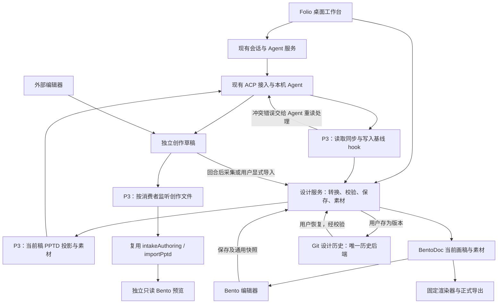

# Folio 平面设计平台改造清单

Status: implemented
Translation: pending

## 摘要

Folio 将成熟的 Lody coding-agent 工作台与 PPTD + Bento 结合，形成 Agent 自主使用的设计环境。保留会话、工具、权限、恢复和 UI，应用仅补充必要的转换、保存与版本保护；同一作品的人与 Agent 串行编辑。最新范围已确认：补齐既有 Bento 语义的 PPTD 往返，冲突由 Agent 通过文件工具处理，删除结果卡、专用缩略图及候选审批，外部文件直接显式导入。内置图像 MCP 提供 generate/edit，model 由用户必填；独立素材库和应用合并引擎不迁入；2026-09-12 新增 Git 作为唯一设计历史后端，不建设平行文件快照库。修订前已集成并单项验收 23/29 项；新保存/提醒合同的替换进展见下方“目标修订后的实施”。历史完成数不代表新合同及安装包、人工完整旅程均已验收。

## 调研范围与依据

- Folio 基线：`8ea564d`；相邻项目基线：`7fd3c06`。检查了本地文档、关键源码和仓库已有截图，没有启动应用或调用真实模型。
- 本项目架构入口：[README](../../../../README.md)、[Electron](../../../../apps/electron/README.md)、[平台边界](../../../../packages/platform/AGENTS.md)、[共享合同](../../../../packages/shared/AGENTS.md)。README 包含完整 Lody 产品描述，不能视为本地 OSS 构建实际开放的功能清单。
- 本项目 UI 入口：[会话外壳](../../../../packages/components/src/components/sessions/session-detail.tsx)、[侧面板](../../../../packages/components/src/components/sessions/session-side-panel-tab-bar.tsx)、[设置目录](../../../../packages/components/src/components/settings/settings-tabs.tsx)、[主题](../../../../packages/components/src/tailwind/index.css)。设置已经按平台能力隐藏云账户、计费等入口。
- 本地同步参考：[Loro 数据面](../../../docs/cli-lib-local-loro-data-plane.md)。本地持久化不等于已经实现作品实时多人编辑。
- 相邻项目位于 `~/dev/agentic-listing-design`。主要依据为 `CONTEXT.md`、`docs/solution.md` §3、`docs/local-agent-cli-design.md`、`docs/local-agent-cli-progress.md`、`docs/f18-1-acceptance.md`。
- 迁移源码依据：相邻项目 `packages/contracts/src/revision.ts`、`packages/kernel/src/kernel.ts`、`packages/authoring/src/revisions.ts`、`packages/orchestration/src/{job-context,revisions,orchestrator}.ts`、`packages/editor-bento/src/bridge.ts`、相邻项目的 `editor-bridge.js` 父桥接源码、`packages/editor-bento/scripts/production-render.mjs`。
- 查阅两边已有 UI 图片：本项目 README hero 只作布局参考；相邻项目 `docs/assets/f18-ui/01-workbench.png` 为既有工作台截图，不代表本轮运行结果。
- 2026-09-11 补充核对 Lody 已有常规能力，见[逐项复用证据与更正](../../proposed/simplification/2026-09-11-design-result-feedback.zh.md#lody-常规能力复核2026-09-11)。附件本地传输/存储、图片转 PNG、会话导航、命令、文件预览与引导框架均已有基础；本清单中的“改造”只表示设计接入差量，不授权重新建设这些功能。安装版 Lody 的入口观察、迁移前源码和 Folio OSS 验收分别记录，不相互替代。

## 重要发现

1. 相邻项目 README 仍描述 Docker 与旧运行路径；当前桌面方案和实现已转向用户安装的多种 Agent CLI。不能迁入旧沙箱、旧 egress 或应用自带 Agent 作为新产品前置条件。
2. 相邻项目的设计产物是单画布静态设计。PPTD 是 Agent 创作输入，BentoDoc 是唯一长期可编辑文档；不支持多页演示文稿，也不能从格式名称推断 PPTX 互操作。
3. 它已有参考图、结构化编辑、元素选区、素材、修订、冲突候选、PNG/JPEG 导出路径。源码中的 `commitEditor` 检查预期当前修订；`commitEditCandidate` 对基线、当前稿和候选做协调，冲突不覆盖当前稿。
4. 相邻项目进度记录明确区分 Pi/Codex 真实设计流程与其他 CLI 的部分证据，旧 UI/UX 曾被判不通过，F18 重做仍待人工评价。迁移不能继承“所有 Agent 已通过”或“UI 已验收”的结论。
5. 既有 Bento 截图仍出现 New slide、Slideshow、媒体等控件，与单画布目标不一致。迁入渲染能力不能等同于直接采用整套编辑器界面。
6. 本项目侧面板类型直接列举 files、changes、pr、browser、session、file、diff，接入设计需修改面板选择、恢复和状态处理，不能只替换图标和文案。
7. 导出依赖固定编辑器壳、字体与 Chromium；生产入口目前还引用相邻项目 verify 中的共享构建/浏览器辅助代码。迁移要带齐实际生产依赖并整理归属，不能只复制一个 render 文件或用窗口截图代替正式导出。

## 建议产品范围

定位：用自然语言、参考图和手工编辑完成可交付平面设计的本地桌面工作台。

首期覆盖海报、社交配图、封面、横幅、信息图、长图及通用电商图片。Amazon A+ 等场景只作为可选技能或尺寸预设，不进入设计内核。首期每个作品一个画布；项目可组织多个作品，但不在首期增加一个文档内的多画板模型。

主要流程：现有输入框发起设计 → 运行中观看实时结果 → 校验并保存当前稿 → 选中元素对话修改或手工调整 → 重开和导出。重新生成与普通修改同一提交规则；冲突交给 Agent 重读文件处理，外部文件预览后直接显式导入，不增加候选审批或固定评审步骤。

无需选择 Git 仓库或分支才能创作；用户通过会话历史查找设计产出，不提供独立作品目录或目录迁移功能。底层工作目录与画稿、素材的持久化归属仍须核对，不能把历史入口等同于已保存完整产物。

## Git 设计历史补充（2026-09-12）

用户已确认[Git 版本方案](../../implemented/feature/2026-09-12-design-version-history.zh.md)：自动保存维护当前稿，“存为版本”创建历史节点，版本下拉支持只读查看及从旧版继续编辑。Git 是唯一历史后端，取消自建文件快照库及独立权威版本索引；当前稿保存、原子版本检查、素材完整性和 Agent 草稿保护保留。Git 仓库由 Folio 独立管理，与用户项目仓库隔离；不要求用户理解分支或配置远程，不复用自动提示 Agent commit/push 的流程。

此新增范围由 P4.6/P6.6 承接，尚未拆为新 GitHub 票据，不计入既有 T01–T29 的实现/关闭数量，也不改写历史验收。用户另已确认[人工编辑自动更新 PPTD](../../implemented/simplification/2026-09-12-editor-owned-pptd-save.zh.md)，同时要求保留[先读文件提醒 hook](../../proposed/simplification/2026-09-12-noninvasive-design-hooks.zh.md)。读取时同步和逐次 generation 证明退出目标；以本修订及 Spec 为准，旧任务完成/失败证据不改写。

## 素材库范围裁定（2026-09-10）

用户确认：独立素材库及跨作品素材浏览、复用从整个迁移计划移除，不只是从 P3 移走，也不列入 P4–P6 或后续迁移待办。此裁定取代原“迁入最小版”的建议；以下当前清单和阶段工作项已同步，整份计划仍为 proposed，Spec 仍为 draft。

相邻项目确有素材库：其素材面板提供预览、下载、插入画布、用作参考图和重新生成；`packages/orchestration/src/orchestrator.ts` 的 `listAssets` 从历史修订汇总已登记素材，不另建独立素材存储。Folio 不迁入来源项目的完整修订库；后续确认的 Git 设计历史也不恢复跨作品素材汇总入口。取舍是放弃应用内跨作品查找和复用素材，保留当前画布的图片插入、替换、选中图片重新生成及文档所需素材持久化。

回合参考图附件（P2-A3）继续作为独立需求，不因取消素材库而取消或自动并入 P3。旧 UI 概念图中的素材库页面和所有共用侧栏中的素材库入口作废，仅保留生成记录；不作为后续实现依据。本次仅调整计划、Spec 与概念图说明，未改产品代码，也未运行产品测试。

## Agent-naive 范围复核（2026-09-10）

本轮按确认的修改方向修订当前方案和 P3–P6；P0–P2 的已实施记录保留历史语义，不作为后续扩大迁移范围的授权。新增的[按需同步与 hook 决策](../../rejected/architecture/2026-09-10-design-sync-hooks.zh.md)负责说明反向转换、文件边界与五种接入的验证要求；产品意图同步到 [Spec](../../../../specs/graphic-design-platform.zh.md)。

核心边界是 Lody 管理 Agent、Bento 独立编辑渲染、设计服务管理转换与存储，Agent 自主创作。画布编辑不驱动 PPTD 回写；Agent 读取触发一致快照与同步，受控写入核对读取基线，最终提交仍独立核对版本。hook 只执行数据完整性前置条件，不强制创作顺序或语义审查。

完整三方对比及应用自动合并退出迁移计划；最新裁定进一步删除候选工作流，版本冲突以文件诊断和 Agent 自行处理收敛。独立素材库、作品目录导入和品牌资源管理不进入任何迁移阶段；Git 设计历史按 2026-09-12 新决定单独纳入，取消自建快照历史；模板市场、多人协作等也不作为迁移延期待办。参考文件和常用尺寸沿用文件入口与轻量预设。

## 文件实时预览补充（2026-09-11）

确认增加 Agent/外部编辑器实际文件变化驱动的 PPTD → BentoDoc 实时预览，按打开的消费者共享订阅，复用既有 intake/importer 和 Bento 渲染。文件变化只触发读取和展示，不提交当前稿、不判断回合完成、不改变 Agent 草稿基线；详细源码依据、快照限制和失败行为见[实时预览决策](../../implemented/architecture/2026-09-11-pptd-live-preview.zh.md)。

用户确认首期创作预览只读：运行中观看，正式提交后恢复当前稿编辑与元素引用；没有运行回合或待完成处理时，外部 PPTD 的所见快照可直接显式导入。当前稿在执行及处理期间也只读，切换视图不改变读取 hook 的对象或解除只读；不新增临时预览元素引用。应用投影不进入创作监听/产物采集，预览不触发提交循环。

本次实时预览补充不恢复素材库、三方合并或目录导入；历史版本由后续 Git 决定单独纳入；剩余技术验证见实施切片。本轮仅修改设计文档。

## 串行编辑修订（2026-09-11）

已确认以“派发前保存 → 所属画布只读 → Agent 执行及产物处理 → 恢复编辑”取代人机同时修改同一稿。应用通过通用只读属性及人工写入入口检查实施，Bento 不感知 Agent；复用 Lody 状态而不新增调度器。反向同步、版本检查与草稿保留继续需要，版本冲突由 Agent 处理；已实现的手工冲突另存仅暂留异常保稿。完整边界见[串行编辑决策](../../implemented/architecture/2026-09-11-design-serial-editing.zh.md)，P1/P2 历史描述不恢复并行编辑目标。

## 整体审查收敛（2026-09-11）

用户确认本轮全部范围决定，详见[工作流收敛记录](../../proposed/simplification/2026-09-11-design-workflow-convergence.zh.md)：为现有 Bento 编辑能力做最小 PPTD 扩展；修改与重新生成统一提交；冲突经工具错误交给 Agent 重读、比较和修改；外部文件直接显式导入；内置图像 MCP 补 generate/edit 且 model 必填无默认值。运行中只观看临时画面，提交后引用当前稿。

已无须用户补充才能拆分的产品问题。格式差异清单、实际工作目录、同字节草稿主动重提交、五种接入覆盖属于实施合同及验证；不能用“复用”略过，也不另建管理产品。新的候选 UI/生产链退出 P3，旧文件、旧 outcome 和已有候选内容/素材仍保持可达。以下 P3–P6 和切片表是当前目标，P0–P2 历史实现不据此改写为已完成纠正。

## 功能处置清单

2026-09-11 再次复核：适用规则见根 [AGENTS.md](../../../../AGENTS.md#design-principles-and-migration-scope)，完整来源与 P0–P6 处置见[范围审查](../../proposed/simplification/2026-09-11-design-result-feedback.zh.md)。通用结果卡不是来源项目的候选审阅卡，P2.5/P2.6 曾完成不能作为继续保留的依据。下表与后续 P3.0/P4 取代旧卡片及缩略图目标；历史记录保留原事实。读取 hook、实时预览属于明确确认的 Folio 适配，不是宣称原项目已具备，也不授权其他产品增量。

| 功能                                                              | 建议处置           | 目标与边界                                                                   |
| ----------------------------------------------------------------- | ------------------ | ---------------------------------------------------------------------------- |
| Electron 外壳、窗口、快捷键、菜单、通知                           | 保留               | 沿用现有桌面结构和组件体系                                                   |
| 主题、排版、按钮、弹窗、侧栏、标签页                              | 保留并适配         | 以 Folio 当前 UI 为基准；Bento 控件统一主题和密度                            |
| ACP、Agent 选择、模型、权限、流式输出、取消与恢复                 | 保留               | 本项目继续拥有进程和会话生命周期；逐 Agent 验证设计能力                      |
| Loro/Flock 会话持久化和本地通信                                   | 保留               | 不为此次改造重写存储；不自动延伸为画稿协作模型                               |
| 搜索、置顶、重命名、归档、草稿、附件                              | 保留并改造         | 沿用会话查找与当前画稿入口，不新增侧栏或历史作品缩略图链路                                 |
| 当前项目/仓库入口                                                 | 改造               | 从设计会话进入创作和查找历史产出，移除必选仓库/分支的心智负担                |
| 侧栏开发状态                                                      | 改造               | 复用生成中、等待回应和错误状态；去掉行数差异、PR、Mergeable及候选待处理产品状态 |
| 主对话                                                            | 改造               | 保留正文、工具展开、输入与当前稿选区；复用文件诊断和继续，不增加结果卡或候选入口 |
| 右侧文件/变更面板                                                 | 改造               | 默认画布；图片操作随选区和属性呈现，文件浏览降级为高级入口                             |
| 引用与视觉批注                                                    | 改造               | 引用参考素材和稳定元素 ID，携带作品身份与当前稿基线；不能只用坐标或截图      |
| Agent Roles                                                       | 保留到高级设置     | 可承载设计指令预设；不强制增加多角色编排，不把品牌素材存入 Role              |
| Skills 与 MCP                                                     | 保留底层、简化入口 | 复用 graphic-design/MCP；skill 提供格式与能力，不强制创作步骤                 |
| Onboarding                                                        | 复用并删减         | 沿用现有能力裁剪和 Agent 引导，替换代码示例为首个设计；不增加必经语言/外观/图像配置页面 |
| 设置                                                              | 复用并整理         | 沿用通用、外观、快捷键、Agents、关于及 P2 已实现图像连接；MCP/Role 整理到高级项，不新增无具体需求的保存设置 |
| token/上下文与耗时                                                | 保留必要信息       | 图像调用与费用仅展示可观测数据；未知不显示零费用                             |
| Git diff、提交、分支、worktree、合并                              | 从设计主流程移除   | 保留 Git 历史的新消费者；分支/worktree 等开发入口按用途裁剪，不整体删除基础设施                  |
| GitHub、PR、CI、自动代码审查/自动归档                             | 从设计产品移除     | 检查入口、后台订阅和任务注册，不能只隐藏按钮                                 |
| 通用终端、IDE 打开、端口/网页应用预览 | 按消费者裁定 | 保留文件、进程和诊断能力；参考浏览按需求复用，隐藏入口不等于删除底层 |
| 聊天分叉、子标签、侧聊、多 Agent 调度 | 按消费者裁定 | 复用仍有用途的 Lody 能力；不迁入第二套设计编排，作品复制不等同聊天 fork |
| 远程机器、云账户、计费、团队邀请、Web/mobile                      | 不纳入首期         | 遵循本地 OSS 能力边界；共享包残留不在首轮机械全删                            |
| Lody 品牌、代码示例、帮助文案                                     | 改造               | 对外名称暂按 Folio；包名和内部协议名不做无关全局替换                         |
| Bento 画布与属性编辑                                              | 迁入并整理 UI      | 文字、图片、形状、布局及已支持静态元素；移除演示/视频等非目标入口            |
| Agent 期间所属画布只读 | 已确认，待实施 | 仅限制同一作品人工变更，直到执行和结果处理结束；其他作品可编辑 |
| PPTD 创作文件实时预览 | 新增必要连接 | 按消费者监听受限文件，复用正向转换与 Bento 只读呈现；不替换当前稿 |
| 人工保存设计版本及历史恢复 | 2026-09-12 已确认，待实施 | Git 唯一历史后端；自动保存维护当前稿，历史只读查看后从旧版继续编辑，不建平行快照库 |
| 独立素材库与跨作品素材复用                                        | 不迁移             | 从整个迁移计划移除，不顺延到后续阶段；当前画布图片操作保留                  |
| 设计候选                                                          | 退出目标范围       | 停止新候选创建/采用/拒绝流程；旧内容可读，冲突保留草稿给 Agent，外部文件直接显式导入 |
| 图像 MCP generate/edit | 补齐既有接入 | 复用 URL/Key/必填 model 与素材保存；删除默认模型，补原图/参考图及可选 mask 请求，不新建图像作业 |
| 正式导出                                                          | 迁入               | PNG/JPEG、透明背景行为和实际像素尺寸明确；从已保存当前稿生成                 |
| 参考文件与尺寸预设 | 复用或轻量适配 | 沿用 Lody 附件 UI、本地文件传输与存储，补 Folio 本地组合差异；保留静态常用尺寸，不新建附件系统或素材库 |
| 模板市场、多人实时协作、批量尺寸变体、PDF/SVG/PSD/PPTX、视频/动效 | 不在迁移范围 | 不列为后续迁移待办；另有独立需求时再讨论 |

“移除”是拟定产品范围，不授权本轮删除代码。实际删除须确认后台消费者和旧数据；历史设计、聊天和用户目录不得因改版被清空。

## UI 建议

沿用当前侧栏、对话和侧面板结构，不重建另一套首页或桌面壳。默认工作区为左侧项目/设计会话，中间对话，右侧较大画布；允许收起对话进入专注画布模式。窄窗口切换对话与画布，保留同一编辑器实例和未保存状态。

Lody 已有面板伸缩、标签恢复与临时 Zen 布局状态；P1 的 `design-canvas.tsx` 也已实现 Focus canvas / Show conversation。现有 Zen 隐藏右侧面板，与专注画布方向不同。P4 复用 P1 已有专注入口，只核对其与新预览、只读和窄窗口的衔接，不重做专注模式或另建布局/偏好存储。

画布顶部放作品名、尺寸、自动保存状态和导出，右上角增加“当前稿 ▾”版本选择和“存为版本”；选择元素后显示属性。图层和图片属性按需展开，避免同时固定项目侧栏、对话、图层、画布、属性五个面板。新建设计可以从一句话、参考图或尺寸预设开始，不先显示庞大模板库。

对话中的操作需要产品化：“重新生成方案”“替换这张图”“修改整体风格”提供上下文动作，无需记忆相邻项目的斜杠命令。这些动作携带目标与普通提示词，复用现有派发；不另建图像生成作业、付费重试或多角色编排。保留命令作为高级快捷方式即可。

## 架构与数据归属建议



- **一个运行时负责人**：由 `apps/cli` 继续管理 Agent 与会话；不并入相邻项目完整 Runtime Manager、session store 或 HTTP/SSE 应用服务器。
- **一个画稿提交负责人**：本地设计服务拥有 canonical、素材和当前画稿保存。沿用 P0–P2 的 CLI 后台和 Electron 编辑器/渲染边界；新增反向转换复用设计能力包，具体同步接口在 P3 验证。
- **分开存储不同事实**：Loro/Flock 继续存会话和关联元数据；复用已有存储保存当前画稿与素材；历史只存入 Git，不迁入来源项目完整修订库或新增文件快照后端。两者通过稳定 ID 关联，不将完整 BentoDoc 同时作为第二份可写聊天状态。
- **作品与会话分开命名**：项目组织作品；作品具有可定位身份及当前状态，用户存下的历史版本从 Git 读取；首期默认一个作品对应一个主设计会话。会话/回合记录相关作品及输入基线，会话归档和删除沿用原项目行为，不新增删除普通 workspace 文件的操作。侧栏现有 Session 不直接重命名成另一种 Task 数据实体。
- **版本与执行分开**：Agent 回合完成不代表产物有效；校验和画稿保存完成后才展示可用作品。缺失产物、失败、取消与成功必须区分。
- **人工编辑不能丢**：派发快照保留历史事实；P3 新增 Agent 读取当前稿的基线。运行中禁止人工改稿；最终提交原子检查对应基线，冲突保留草稿供 Agent 处理，结束后才发现的问题走下一次显式继续。重新生成不特殊候选，应用不自动合并或因文件出现停止 Agent。
- **通信复用既有边界**：设计操作接现有受控后台接口，明确对象身份、schema 和失效条件。MCP 可承载 Agent 侧设计工具，但不与现有 MCP/Role 目录另建一套持久化或默认选择机制。
- **跨平台与编辑器依赖**：保留固定构建资源和导出依赖，核对 Bento 子模块、patches、字体、图标、Chromium 及相关来源声明；不能只把它当作普通 npm React 组件。

## 迁移与实施顺序

2026-09-11 修订：当前请求授权更新方案文档；P0–P2 已另获实施授权并完成，P3–P6 仍为计划。本节取代此前五步概要；仍为 proposed，不把方向性认可当作新 Spec 已逐项批准。产品意图单独记录在 [Spec 草案](../../../../specs/graphic-design-platform.zh.md)。已有 UI 概念图作为实施参考，不作为控件能力或交互验收依据。

### 阶段总览

| 阶段              | 交付结果                                      | 依赖                   | 完成后能做什么                            |
| ----------------- | --------------------------------------------- | ---------------------- | ----------------------------------------- |
| P0 技术切片与合同 | 在当前桌面构建中证明 Bento 可加载、渲染和交付 | 无                     | 固定样稿在 Folio 中打开和导出             |
| P1 作品与手工编辑 | 会话 workspace、当前画稿和编辑器接入          | P0                     | 创建沿既有 Agent 配置；打开后独立编辑、保存、重开和导出 |
| P2 Agent 设计闭环 | 现有 Agent、设计技能与产物保存（历史交付）     | P1                     | 用自然语言完成第一张可编辑设计            |
| P3 持续创作       | 双向转换、hook、文件预览、Agent 处理冲突及图像编辑 | P2                  | 多轮迭代、串行编辑、直接导入和继续创作 |
| P4 工作台产品化   | 导航、画布、输入、设置和引导统一              | P3；局部界面整理可提前 | 设计师无需了解内部工具即可创作            |
| P5 开发功能清理   | 清理开发链路与品牌文档                        | P4                     | 得到聚焦设计的应用                        |
| P6 发布验收       | 安装包、Agent/平台支持矩阵及完整旅程证据      | P5                     | 可交付的首版，而非只在开发机跑通          |

P0–P2 是第一个可演示闭环，P3–P4 构成可日常使用的测试版，P5–P6 完成首版交付。每阶段都有可运行结果；下阶段依赖项未通过时先解决具体问题，不把失败归入后续“优化”。不按猜测给固定工期；后续拆分依据已完成阶段及 P3 切片的实际成本。

### P0：验证编辑器接入和确定最小合同

以下保留 P0 原阶段的交付目标；候选相关历史措辞不恢复最新已删除的工作流。

阶段边界已确定：固定合成样稿在开发版与打包版中打开、重开和导出，并验证最小持久化链路；完整新建、编辑保存属于 P1，Agent 生成属于 P2。macOS 实机开发版及安装包验收阻塞进入 P1；Windows/Linux 同期执行构建与资源探针，发布支持须另有实机证据。

**工作项**

- P0.1 校准仓库要求的 Node/pnpm 与原有构建基线，记录既有失败，避免误把环境问题归因于迁移。
- P0.2 固定相邻代码版本，列出 contracts → kernel/authoring → quality/render/editor 的真实依赖，包括 capability matrix、Bento 子模块、patches、字体、图标及生产渲染辅助文件；保留必要来源声明。
- P0.3 在现有 Electron 开发与打包路径加载固定样稿，验证编辑器资源、受控通信与 PNG/JPEG 渲染；不移植相邻项目的完整 Web 应用、HTTP/SSE 后台或 Runtime Manager。
- P0.4 明确产物定位、会话关联、当前稿基线、素材和候选的 workspace 存储归属，确认设计服务由 CLI 后台承载、渲染由 Electron 服务承载的接口。写明提交成功但通知/会话关联更新失败后的恢复路径。
- P0.5 确定独立应用标识/数据目录；核对会话使用的非 Git 工作目录派发链，不新增用户管理作品目录的入口。记录可用于后续验收的现有 Agent 接入和拟发布平台；Agent 由用户选择，不绑定 Pi 或其他特定 Agent，P0 不依赖真实生成流程。

**模块**：`apps/electron` 的资源、IPC 与渲染服务；`apps/cli` 的本地项目/会话入口；`packages/shared` 的窄协议；拟迁入设计包。共享类型保持平台中立，不把 Node 文件操作塞入 UI 包。

**验收**：在当前应用构建内打开一张包含文字、透明图片和形状的合成样稿，生成与画布尺寸一致的 PNG/JPEG；重开一致；开发和打包资源不依赖隔壁绝对路径。后续 CI 能重现生产资源构建。构建工具或格式兼容问题必须在此解决，不能静默改换渲染器。

### P1：打通作品存储与手工编辑

历史交付说明：本节保留 P1 已实施的保存及冲突另存事实。新目标按 P3.0e 禁止 Agent 期间人工改稿；冲突另存暂留异常保稿，不再扩展为常规人机协同流程。

**工作项**

- P1.1 已完成：回车提交复用现有 Session 创建和自动命名，同时关联空白单画布。尺寸位于项目目录同一行最右侧，默认 Auto；自定义才要求宽高。没有 Git 也能创建，手工编辑不依赖 Agent 执行；创建提交沿用现有 Agent 配置要求。
- P1.2 在会话侧面板加入真实画布类型，处理标签恢复、切换和编辑器实例身份；接入文本、图片、形状以及既有支持元素的编辑命令。
- P1.3 保存 canonical 当前画稿与素材，保留预期状态校验以防并发覆盖，不迁入不可变修订库；落盘后再报告保存成功。保存失败和失效消息不可覆盖另一作品。
- P1.4 自动保存、撤销/重做、切换/关闭/退出的保存确认；已保存当前稿的正式 PNG/JPEG 导出和原生保存对话框。
- P1.5 清除画布中不受支持的演示/媒体入口，沿用 Folio 基础主题，先保证最小界面可用。

**模块**：设计文档与持久化包、CLI 设计服务、`session-detail`/侧面板、Electron 导出和资源桥接。

**验收状态**：P1 核心实现及 macOS 验收已完成。通过真实回车创建与自动命名 → 编辑文字和图片 → 撤销/重做 → 切换 → 退出重开 → 原生 PNG/JPEG 导出；文件摘要确认重开未丢稿。保存失败、并发冲突及旧实例隔离由存储测试和打包原生探针覆盖。见文末 computer-use 验收记录。P2 设计生成及后续平台发布仍按各自阶段执行。

**P1 交互决定（2026-09-09）**：最初独立新建入口已被用户修订为回车提交和自动命名，过程见文末入口修订。保存失败时阻止切换、关闭或退出并保留修改，提供重试或明确放弃；这会打断离开动作，但避免静默丢稿。标签仍打开时保留撤销/重做，关闭标签或重启后清空撤销历史，仅恢复已保存当前稿；不新增持久化撤销日志。以上已实现，不表示整份 Spec 已批准。

**P1 保存与尺寸边界（2026-09-09）**：沿用迁入语义编辑器的尺寸调整行为，保持元素几何；若有元素超出新画布则拒绝调整并说明原因，不自动缩放或裁切。并发基线冲突拒绝保存并保留修改，允许另存独立作品或明确放弃后重载，不引入自动合并。意外崩溃或断电只保证恢复最后成功保存的画稿与素材，未确认保存的修改可能丢失；不新增崩溃草稿日志。这些决定优先保护已保存内容并复用编辑能力，代价是缩小画布前需人工调整元素、冲突需人工处理。实现见 [CLI 作品存储](../../../../apps/cli/src/design/store.ts)及 [canvas 控件](../../../../packages/design-bento/vendor/packages/editor-bento/src/ui/canvas.ts)。

**P1 冲突另存归属（2026-09-09）**：另存创建独立作品和空白主设计会话，将当前编辑画稿及必需素材复制到新 workspace，不改变原作品，不复制交流记录或撤销历史。复制素材增加存储占用，但避免新作品依赖原 workspace；空白会话避免把原会话执行记录误认为发生在新作品上。另存失败保留未保存修改，并沿用保存失败时的离开保护，直至保存成功或用户明确放弃。实现与探针已覆盖；文档仍为提案和草案，阶段验收不代表整份产品 Spec 获批。

### P2：接通首个 Agent 设计闭环

以下工作项和文末记录描述当时交付。P2.5 结果卡、P2.6 缩略图及候选工作流现退出目标，按 P3.0/P3.3/P3.4 退役；P2.4 的默认模型和仅生成能力由 P3.2a 纠正。版本保护、提交回执、已有内容与 P2.4b Agent 渲染读图保留。

**工作项**

- P2.1 通过本项目现有接入驱动一个可用 Agent；将 `graphic-design` 和明确选择的 `imagegen` 产品技能放入任务上下文，记录应用提供材料的版本/内容身份，不改写用户全局配置。
- P2.2 准备需求、参考素材和工作目录；发送前保存画布并固定输入基线，沿用现有回合接收、权限请求与取消流程。
- P2.3 Agent 自然完成后采集、校验和提交产物；区分对话结束、生成失败、产物无效和设计完成。复用单一设计提交者。
- P2.4 引入图像服务最小配置和可用性反馈，采用已有凭据存储边界；图像连接失效时仍能编辑和导出已有作品。
- P2.5 提供真实结果卡和画布定位；发生并发修改时至少保存独立候选并给出处理入口，不能先覆盖后在 P3 修复。

**模块**：CLI 会话派发/产物采集、设计技能与上下文组装、现有 MCP/权限链、设计服务及对话结果卡。

**验收**：真实 Agent 完成“参考图 + 需求 → 可编辑作品 → 手工修改 → 保存重开 → PNG/JPEG 导出”；同时验证真实取消、权限回应和无效产物路径。视觉效果由人工判断；合成 Agent 测试只能证明协议。真实 API 调用按届时已有授权和配置执行，本轮不调用。

### P3：当前画稿可读与持续创作

**2026-09-12 当前目标修订**：P3.1b/P3.1c/P3.3 按自动保存与提醒合同收敛；下方历史切片和已完成记录中的“读取同步”“generation/attempt 证明”说明旧范围。后续执行应重列替换工作与验收，不能继续按旧范围补 runtime，也不能直接将 T18–T20 标为完成。保留草稿、CAS、真实执行失败/取消与来源隔离。

P3.1 负责双向转换、保存时更新 PPTD 和先读提醒，P3.7 复用正向转换提供实时结果与直接导入，P3.3/P3.4 将旧候选流程收敛为文件冲突和继续。职责见[同步](../../rejected/architecture/2026-09-10-design-sync-hooks.zh.md)、[预览](../../implemented/architecture/2026-09-11-pptd-live-preview.zh.md)和[最终范围决定](../../proposed/simplification/2026-09-11-design-workflow-convergence.zh.md)。文件来源合同对齐后，转换、预览与各接入可分别推进；不迁入上游编排服务。

**工作项**

- P3.0a 复用现有会话诊断、当前稿定位和普通文件入口，移除 `DesignTurnResultCard`、逐轮额外状态及专用修复按钮；不再先建设候选面板。卡片退役前保证已有候选内容/素材可受控读回，P3.4 承接兼容；P2-A2 当前稿更新继续可用。
- P3.0b 移除专用缩略图生成、引用生产、`thumbnail-read`、worker/IPC 读回与孤立 UI。核对 shared 字段、`maxEdge`、宿主缩放的剩余消费者；旧 outcome 容忍遗留字段，不批量改历史或删除用户文件。
- P3.0c 保留 `folio_render_preview`、共享渲染队列/宿主、PNG 和 Agent 实际读图，验证无结果卡仍可看图及导出。提交回执和必要旧内容读回不随 UI 删除；不等待实时预览才保留这些既有能力。
- P3.0d 删除 #2b 未改动旧 PPTD 自动提升。沿用派发内容证据，普通未变化旧工程记录 no_artifact；缺失旧快照不推断未修改。保留旧内容/回执，独立交付；P3.3 后续接通有明确新基线及主动提交事实的重提交，不恢复被动提升。
- P3.0e 接入串行编辑：派发前阻止新变更、flush 并确认保存，再冻结版本和启动；所属作品所有实例只读至执行及处理结束。人工保存/导入执行同一检查，覆盖权限等待、取消、断连重开、迟到事件、重叠派发和异常脏状态。其他作品可编辑，不新增锁平台或整轮持有磁盘提交锁。
- P3.1a 先核对首期所有开放 Bento 编辑能力与 PPTD 的差异，再实施必要格式版本、validator、import/export、素材、能力矩阵与来源补丁。包括已查到的分组和多层阴影，保留可编辑语义与稳定 ID/顺序/样式；旧版本兼容及未知内容明确处理，不静默扁平化，也不以正常手工操作导致下一轮读取失败作为完成。
- P3.1b 将 PPTD 投影发布从活动回合中解耦，接入已有当前稿自动保存、创建、导入和恢复；flush 等待同版本 PPTD/素材就绪，发布失败保留当前稿并反馈。投影与草稿隔离，不改冻结输入；准备、实际 cwd、MCP、预览和采集共用现有入口身份。不首次在派发时同步，不另建工作副本管理产品。
- P3.1c 保留公开 hook/extension 的先读文件提醒，复用各 Agent 原生保护，记录实际版本、事件和上下文送达。新文件例外，冲突后重读；不把提示当硬阻断，不修改 runtime 或建立逐次 generation 证明。联合收敛写入、重提交和最终采集中的旧证明依赖，保留结构/素材/来源/CAS。五种接入分别验收，不把静态 skill 当 hook，不覆盖用户配置。
- P3.1d 将当前稿选区的稳定元素 ID、作品和基线接入已有输入/mentions；在执行前或提交后引用当前稿，失效时提示，不猜目标。运行中只观看临时结果，不扩临时预览的元素引用上下文。
- P3.2a 补齐内置 image MCP 的 generate/edit：复用既有连接、注册、权限和素材保存，增加原图/多参考图与可选 mask 的 edits 请求及对应文件传输；model 由用户必填，删除产品默认值及空值回填，保留已有明确配置。同步设置、schema、skill/说明、物化和错误边界；不引入模型路由、自动付费重试或独立 mask 编辑器。
- P3.2b 复用 Bento 的插入、裁切、替换及普通 Agent 派发，连接选中图片生成/编辑与元素目标；工具先产出素材，由 Agent 决定 PPTD 修改。保护当前稿、草稿和旧内容所需素材；不新建图片作业、素材库或跨作品汇总。附件/看图独立于图像服务配置。
- P3.3 停止新候选创建与采用/拒绝，有效产物统一提交。运行中冲突经工具反馈由 Agent 处理；结束后保留文件/诊断供显式继续，不自动启动 Agent。明确重提交绑定预期当前稿版本及确切草稿，不再依赖模型 generation 读取证明；旧文件存在或单纯重读不产生新产物。
- P3.4 复用普通文件、会话恢复与现有读回，使冲突/取消/失败后的草稿和已有候选内容/素材可达。旧 outcome、提交回执保持事实，旧内容可供 Agent 使用或显式导入；不批量改历史、不新建待处理列表、候选库或执行 checkpoint；用户 Git 版本另由 P4.6 承接。人工保存异常另存暂保留。
- P3.5 复用 Lody 取消/失败后显式继续、Agent 切换与重开，验证最新当前稿、保留草稿、诊断和文件身份能进入后续回合。仅修接线缺口，不重写恢复/派发系统，不在重启或冲突后自动调用模型。
- P3.6 收敛 graphic-design/imagegen skill、工具说明和派发提示：保留真实格式/能力、工具用法与可选脚本，移除固定 inspect/draft/review、inspect-once、强制 finalize、指定分析方式和固定评审次数。generate/edit 说明与 P3.2a 实际能力一起发布；渲染和 Agent 读图独立保留，不按一个工具缺席判定 Agent 全部视觉能力缺席。
- P3.7a 复用 collect/intake/importer，补受限依赖闭包、采集前后内容复核与固定素材字节；沿用 P3.1a 更新后的格式支持，不复制转换器。稳定观测只允许预览，不证明作者完成事务。
- P3.7b 复用 watcher 生命周期，为实际消费者建立精确依赖订阅，覆盖缺失文件、rename、依赖变化、释放和重开核对；合并、摘要去重、有限重采、旧结果隔离，不开启 Code Collab 全目录扫描。
- P3.7c 在现有画布区域呈现只读创作结果，区分已保存稿与临时来源；中间无效保留上一有效画面。预览不提交、不改基线、不生成专用缩略图，应用投影/缓存不进入创作监听。运行中观看，正式提交后恢复当前稿编辑。
- P3.7d 无执行及待完成处理时，预览外部 PPTD 后一次明确导入为当前稿，复用 flush、结构/素材检查和原子保存。绑定所见快照和当前版本，源变化不偷换内容；失败保留原稿与未保存内容。删除候选创建/采用中间层，不新增目录导入产品。

P2-A3 本地参考附件适配保持独立：复用 Lody 已有附件 UI、sender、blob store 和读回，解决免云认证、首条消息身份及实际图片输入；不因取消素材库被删，也不自动并入 P3.2。此前“不是 P3 因而未安排”的表述以实施切片表中的独立安排为准。

**模块**：现有设计包、CLI 设计服务/Agent 接入/派发与采集、shared 合同、Bento 桥接、会话输入和设置。正反转换共享格式与素材合同；不增加通用 hook 平台、合并服务、图像调度器或设计 runtime。

**验收**：手工改稿→派发保存/只读→Agent 真实读取→写入/冲突重读→实时观看→统一提交→恢复编辑→重开与导出。覆盖同字节主动重提交与无人提交旧文件的区别、最终 CAS、迟到事件、实际 cwd、已有内容可达、直接导入、generate/edit 和必填模型；各能力的针对性证据随切片完成，不以文档检查或一次合成运行替代真实接入。

### P4：统一为设计工作台

**工作项**

- P4.1 基于现有首页输入、会话和侧面板适配创作、编辑、文件诊断/直接导入、导出及设置。沿用组件、主题、导航和标签页；概念图中的结果卡、作品缩略图、素材库、历史版本/恢复、独立作品库与新建流程不作为实现要求。
- P4.2 侧栏呈现项目与设计会话，直接复用现有名称、搜索、置顶和生成/待回应状态，不新增作品缩略图或状态存储；沿用面板伸缩/标签恢复，调整画布宽度、窄窗口切换和属性面板，复用 P1 已有 Focus canvas，核对与新预览/只读衔接；不要用隐藏右侧面板的现有 Zen 替换它。在同一侧面板区分当前稿与创作预览，显示执行/处理期间只读，切换不解除只读或销毁编辑状态。
- P4.3 重新生成、替换图片、调整风格的上下文动作只携带目标和普通提示词，复用已有命令/快捷键/派发，不新增动作引擎。选区引用复用输入与引用呈现；网页批注的 selector/矩形不能代替作品/版本/稳定元素 ID。清楚呈现只读预览、更新受阻与显式导入状态；保留已有草稿、附件粘贴/拖放、通用图片预览、工具折叠、流式滚动及输入法行为，不重复开发。
- P4.4 复用现有设置目录、Agents/Role/MCP 和图像连接，承接 P3.2a 的必填 model 与 generate/edit 状态；整理入口与设计文案，不再次建设图像服务或新增无具体需求的保存设置。沿用本地 onboarding 裁剪，把代码示例改成设计，不添加必经语言/外观/图像配置页面。尺寸使用静态预设，参考资料沿用文件/附件，不新建资源管理系统。
- P4.5 Git/PR 等仅开发用途入口退出设计主流程，并关闭无消费者的后台活动；物理代码删除在 P5 按消费者审查。
- P4.6 新增 Git 设计历史：采用 Folio 管理的独立本地仓库，核对普通目录支持与 Git 依赖供给，再复用当前稿完整载荷及保存检查，实现人工存版本、从 Git 列出/读取、受控恢复和右上角入口。恢复前保留未存版本的当前稿，历史保持不变，后续编辑追加版本；运行及采集期间只读查看，保护其他窗口、用户仓库和遗留 Agent 草稿。只实现一个历史后端，不建设文件快照库、权威列表数据库、分支树或专用缩略图。此项是新增后续切片，不冒称 T22/T25 已完成其验收。


**模块**：`packages/components` 的导航、会话、设置、onboarding、i18n 与主题，以及 Bento 编辑器的可见控件。

**验收**：首页输入 → 创作 → 手工/对话修改 → 文件冲突由 Agent 处理 → 保存重开 → 导出的交互连续；能查看独立实时预览，等待有效文件/监听失败不会伪装为当前稿已更新；当前稿只读覆盖文档变更；运行中可观看，处理结束后引用当前稿；键盘、中文输入法、弹窗焦点、深浅主题和窄窗口可用。由人工实际操作评价体验，不能只凭截图通过。新呈现组件和关键状态按仓库规则补 Storybook。

### P5：按消费者清理开发功能

**工作项**

- P5.1 按“入口 → hook/订阅 → 后台任务 → 依赖包”检查 GitHub/PR/CI/代码审查等仅开发用途链路；删除确无消费者的部分，保留通用文件、进程、工具、诊断、权限和恢复能力，以及实时预览仍使用的 watcher 基础设施。
- P5.2 终端、IDE、参考网页浏览、会话分叉和标签能力逐项决定保留、隐藏或删除；不因退出主流程就整体删除 Git/worktree 底层，不重写 Loro/共享协议或新增设计专用会话编排。
- P5.3 已取消：不迁入隔壁作品目录导入功能；旧程序数据保持原状。
- P5.4 更新 Folio 名称、图标/说明、帮助、新手示例和公开 README；仅实际依赖变化时更新锁文件、第三方声明和受影响模块规则。

**模块**：CLI 开发产品链路、components 开发面板和路由、Electron 应用身份、实际受影响依赖与文档。

**验收**：设计项目无需用户预建 Git 仓库或配置 GitHub 可完成主流程，Git 历史依赖由其新增切片明确，已停止无消费者的开发后台任务；保留的 Agent 文件/工具/诊断/权限/恢复链路仍可用。不提供作品目录导入；旧程序数据不受清理影响。边界检查证明未引入相邻项目 Web/mobile 或私有运行依赖。

### P6：安装包与首版验收

**工作项**

- P6.1 在每个拟发布 OS/架构测试实际安装包，核对独立身份、数据目录、编辑器/字体/Chromium 资源、原生依赖和导出。Mac 优先真实设计验收；Windows/Linux 的构建探针从 P0 起覆盖，最终缺失证据的平台不标已支持。
- P6.2 建立 Codex、Claude Code、Pi、Kimi Code、Grok Build 的实际版本/ACP 启动/工具路径矩阵：发现、图片输入、技能、权限、取消、继续、完整设计流程及 hook 成功/缺席/错误路径。供应商有 hook 不等于 Folio 已接入；只对验证通过的组合宣称支持，Agent 始终由用户选择。
- P6.3 固定合成海报、信息图、长图样例，验证 Bento/PPTD 往返语义、手工编辑可读、草稿不被同步覆盖、投影不被误收集；覆盖基线缺失/过期、派发前保存竞态、运行/结果处理期间只读、多实例和最终提交版本变化。复用既有测试设施，不建立第二套验证引擎。
- P6.4 验证普通用户安装、无 CLI 状态、自配 model 的 generate/edit、必填字段与图像服务错误、退出重开、磁盘写入失败、保留草稿继续与旧内容可达；验证移除结果卡后 Agent 仍可渲染并实际读取图片、继续修改，旧 outcome 可读，后台不再生成专用缩略图；测量加载/编辑/保存/导出及内存表现，依据实测和目标机器确定可接受范围，补用户文档及发布说明。
- P6.5 验证安装包文件监听与实时预览：分步写入、素材同路径替换、原子 rename、依赖增删/暂缺、持续写入与资源预算、监听遗漏/恢复、多消费者及断开释放、旧结果迟到、无消费者后台回合。验证外部编辑与直接显式导入、预览切换不解除当前稿只读、结束后恢复编辑、异常未保存内容不丢失、源变化不偷换导入对象、hook 投影不会进入循环；使用现有确定性设施，平台监听另留实机证据。

- P6.6 新增 Git 历史安装包验收：自动保存不逐次建版本；人工存 V1/V2 后查看 V1 不改变当前稿；从 V1 编辑并存新版本后 V2 仍可打开；恢复前保护、图片/字体留存、重开、磁盘/Git 失败、跨窗口竞争、运行期间禁止恢复、撤销/选区重绑定及外部项目隔离均有证据。确认历史仅在 Git 中保存，不把多文件捕获或当前稿 CAS 正确性归因于 git commit；本项不以旧 T27–T29 验收替代。
- P6.7 必做真实图像 MCP 与多图设计验收，见[TODO 与用户测试连接](../testing/2026-09-12-live-image-mcp-acceptance.zh.md)。通过实际 Folio MCP 调用 AruHub image2 的 generate/edit，验证真实图片读取、PPTD/Bento 素材引用、选中图片编辑替换、多图自动保存/重开及 PNG/JPEG 导出，记录真实负载性能和人工视觉结论。用户提供的 model 仅用于测试，密钥经既有机密配置使用；模拟供应商不能替代此项，不自动重试付费请求。已有三次真实生成与一次真实编辑，失败回执及后续读图分别留证；正常包 567741b 的四图海报、12 图长图及独立重开已通过；用户已通过六项人工检查、原 edit 目标及后续三场景整体旅程。新增实时画布缺陷已修复并留有安装包行为证据，追加 2 次真实生成与 1 次编辑已返回，结合零图片调用续接完成选中替换、正式保存、导出及重开；本项约定范围完成，失败历史与证据边界见上述 TODO；基础生图/编辑不依赖 Git 历史上线。

**验收**：安装包内走完完整旅程，自动检查与人工视觉/编辑体验分别记录；每个宣称支持的平台、Agent 和 hook 路径均有对应证据。首发不要求应用自动安装外部 Agent，也不新增自动更新系统。打包通过不等于签名/发布完成，实际发布单独执行。

### 执行纪律、检查与拆分

#### 已确认的实施切片（2026-09-11）

以下任务发布记录保留发布时点的事实；后续开发情况见本节末的“本地集成进度”。运行时代码的实施不自动批准整份 Spec，也不代替安装包和完整旅程验收。

2026-09-11 用户已确认以下 **29 项任务的粒度及依赖**，已在 GitHub 分别发布并建立 **40 条原生阻塞关系**。T 编号保留为计划标识，GitHub 列给出实际 Issue；不改变上文 Pn.x 范围。此次仅完成任务发布与编号回填，未启动运行时开发或委派 Agent；任务确认不表示整份 Spec 获批或实现已通过验收。

已核对仓库现有 [P2 规格 #1](https://github.com/LeonEthan/Folio/issues/1) 与 [桌面日常验收故障 #2](https://github.com/LeonEthan/Folio/issues/2)：前者保留 P2 当时的候选/结果卡目标，后者没有提供足以归因到本次改造的具体失败记录。两者保持原状，不据其 open 状态重做已完成 P2，也不新建一份相同故障单。新任务以当前 Spec 和范围收敛为目标，明确需要纠正的 P1/P2 行为。

任务按可验证行为拆分，不按前端、后端、schema 分层。每项包含实现该行为所需的接线、受影响文档及针对性验证；复用已经存在的界面、存储和执行设施。依赖只列真正需要先交付的能力，不把同文件改动或最终联合验收当成额外开工条件。T04 单独交付实际工作目录的一致设计闭环，让预览不必等待 hook；T14 先交付打开/主动刷新可用的完整只读路径，T15 再自动更新，二者共用同一快照与转换实现。

| 任务 / 原计划范围 | GitHub | 交付行为与验收边界 | 阻塞于 |
| --- | --- | --- | --- |
| T01 删除旧 PPTD 被动提升 / P3.0d | [#3](https://github.com/LeonEthan/Folio/issues/3) | 未改动旧文件不产生新候选或提交；有变化的产物和旧回执仍正常。缺少旧快照时不伪称已证明未变化 | 无 |
| T02 Agent 执行期间所属画布只读 / P3.0e | [#4](https://github.com/LeonEthan/Folio/issues/4) | 派发前保存成功才启动；全部所属实例只读到执行及结果处理结束。覆盖权限等待、取消、断连、迟到事件和保存失败，其他作品可编辑 | 无 |
| T03 保持现有 Bento 编辑语义的 PPTD 往返 / P3.1a | [#5](https://github.com/LeonEthan/Folio/issues/5) | 先完成全部开放编辑能力差异核对，再交付最小格式、校验和双向转换。分组、多阴影、稳定 ID、顺序和素材往返不丢失；旧版本兼容、未知版本明确失败 | 无 |
| T04 在真实 workspace 中贯通设计文件 / P3.1b 的前置整理 | [#6](https://github.com/LeonEthan/Folio/issues/6) | 从本地项目或会话工作目录发起创作，准备、Agent cwd、素材、MCP 渲染和最终采集均解析到同一作品；固定投影与草稿的分离位置，跨作品不串用 | 无 |
| T05 Pi 首个读取/写入 hook 闭环 / P3.1b/c | [#7](https://github.com/LeonEthan/Folio/issues/7) | 用户手工修改后，真实 Pi 读取 hook 取得最新投影，成功读取才记基线，受控写入检查该基线，合法产物经独立版本检查提交。同步不覆盖草稿或改冻结输入 | T02、T03、T04 |
| T06 Agent 自助处理文件冲突，停止新候选 / P3.3 | [#8](https://github.com/LeonEthan/Folio/issues/8) | 运行中返回可处理错误，Agent 重读、比较和重试；同字节草稿可凭明确新尝试重新提交。普通修改和重新生成统一保存，结束后冲突保留文件及诊断，等待显式继续 | T01、T05 |
| T07 旧内容通过普通文件可达，移除结果卡 / P3.4、P3.0a | [#9](https://github.com/LeonEthan/Folio/issues/9) | 先保证旧草稿/候选及素材可受控读回，当前稿、提交事实和错误沿现有入口可见，再删除卡片和专用修复/采用/拒绝按钮；普通输入可继续处理文件 | 无 |
| T08 删除专用缩略图，保留渲染与实际读图 / P3.0b/c | [#10](https://github.com/LeonEthan/Folio/issues/10) | 不再生产、存储引用或读回逐轮缩略图；旧字段容忍读取，用户文件不删除。Agent 仍能渲染、取得 PNG 并继续创作，正式导出可用 | T07 |
| T09 内置 image MCP 支持生成和编辑 / P3.2a | [#11](https://github.com/LeonEthan/Folio/issues/11) | 复用 URL/Key 配置并要求用户填写 model；generate/edit 接收实际所需原图、参考图和可选 mask，结果保存为素材。保留明确旧配置、无默认值或付费自动重试，同步设置及工具/技能说明 | 无 |
| T10 接通 Folio 本地参考图附件 / P2-A3 | [#12](https://github.com/LeonEthan/Folio/issues/12) | 复用附件选择、粘贴/拖放、sender、blob 和读回；首条及后续消息免产品云认证可附图，重开可见，参考快照与真实 Agent 图片输入对应 | 无 |
| T11 删除强制创作步骤 / P3.6 | [#13](https://github.com/LeonEthan/Folio/issues/13) | 实际物化的技能、派发提示和工具说明不再强制固定顺序、finalize 或评审次数；保留真实格式、可选脚本、渲染与读图说明。新增 edit 的准确用法由 T09 同步交付 | 无 |
| T12 引用当前画稿元素继续对话 / P3.1d、P4.3 | [#14](https://github.com/LeonEthan/Folio/issues/14) | 复用选区与 mentions，携带作品、基线和稳定元素 ID；真实 Agent 能针对目标修改。失效引用明确提示；运行中不引用临时结果元素 | T05 |
| T13 接通图片与设计上下文动作 / P3.2b、P4.3 | [#15](https://github.com/LeonEthan/Folio/issues/15) | 复用已有命令、Bento 图片插入/裁切/替换和普通派发，选中图片生成/编辑、调整风格或重新生成均有明确目标。图像工具先产素材，Agent 决定文档修改 | T09、T12 |
| T14 打开和主动刷新 PPTD 只读预览 / P3.7a/c | [#16](https://github.com/LeonEthan/Folio/issues/16) | 在现有画布区域查看固定文档及素材快照；复用 intake/importer，不稳定或无效时保留上一有效画面并报状态。当前稿与临时来源可区分，预览不提交、不改基线 | T02、T04 |
| T15 文件变化自动更新已打开预览 / P3.7b/c | [#17](https://github.com/LeonEthan/Folio/issues/17) | 为消费者共享受限依赖监听，覆盖分步写入、素材替换、rename、缺失/变更依赖；合并去重、隔离旧结果、释放与重开补查，失败可主动刷新，投影不形成同步循环 | T14 |
| T16 将所见外部 PPTD 直接导入当前稿 / P3.7d | [#18](https://github.com/LeonEthan/Folio/issues/18) | 无执行和结果处理时，一次明确导入保存所见文档及素材快照；处理未保存编辑、校验版本，源变化不偷换内容，失败不丢稿，无候选中间流程 | T14 |
| T17 Claude Code 接入共享 hook 与冲突处理 / P3.1c | [#19](https://github.com/LeonEthan/Folio/issues/19) | 固定实际版本及 ACP 启动方式，薄适配成功读取、写入拒绝和工具反馈；验证正常创作、冲突重读、hook 缺席/失效与最终保护，不改全局配置 | T06 |
| T18 Codex 接入共享 hook 与冲突处理 / P3.1c | [#20](https://github.com/LeonEthan/Folio/issues/20) | 对实际文件工具、patch、Shell/MCP 路径逐项验证，共享同步与提交检查；不假设独立 Read 或全局 Shell 拦截，诚实记录未覆盖路径 | T06 |
| T19 Kimi Code 接入共享 hook 与冲突处理 / P3.1c | [#21](https://github.com/LeonEthan/Folio/issues/21) | 按独立托管 runtime/ACP 合同接入，验证配置实际加载、错误/超时语义、真实读写与冲突处理；不复制隔离包或绕过最终保护 | T06 |
| T20 Grok Build 接入共享 hook 与冲突处理 / P3.1c | [#22](https://github.com/LeonEthan/Folio/issues/22) | 固定真实 CLI/ACP 版本和事件，薄适配并验证真实读写、冲突重读、取消及失败路径；未验证组合不宣称支持 | T06 |
| T21 取消、继续和重开保持正确画稿 / P3.5 | [#23](https://github.com/LeonEthan/Folio/issues/23) | 沿 Lody 现有恢复/派发，取消或失败后保留当前稿和草稿，显式继续或切换已支持 Agent 时读取正确上下文；重开恢复关联和诊断，不自动调用模型 | T06、T07 |
| T22 设计工作台导航与画布布局收敛 / P4.1/2/3 | [#24](https://github.com/LeonEthan/Folio/issues/24) | 复用侧栏、会话、搜索/置顶、面板与 Focus canvas；宽/窄窗口及视图切换保留编辑状态，正确呈现当前稿、实时结果和只读。核验键盘、输入法及主题，不重做通用组件 | T12、T15 |
| T23 设置与首次设计引导收敛 / P4.4 | [#25](https://github.com/LeonEthan/Folio/issues/25) | 复用设置目录及本地 onboarding，用设计示例替换代码示例，呈现用户 Agent 和图像连接真实能力；无额外必经配置页，未配图像服务仍可编辑已有作品 | T09 |
| T24 PR/CI/代码审查退出设计流程 / P4.5、P5.1 | [#26](https://github.com/LeonEthan/Folio/issues/26) | 按入口到订阅/后台任务核对消费者，移除纯开发链路及确无消费者的依赖；保留通用工具输出、权限、文件与诊断 | 无 |
| T25 精简 Git/IDE 等开发操作入口 / P4.5、P5.2 | [#27](https://github.com/LeonEthan/Folio/issues/27) | 设计主流程不要求仓库/分支/IDE 操作；停止无消费者后台活动。终端、参考网页、分叉及 worktree 底层按实际通用消费者保留，不连带删除 watcher 或会话能力 | 无 |
| T26 Folio 品牌、帮助与公开文档对齐 / P5.4 | [#28](https://github.com/LeonEthan/Folio/issues/28) | 核对既有独立身份，更新实际剩余名称、图标/说明及设计示例；帮助只描述已交付能力，不批量改历史或用户数据。后续功能票各自更新受影响说明 | 无 |
| T27 安装包资源、保存与导出核验 / P6.1 | [#29](https://github.com/LeonEthan/Folio/issues/29) | 复用现有打包探针，验证 macOS 实际包内身份隔离、Bento、字体/Chromium、原生依赖、保存重开及 PNG/JPEG；Windows/Linux 保留构建与资源证据，实机未知如实记录 | 无 |
| T28 安装包内五种 Agent 能力矩阵 / P6.2 | [#30](https://github.com/LeonEthan/Folio/issues/30) | 使用实际发布组合验证发现、参考图输入、技能、权限、取消/继续、读写 hook 与图像工具；与前述适配票的开发验证区分，记录各版本/路径的实际支持与限制 | T10、T13、T15、T17、T18、T19、T20、T21、T27 |
| T29 首版完整用户旅程与发布验收 / P6.3/4/5 | [#31](https://github.com/LeonEthan/Folio/issues/31) | 包内人工走完设计、手工修改、Agent 持续创作、文件冲突、实时结果、直接导入、重开与导出；复用确定性设施补交叉缺口，检查旧内容、读图及无缩略图生产，记录视觉体验和性能实测及发布范围 | T08、T11、T16、T22、T23、T24、T25、T26、T28 |

按已确认拆分，以本机已有 Pi 作为 T05 的技术先行对象，仅确定施工顺序，不设置产品默认 Agent，也不将 CLI 在 PATH 中等同于 hook 已可用。该票必须先核对实际 runtime/ACP 的扩展加载及事件，再交付完整闭环；若证据要求更换先行对象，交换对应适配任务并同步依赖，不另建第六套实现。其他四票复用 T05/T06 的合同，分别保留自己的真实接入证据。

T07 可先退役展示形态并让旧内容经普通文件入口可达；T06 独立停止新候选生产，不把候选 UI 作为兼容前置。T16 依赖固定快照预览，不依赖自动监听或候选系统。T03 的完整差异核对属于往返实现本身，不能只交一张差异表就关闭任务，也不能以未枚举现有能力为由新增编辑功能。

无前置任务可独立开工，不表示已安排同时开发。优先推进 T01–T04，并可穿插 T09–T11；T07/T08 的删减、T24–T27 的现有链路核对与资源探针可提前。T04 后，预览沿 T14/T15 推进，与 T05/T06 的 hook/冲突路径分开；适配、选区和 UI 只等待各自列出的前置。共同编辑同一模块时协调合并顺序，不为此新增虚假的产品依赖。

P2-A3 已列为 T10，在参考图完整旅程前完成。非 PNG 分析副本规范化仍为可选改进，异常手工另存的彻底删除尚未作为已确认实施项，不创建这两类任务。P0/P1/P2 不重建；已完成实现中与新目标不符的部分由 T01–T11 等明确纠正。每个实现票随交付完成针对性验证；T27–T29 验证实际包和跨功能旅程，不另建测试引擎，不将全部测试推迟到 P6。

29 项任务均使用 GitHub 现有 ready-for-agent 标签；已回读核对标题、验收正文、标签及全部 40 条原生阻塞关系。任务正文包含独立可理解的行为、验收和实际依赖编号，不绑定易过时的具体文件清单。P2 规格和既有故障单保持原状。当前 12 项没有阻塞条件，后续以 GitHub 实际关闭状态计算可开工任务；标签本身不表示依赖已完成。运行时代码、真实 Agent、图像调用、产品测试和构建均未执行，未提交代码或发布安装包。

- 每项做贴近风险的验证：格式/版本与读写顺序用现有确定性测试，实际 Agent 和安装包分别留证据，保存/退出/导出做桌面旅程；不依赖真实 sleep 或调度运气。
- 提交前按仓库执行 `pnpm check`/`pnpm format`，包边界变更执行 `check:public-boundary`，资源变更做打包探针；记录跳过项，本轮不执行产品测试。
- 原子保存、真实回执、失败不丢稿、跨作品隔离和不自动模型调用贯穿各切片。回退不允许旧版本强写新格式，不双写两份权威稿。
- 各切片更新 owning note、Spec 与受影响模块规则/README；实现证据未完成前保持 proposed/draft，检查及翻译不代表审批或产品验收。

#### 目标修订后的实施（2026-09-12）

以下是自动回写与公开提醒合同的新增证据，取代旧 generation/read-proof 目标的待办解释；
下节及旧票据中的完成/阻塞记录保留为原合同历史，不据此要求补 runtime 或宣称新合同已通过。

| 范围 | 当前实施和证据 | 仍待完成 |
| --- | --- | --- |
| P3.1b/P3.3 自动回写与采集收敛 | `603bf9d`：保存/重开发布和校验当前 PPTD，移除读取台账与逐次生成证明，五家重提交复用 launch/source、确切草稿摘要与 CAS；[实施记录](../../implemented/simplification/2026-09-12-editor-owned-pptd-save.md) | 组合 `c683038` 的 Pi/Claude 原生成功、失败、取消六路径均通过；外部语言模型为合成响应，正常安装包的当前稿读写/提醒/采集组合已补证，详见[矩阵](../testing/2026-09-11-installed-five-agent-matrix.md)；不表示所有历史边界都在同一包重跑 |
| T18 Codex 提醒 | `7df62fa`：公开 UserPromptSubmit 在模型请求前及恢复时送达，保留用户配置/信任；[原生证据](../../implemented/architecture/2026-09-12-codex-read-reminder.md) | bb7a424c 安装包的公开提醒、人工当前稿读取、草稿写入与提交回执通过独立证据核对；整轮辅助请求失败及仅保留基线前缀的限制仍保留，不代表强制先读顺序 |
| T19 Kimi 提醒 | `4ca6795`：[原生事件可用，但缺会话级加载入口](../../proposed/architecture/2026-09-12-kimi-read-reminder-loading.md) | [最小公开插件已准备并隔离验证](../../proposed/architecture/2026-09-12-kimi-reminder-plugin.md)，bb7a424c 安装包的隔离插件/当前稿读写/提交组合已通过；实际用户登记属自愿启用的配置操作，经用户批准后已于 2026-09-12 在真实 Kimi home 完成（见插件笔记），对新启动的 Kimi 进程生效；不作为该已验证组合的技术阻塞；未改 runtime |
| T20 Grok 提醒与停止 | 主线 `e86a92a`：公开 session plugin + 原生 reload，实际首轮/恢复送达；[证据](../../implemented/architecture/2026-09-12-grok-read-reminder.md)，组合完整检查已通过 | 提醒到达当前工具之后的下一模型请求，不能保证已生成的写入先等 Read。用户已确认 Stop 完整关闭会话执行、后台及子任务，下一条显式消息恢复；bb7a424c 的公开关闭、HTTP 关闭、显式恢复/读取已补证；567741b 的提醒及当前稿读写/提交通过独立核对。原失败、辅助请求造成的整轮脚本失败及未执行的最终画布检查仍保留，详见安装包矩阵 |
| T28 Pi 图像 MCP | `eccd540`：公开 Pi extension 复用现有三项图像/渲染工具，真实 HTTP/stdio 合成主机的目录、调用、取消与清理通过；[记录](../../implemented/architecture/2026-09-12-pi-geon-mcp-extension.md) | Pi 安装包的目录、调用、读图和取消回归已补证；真实 AruHub 调用及 Kimi 读图属于独立组合，不宣称五家逐一执行付费测试 |
| P4.6 Git 版本 / P6.6 验收 | `c683038` 实现[独立 Git 历史](../../implemented/feature/2026-09-12-design-version-history.zh.md)，五项 Git 测试通过；`50ddd41` 正常安装包的版本 UI、自动 PPTD、多实例门禁和受控外部写 CAS 补验通过 | 567741b 的真实四素材海报、12 图长图保存/版本/导出及同 profile 重启、复制 profile 独立重开已通过；用户已确认该副本六项视觉/编辑检查可接受，更广范围验收仍按完整旅程记录保留；此新增功能不计入旧 29 票完成数 |

`c683038` 组合完整检查通过（CLI 2671、组件 3288 项测试），格式、文档和边界检查通过。
独立 Git/UI/自动回写轮为 `/tmp/folio-history-ui-3hA6WO/result.json`，没有模型调用；
Pi/Claude 六路径为 `/tmp/folio-t05-new-contract-NSbuQU/result.json`，记录确切主进程和 CLI 哈希，
验证人工保存先于模型请求落盘、所属原生画布只读、提醒实际送达、成功提交及失败/取消保稿；
外部语言模型使用合成响应，不宣称真实模型创作或视觉质量。
指定 AruHub 已实际调用三次 generate 和一次 edit，无重试，最终四图原生读取通过；
第二、三张的原回合工具回执未完成，恢复图片及后续读图不能抹掉失败。
`69780aa` 修复 Pi/Kimi 图像客户端期限短于服务期限的问题，源码完整检查通过，
后续安装包已完成图像期限/取消回归和真实多图保存、版本、导出、重开；
[P6.7 TODO](../testing/2026-09-12-live-image-mcp-acceptance.zh.md)仍保留原失败，并已补录两份作品的六项人工通过结论及其范围。
[完整旅程记录](../testing/2026-09-11-complete-design-acceptance.md)给出 567741b 的确切包身份和人工检查副本。Spec 保持 draft，不关闭最终验收任务；安装包仅用于私有验收，没有发布。

#### 本地集成进度（2026-09-11）

用户随后授权按依赖和共享修改面并行实施全部 29 项任务。以下记录已审查并集成到本地主分支的实现；GitHub Issue 尚未关闭，代码和安装包尚未发布。每项的证据及限制以对应实施记录为准，不把单项通过扩大为完整设计平台已验收。

| 任务 | 本地集成 | 已取得的证据与边界 |
| --- | --- | --- |
| T01 / #3 | `2f01848` | [旧 PPTD 被动提升已删除](../../implemented/simplification/2026-09-11-unchanged-pptd-outcome.md)：确定未变化时为 `no_artifact`，保留原文件和历史回执；41 项确定性测试及全仓检查通过。冲突候选的停止仍属 T06 |
| T02 / #4 | `a360bde` | [画布只读与派发保存握手已交付](../../implemented/architecture/2026-09-11-canvas-serial-execution.zh.md)：所有所属实例只读至实际执行及产物处理结束；真实 Electron 验证多实例另存/关闭不丢其他稿件。全仓检查通过；P1 使用合成 idle 上下文，完全无桌面确认的设计派发明确失败，未称五种 Agent 或安装包已验证 |
| T03 / #5 | `a31f83e` | [PPTD v3 数据往返已交付](../../implemented/architecture/2026-09-11-pptd-editable-roundtrip.zh.md)：保留现有 Bento v4 编辑字段及素材，v2 继续导入；分组仍是 flat groupId。91 项格式测试及全仓检查通过，不代替 workspace、hook 或像素验收 |
| T04 / #6 | `36eda31` | [设计文件路径已贯通实际 workspace](../../implemented/architecture/2026-09-11-design-workspace-paths.md)：准备、渲染、图像素材和采集共用可信 Session 路径；项目内按作品/会话隔离草稿，保留旧输入与文件，投影只预留固定位置。全仓检查及技能物化通过；工作目录变更时明确拒绝，不宣称自动迁移或真实 Agent 已验证 |
| T05 / #7 | `9944930` | [Pi 原生读写 hook 已贯通](../../implemented/architecture/2026-09-11-pi-design-hooks.md)：成功读取完整投影后绑定基线，拒绝同批提前生成的写入，最终独立校验内容、素材和版本。真实桌面与 Pi ACP 走通手工保存、后续合法写入、自然提交和画布解锁；180k 字符通过四次原生续读。外部模型响应为合成流；显式新尝试及旧请求隔离由 T06 继续实现 |
| T06 / #8 | `7e5d6c5` | [Agent 显式重提交与新候选退役已交付](../../implemented/simplification/2026-09-11-explicit-design-resubmission.md)：完整读取、生成前草稿摘要和尝试代次共同约束普通写入与同字节重提交；冲突保留草稿及持久诊断，旧候选文件仍可读。真实 Pi 桌面完成冲突、重读、显式重提交和自然保存；主线联合检查通过，其他 Agent 接入独立验收 |
| T07 / #9 | `fb7914d` | [结果卡已退役，旧内容经普通文件可达](../../implemented/simplification/2026-09-11-design-files-without-result-cards.zh.md)：保留提交事实、旧候选原 JSON 和素材、旧/新 workspace 草稿及归档会话的只读访问，删除专用采用/丢弃入口。文件、历史权限与会话组件验证及主分支全仓检查通过；新候选与缩略图生产分别由 T06/T08 停止 |
| T08 / #10 | `72b2e5c`、`1dba728` | [专用缩略图链路已删除](../../implemented/simplification/2026-09-11-design-without-turn-thumbnails.zh.md)：保留旧文件、通用图片、渲染 MCP 和正式导出。真实 Electron 中 Codex 完成渲染 PNG、原生 View Image 读取同一路径、仅修改指定页脚并提交；原生保存/重开及 PNG/JPEG 导出探针通过。该 macOS 开发态证据不覆盖其他 Agent 或最终安装包 |
| T09 / #11 | `85bf76b` | [图像生成与编辑 MCP 已交付](../../implemented/feature/2026-09-11-image-generation-editing.zh.md)：用户显式配置 model，生成与 multipart 编辑共用连接、gate 和素材落地；89 项定向测试及全仓检查通过。未调用真实付费图像服务，不宣称服务兼容性或视觉质量已验证 |
| T10 / #12 | `18ce599` | [本地参考图接线已交付](../../implemented/feature/2026-09-11-local-reference-attachments.zh.md)：首条附件、同字节参考快照/ACP 图片、历史受控读回有确定性证据，并完成一次真实 Codex ACP 合成图识别；未宣称安装包或其余四种 Agent 已验证 |
| T11 / #13 | `35cda47` | [强制创作步骤已删除](../../implemented/simplification/2026-09-11-autonomous-design-skills.zh.md)：技能、派发提示和工具说明保留格式要求及可选帮助，创作与评审由 Agent 决定。构建后实际技能物化、直接 PPTD intake 及全仓检查通过；图像能力的后续准确说明由 T09 一并更新 |
| T12 / #14 | `a8da7ea` | [当前稿元素引用已交付](../../implemented/feature/2026-09-11-canonical-element-mentions.md)：复用 mention 保存作品、保存基线和稳定元素 ID，发送及恢复时拒绝过期引用。实际 Bento 选择→普通输入→Pi 定向修改→提交保留其他元素；主线联合检查通过。原生断言通过后临时目录清理报 ENOTEMPTY，已核查无所属进程遗留，不将该探针称为全程零退出码 |
| T13 / #15 | `d86c13b` | [图片与选区动作已接通](../../implemented/feature/2026-09-11-design-context-actions.zh.md)：保存后验证图片类型，通过普通 mention 和可编辑提示表达目标，不另建图像作业。真实桌面走通选图、multipart 编辑、原生读图、PPTD 提交和重开；失败保留当前稿且不自动图片重试，过期引用拒绝发送。主线联合检查通过；合成图像服务不能证明付费模型质量，手工无配置探针的退出超时另有记录 |
| T14 / #16 | `1c60650` | [PPTD 主动只读预览已交付](../../implemented/feature/2026-09-11-manual-pptd-preview.md)：复用转换与 Bento，固定文档和素材观测，保留无效更新前的有效画面，预览不保存或替换当前稿。实际桌面验证主动打开/刷新、素材变化、只读、缩放及返回原编辑器撤销；全仓检查通过，自动文件监听由 T15 继续接入 |
| T15 / #17 | `cf35511` | [打开的预览随文件自动更新](../../implemented/feature/2026-09-11-automatic-pptd-preview.md)：复用窄范围 watcher，共享依赖监听、串行观测和固定字节转换，最后一个消费者离开即释放。实际 Session UI 与原生探针覆盖首次创建、rename、同路径素材变化、无效状态保留及手动恢复；主线联合检查通过，预览不提交或修改读取基线 |
| T16 / #18 | `91ef909` | [所见 PPTD 直接导入已交付](../../implemented/feature/2026-09-11-direct-preview-import.md)：固定点击时的文档和素材，持有画布变更限制完成 flush、原子保存和重载；保留重试基线及已保存但重载失败的真实结果。原生与实际 Session UI 验证刷新竞争、执行拒绝、失败保稿和导入后编辑；主线联合检查通过，未据此宣称最终安装包验收 |
| T17 / #19 | `6c691d1`、`37dba83` | [Claude 原生 hook 已接通](../../implemented/architecture/2026-09-11-claude-design-hooks.md)：固定 CLI/SDK/ACP，复用完整读取、生成批次和明确重提交合同；原生与真实桌面走通手工改稿、冲突重读和同字节提交，hook 缺席保留原稿。普通子代理工具已恢复，子代理读取不能授权主代理写入；联合检查通过。此为开发态证据，安装包矩阵由 T28 继续验证，运行时切换/恢复见 T21 |
| T21 / #23 | `9ef3b50`（源 `01ac4f9`） | [持续创作与运行时切换已交付](../../implemented/bug-fix/2026-09-11-design-continuation-runtime-identity.md)：恢复沿用既有 Session 派发与历史，读取证据绑定实际启动和 provider；取消、失败、冲突保留当前稿与草稿。真实 Pi/Claude 桌面验证重开、明确继续和菜单切换，重新取得读取与生成事实，切换至 Claude 后退出清理通过；主线联合检查通过。使用合成模型响应和预备缓存；此退出结果不覆盖后续 Pi 仍在运行时的安装包清理失败 |
| T23 / #25 | `bf6c424` | [首次设计引导与设置已收敛](../../implemented/feature/2026-09-11-first-design-onboarding.md)：复用设计初始化与现有草稿恢复，保留用户 Agent/model，图像表单使用共享校验。全仓检查及隔离桌面引导、设置、保存/导出探针通过；原生会话烟测使用合成 ACP，首次引导卸载后的创建由组件测试覆盖，未验证商用模型调用 |
| T24 / #26 | `6372da6` | [PR/CI/代码审查产品链路已退役](../../implemented/simplification/2026-09-11-developer-workflow-retirement.md)：移除产品入口、专用后台轮询/自动化及无消费者的运行时依赖，保留普通文件、工具输出、终端、权限、历史数据和工程 CI。全仓检查、实际桌面烟测、设置入口及构建后 CLI 帮助验证通过；Git/IDE 剩余入口由 T25 精简 |
| T25 / #27 | `0bb5452` | [Git/IDE 设计入口已精简](../../implemented/simplification/2026-09-11-design-without-git-ide.md)：新设计直接使用所选目录，退役分支/worktree/IDE 控件及专用订阅，保留终端、文件、参考浏览、共享目录分叉及旧 worktree 恢复。非 Git 原生旅程和 3 场景/18 步桌面烟测通过；主分支依赖、全仓及 E2E 检查通过。外部 ACP 为合成服务，未据此声称五种 Agent 或最终包验收 |
| T26 / #28 | `bed33d8` | [Folio 品牌与公开帮助已对齐](../../implemented/feature/2026-09-11-folio-public-help.md)：英文隔离桌面的标题、侧栏、About、原生 Help 已核验；既有身份和用户名称保留。中文运行态切换及签名/发布未验证，首次设计引导仍属 T23 |
| T27 / #29 | `cc255db`、`7cac0d3` | [实际包资源与保存/导出已核验](../../implemented/testing/2026-09-11-packaged-design-verification.md)：修复依赖收集和跨产品更新身份；macOS arm64 DMG 安装副本通过 P0/P1、真实像素导出及异常保稿。Windows/Linux 仅跨宿主构建与资源证据；该包早于 T02，最终组合仍由 T28/T29 验收，未公证或发布 |

截至 2026-09-12（主线 `ec5ea41`，正常包产品源 `81d54b6`），已本地验收并集成 23/29 项。T21 的运行时重建隔离、失败/取消恢复和实际 Agent 切换已通过单项原生旅程及主线联合检查。T22 的[成功提交后返回当前稿修复与交互证据](../../implemented/bug-fix/2026-09-11-current-canvas-after-commit.md)已交付：修复集成于 `c3ec872`，原生桌面完整旅程和中文输入法等技术核验已有记录；人工完整旅程及宽窄窗口的视觉判断仍待完成，不计入上述完成数。T28/T29 的三场景、测量及人工验收资料仍使用产品源 `b86a1c92`；后续标题 Agent 退出修复已进入 `609b2fe2` 正常包，设计 worker 退出修复进一步进入 `dcc3c975` 正常包。`5b21c6a` 正常包的标题模型默认值修复（源 `fdf72d0`）已有实际模型请求及独立存储读回证据；当前 `81d54b6` 正常包另包含 Grok 原生读图修复，构建、安装、身份核验及无包装器的图片/文字/写入权限回归通过，前两轮 fixture 失败保留，具体范围沿下方矩阵记录。新包专项回归与旧包证据分别保留对应的产品源码身份，不将旧回归视作新包已执行。共同修改同一文件时协调接线，所有原始验收要求保持不变。

[安装包 Agent 矩阵](../testing/2026-09-11-installed-five-agent-matrix.md)记录实际版本与路径及各轮范围：Claude 的参考图、技能、权限和设计提交旅程已有通过证据；早期 Pi 原生操作及扩展权限轮次的退出清理失败继续保留。`dcc3c975` 正常包上的原 Pi cold/resubmit 和独立零 Bento worker 退出轮次均通过实际执行与清理检查，但未重复完整恢复旅程，不据此关闭 T28/T29。Codex/Kimi/Grok 的设计 hook 仍受下述运行时缺口阻塞，Grok 的参考附件输入已有 `5b21c6a` 诊断证据，独立 PNG 读图及文字读取、写入权限已在 `81d54b6` 正常包通过，底层模型连接取消仍有失败，其他能力必须逐项执行，不能由发现或认证准备推断。[完整设计验收记录](../testing/2026-09-11-complete-design-acceptance.md)继续按原产品身份汇总三场景、实测与剩余缺口；人工视觉和编辑体验尚无通过结论，未公开发布或执行 Developer ID 签名、公证。

T18 的[原生 Codex 审查](../../rejected/architecture/2026-09-11-codex-design-hook-boundary.md)确认当前 CLI 0.153.4 / ACP 1.10.0 缺少可等待的生成前边界，交互式 Shell 续写与成功结果信息也存在覆盖缺口。该项为 BLOCKED，未接入生产 hook，未计入上述完成数；需要运行时提供所需边界后继续验证，不能以部分工具事件冒充完整合同。

T19 的 [Kimi 托管运行时审查](../../rejected/architecture/2026-09-11-kimi-design-hook-boundary.md)与 T20 的 [Grok Build 原生审查](../../rejected/architecture/2026-09-11-grok-design-hook-runtime-gap.md)也已完成能力核对并保留为 BLOCKED。Kimi 的读取结果截断、通知时序及失败放行语义，Grok 的生成边界缺失及 SDK 通知语义，均不能满足当前完整读写合同；Grok 文件后置 hook 可等待，不能与 SDK 通知混为一谈。对应证据不计为接入完成，未启用两者的生产设计 hook，也未削减后续真实创作/冲突/重提交验收。

此前二十三项组合（以 `c3ec872` 为基线，合入 T21 源 `01ac4f9` 及 T22/T28/T29 验收准备）已通过完整 `pnpm check`、格式、文档及独立 E2E 检查，包括类型、lint、测试及公开/平台边界检查；另通过实际 Electron 构建与桌面烟测，3 个场景、18 个步骤及退出清理均通过，外部 ACP 为合成服务。联合检查修正了验收测量脚本的七处变量遮蔽，不改变测量逻辑；当时测量仍待安装包实测。`d37ebf8` 的验收工具另通过同类全量检查、构建及 3 场景/18 步烟测。T12 集成时冻结依赖安装通过。这些检查不替代最终安装包、五种 Agent 或人工完整旅程验收。前一批联合检查修正了新增 Electron 多实例探针的两处变量遮蔽；该修正不改变探针行为。T07 集成保留了 onboarding 与普通文件回执两组翻译键；T05 合并保留了历史文件入口和 T08 已删除缩略图的采集流程。T14/T25 集成保留预览与当前画稿入口，并将合并后的规则控制在既定文件大小内，不删除权限隔离、关闭保存或历史 worktree 保护。T08 真实读图证据与其主分支集成的运行时代码一致，仅根计划进度不同；其他单项真实运行证据仍限于各自记录的源码组合，不据此宣称最终安装包或全部 Agent 已验收。

十三项组合另通过真实 Electron 开发构建及既有桌面烟测：3 个场景、18 个步骤，覆盖引导、会话停止/删除及 worktree/终端释放，外部 ACP 使用合成服务。此前十项组合首次运行因实际目录中的技能文件让合成仓库不再干净而触发原有保留保护；仅调整该测试仓库的内置技能忽略规则（`72a4065`）后通过，PPTD、素材和自定义技能仍计为未提交文件。生产保稿规则未改；该桌面烟测不代替五种 Agent、完整画布只读矩阵或安装包验收。

十四项组合重新构建后另通过 Pi 桌面闭环：真实 Electron、CLI、Pi ACP 和原生工具执行读取与写入，保留手工插入的形状，拒绝同批提前写入，自然结束后保存新背景并恢复画布编辑。外部模型为本地合成响应流，未发生付费模型调用；该证据不表示其他四种 Agent 或安装包矩阵通过。

## 已确认删减与剩余实施项

用户已确认[整体收敛](../../proposed/simplification/2026-09-11-design-workflow-convergence.zh.md)，没有阻碍拆分的产品问题。旧 PPTD 自动提升、结果卡和专用缩略图分别已由 T01/T07/T08 删除，新候选生产已由 T06 退役；旧文件、素材、提交事实继续保留。以下边界保持不变，已交付部分见上方集成记录：

| 项目 | 实施要求 |
| --- | --- |
| Bento/PPTD 差异 | 形成完整清单并补最小格式/转换适配，不能只实现 serializer 或静默丢字段 |
| Agent 自助冲突 | 区分工具期间与回合后的错误；明确新尝试、同字节主动重提交及独立 CAS，不把重读变成隐式 rebase |
| 作品入口 | 对齐准备、Agent cwd、MCP/素材、监听及采集，不新增目录管理 |
| 图像 MCP | generate/edit 共同接入；用户 URL/Key/model，model 必填无默认；错误诚实、不自动付费重试 |
| P2-A3 | 独立复用本地附件，验证免云认证、首条消息、读回与实际图片输入 |
| reference-pack | 首期声明可选脚本限制；PNG 规范化可选，不阻断 Agent 看图或扩写解码器 |
| 旧内容与异常手工保稿 | 文件及旧候选内容可达，旧回执不改写；手工冲突另存暂留，不因 Agent 可修复而删除离线出口 |

单人单画布、会话历史入口、既有删除语义和不绑定 Agent 已确定。2026-09-12 首发平台确定为 macOS arm64（唯一完成实机安装包验收）；Windows/Linux 保留构建与资源探针证据，不作实机验收承诺，未来验收另行决定。旧阶段或概念图不恢复已取消需求。

### 预期 UI 效果图

2026-09-09 补充了[五张 UI 概念图与提示词](https://github.com/LeonEthan/Geon/blob/8bac4b433a3c7ac38ddd5be14b315363c75a8f92/output/imagegen/folio-ui-v1/README.md)，覆盖首页、对话画布、素材库、版本对比及设置。通过内置 imagegen 生成，以同一工作台图作为其他页面的视觉参考；合成案例与 Agent 状态只用于界面示意。已检查主要布局和页面覆盖，没有进行交互实现或验收，方案仍为 proposed。素材库页面/导航、历史版本列表与恢复承诺已取消，完整三方对比也不进入迁移范围；候选创建、采用/拒绝也已退出范围。旧图仅保留为历史生成记录，不能恢复已取消的入口或要求。通用结果卡、作品列表/侧栏缩略图也不再构成实现要求；按 P3.0 退役既有专用链路。

| 决定         | 建议默认                                                       | 改变选择的影响                                         |
| ------------ | -------------------------------------------------------------- | ------------------------------------------------------ |
| 首期范围     | 本地单人、单作品单画布、通用平面设计                           | 多画板/演示/云协作会扩大文档、权限、同步及导出范围     |
| 编辑器与布局 | 保留 Folio UI，迁入 Bento 能力，对话与大画布并排               | 换编辑器将重新验证文档、编辑、保存和导出，不是简单换皮 |
| Agent 范围   | 由用户选择已有接入，先验收一个完整流程，不绑定 Pi 或其他 Agent | 每个接入按真实能力验证，不能由一个通过推断全部支持     |
| 旧数据       | 不迁入作品目录导入功能，原数据保留                             | 若未来需要迁移，另行定义范围与格式                     |

## 验证与局限

2026-09-11 整体 grilling 已收敛；本轮更新 Spec、主计划、同步/预览/串行记录、范围说明及根规则，并新增收敛记录。P3.2 补图像编辑与必填模型，P3.3/P3.4 改为文件冲突继续和旧内容可达，P3.7d 直接导入。只改文档，未启动开发、未运行产品测试或模型调用；既有 P0–P2 记录仍是当时事实。

2026-09-11 本轮新增文件实时预览设计并同步阶段计划、Spec、hook 分工、术语和规则。只读源码确认 intake/importer 可复用，现有采集不具备跨文件事务，现有 watcher 仍需窄范围适配；预览 UI 边界已确认。未改运行时代码，未运行产品测试或构建，持续预览尚未实现。

2026-09-10 本轮仅修订方案、Spec、同步决策、术语、仓库边界与旧 UI 说明，未改运行时代码或 skill，未运行产品测试、构建或真实 Agent。`corepack pnpm run docs status` 与 `corepack pnpm run docs check` 无错误，20 条既有 AGENTS.md 大小警告，无注册 SHA topic；`git diff --check` 通过。Spec 保持 draft，计划与新决策保持 proposed，英文翻译 pending。

首次调研仅新增此提案，无产品代码、依赖清单或现有 Spec 改动。未运行构建、产品测试或真实模型，也未确认视觉质量、性能和跨平台集成可行性；相邻项目既有验收只作来源证据。

后续规划轮补充：本次更新了分阶段计划并新增 `specs/graphic-design-platform.zh.md` 草案，保留已有 UI 概念图及其引用，未改产品代码或依赖。新计划尚未执行；`node scripts/docs/main.mjs check` 通过，无错误，仍有 18 条既有大小警告，无注册 SHA topic。两份设计文档均待英文翻译，未标注实现或 Spec 批准。

开工时系统 `pnpm` 实际解析为 11.19.0，与仓库要求的 10.20.0 不符，并在执行 docs 命令时启动安装；已停止该进程，改用同一脚本 `node scripts/docs/main.mjs status`，结果无错误且无已注册 SHA topic。工作树检查未见依赖文件变化。完成时 `node scripts/docs/main.mjs check` 通过，无错误，有 18 条既有 AGENTS.md 大小警告；英文翻译保持 pending，不表示方案已批准。

2026-09-09 P0 范围细化：固定样稿切片与平台门槛已确定；取消此前作品目录及复制导入建议，历史产出通过会话历史查找。此取舍减少目录管理和迁移流程，不取消画稿与素材持久化要求；历史只作为会话查找入口，画稿只保留 workspace 最新状态；归档和删除沿用原项目语义。已同步 Spec 草案和术语表；未实施产品代码或运行验收。

2026-09-09 历史语义修正：会话历史不是设计版本历史。首期只保存 workspace 最新画稿，取消不可变修订库、历史版本入口和恢复流程；未来历史还原基于 Git 另行设计。并发状态校验和待处理候选不等于历史版本功能。会话删除沿用原项目行为，不新增本地 workspace 文件删除；既有 Git worktree 清理例外保持原有语义。此前 UI 概念图中的版本页面不再属于实施范围。

删除路径源码核对：[`getDefaultSessionWorkdir`](../../../../apps/cli/src/session/session.ts) 使用应用数据根下的 `chats/<sessionId>`；[`deleteSession` 路径](../../../../apps/cli/src/lib/message-handler.ts) 删除持久会话文档并释放运行资源，只对可识别 Git worktree 执行目录清理，不删除普通工作区。因此永久删除并非单纯 UI 隐藏，但保留普通工作文件。此结论来自只读源码检查，未运行删除测试。

后文 P0–P2 是历史实施记录。涉及旧候选、默认模型、完整三方对比、自动合并或固定 skill 流程时，以本轮 P3–P6 为后续目标；不据此宣称既有代码已经改造。原未决项按当前已确认范围和实施切片处理。

## P0 实施记录（2026-09-09）

已获完整 P0 实施授权；仍不把阶段实现视为整个产品 Spec 获批。当前迁入源码闭包及固定样稿，不实现 P1 编辑、P2 Agent 生成、作品目录管理或版本库。实现入口与来源说明见 [Bento 包](../../../../packages/design-bento/README.md)。

- 环境使用 Node 22.22.0、corepack pnpm 10.20.0；初始化仓库固定 ACP 子模块。系统另有 pnpm 11，验证时用临时 corepack shim 保证嵌套脚本同样走 10.20.0，没有改用户全局工具。
- 相邻源码固定在 `7fd3c0691876ec7428fe3f3ef1ef6c4c46cdef12`，Bento 子模块固定在 `813c71fff72491e6898f5e55a20da44a562be586`。来源清单校验拷贝源码与补丁哈希，保留 capability matrix、离线图标和字体声明。真实构建闭包为 Bento slides/kernel + contracts + adapter kernel/editor；PPTD authoring、quality 编排与历史修订存储不进入固定样稿切片。
- CLI 独立构建入口 `design-sample.js` 只接收严格校验的 `open-sample` 请求，拥有 `<Folio data root>/chats/folio-p0/design.json`。整份样稿和素材原子发布，重复打开不会覆盖已有文件；损坏或不同内容明确报错。响应丢失后再次打开读取已落盘内容。此合成样稿不新增 Session 元数据，真实 Session 关联属于 P1。
- Electron 原生 File 菜单打开样稿并导出，使用无 preload/Node 权限的独立 session；仅提供固定文档和编辑器资源，拒绝其他路径、写请求、权限、弹窗及外网。Bento 投影出的 stage 为展示与导出唯一来源；导出不包含窗口界面。
- Electron 精确固定为 39.5.1（Chromium 142.0.7444.265）；这是 Folio 实际生产渲染宿主，未迁入隔壁的独立 Chrome for Testing/Playwright 后台。改变宿主后的结果重新验收，不继承隔壁渲染结论。macOS arm64 开发构建与打包后 `.app` 均实际通过固定样稿重开字节一致、800×600 输出、PNG 透明角和 JPEG 白色角检查；已查看实际导出图。证据见 [开发记录](https://github.com/LeonEthan/Geon/blob/8bac4b433a3c7ac38ddd5be14b315363c75a8f92/output/folio-p0/development.json)、[打包运行记录](https://github.com/LeonEthan/Geon/blob/8bac4b433a3c7ac38ddd5be14b315363c75a8f92/output/folio-p0/packaged.json)、[PNG](https://github.com/LeonEthan/Geon/blob/8bac4b433a3c7ac38ddd5be14b315363c75a8f92/output/folio-p0/sample.png)。
- Folio 的 profile 使用 `.folio`、`folio` scheme、`dev.folio.app` 及独立本地 host 端口 17790；TS/CJS、桌面打包和相关路径测试同步。普通 workspace 删除语义未改，Lody 数据不迁移或删除。
- Windows/Linux/macOS 的资源构建矩阵已加入 CI，使用相同源清单及资源检查脚本。本机 macOS arm64 和三平台远端 CI 均已通过；Windows/Linux 只验证资源构建与完整性，不扩大应用运行支持平台。

### 当前验证限制

本机空间一度耗尽，首次完整检查在 CLI 测试阶段出现 ENOSPC，已中止；仅清理本轮下载缓存，保留用户数据与安装依赖。另有两项既有 Claude 认证测试受 shell 的 Anthropic 配置影响，隔离配置后 31 项认证测试通过。应用包已生成并可执行 P0 探针，但打包命令的 ad-hoc codesign 在 Electron Framework 报 `internal error in Code Signing subsystem`，尚无成功签名/安装器结论；不是已发布版本。完整 `pnpm check` 在隔离 Anthropic shell 配置后复跑通过：CLI 2615 项通过、4 项跳过，UI 3275 项通过，Electron 100 项通过；共享包、脚本、类型检查、lint、i18n 和边界检查均通过。`pnpm format` 已执行，移除了无关格式差异。末次保存同步及图片解码就绪细化另做定向测试和类型检查；文档检查通过。

### Claude 认证测试的环境规避（2026-09-09）

继承当前 shell 的 Anthropic 配置运行检查时，`apps/cli/src/agent/acp-authentication.test.ts` 中 `recognizes an authenticated Claude credential store` 与 `returns the Claude subscription method when local credentials are missing` 两项失败：实际返回 `unknown`，而测试预期分别为 `authenticated`、`unauthenticated`。认证探测包含环境冲突判断（见 [claude-env-conflict.ts](../../../../apps/cli/src/agent/claude-env-conflict.ts)）；这两项本地凭据测试会受宿主认证或端点配置影响。隔离 `ANTHROPIC_*` 和 `CLAUDE_CODE_USE_*` 后，认证定向检查及全量检查通过。该证据说明本次失败与继承环境有关，不把规避等同于测试隔离缺陷已修复，也不将产品认证改为忽略冲突。

复现本次规避方式：在仓库根目录、Node/Corepack 已可用的环境运行以下命令。只过滤检查子进程的环境，不修改当前 shell、凭据文件或用户配置，不输出环境变量值；不跳过认证测试。

```sh
python3 - <<'PY'
import os
import subprocess

check_env = {
    key: value for key, value in os.environ.items()
    if not key.startswith(('ANTHROPIC_', 'CLAUDE_CODE_USE_'))
}
raise SystemExit(subprocess.run(
    ['corepack', 'pnpm', 'check'], env=check_env
).returncode)
PY
```

P1 提交前已采用该隔离方式重跑 `pnpm check`，退出码为 0；`pnpm format`、文档检查及差异空白检查也通过。后续若修复测试自身的环境隔离，应保留显式环境冲突用例，单独验证有配置和无配置分支；本次仅记录规避，不扩展 P1 的认证代码范围。

### P0 安装产物补充验收（2026-09-09）

用户清理磁盘后，ad-hoc 签名重试成功。随后通过既有 `package-electron.mjs` 包装器重新构建 macOS arm64 DMG，命令退出 0，内嵌 CLI 启动及原生依赖探针通过。`hdiutil verify` 确认镜像校验有效；只读挂载后将应用复制到隔离目录，严格递归签名检查通过，再从该副本启动 P0 探针：重开一致、800×600、PNG 透明与 JPEG 白底均通过。挂载已卸载，未覆盖用户已有应用或数据。见[安装产物证据](https://github.com/LeonEthan/Geon/blob/8bac4b433a3c7ac38ddd5be14b315363c75a8f92/output/folio-p0/installed.json)。此结果取代上文签名失败及安装器未验证的当前结论；仍为本地 ad-hoc 签名，未做 Developer ID 签名、公证或发布。

Windows/Linux/macOS 资源构建及完整性探针已全部通过，[CI 运行](https://github.com/LeonEthan/Folio/actions/runs/34350883149)对应提交 `e64edec462a732003966bea2b1795224d4a4c124`。用户已确认向公开仓库上传资源验证分支；只提交资源闭包、工作流和验证记录，未发布应用或提交工作区全部实现。首次 Windows 构建发现 TEMP 的 8.3 路径与完整路径混用导致 Vite HTML 代理模块失配；构建器对临时目录执行 `realpathSync.native`，重跑三平台均通过。本机重建资源哈希未变，原 macOS 安装产物证据仍对应相同资源。见[CI 证据](https://github.com/LeonEthan/Geon/blob/8bac4b433a3c7ac38ddd5be14b315363c75a8f92/output/folio-p0/ci.json)和[路径修复记录](../../implemented/testing/2026-09-09-bento-resource-ci.md)。

P0 固定样稿、macOS 安装产物门槛及同期三平台资源 CI 已完成。Windows/Linux 应用运行、Developer ID 签名、公证和发布属于后续平台交付验证；不把资源 CI 通过解释为已支持这些平台的完整产品旅程。整份产品提案仍为 proposed，Spec 仍为 draft。

### P1 实施记录（2026-09-09）

用户已授权完整实现 P1。本段记录首次实现，后续入口、命名与 Auto 行为以文末修订为准。最初独立新建入口复用本地 Session 元数据与侧面板，不发起 Agent turn；用户随后要求改为现有回车提交。画布默认占较大侧面板，提供专注模式、手工元素编辑和导出。原生隔离编辑器实例跟随打开的画布标签保留，路由离开只隐藏；显式关闭标签和重启重新加载当前稿并清空撤销。

[CLI 作品存储](../../../../apps/cli/src/design/store.ts)原子写入当前文档与必需素材，以完整文件摘要检查保存基线，重复确认同一写入幂等；不引入版本库。创建日志仅修复尚未确认的 Session 关联，不重新发现已删除会话。另存复制编辑快照与必需素材，创建独立作品和空白会话；源快照改变或复制失败均保留原编辑器。保存失败由原生离开保护提供保留、重试或明确放弃。

[Electron 服务](../../../../apps/electron/src/main/services/design-service.ts)拥有每作品独立 origin、原生视图、保存和导出通道；无 Node、预加载或外网访问。旧挂载身份不能隐藏新实例。导出先保存，再用同一渲染器等待素材与字体就绪，只捕获画布，PNG 保留透明、JPEG 合成白底。源码来源与两处本地编辑器覆盖见 [Bento 包说明](../../../../packages/design-bento/README.md)。

资源上限：画布宽高各 1–4096 像素、最多 2000 个元素、文档 64 MiB、单素材 16 MiB；图片导入限 PNG/JPEG/GIF 和 1600 万像素。保存只保留实际引用的内嵌素材，不依赖源作品目录。首期使用单 CLI 写入队列，外部程序同时修改文件不在跨进程事务保证内；意外终止只承诺已确认保存的内容。当时 P2 Agent 生成、P3 素材库和后续整体界面改造保持原阶段范围；其中素材库已由本文 2026-09-10 范围裁定取消，当前 P3.2 仅保留画布图片操作。

验证：存储集成检查覆盖原子重开、幂等响应、过期基线拒绝、独立图片/字体复制、损坏文件及路径逃逸拒绝、关联确认。真实 Electron 探针覆盖编辑、隐藏后的撤销/重做、关闭后重开清空撤销、旧挂载失效、冲突保留、另存和透明 PNG/白底 JPEG。实际桌面入口也已在无 Agent 配置下创建并打开合成作品。全量 `pnpm check` 在隔离 shell Anthropic 配置后通过：CLI 2616 项、UI 3275 项、Electron 100 项，CLI 另有 4 项既有跳过；沿用 P0 已发现的环境影响，不修改认证逻辑。末次视图生命周期细化另经类型检查、lint 及原生探针验证。已执行 `pnpm format`，移除无关格式差异；文档检查无错误、18 条既有大小警告。

macOS arm64 本地打包通过，内嵌 CLI 启动与原生依赖检查通过，同一 P1 探针在应用包中全部通过。首次下载停滞后复用本机同版本 Electron 39.5.1，使用既有打包包装器且禁止发布；补齐 CLI 构建资源复制步骤后完整打包成功。证据：[开发探针](https://github.com/LeonEthan/Geon/blob/8bac4b433a3c7ac38ddd5be14b315363c75a8f92/output/folio-p1/result.json)、[应用包探针](https://github.com/LeonEthan/Geon/blob/8bac4b433a3c7ac38ddd5be14b315363c75a8f92/output/folio-p1/packaged/result.json)。本轮验证为 macOS 本地 ad-hoc 应用包；未执行 P1 Windows/Linux 实机验收、Developer ID 签名、公证或发布。

## P1 新建设计入口布局复核（2026-09-09，提议）

研究时首页将整块新建设计表单放在 `ChatLanding` 之前，名称与宽高占用全局顶部并推移原有窗口拖拽区、侧栏入口。这里保留当时的布局修正建议；最终实现与验收以文末修订为准。

本轮检查 OpenDesign 官方仓库 `nexu-io/open-design` 的提交 `81044a03ca717f77a5bde38947903a8ef222da8c`。以下为源码事实，未安装或启动上游应用；仓库截图仅能证明截图所处版本，不能替代当前调用链：

- 类型胶囊位于输入卡片上方，输入区本身位于卡片内：[HomeHero.tsx L1301–1316](https://github.com/nexu-io/open-design/tree/81044a03ca717f77a5bde38947903a8ef222da8c)、[L1630–1639](https://github.com/nexu-io/open-design/tree/81044a03ca717f77a5bde38947903a8ef222da8c)。输入卡片下沿左侧为附件、模板入口，右侧为执行配置与发送；设计系统和工作目录在下一行，仍属于同一个 composer 表面：[L2001–2120](https://github.com/nexu-io/open-design/tree/81044a03ca717f77a5bde38947903a8ef222da8c)。
- **当前首页不显示通用名称、宽高或比例表单。** 虽然 `HomeHero` 保留参数下拉渲染器，真实调用方的 `footerInputNamesForChip()` 恒返回空数组；上游已经移除图片、视频等创作类型的 `ratio`、`resolution` 等首页参数，由 Agent 根据需求推断或在必要时问询：[HomeView.tsx L3565–3616](https://github.com/nexu-io/open-design/tree/81044a03ca717f77a5bde38947903a8ef222da8c)。因此，不能把保留的比例控件代码描述为当前首页可见能力，也不能将图片生成参数等同于通用画布尺寸。
- 空白项目的本地默认创建分支使用未命名标题，无需先填名称对话框；宿主可提供自己的创建回调：[HomeView.tsx L2044–2071](https://github.com/nexu-io/open-design/tree/81044a03ca717f77a5bde38947903a8ef222da8c)。

建议恢复 Folio 原有全局顶部，把空白画布入口放在底部输入框**紧邻上方**、同一内容列内，压缩为单个入口「＋ 新建设计 · 800 × 600 ▾」。点击后展开小面板，集中编辑名称与宽高，并提供「创建空白画布」按钮；名称允许采用默认未命名值。保留原输入框、Agent/模型及发送区，创建空白画布继续不依赖 Agent。此处借鉴的是 OpenDesign 将创作配置聚集在 composer 附近的层级，不照搬其 Agent 推断尺寸方案；Folio P1 手工创作仍需明确尺寸。

直接放在输入框下方也是相邻布局，但 Folio 输入框已有底部停靠和执行配置行，会改变原有底部结构；将全部字段永久展开在输入框上方则仍然抢占空间。以上为研究时的建议，以下用户修订取代该入口方案。

### P1 输入入口修订（2026-09-09）

后续布局修订：用户要求尺寸不单独占一行，而与项目目录同高、位于最右侧并对齐输入框；默认支持 Auto。实现将选择器移入现有项目选择行，删除上一轮新增的独立布局插槽。Auto 不提交自定义宽高，只有自定义模式展示和校验数值；P1 仍需要具体的初始空白画布，因此 CLI 缺省为 800×600，可在编辑器调整。该缺省不是 Agent 根据内容计算尺寸的承诺。此段取代下文上一轮的独立上方行及默认必填宽高设计。

Auto 修订验证：扩展存储检查覆盖省略宽高时的缺省初始化，定向测试通过；全仓类型检查、lint、公开边界与文档检查通过。CLI/Electron 构建、macOS arm64 打包及内嵌 CLI 检查通过。新版实机确认尺寸与项目目录同排右对齐；Auto 不显示宽高，自定义显示宽高，切回 Auto 后收起数值。测试结束保留新版窗口及 Auto 状态。

用户明确要求取消独立新建按钮和名称输入，复用回车提交及 Lody 自动 Session 命名，并授权实施。首页恢复原有顶部，只在底部输入框紧邻上方显示「画布尺寸：800 × 600」展开入口。弹层只有宽高，校验整数 1–4096；不引入第二个提交按钮。画布工具栏也移除独立名称表单，作品展示与复制名称来自 Session。

画布沿用输入草稿已预留的 Session ID，先保存画稿，再由现有 Session 首次接受事务一并保存作品关联、草稿标题及首条消息，保留后续自动命名资格。创建身份与尺寸跟随工作区输入草稿保留，首次准备后冻结尺寸以保证重试同一作品；已初始化的画布可在编辑器内调整尺寸。关联确认失败不能重新发送已接受的回合，恢复关联也不重写已有 Session 标题或 Agent 配置。该修订移除旧的无 Agent 独立新建入口；回车提交沿用现有 Agent 配置校验，手工编辑仍不要求 Agent 执行。P2 的设计生成与候选协议不由此次布局修订实现。

修订验证：会话动作的 28 项定向测试通过，其中首次接受检查确认作品关联、首条消息和 `draft` 标题来源同时保留。Electron OSS 构建及 macOS arm64 应用打包通过，内嵌 CLI 原生依赖检查通过。正常退出旧版后启动新版，实机确认顶部不再显示新建/名称表单、尺寸弹层位于输入框上方且按键修改会更新摘要；测试后恢复 800×600。当时机器无 Agent 配置，因此该轮没有执行真实模型请求；后续完整人工路径见下节。全量测试、类型检查、lint、i18n 及导入/平台检查通过；公开边界检查最初误识别外部研究引用，改用官方提交链接与文件行号后定向重跑通过。`pnpm format` 已执行并保留无关代码原状，文档检查无错误。

### P1 computer-use 验收与交付（2026-09-09）

使用 macOS arm64 本地应用包完成原生 UI 验收。Agent 配置可用后，通过首页输入并回车创建关联画布，观察到 Session 自动命名；Auto 初始化为 800×600。手工添加文字、形状并导入合成图片，修改图片位置，切换路由后撤销与重做均保留。正常退出并重启后图文与内嵌素材保留，撤销不再改变文件，文档摘要一致。PNG、JPEG 均通过原生保存窗口导出并核对 800×600 尺寸。未声称 Agent 已能生成设计。

验收发现导出建议文件名仍取作品初始名称，已改为传递当前 Session 标题，并在原生服务校验、过滤文件名非法字符。重新构建和打包后，再次通过 UI 确认 PNG、JPEG 建议名均跟随自动命名。最终应用位于 `apps/electron/dist/p1-layout/mac-arm64/Folio.app`，验收后保持打开。

证据：[人工路径检查结果](https://github.com/LeonEthan/Geon/blob/8bac4b433a3c7ac38ddd5be14b315363c75a8f92/output/folio-p1/manual.json)、[PNG 合成样稿](https://github.com/LeonEthan/Geon/blob/8bac4b433a3c7ac38ddd5be14b315363c75a8f92/output/folio-p1/manual-acceptance.png)、[JPEG 合成样稿](https://github.com/LeonEthan/Geon/blob/8bac4b433a3c7ac38ddd5be14b315363c75a8f92/output/folio-p1/manual-acceptance.jpg)。记录仅含检查结果及合成画稿，不保存对话或窗口截图。保存失败、冲突、独立复制、旧挂载身份和导出透明度采用前述存储测试与应用包探针证据，未在此次人工路径重复故障注入。

末次导出修复通过 Electron 类型检查、lint、OSS 构建、macOS arm64 打包和内嵌 CLI 原生检查；相关文件已格式化。交付整理完成后重新运行文档、公开边界和差异空白检查。P1 的本地 macOS 验收完成；整份平台提案仍为 proposed，Spec 保持 draft，英文翻译待补。P2 生成流程、P1 Windows/Linux 实机验证、Developer ID 签名、公证及发布未包含在本轮交付，本轮交付仅创建本地提交。

### P2.1 实施记录（2026-09-10）

**技能与 intake 包。** 新建 [packages/design-authoring](../../../../packages/design-authoring/README.md)，从相邻项目（固定 `7fd3c06`）迁入 PPTD intake 子集：`validate.ts`（fail-closed 快照/文件双形态校验）、`import.ts`（PPTD→BentoDoc v4 确定性导入）、`migrate.ts`（loadBentoDocV4 迁移链）、`intake.ts`（三态 intakeAuthoring）、`richtext.ts`/`semantic-assets.ts`/`product-boundary.ts`/`latex.ts` 及安全采集 `collect-authoring.ts`。contracts 类型与冻结能力矩阵不复制，经单一 `src/contracts.ts` 接缝指向 design-bento vendor。`collect-authoring.ts` 适配为唯一入口 `design.pptd`（上游 runner 时代的 case.yaml/commands.json/prompt.txt 根文件不迁），并以本地 `AuthoringSnapshotError` 替代上游 workspace 错误类；不可变修订 CAS 库（revisions.ts/workspace.ts）按裁定不迁。`source-manifest.json` 记录全部 24 个迁入文件的上游路径、派生级别（verbatim/adapted/ported/rewritten）与哈希，`scripts/build.mjs` 每次构建校验 verbatim 字节——取代技能运行时逐文件 VENDOR.lock 冻结。

**矩阵打包适配。** 上游 loader 经 `import.meta.url` 读 `v1.json`，在 CLI vite chunk 与技能 esbuild bundle 下失效；构建期把 vendored v1.json 以 base64 嵌入 `src/generated/capability-matrix-bytes.ts`（期望值从 vendored matrix.ts 的 FROZEN_MATRIX_SHA256 提取，构建时先对字节 fail-closed 校验），运行时 `src/capability-matrix.ts` 再做一次哈希复核后解析。字节级一致，打包形态安全。

**技能内容。** `skills/graphic-design/SKILL.md` 改写：创作方法保留，工作流改为 inspect→draft→self-check→review→report；产物固定在会话 workdir 根（`design.pptd`+`pages/`+`media/`），intake 由守护进程回合后执行。references 迁入 4 份（general-poster 逐字；replication、graphic-canvas-profile、pptd-authoring 适配）；88KB 上游语言目录 `pptd.md` 按裁定不迁，相关指引改为「membership 即全部写时词表」。`finalize.mjs` 成为共享校验器的薄入口（构建期 esbuild 打包 `scripts/lib/folio-pptd.mjs`，物化目录自包含、Node 22 直跑），去掉「必须经此脚本」表述。`render-preview.mjs` 保留采集+intake 自检能力，随后诚实指引 `folio_render_preview` MCP 工具；工具缺席即如实说明，旧 Pi gateway/沙箱/运行时分支不迁。`imagegen/SKILL.md` 改写为 `folio_generate_image` MCP 工具（仅在图像连接配置启用时注册，缺席时诚实报告），保留提示方法与 taxonomy，删除旧 CLI/代理白名单/环境变量节；`prompting.md` 适配两处部署限定注记，`sample-prompts.md` 与 MIT `LICENSE.txt` 逐字迁入。`amazon-aplus` 不迁。

**reference-pack 裁定执行。** 核对结论：Folio store/sniffer 只有 MIME+sha256，迁入的 intake 不含图像测量；网格叠加、色板提取、栅格裁切均缺失且复刻流程必需，故按裁定移植为无依赖 Node 脚本 `reference-pack.mjs`（node:zlib 实现 PNG 编解码、双线性缩放、内置 5×7 位图标注字体；JPEG/GIF/BMP/WEBP 仅 meta.json 尺寸，栅格产物诚实拒绝并要求转 PNG）。上游依赖 Pillow 的 pack/crop 语义与产物文件名保持一致。

**物化与 prompt 接线。** `apps/cli/src/design/skills.ts` 把打包技能同步进会话 workdir 的 `.claude/skills/` 与 `.agents/skills/`（仅写新增/内容变化且仍受管清洁的文件；用户改动不覆盖，记入 drifted；拒绝符号链接目标与路径逃逸；永不写主目录），每目录写 `.folio-managed-files.json`（relpath→sha256），结果另带 `sourceIdentity`（全部受管文件元组哈希）供 P2.2 输入清单记录技能内容身份。staging 沿用 deepseek 先例：`apps/cli/scripts/copy-design-skills.js` 把 `packages/design-authoring/skills` 拷至 CLI 产物 `design-skills/`，dev（dev-build.mjs）与生产（`copy:design-skills`）均接入，`prepare:design-authoring` 保证技能 bundle 先于打包构建。派发侧在 `MessageHandler.buildAcpPromptBlocks`（create/continue/retry 共同漏斗）读取 SessionMeta.design：设计会话先物化再向 prompt 追加指路行「Use the skill at <workdir>/.claude/skills/graphic-design; read its SKILL.md first.」；非设计会话逐字节不变；物化失败只记警告不阻塞派发（prompt 热路径纪律）。imagegen 物化以 P2.4 图像连接为条件，本轮接线只传 `['graphic-design']`，物化器本身接受任意技能列表。

**测试。** 包内 19 项（intake 三态 7、最小示例符合性 1、loadBentoDocV4 2、采集 2、技能脚本端到端 7）；CLI 侧物化器 9 项（全新同步/幂等/更新受管文件/漂移保护/既有未受管文件/名称逃逸/符号链接/缺源/指路行）、intake→store 集成 2 项（合成 PPTD 经 intake 后过 store 的 schema+kernel 重放+素材完整性）、prompt 接线 3 项（设计会话有指路且双目录落盘、非设计会话不变、缺 bundle 不阻塞）。全部通过；全部夹具合成。

**偏差与理由。**（1）示例 manifest 保留上游名 `poster.pptd`（逐字迁入），pptd-authoring.md 注明交付物须为 `design.pptd`。（2）物化器不删除旧版本遗留文件（裁定只要求新增/更新语义）。（3）物化失败不阻塞回合——沿用「agent.prompt 前只允许正确性关键准备」的现有纪律，缺失以日志呈现。（4）`pnpm format` 发现 main 上 `app-updater-sparkle-policy.test.mjs` 存在既有格式漂移（与本次无关），已还原留给主会话处置。（5）上游代码三处为满足本仓 lint（no-shadow、consistent-return）与 noUncheckedIndexedAccess（richtext 一处）做了不动语义的适配，已记入 manifest 的 adapted 级别。P2.2–P2.5（输入清单、回合后采集、图像连接、结果卡）不在本轮。

### P2.2 实施记录（2026-09-10）

**输入物化。** `apps/cli/src/design/turn-input.ts` 在用户回合派发前冻结本次输入：`chats/<sessionId>/design-input/<turnId>/manifest.json`（version、turnId、prompt、画布宽高、`baselineRevisionId`、`skillSourceIdentity`、`skillDrift`、references 列表）与 `references/<sha256>.<ext>` 内容定名副本（写后复验哈希；同内容去重；同 turnId 重试逐字节重写不重复——**P2.7 修正**：重试改为原样复用已冻结的清单，不再重写，见下节）。全部写走 store 同款纪律：临时文件 + fsync + rename + 父目录 fsync。基线经单一提交者 `designOperation({operation:'read'})` 读取；设计不可读即抛 `DesignTurnInputError` 阻塞派发，与 P2.1 技能同步对 `userTurnId` 缺失的内部轮次保持警告语义的分工一致——用户回合的清单是 P2.3 判定提交/候选的完整性锚点，不得降级为警告。

**turnId 贯通。** `SessionExecutionServiceDeps.buildAcpPromptBlocks` 增加 `userTurnId`，由三处调用点传入原始消息 userTurnId（create、continue/replay、runVisibleSessionTurn），使投递重试（delivery retry）命中同一份已冻结的清单而非产生第二份（P2.7 起为「复用」而非「改写」，见下节）。`prepareDesignTurn` 取代 P2.1 的 `buildDesignSkillPointer`：设计会话先物化技能再写清单，返回指路行；非设计会话仍逐字节不变。

**参考图双通道。** 清单 references 使用与 prompt 图片块同源的已下载字节（`DownloadedSessionImagePromptBlock`），按 MIME 定扩展名；Agent 声明的图像输入能力不变，图片块照常进入 prompt。

**发送前保存（渲染侧）。** `packages/components/src/lib/design-canvas-save-gate.ts` 的 `flushDesignCanvasBeforeSend(artworkId)` 是两处发送点的共用漏斗：无 Electron 宿主或画布本轮从未挂载即直接放行（无未保存编辑），有编辑器记录则执行 `window.folio.save()` 并等待。Electron `design.save` IPC 经 `saveDesignForDispatch`：无记录放行；桥未就绪（`window.folio` 未定义）放行；真实保存失败抛出，调用方（chat-landing 首回合提交、session-chat-interface 输入提交）阻断发送、保留草稿并提示 `design.saveFailedBeforeSend`（中英文案已补）。隐藏但未关闭的画布沿用 P1 实例保留语义，保存照常工作。

**测试。** CLI 10 项（清单内容与哈希、原子写、幂等重写、设计不可读阻塞、非设计会话不变、参考图落盘与去重、prompt 接线）；渲染侧 4 项（无宿主放行、无设计服务放行、等待保存完成才 resolve、保存失败 reject 以阻断发送）。

**偏差与理由。**（1）保存门为「无记录即放行」——P1 语义下未挂载编辑器不可能存在未保存编辑，强制失败会把正常发送误伤为错误。（2）参考图与图片块共用下载字节而非二次读取附件，避免两条路径产生不同事实。（3）`skillDrift` 记录为 workdir 相对路径（P2.1 为绝对路径），便于清单消费方直接定位。（4）会话元数据不可读（如测试替身未提供文档）时按「无法确认是设计会话」处理：警告并跳过设计回合准备，不阻塞——此时既无设计关联可确认，也无清单可冻结；确认 `meta.design` 之后的技能同步、基线读取与清单写入仍是阻塞语义。该分支由既有 `message-handler-session-file-prompt` 测试暴露（最小替身不含文档），修复后设计相关 26 项测试全绿。P2.3–P2.5（回合后采集、图像连接、结果卡）不在本轮。

### P2.3 实施记录（2026-09-10）

**采集模块与接线。** 新建 [turn-outcome.ts](../../../../apps/cli/src/design/turn-outcome.ts)，采集、分类与结果写入只有这一份实现；`session-execution-service.ts` 只负责在正确时点调用。回合收尾漏斗 `finalizeTurn` 在 `finalizeTurnOutput` 之后取原始 userTurnId，取消谓词 `stopIfTurnCancelled('ACP finalization')` 命中即按 `cancelled` 记录并返回，不读清单、不提交、不写候选；正常运行按 `collect` 采集。生成失败路径有三处独立漏斗：用户回合未处理错误（`handleVisibleTurnUnhandledError`，携带 `options.userTurnId`）、派发前/启动即停顿的回合（`finalizeHaltedTurn` 新增 `userTurnId` 参数）、以及取消收尾（`finalizeCancelledTurnEffect`）；`ctx.producedOutput === false` 的回合按失败记录，不在聊天失败提示背后静默提交产物。整个阶段包在 `runTurnFinalizationStage(sessionId, turnId, 'designTurnOutcome', …)` 里，异常只记日志、绝不让收尾失败；无 `SessionMeta.design` 的会话在阶段内直接返回，非设计会话零行为变化；无 userTurnId 的内部轮次（P2.2 本就不冻结清单）同样直接返回。

**分类合同。** P2.2 的 `design-input/<turnId>/manifest.json` 是完整性锚点，采集路径用 `getDefaultSessionWorkdir`（与 P2.2 一致，不用可能被本地项目改写的 `session.getWorkdir()`）：无清单或清单不可解析 → 静默跳过，不写任何结果、不提交（P2.2 之前的会话与内部轮次落此分支）；清单 turnId/基线格式不符 → `invalid` + `design_manifest_mismatch`。有清单但 workdir 根缺 `design.pptd` → `no_artifact`，画布不动。有产物则走 intake 三态：结构非法或采集被 fail-closed 规则拒绝（`AuthoringSnapshotError`：符号链接、路径逃逸、素材缺失）→ `invalid`，诊断取校验器的 code+message，去重、上限 20 条、消息截断；合法 BentoDoc → `designOperation({operation:'save', baseRevisionId: 清单基线})` 成功后 `committed` 并记新 revisionId；`DESIGN_CONFLICT` → `candidate`，经 `saveDesignCandidate` 落盘、画布不动；其余 store/意外错误 → `invalid` + 错误消息（不静默、也不在未落盘时声称已提交）。不修复、不重跑语义检查、不重试付费调用；素材 MIME 按字节嗅探（`sniffStaticV1ImageMime ?? sniffStaticV1FontMime`）后转 data URI，单素材上限 16 MiB。

**结果持久化。** [packages/shared/src/design-turn-outcome.ts](../../../../packages/shared/src/design-turn-outcome.ts) 定义平台无关的 `DesignTurnOutcome`（version、六态 status、turnId、artworkId、candidateId?、revisionId?、有界 diagnostics、timestamp）与 fail-closed 的 `sanitizeDesignTurnOutcome`（未知 status/version、空 turnId、缺 timestamp 一律丢弃；可选 id 只接受 64 位十六进制；诊断去重、截断）。落地沿用 `modelInfo`/`fileDiff` 的 entry-level `schema.Any({ required: false })` 先例：`sessionHistorySchema` 增加 `designOutcome`，值写在 id 等于清单 turnId 的那条 history 条目上（`SessionDocument.updateHistory`），因此取消/失败的回合也有位置可写；Loro 快照重开后仍可读，P2.5 结果卡直接消费，不新增消息内容类型与渲染分支。每回合幂等：条目已有合法结果即跳过（`already_recorded`），重复采集不重复提交、不重复写候选。

**候选存储。** store.ts 新增 `saveDesignCandidate`/`readDesignCandidate`/`listDesignCandidates` 三个导出与 `chats/<id>/candidates/` 目录。候选 id 是规范化内容字节的 sha256（素材键排序，不依赖键插入顺序），信封 v1 记录 artworkId、turnId、baselineRevisionId 与 createdAt；同内容重复写入直接返回既有 id、不产生第二份文件；读取走 `O_NOFOLLOW` 并复验内容哈希，校验失败即报错而不被信任采用；写入复用 `designOperation` 同款临时文件+fsync+rename+父目录 fsync（抽成 `publishBytesAtomic`），并拒绝符号链接目录与路径逃逸的 artworkId/candidateId。

**所有权表述。** store.ts 模块文档与 [design-bento README](../../../../packages/design-bento/README.md) 的 P1 节改为「单一提交者、两个调用方」：Electron 侧 CLI worker 经 stdin 转发 UI 请求，守护进程回合后 in-process 调用同一批导出；两者**P2.7 起另共享一把按作品的写锁**（`chats/<artworkId>/.design.lock`，见下节），在此之上仍只靠内容定址状态（sha256 revisionId 对比调用方基线）决定谁该被拒；失去基线的调用方得到 `DESIGN_CONFLICT` 且字节不会落地，守护进程据此转为候选而非覆盖。

**测试。** shared 15 项（净化器接受/丢弃/有界/去重/截断 + `withMirror` 落盘、快照导出导入重开、后续单字段更新不动结果）；CLI 采集 17 项（提交后画布等于导入文档且 revisionId 前进、无产物画布不动、坏 PPTD 诊断、基线被移动→候选且候选 id 跨回合稳定、取消不提交、失败诊断、先写结果优先、缺清单无操作、非设计跳过、元数据/文档不可读跳过、条目缺失跳过）；store 2 项（原存储测试 + 候选内容定址幂等、读取复验、列表、路径逃逸拒绝）；`session-execution-service` 85 项（新增 3 项接线：完成回合提交、无输出回合记失败、非设计会话不写结果）。全部通过，夹具全部合成，无真实 Agent、网络或定时器。

**偏差与理由。**（1）结果不新建 history 条目类型，而是作为 `designOutcome` 字段盖在 turnId 对应的既有条目上——新条目类型要动 AI 消息联合、校验 switch、内容守卫与渲染器四处，且会把 P2.5 UI 提前拉进本轮。（2）失败/取消的接线点不在 `handleTurnError`：Effect 的 `acquireRelease` 释放回调先于外层 catch 执行，运行态（含 userTurnId）在那时已被释放，故改在仍携带 userTurnId 的三个失败漏斗记录。（3）`ctx.producedOutput === false` 记 `failed` 而非尝试采集：应用已在聊天里报失败，不能在失败提示背后静默提交画布。（4）取消/失败同样要求清单存在——P2.2 未冻结输入就没有可如实报告的对象，宁可不写。（5）候选写入用独立导出函数而非新增 `designOperation` 请求变体，避免改动既有 IPC 请求合同，同时保持 store.ts 单模块写入所有权。（6）Spec 无需改动：草案第 3/4/6 条与「P1 并发保存」节已陈述的行为正是本轮实现，`Status: draft` 与「P2 尚未实施」的验证状态按原样保留。P2.4–P2.5（图像连接、结果卡）不在本轮。

### P2.4 实施记录（2026-09-10）

**图像连接行与判据。** 新建 [packages/shared/src/image-connection.ts](../../../../packages/shared/src/image-connection.ts)：`ImageConnectionSettings`（v1：enabled、baseUrl、apiKey、model、updatedAt）、fail-closed 的 `normalizeImageConnectionBaseUrl`（仅 http(s)，拒绝内嵌凭据/query/fragment，去尾斜杠）与 `normalizeImageConnectionSettings`（版本或形状不符即 `undefined`；空 key 是合法存储态，只是不 ready）、`isImageConnectionReady`（`enabled && apiKey` 非空）作为机器侧的**唯一**判据——行读取、技能物化、设置测试按钮共用它，避免多份判据漂移——以及不含密钥的投影 `toPublicImageConnection`/`PublicImageConnectionSchema`（只报 `hasApiKey`）。**完整能力判据是「设计会话 + 该行 ready」**：`folio_generate_image` 只暴露给设计会话（任务书 B 节首行），因为非设计会话的 workdir 就是用户自己的代码目录，生成物落进去等于未经邀请地写用户的仓库；会话身份与行就绪在守护进程里合成同一个 `ready` 位，见下。行族落在机器 Flock：[machine-flock.ts](../../../../packages/shared/src/machine-flock.ts) 增 `machineFlockKeys.imageConnection()`（一机一行，key 不带 id，两台机器各自的凭据不需要工作区级协调）、`getMachineFlockImageConnection`/`writeImageConnectionToFlock`/`clearImageConnectionFromFlock`（写返回「是否有变化」，无变化不同步）、`parseMachineFlockRow` 的读时再校验分支与 `imageConnection` family。**密钥边界与 `AgentConfigMeta.env` 完全相同**：都是操作者在设置里亲手输入、只属于这台机器的凭据，存进这台机器的 Flock 文档；判定时认定的「敏感键过滤规则」即既有 env 键规则（`isSensitiveAcpConfigOptionId` 系列，约束 env 键进入共享 ACP 运行配置与会话文档），图像连接不写 env，因此密钥只出现在两处：CRDT 行本身，以及守护进程→MCP 服务器的 owner-only 本地控制 socket 应答。

**两个 RPC 方法与探针。** [local-machine-rpc.ts](../../../../packages/shared/src/local-machine-rpc.ts) 增 `design/image-connection`（读设置，永不触网）与 `design/image-connection-test`（打用户自己的上游），`ImageConnectionRpcResultSchema` 为判别联合：读方法只回公开投影 + `ready`，`credential` 仅在 ready 时非空且注释写明它只服务「守护进程自己的子进程（MCP 服务器）」，设置面必须继续用不含密钥的 `connection`；测试方法只回 `{ ok, modelCount?, error? }`。**两个方法的会话性不同且刻意如此**：读方法带请求基类既有的 `ownerSessionId`（MCP 侧由 `resolveDesignGate` 传当前会话；HTTP 传输的会话来自每请求头，stdio 来自会话上下文），守护进程侧 `isDesignSession` 用 `repo.getDocMeta(getSessionRoomId(id))` 做**只读**元数据查询——不打开、不创建、不写会话文档（测试断言 `getOrCreateSessionDoc`/`upsertDocMeta` 零调用）——仅当 `ownerSessionId` 存在、meta 带 `design`、且该机连接 ready 时才回 `ready: true` 与非空 credential，缺失/删除/不可读一律 fail-closed 为不可用；`design/image-connection-test` 则保持**机器作用域、不带会话身份**：设置面不属于任何会话，也必须能在会话存在之前工作，把它一起收紧会让用户在设置页无法测试连接。`MessageHandler.dispatchLocalMachineRpc` 的两个分支都按本机 `machineId`/`workspaceId` 读取，没有可指向别处的选择器；测试分支的日志只记端点与结果，请求头从不进入日志。探针 [image-connection.ts](../../../../apps/cli/src/design/image-connection.ts) 的 `probeImageConnection` 打非计费的 `GET /models`（`buildImageModelsRequest` 与付费路径共用 URL/头构造，故不会漂移），连接不完整时**零**传输调用直接返回 `image_connection_incomplete`；`fetchImageHttpTransport` 是唯一真实网络实现，流式读取即执行字节上限，测试一律注入假传输或替换 `fetch`。上游文本（探针与生成共用 `redactCredential`）在进入任何消息前先抹掉本次发送的凭据：base URL 由用户自填，端点并不必然可信，回显请求头的网关否则会把密钥写进设置面板、工具结果与日志。

**设置面。** `image-connection` 设置页（[settings-tabs.tsx](../../../../packages/components/src/components/settings/settings-tabs.tsx) 注册在 Agents/Roles 旁并注明共享同一机器凭据边界；[desktop-settings-modal.tsx](../../../../packages/components/src/components/settings/desktop-settings-modal.tsx) 与 `/$workspaceName/_auth/settings/image-connection` 路由共用同一组件，`routeTree.gen.ts` 已重新生成）。[image-connection-setting.tsx](../../../../packages/components/src/components/settings/image-connection-setting.tsx) 拆为纯函数（`createImageConnectionFormDraft`/`resolveImageConnectionApiKey`/`buildImageConnectionSettings`/`imageConnectionDraftIssues`）、展示组件与容器：draft 只有 `{ enabled, baseUrl, apiKey, clearApiKey, model }`，密钥**只写**——永不回填已存密钥，只显示「已保存」并接受替换，「移除已存密钥」是独立动作；测试按钮在 `saving || testing || !stored || dirty || !ready` 时禁用并给出确切原因；每次失败都变成可读消息而非抛出。文案全经 i18n（中英各 35 键，`pnpm lint:i18n` 覆盖），Storybook 8 个状态，其中 `StoredKey` 钉住「已存密钥不落输入框」。失败隔离是该面的承重规则：它不在任何其他面的路径上，连接缺失/禁用/半填写的最坏结果是 `folio_generate_image` 不注册，设计照常打开、保存、导出。

**`folio_generate_image`。** [design-tools.ts](../../../../apps/cli/src/mcp/design-tools.ts) 的 `resolveDesignGate` 以 `ownerSessionId = 当前会话` 经 `makeLocalControlClientAuto` 向守护进程查询，10s 超时，**任何失败都解析为「无能力」**（不可达的守护进程不是说了 yes 的守护进程，守护进程不认识的设计会话也不是设计会话；缺席是默认且诚实的，注册了却总报错的工具只会教 Agent 放弃）；守护进程应答到门的映射抽成纯函数 `designGateFromRpcResult`，是「什么算能力」的唯一落点，MCP 进程自己从不判定会话种类（它无从判定，第二份判定只会多一个漂移点）。[lody-mcp-server.ts](../../../../apps/cli/src/mcp/molly-mcp-server.ts) 沿用 `taskToolsEnabled` 先例：先注册再 `disable()`，禁用即真正从 `tools/list` 消失且不可调用；HTTP 传输每请求解析一次（设置改动下一回合生效），stdio 每会话一次且**每次付费调用前 `resolveGate` 复检**（会话中途被撤销的连接不会被消费）。执行经 [image-generation.ts](../../../../apps/cli/src/mcp/image-generation.ts)：`n` 固定为 1（schema 无法表达多图，多要一张就是替用户多付一次钱），响应接受 `b64_json` 或单次取回的 `url`，字节按内容定址写 `<workdir>/media/<sha256>.<ext>`——workdir 内、同内容复用、同路径不同字节拒绝覆盖（用户空间里的既有文件没有理由被生成物替换）、非普通文件/符号链接拒绝、临时文件+fsync+rename+目录 fsync、字节上限与 `sniffStaticV1ImageMime` 只接受 PNG/JPEG/GIF（渲染得出来但 intake 导不进的 WebP 被明确拒绝）；上游 HTTP 错误带其自身消息（截断），超时、超大、无图各自成为可读的工具错误，**不自动重试付费调用、不伪造结果**。

**技能接线。** [skills.ts](../../../../apps/cli/src/design/skills.ts) 增 `IMAGE_DESIGN_SKILL` 与 `designSkillsForImageCapability`，`MessageHandler.prepareDesignTurn` 先经 `readMachineImageConnection` + `isImageConnectionReady` 问同一行（读不到即「无能力」，代价是一个缺席技能而非一句广告），再物化 `['graphic-design']` 或 `['graphic-design','imagegen']`。补上设计会话判定后技能与工具才真正对称：技能路径本就只在 `meta.design` 存在时到达（`prepareDesignTurn` 提前返回），工具路径现在由守护进程用同一条会话事实把关，所以**非设计会话既没有 `imagegen` 技能，也拿不到工具**。P2.1 的物化、漂移与 `sourceIdentity` 逻辑不变。

**渲染预览：按升级条款停手。** 现状勘察结论：不存在守护进程→Electron 的请求/应答通道——Electron 侧没有任何监听者，唯一「守护进程发起请求并等应答」的先例是 CRDT 中介的权限/elicitation 往返；而离屏渲染本身已由 Electron main 的 [design-service.ts](../../../../apps/electron/src/main/services/design-service.ts) `renderSavedDesign` 解决。要让 `folio_render_preview` 存在，需要同时新增事件种类、Electron main 端点与 renderer 改动，明显大于本阶段其余部分，故按任务书的升级条款停手并拆为 P2.4b，本轮不实现该桥、不半建。工具缺席即诚实状态：imagegen 技能文本在工具缺席时已如实说明未完成视觉复核，无需改动。

**测试。** shared 行族/净化/边界（`machine-flock` 套件扩展内含）；CLI `design/image-connection.test.ts` 13 项（行读取/缺失/异版本、请求形状=GET+`/models`+bearer+探测上限且非 generations 路径、不完整零传输调用、成功计数、401、非 JSON 200、传输抛错、密钥不出现在结果、上游回显密钥即打码、流式上限与取消经替换的 `fetch`）；`mcp/image-generation.test.ts` 20 项（合成 PNG（自算 CRC32）、13 字节 GIF、SOI+SOF0 JPEG 夹具、端点/模型/`n:1`/头形状、落盘位置、url 取回、幂等复用、HTTP 错误、传输失败、超大、无图、非 JSON、WebP 拒绝、错误不含密钥且带「请求确实带过密钥」的正控、上游回显密钥即打码、符号链接拒绝、碰撞拒绝）；`mcp/design-image-tool.test.ts` 12 项（`InMemoryTransport` + 会话上下文：默认/空门/禁用/无 key 都缺席且不可调用、ready 出现、调用落盘并返回 path/尺寸、上游失败成工具错误、调用前复检（列表仍在但零传输调用）、空 prompt 与多余参数拒绝、无 socket fail-closed、请求形状含 `ownerSessionId=当前会话`（经真实 unix socket 上的假守护进程记录请求体）、守护进程两种应答各自映射为「注册并可调用」与「缺席且零传输调用」）；`tests/message-handler-image-connection-rpc.test.ts` 6 项（守护进程分支：设计会话 + ready → ready 且 credential 非空，且 `getOrCreateSessionDoc`/`upsertDocMeta` 零调用；非设计会话 + ready → ready:false、credential:null；无 `ownerSessionId` → 不可用；会话文档缺失/墓碑/存储抛错/无 design 分支四态 → 不可用；设计会话但行缺失/禁用/空 key → 不可用；设置探针无论带不带会话身份都照常打机器行、且不触碰会话文档）；components 13 项（纯函数 + 展示组件：已存密钥不回显、移除只经单一动作、save/test 的禁用原因、保存中锁定、失败与就绪文案取自 locale）；技能侧既有套件扩展 5 项（`skills.test.ts` 11 项：新增能力列表与 imagegen 物化；`message-handler-design-skill-prompt.test.ts` 5 项：新增 ready→imagegen 落盘、disabled/keyless→不落盘，均以真实 FakeFlock 行驱动能力判定而非桩谓词）。全部通过，夹具全部合成，无真实网络、无真实 Electron、无真实 sleep。

**偏差与理由。**（1）本轮新增的 `readImageDimensions` 把 GIF 逻辑屏幕描述符（该头部是唯一的 little-endian）当大端读，自测的 13 字节 GIF 夹具当场暴露（11×5 读成 2816×1280），已抽 `readU16LE` 修复并补 JPEG 断言。（2）设置面独立成页而非并入 `machine-agent-settings.tsx`：它是另一个凭据、另一个端点，并置会被读成同一个编辑器。（3）密钥在设置 UI 只写：不回填、不经 RPC 请求回渲染器、不回显，任何渲染态都无法捕获它。（4）测试按钮要求「已保存且干净」，因为 `design/image-connection-test` 针对已存行；拿草稿去测会让用户以为草稿已经生效。（5）保存中锁定全部控件并在组件注释里写明理由：在途保存的读回会重置 draft，允许边存边改就是制造一次可见的编辑丢失。（6）首次全量 `pnpm check` 在 lint 阶段暴露 `preserve-caught-error` 两处，已按规则补 `cause`（消息仍是我们自己的有界文本，不含密钥），随后全量检查通过。（7）Spec 无需改动：草案关于「图像连接属于机器级、工具诚实缺席」的陈述正是本轮实现，`Status: draft` 保留。（8）审查发现工具只做了机器级门控、未落实任务书 B 节首行「设计会话专属」：已补会话身份门控（`ownerSessionId` + 只读会话元数据判定），并把这条不变式写进 `packages/shared/AGENTS.md`（RPC 合同面）与 `apps/cli/src/mcp/AGENTS.md`（工具暴露面）。这里选择的读法是 `repo.getDocMeta` 而非 `getOrCreateSessionDoc`：**能力查询绝不能创建或写入会话文档**，代价是「守护进程内存里没有该会话文档」时按不可用处理——但那正是诚实方向（缺席工具，而不是把工具给一个身份不明的会话），且真实调用路径上守护进程必然持有该会话。P2.5（结果卡）与 P2.4b（渲染预览）不在本轮。

### P2.5 实施记录（2026-09-10）

> 历史实施记录：通用结果卡及其专用缩略图已决定按 P3.0 退役；以下保留当时事实，不是当前保留要求。候选保护与 Agent 预览/读图能力不退役。

**一回合一张卡，读的是持久结果。** 卡挂在 id 等于该回合的 history 条目上（P2.3 写入 `designOutcome` 的位置），渲染入口是 [design-turn-result.ts](https://github.com/LeonEthan/Folio/blob/a09858632afaf2a9d1929af95f593308951d8ae9/packages/components/src/lib/design-turn-result.ts) 的纯函数：`resolveDesignResultCard(rawOutcome, generating)` **只经 `sanitizeDesignTurnOutcome` 读取**，读不懂的负载（未来 version、坏写入）一律按「什么都不显示」处理，而不是猜一个状态——猜出来的状态会被当真。六态各有标签、说明与图标；`live`（生成中）只在该回合**没有任何已记录结果**且会话 presence 非空时出现，`sessionLivePresenceAtomFamily` 是唯一「正在工作」事实源（沿用既有规则，绝不读 `SessionMeta.status`）。卡只出现在设计会话（`sessionMeta?.design`）。消息行是 memo 且按原始字段身份复用（[build-chat-stream-items.ts](../../../../packages/components/src/components/ai-gui/build-chat-stream-items.ts)），缓存判定因此新增 `rawDesignOutcome`，否则回合结束后新写入的结果不会重绘。

**卡上的四个动作都是用户的动作。** 定位是视图行为，经 [session-detail.tsx](../../../../packages/components/src/components/sessions/session-detail.tsx) 的 `revealRightSidebar()` + 侧栏标签选择走既有路径，卡不自己开面板。采用／丢弃只在候选仍在且与当前画布不同时出现；修复只在状态是 `invalid` **且**带非空有界诊断时出现（无产物不修、失败不修——没有可执行的对象）。采用先在**卡内**确认一步（「确认采用？将替换当前画布」），不弹原生 confirm。动作可用性由 `resolveDesignResultCardActions` 从纯函数推出：状态 + store 的只读回答 + 设计通道是否存在；任何未知（未来的候选状态、读不到的通道）都不提供动作。

**候选的活态与写入都归 store（单提交者）。** [store.ts](../../../../apps/cli/src/design/store.ts) 增三个导出，[design-entry.ts](../../../../apps/cli/src/design-entry.ts) 各加一个独立操作分支：

- `readDesignCandidateState`：**只读**。候选文件缺失或校验不过 → `unavailable(missing|unreadable)`；存在则用 `isDeepStrictEqual` 比 `doc`+`assets`，与当前画布一致即 `adopted`，否则 `pending`，并带回当前 `revisionId` 与候选自己的 `baselineRevisionId`／`createdAt`。**这是「已采用」的唯一判据**：不新增持久位、不回写历史条目——持久 `designOutcome` 记的是「该回合产出了什么」，用户此后采用还是丢弃是 store 的事实，读的时候如实看，重开、换机后同样。
- `adoptDesignCandidate`：**CAS base 取点击瞬间读到的当前 revision，而不是候选冻结的 baseline**。候选之所以存在，正是因为画布已经离开了那个 baseline（用户在同回合保存过），拿它当 base 会让「冲突之后」这条最常见路径永远拒绝。候选内容已等于当前 → 幂等成功、不写第二个 revision（`alreadyCurrent`）；写入瞬间画布又动了 → `designOperation` 以 `DESIGN_CONFLICT` 拒绝 → 返回 `rejected`，候选保留，**绝不强写**。测试用注入的 `onBeforeWrite` 在「读」与「写」之间放一个真实并发写者，钉住这条路径。
- `discardDesignCandidate`：只 `unlink` 候选文件；`design.json` 不读、不写、不删，因此丢弃不可能改变画布。

**IPC 面。** 三个操作走既有 design worker 通道（[design-service.ts](../../../../apps/electron/src/main/services/design-service.ts) 的 `designRequest`），渲染器不接触 `chats/<artworkId>/`：worker 拥有 store，store 拥有 `design.json` 与 `candidates/`。`candidateId` 在 shared 收紧为 `DesignCandidateIdSchema`（64 位小写十六进制），渲染器无法用它指 `../design.json` 或任何路径。

**采用后的编辑器刷新。** 编辑器只加载一次文档、并记住它可以写的 revision；不刷新，它会继续渲染、并在下次保存时写回刚被替换的文档。刷新实现为销毁记录、按同一 host／bounds 重建（`adoptDesignCandidate` 先做的 flush 已使这一步安全）。审查修正：重建只在画布当前仍被 host 持有时进行——原先的 `hosts.get(id) ?? id` 会在面板已关闭或已切到别的标签时把一个原生 `WebContentsView` 重新设为可见，浮在用户正在看的界面上；改为无 host 时只销毁记录，下一次 attach 自然从 store 重读，因此也不会显示刚被替换的旧文档。

**修复回合是真实用户回合。** 卡只调用会话面注入的 `onRepair`，最终落到 `dispatchPrompt` → `dispatchInputBlocks`——作曲家的同一条路径：设计会话先过 P2.2 的保存门（`flushDesignCanvasBeforeSend`），失败即不发送、草稿保留；基线仍由守护进程按回合输入清单冻结。文本由 `buildDesignRepairRequest` 在客户端合成（最多 10 条诊断、最长 4000 字符，超出即截断），**永不自动触发、不重试任何付费调用**。`redactDesignText` 在诊断进入渲染与修复文本之前抹掉绝对路径（含带空格的 macOS 路径与 `C:\` 路径）与形如密钥的 token／键值赋值；`https://host/a/b`、`pages/1/text` 这类不是路径的文本不受影响。卡自身只渲染状态文案、候选／版本号的短前缀（完整值只在元素的 `title` 里）与脱敏后的诊断。

**i18n 与 Storybook。** `locales/en.json`、`zh_CN.json` 各 41 键（`design.result.*`），组件一律 `t(key, defaultValue)`；[DesignTurnResultCard.stories.tsx](https://github.com/LeonEthan/Folio/blob/a09858632afaf2a9d1929af95f593308951d8ae9/packages/components/src/stories/DesignTurnResultCard.stories.tsx) 12 个状态，只注入 store 的回答并渲染真实组件（文案与外观都在组件里）。

**测试。** CLI store 3 项（新增 1 项钉住 P2.5：缺失／不可校验／待处理三态与各自携带的字段、采用后读回 `adopted` 且画布文档等于候选、再次采用幂等且 `design.json` 字节不变、读写之间的并发写者被 CAS 拒绝且候选保留、丢弃只删候选文件而 `design.json` 字节不变、重复丢弃报 `removed:false`、`../outside` 与 `../design.json` 一律拒绝）；components 33 项（纯函数 18：六态与 `live` 的判据、读不懂即不显示、非内容地址的 id 一律丢弃、候选回答到可用性的映射含未知形状、脱敏（含带空格路径与 URL／相对路径的保留）、修复文本合成与两个上限、i18n 键齐全且 shipped 文案不含路径或凭据；真实组件 15：六态渲染、`live` 只在没有结果且有 presence 时且不提供任何动作、读不懂即渲染空、卡内确认后采用并如实报告、`alreadyCurrent` 不谎报新版本、画布已动即报告拒绝且候选保留、候选已消失不提供动作、丢弃只丢弃、修复只在点击后发送且请求里没有路径、诊断折叠有界、候选读写走设计通道）。全部通过，夹具全部合成，无真实 Electron、网络或时钟。

**偏差与理由。**（1）先前写进决策简报的字面规则「候选 baseline 必须等于当前 revision」**废止**：它会让采用在「冲突之后」这条最常见路径上永远拒绝；用户的显式采用应以「现在」为基准，而并发写者由 store 自己的 CAS 如实拒绝。（2）候选三操作做成独立导出 + `design-entry` 独立分支，而不是塞进 `designOperation` 的请求联合：`designOperation` 的形状是既有合同（create/read/save），把「候选处理」并进去会让「谁在写、写的是什么」变模糊，而它本来就不是保存语义。（3）设计会话「还没有画布」（`design.json` 不存在）时 `readDesignCandidateState`／`adoptDesignCandidate` 会以 store 的 `ENOENT` 失败，而不是编一个状态；卡把它渲染为「无法读取候选状态」且不提供任何动作。候选只可能产生于画布已存在之后，画布被销毁属于会话已经不成立的边界，这里选择如实失败而不是发明语义。（4）「已采用」不新增持久位、也不回写历史条目：加字段要动 history schema 与所有写入方，等于把 store 的事实复制成第二份可能漂移的真相。（5）采用前先 flush 画布（`saveDesignForDispatch`）：采用会替换文档，尚未写出的编辑否则会无痕消失；flush 失败则整次采用失败（与发送门同一条语义「宽容尚未加载的桥、拒绝真实的保存失败」）。（6）修复文本固定由客户端合成而不是让模型自己组织：同一诊断进 transcript 的文本每次都一样，而且「不自动」这件事可以被审查。（7）Spec 无需改动，但有一处**按既定决策推迟**需要写明：草案第 5 条要求「重新生成的候选提供比较、采用和拒绝」，本轮实现采用（含重核当前状态与幂等）与拒绝（丢弃），**比较 UI 不在本轮**——决策简报已明确「候选比较／三方协调 UI」属于 P3.3，卡只呈现候选号、状态与有界诊断，不做视觉比较。`Status: draft` 与验证状态按原样保留。P2.4b（渲染预览）与 P2 总验收不在本轮。

### P2.4b 渲染预览桥（2026-09-10，已实施）

**状态：已实现，按「传输方案 C」落地。** 注册受门控的 MCP 工具 `folio_render_preview`：守护进程作为**服务端**保留渲染队列，运行中的 Folio 桌面按 `DESIGN_RENDER_HOST_POLL_INTERVAL_MS` 轮询既有 owner-only 机器控制 socket 的 `design/render-host`，取走待渲染负载、出图、在**下一次**轮询回报结果。守护进程**从不**发起出站请求，Electron main **不新增任何入站面**，会话文档**不新增任何键或事件种类**。工具缺席仍然诚实：桌面没在轮询就没有 `design/render-host-status` 的 `connected:true`，工具即未注册。

**这一轮推翻了前一版复核的推荐方案。** 上一版把「A 复用 CRDT 中介往返」列为推荐，是在**尚未测量改动面**时作出的判断；本轮两次独立勘察否掉了它（见下），记录在此以免被重新提出。

**复核结论（三项独立勘察一致）。** 守护进程→Electron main 的请求/应答通道**确实不存在**，P2.4 记录中的判断成立：

- Electron main 侧没有任何入站监听（`apps/electron/src/main` 下不存在 `net.createServer`／`http.createServer`），其 socket 全部是**出站**客户端（[loro-data-plane-relay.ts](../../../../apps/electron/src/main/services/loro-data-plane-relay.ts)、`terminal-relay.ts`（已随底部 Terminal 一并删除）、[cli-service.ts](../../../../apps/electron/src/main/services/cli-service.ts)）。
- [local-machine-rpc.ts](../../../../packages/shared/src/local-machine-rpc.ts) 的请求联合（`code-collab/*`、`file/*`、`session/*`、`design/image-connection*`）**全部**由 Electron／渲染器发起、守护进程作答；守护进程只能应答，无法发起。
- 唯一「守护进程发起请求并等应答」的先例是权限/elicitation 往返，且它由**共享 Loro 会话文档**中介：守护进程把请求写进 history（`handleAgentPermissionRequest`），**任何客户端**把结果写回，守护进程的 mirror 订阅解除等待。参与者是渲染器的 CRDT 写入方，**不是 Electron main**。
- 无渲染能力声明：[machine-protocol-capabilities.ts](../../../../packages/shared/src/machine-protocol-capabilities.ts) 无 render 键；[packages/platform](../../../../packages/platform/src/capabilities.ts) 只有云/本地字符串开关与云端口，无 host/render 端口；`apps/cli/src/design/*` 对 Electron／渲染零引用。
- MCP 侧**没有任何图像内容块**：结果助手只有 `textResult`／`jsonTextResult`（`content: [{ type: 'text' }]`）；已生成图像到达用户走的是「返回路径 + 另一次 `lody_upload_images`」。因此预览工具应返回**可读的文件路径**而非字节——这与技能文本「render the project and open the resulting PNG with the image-reading tool」一致。

**守护进程已经具备的部分（C 直接复用）。** 未保存的工程也能得到可渲染负载：[collect-authoring.ts](../../../../packages/design-authoring/src/collect-authoring.ts) → [intake.ts](../../../../packages/design-authoring/src/intake.ts) `intakeAuthoring` → `buildAssetDataUris`（P2.3 的 `collectDesignTurnOutcome` 已在用同一条链）。`surface(payload, false)` 不暴露 save 路由，所以**预览不需要、也不应该提交画稿**。缺的只有最后一跳：[design-service.ts](../../../../apps/electron/src/main/services/design-service.ts) 的 `renderSavedDesign` 只能在 Electron main 运行（CLI worker 以 `ELECTRON_RUN_AS_NODE=1` 启动，是纯 Node，无 Chromium）。

**这条勘察决定了传输方案。** 既然守护进程**无法发起**，那么「让桥存在」就不必等于「给守护进程装上发起能力」：把它做成守护进程**应答**、桌面**发起**的轮询，改动就落回既有方向之内。三条候选传输：

- **A（否决）复用 CRDT 中介往返**：守护进程把请求写进会话文档，渲染器观察到后调用 design IPC，Electron main 出图，渲染器把结果写回文档。**否决理由（两条，任一即可成立）**：（1）**守护进程读不到会话文档**——它只有 `repo.getDocMeta` 与自己的 mirror，真正持有可写文档的是**加入该房间的渲染器**；因此这条路径只在「用户正好打开着这个会话」时才可能被应答，其余情况静默挂起，工具只能超时，而这正是它想避免的失败语义。（2）改动面被显著低估：新增文档根键要同时改 schema、mirror 的 `initialState`、合并、`getDocState`、各脱敏器与约 15 个测试文件；它确实是「持久事件种类」级改动，而不是一次传输选择。B/RPC 往返虽能枚举房间，但仍需渲染器在线，同样保留静默挂起。
- **B 在 Electron main 新开入站监听**：代码更短，但给一个**刻意不设入站面**的进程新增入站面，需要 owner-only socket、鉴权与生命周期治理，安全评审面明显更大。
- **C（采纳）复用既有的 Electron→守护进程方向**：把请求/应答的**发起权留在客户端**。桌面轮询 `design/render-host`（报告进、工作出），守护进程只在内存里排队；负载与产物都走文件系统（守护进程暂存 `<dataRoot>/design-preview-stage/<requestId>.json`，桌面写回 `chats/<session>/design-preview/<ms>-<8hex>.png`），因为 base64 素材可达数 MB 而控制 socket 的应答体上限是 16 MiB。代价与 A 相同——桌面不在就没有渲染——但这一点现在是**可观测的**：`design/render-host-status` 直接回答 `connected`，工具据此注册或缺席，而不是承诺一个永不兑现的等待。它不新增 IPC 通道、不新增监听、不新增会话文档键、不新增持久事件种类。

**失败语义（C 下的既定答案）。** 桌面在持有请求时消失，由**下一个** host 的首帧轮询判定：守护进程记录「上一帧是否已过期」，并把旧 host 持有的全部请求立即失败（"the Folio desktop restarted before the preview was rendered"）；桌面自己渲染失败则如实回报为拒绝；守护进程另有 60 s 兜底期限，桌面侧的 MCP 超时是 75 s，**必须更长**，否则客户端会放弃一个守护进程仍在持有、且已被交给某个 host 的请求。

**验证与绕过。** 产物**先验证再交给 agent**：头部嗅探必须是 PNG、大小非零、路径必须落在会话 workspace 内；宿主回报不等于产物存在，未通过即拒绝且不重试。暂存目录 `<dataRoot>/design-preview-stage/` 与产物目录 `design-preview/` 都**不在** `collectAuthoring` 的白名单（根 `design.pptd`、`pages/`、`media/`）内，所以预览永远不会被后续回合当成素材采集进画稿。`renderDesignPreview` 只读协议产物、从不读也从不写 `design.json`：中途预览不可能提交、不可能覆盖、不可能变成候选。

**已知的能力落差（不因建桥而消除）。** 旧上游 gateway 的 `textMeasurements`（`{ elementId, overflow }`）在 Folio 无对应实现，本桥**不复制**它；Agent 由 PNG 自行目视判断溢出，这正是故事 13 与技能文本的要求，不得声称桥建成后具备程序化溢出检测。

**离开 agent-naive 检查清单的三处，以及为什么都不越界。** 工具与队列不做任何语义判断：（1）`buildPreviewPayload` 走的是与回合后采集**同一条** intake（`collectAuthoring` → `intakeAuthoring` → `buildAssetDataUris`），只复检 schema／快照完整性／素材摘要，即存储层结构；（2）失败**不重试**，无论是渲染失败、超时还是产物验证失败，都直接如实拒绝；（3）不做「预渲染修复」——若 agent 写坏了工程，它拿到的就是 intake 自己的诊断文本。三处都属于「如实分类可观察结果」，不是「替 agent 重跑它自己能跑的东西」。

**测试。** CLI 4 个文件 40 项：队列 10（未轮询即未连接、无 host 立即拒绝、TTL 边界、只派发一次且由回报结算、失败回报转成宿主错误、同一帧内先应用回报再派发、跨 liveness 断档判定重启、自身期限拒绝、未知 requestId 忽略、`MAX_PENDING_PREVIEWS` 上限且已排队者不受影响）；渲染 10（同一 intake 导入、无产物时「Write the project first.」、坏页面带诊断、happy path 含路径形状与 `revisionId === sha256(canonicalContentBytes({doc,assets}))`、非 PNG 拒绝、越出 workspace 拒绝、宿主拒绝透传、空文件拒绝、按名裁剪到 `MAX_KEPT_PREVIEWS`、`design.json` 字节不变）；守护进程 RPC 10（状态前后、非设计会话、读不到的会话、未署名会话、无桌面立即拒绝、无产物拒绝、happy path 端到端含桌面回写与回报、桌面失败转成 agent 的拒绝、空轮询与未知 requestId 容错）；MCP 工具 11（缺席／`renderHost:false`／存在三种注册态、缺席即不可调用且不产生任何渲染请求、`resolveRenderHost` 对未知与不可达 socket 为 false、请求体携带 method／machineId／workspaceId／ownerSessionId、成功渲染返回落地路径、拒绝转 `isError`、不可达守护进程、中途退出的桌面被二次核对拦下）。共享协议 11 项钉住线上形状。Electron 纯循环 8 项（本帧不报未完成、失败轮询不丢失也不重复、在途去重、渲染失败转 `ok:false`、错误有界且不为空、每轮至多 8 条报告、`start` 立即轮询再按周期且 `stop` 幂等、已欠下的报告仍会送达）。全部通过，夹具全部合成，无真实 Electron、网络或时钟。

**本轮修掉的两处缺陷（都由新测试当场暴露）。** （1）`DesignRenderRpcResultSchema` 最初把「渲染成功」与「拒绝」两个变体平铺进同一个 `discriminatedUnion('type', …)`——判别值重复，zod 在解析时抛错，结果是**每一次成功渲染**都会被 MCP 工具读成「守护进程答非所问」。改为按 `ok` 嵌套判别；共享协议测试现在同时解析两半。（2）Electron 轮询循环 `pollOnce` 把 `this.reports` 别名进 `pending` 后重建 `[...held, ...this.reports]`，**每一次轮询都会把已发出的报告复制一遍**（失败轮询还会指数增长）。改为只丢弃已发出的前缀（`slice(send.length)`），失败时不改动（本来就没投递）。

**结论。** C 把这次的改动面收在「跨进程协议 + 一条客户端轮询」内：不改会话文档 schema、不新增持久事件种类、不在 Electron 新增入站端点。Spec 只需订正 `folio_render_preview` 的验证状态一行，行为陈述（工具诚实缺席、能力由机器决定）原本就成立，`Status: draft` 保留。已核准的 P2 验收（Issue #1）**不包含**渲染预览，因此它不阻塞 P2 总验收。

### P2.6 缩略图引用（2026-09-10，已实施）

> 历史实施记录：通用结果卡及其专用缩略图已决定按 P3.0 退役；以下保留当时事实，不是当前保留要求。候选保护与 Agent 预览/读图能力不退役。

**状态：已实现。** 实现故事 20 的「缩略图引用」：结果卡显示本轮产出文档的渲染预览。持久字段是 `DesignTurnOutcome.thumbnail?: { path, width, height }`——[packages/shared/src/design-turn-outcome.ts](../../../../packages/shared/src/design-turn-outcome.ts) 中**可选且新增**，因此旧写入方的 `version: 1` 负载照常读取，version 不变；`sanitizeDesignTurnOutcomeThumbnail` 是唯一读法，路径不是 `<64 位十六进制>.png` 的形状就整体丢弃（不做半修）。

**为何记引用而不是字节。** 持久条目被每个打开该会话的客户端读；把图像写进历史会让每次读都携带一张图。引用是会话 workdir 相对路径 `design-thumbnail/<sha256(canonicalContentBytes({doc, assets}))>.png`——**按内容寻址**，所以两个回合产出同一文档时共享同一个文件，写与读用的是同一套命名规则。

**采集是追加，不是判定。** [thumbnail.ts](https://github.com/LeonEthan/Folio/blob/baed947b6f16263cb6a2f8f37e10f1695d146fe0/apps/cli/src/design/thumbnail.ts) 的 `captureDesignThumbnail` 只在 `committed`／`candidate` 分类**之后**调用（文档没写进画布就不该有它的照片）：先问 `host.isConnected()` 再落盘（staging 会把整份文档含 base64 素材写进磁盘，没有桌面在轮询的机器不该付这笔钱），再交给 P2.4b 的既有队列，最后 `verifyRenderedPng` 通过才返回引用。**任何失败都是 `undefined`**：不改变 status、不重试、不修 agent 的工程，卡片照常显示它原本的结论。渲染失败因此比命中缓存路径少一件「已存在的缩略图」被覆盖的风险。

**缩放发生在截图之后，不在布局之前。** work item 新增 `maxEdge?: number`，桌面用 `scaleToLongestEdge`（纯函数，随 `design-render-host-core.ts` 一并测试）算出目标尺寸，再对**截到的图像** `nativeImage.resize`。若改成「用 480 px 布局画布再截图」，得到的是**另一张图**——重排后的设计，而不是 agent 那份的缩小版。`Math.max(1, …)` 防止极扁的画布被舍入成零边。

**防覆盖与清理。** 宿主写 `<digest>.<requestId>.png`，验证通过后才 `rename` 到 `<digest>.png`。这样一次失败的渲染**不可能**覆盖同一文档此前回合已经记录好的缩略图（该文档正是同一路径），而清理只 `unlink`／`rmdir` 守护进程自己发明的路径——坏的宿主无法让守护进程删掉任意文件。`rmdir` 拒绝非空目录这一性质，恰好就是「目录里已有别的回合的缩略图时不动它」。

**读取走既有设计通道，不是新的机器 RPC。** 新增 worker 操作 `thumbnail`（[thumbnail-read.ts](https://github.com/LeonEthan/Folio/blob/baed947b6f16263cb6a2f8f37e10f1695d146fe0/apps/cli/src/design/thumbnail-read.ts)）→ `design-service.ts` 的 `readDesignCardThumbnail` → `DesignIpc.thumbnail(sessionId, reference)` → 渲染器，与 P2.5 的候选三操作同一条通道、同一条纪律：**渲染器不接触 `chats/<artworkId>/`**。读取方校验全部条件后才给出字节：会话 id 是 uuid；引用必须**精确匹配** `^design-thumbnail/[a-f0-9]{64}\.png$`（精确匹配而非「洗干净成形状」，使绝对路径、`..`、Windows 盘符、UNC、query string 无需枚举即全部落空）；`chats/<id>` 与 `design-thumbnail/` 两级都必须 `lstat` 为**真目录**（符号链接不算）；文件以 `O_NOFOLLOW` 打开、必须是 `0 < size <= 4 MiB` 的普通文件、头部既嗅探为 PNG 又必须能读出 IHDR（只嗅探会接受「仅有 8 字节签名」的文件）。任一条不成立 → `unavailable(missing|unreadable)`。读取**不创建任何东西**（所以不能复用 `designChatDirectory` 的 mkdir 路径）、不修复、不重渲染。

**卡上的呈现。** `resolveDesignThumbnail` 只接受 `data:image/png;base64,` 前缀的字符串并有长度上限——`src` 因此永远不可能是远程 URL、`blob:`、`javascript:` 或另一种媒体类型，无论答案从哪来。`` 带记录到的像素尺寸，让卡片在数据 URI 解码前就预留正确的盒子；`object-contain` 保证尺寸万一不符也只是留白而不是拉伸。图像描述的是「**该回合产出了什么**」，所以它与候选随后的处置无关：候选被丢弃后预览照常显示，正如持久状态也照常是 `candidate`。

**测试。** CLI 15 项：采集 6（缩放后的引用与尺寸、无桌面时不落盘任何字节、同一文档两次采集共享一个文件、后一次渲染失败不动前一次的字节、拒绝／不可验证／宿主不答四种情形都是普通缺席且不留空目录、没有 canvas 的文档什么都不记）；读取 9（正常取回 data URI、文件已删、会话根本没有工作区、十四种非形状引用全部拒绝且不创建任何东西、工作区或缩略图目录是符号链接、PNG 本身是符号链接、非 PNG／非普通文件／空文件、超过上限、非法会话 id 抛错）。components 41 项（纯函数 20 含 2 项新增：只接受 PNG data URI、其余 17 种答案一律「无图像」；真实组件 21 含 6 项新增：按记录尺寸显示、无引用时不读也不显示、引用失效时不显示图像也不报错、读取失败按无图像处理、候选已适用时预览仍在、走设计通道且每个引用只读一次）。shared 1108 项、Electron 渲染循环 10 项、IPC 通道注册 2 项全绿；夹具全部合成，无真实 Electron、网络或时钟。

**偏差与理由。**（1）不做成机器 RPC、不开新通道：缩略图是**一个会话自己的历史**的一部分，与候选状态同一性质，因此复用 P2.4b 的渲染队列**只为了出图**，读取则留在设计通道上。（2）`maxEdge` 加进既有 work item 而不是新增请求种类：预览与缩略图共用同一条桥、同一个队列、同一套失败语义，多一个请求种类只会多一份要同步的边界。（3）读取方**不复核**记录尺寸与文件头尺寸是否一致：同一 digest 的缩略图可能被更晚的回合以不同 `maxEdge` 重写，复核会让**较早**回合的卡因为文件已经变尺寸而显示不出图像——那是把一条与结论无关的陈旧信息上升成「没有图像」。（4）引用长度上限放进 shared（`MAX_DESIGN_TURN_OUTCOME_THUMBNAIL_REFERENCE_LENGTH`）而不是各边界各写一份：worker 的请求 schema 与形状规则是同一条规则的两次应用，不共享就会漂移。（5）Spec 无需改动：草案第 5 条「结果卡提供渲染预览与采用／丢弃」正是本轮实现，`Status: draft` 与验证状态按原样保留，仅在验证状态行补记 P2.6 已实现。（6）**顺手修掉一处使本文件无法被审查的既有缺陷**：诊断去重用的连接符是一个**字面 NUL 字节**（模板串里 `` `${code}` `` 与 `` `${message}` `` 之间直接夹了一个 0x00 字节），git 与 grep 因此把 `design-turn-outcome.ts` 整个当成二进制——`git diff` 只报 `Bin 7276 -> …`，本轮的改动在其中完全不可见，任何检索也搜不到该文件。改成等价的 `\u0000` 转义后运行时字节完全不变（去重键仍是同一个含 NUL 的字符串，35 项 shared 测试不变），源码恢复为纯文本。P2 总验收不在本轮——它仍需要打包应用内的真实旅程，见下。

### P2.7 持久化加固（2026-09-10，已实施）

历史边界：2026-09-11 已确认按 P3.0d 删除下文 #2b 的旧文件自动候选；以下保留当时的选择、实现及验收事实，不再作为目标行为。回执恢复、原子提交与新产物保护继续保留。

**状态：已实现。** 一次 P2 评审提出四类持久化缺陷，都发生在「提交」与「候选」的交界处，都可以用合成夹具的确定性用例钉住（不需要真实 Agent、网络或定时器）：（1）单一提交者只比对「调用方基线 vs 当前 revisionId」，比较与写入不是一步，守护进程采集与 Electron 侧保存能同时读到同一修订、双双通过比对、双双报成功，其中一个修订被静默覆盖；（2）采集只看工作区根有没有 `design.pptd`，「本轮什么也没做」于是被认成「本轮产出了上一轮留在这里的项目」；（3）派发重试用**当下**的基线与参考图重写本轮已冻结的清单，把一次重试变成一次换基；（4）提交（store 落盘）与结果（history 盖戳）是两个各自持久的写，中间崩溃只剩一半，重跑会把已提交的修订降级成候选。分三批实施：`568bf52`（产出归属与清单只写一次）、`823cd18`（写锁与提交回执）与本提交（无法归属本轮的工程转为候选）。

**产出归属（#2a）。** 新建 [artifact.ts](../../../../apps/cli/src/design/artifact.ts)：`readDesignArtifact(workdir)` 是「工作区里现在有什么工程」的唯一一次观察，返回 `absent` / `present`（digest + 快照）/ `rejected`（`snapshot` 或 `io` 两种拒绝来源）。P2.2 物化清单时按 `DesignArtifactAtSend`（只留 status/digest，**不带快照**）记进 `manifest.artifactAtSend`，P2.3 采集时再观察一次，digest 完全相同即不再算本轮产出：既不再把上一轮的旧稿当本轮产出提交，也不会留下一个内容更旧、采用即撤销用户新编辑的候选。没有 `artifactAtSend` 的旧清单照常按原语义采集，因此这次加固不改动已落地的清单。拒绝状态只记 `{status:'rejected'}` 而不带采集器的消息——清单是 agent 自己读得到的文件。（同一分支的最终形态是「强制候选」，见下面的 #2b 段。）

**清单只写一次（#3）。** `materializeDesignTurnInput` 先读本轮目录里已有的清单：version、turnId、`baselineRevisionId` 形状都对就是本轮的冻结输入，**原样返回**——不读基线、不重写参考图、不再写一次文件。重试因此不再用「当下的」基线覆盖本轮冻结的基线，也不再替换 agent 可能已经读过的参考图（参考图与 prompt 图片块同源，替换会让清单与 agent 看到的内容不一致）。损坏的、别的回合的清单照旧被替换而不是被信任。

**无法归属本轮时的强制候选（#2b）。** digest 与派发时相同只证明「这个工程不是本轮写的」，不证明它不该被看见。于是那一支不再以 `no_artifact` 结束，而是先把工程导入（同一次 intake 与素材校验），再与**当前画布**比对：相同即 `no_artifact`——此时保留候选只会生出一份「一出生就已采用」的候选，什么也没说；不同即作为候选交给用户显式采用或丢弃，**画布一个字节也不动**。原本留在工作区里、用户完全看不见的工程因此可见。比对用的就是 store 判定「候选是否已采用」的那一次比较（导出的 `canvasHoldsContent` → `sameDocument`：`designInput.parse` 之后对 `doc` 与 `assets` 做 `isDeepStrictEqual`），所以「相同」的判定与卡上「已采用」的判定不可能互相矛盾。两侧的素材表并不同构，这一点必须显式处理：intake 按语义引用枚举，连 `theme.tableStyles` 里**没有元素选中**的填充也会快照，而 `theme` 只在清单里、不进导入后的文档，store 因此只保存文档回放真正用到的键。比较前先按 store 写入时用的同一个过滤器归一化，否则一份已经就是画布、只是多带一个未使用素材的工程会被读成「不同」，反复生出一张采用之后仍显示「待处理」的卡片（见下面的偏差（9））。另一种报 `no_artifact` 的情形是工程根本导入不了：未改动而导入失败的工程是这回合**继承**来的状态，不是这回合的失败，因此不升级为 `invalid`，也不冒充本轮的诊断。比对的失败方向是「算不同」——画布读不出来不构成「画布就是它」的证据；多给一份候选的代价是一次丢弃，藏起一份用户没有别的方式看到的产物则不可复原。`no_artifact` 的文案与 shared 的词汇表随之改写：候选不再只是「用户在同回合保存过」，而是「本轮无法证明自己拥有画布」。

**写锁（#1）。** 新建 [lock.ts](../../../../apps/cli/src/design/lock.ts)：`chats/<artworkId>/.design.lock` 是本工作区唯一被两个进程共享的东西，因此锁就放在那里，**按作品**——两个会话从不互相等待。`designOperation` 的写路径（读当前稿、比对基线、发布字节）整段持锁，比较与写入于是成为一步；读路径**不取锁**：字节只会整份可见（`publishBytesAtomic`），读到的就是一个完整修订，而它同时是自己的保存将要被比对的基线。三条规则让它不成为新的失败方式：**有界**（`DESIGN_LOCK_TIMEOUT_MS` 到期抛 `DESIGN_BUSY`，而不是无限等待——调用方自己决定这意味着什么）；**可恢复**（超过 `DESIGN_LOCK_STALE_MS` 的锁被 `rename` 让位后删除，rename 是原子步，所以两个抢占者必有一个赢）；**有主**（持锁者把随机 token 写进文件，只在 token 仍匹配时 release，因此释放永远删不掉一把已被抢走并重新持有的锁；同一个 token 检查在**发布前再跑一次**——`withDesignLock` 把 `assertHeld` 交给调用方，`designOperation` 在 `publishBytesAtomic` 前调用它，因此一把被抢走的锁换来的是自己的写被拒，而不是压在新持锁者上面落地）。

锁**不**承诺「活着的持锁者永远不失去锁」：可用的证据只有文件年龄一个（PID 会被复用，健康探测不该授权抢锁），所以 `DESIGN_LOCK_STALE_MS` 是**死进程的上限、不是活进程的时刻表**，写超过它的持锁者（接近容量上限的文档落在极慢的磁盘上）可能被抢。两条界把窗口压窄并各自说清：一是在锁龄小于 `DESIGN_LOCK_STALE_MS − DESIGN_LOCK_TIMEOUT_MS`（35 秒）时到达的等待者总会先放弃，因为它的预算在文件变陈旧之前就用完；二是超过这一点之后失去锁的持锁者仍会在 `assertHeld` 处拒绝自己的写。剩下的窗口只有「该检查到 `publishBytesAtomic` 的 rename 之间」这一小段，且只对已经写了 45 秒以上的持锁者存在：被抢锁因此最多丢一次更新，永远不会看到半个写入（字节只会整份可见）。

**提交回执（#4）。** 回合目录（P2.2 的 `design-input/<turnId>/`）新增 `receipt.json`，内容就是这一次采集得到的 `DesignTurnOutcome`，写序固定为**先回执、后盖戳**：一个回合的两个持久效果（store 落盘与 history 盖戳）里，可以被单独复原的是第二个。重跑采集时先读回执，命中即**照它盖戳并结束**——不再采集、不再提交、不再渲染，所以丢一次盖戳不会把「已提交」变成候选（它反而会把「已提交」变成一份「邀请撤销用户新保存」的候选），也不会渲染第二次。回执只在 turnId、artworkId 都与本次一致时被采信；损坏的、别人的回执一律忽略，采集照常自己决定。回执写失败**不阻断盖戳**：它是复原凭据，不是结论本身，为一个簿记文件丢掉一个已达成的结论（或一次提交）是更坏的失败。

回执覆盖不到的地方与它覆盖的地方一样写清楚。**写回执之前的那一段没有可复原的东西**：进程若死在「store 落盘」与「写回执」之间（或更早），重跑时既无盖戳也无回执，采集只能**重新判定**——这是安全的（store 的 CAS 让画布移动过就绝不覆盖），但结果不保证相同：用户在这中间保存过某个**不同**的画稿时，本轮已经提交过的那份文档会以候选形式回来，而不是以它本来的「已提交」回来（若用户只是改了作品名、文档相同，store 的幂等短路会照旧报 `committed`；该行为已由用例钉住）。**盖戳在活进程上失败则完全不复原**：它是被记录后放过的（`reportDesignTurnOutcome` 只 warn，收尾继续），而一个已经结束的回合不会再跑一次这个阶段，那种情况保持原样——画布是对的，卡片没有。

**回执是 agent 工作区里的 app 簿记，是边界而不是保证。** `design-input/<turnId>/` 就是会话工作区，agent 自己能写这个文件——与它旁边的清单同一性质，也正是这条路径上每个字节都要校验、而不能信任目录的原因。被冒写的代价有多大，这里也写死：采集**从不**据回执去写 `design.json`，负载只经 `sanitizeDesignTurnOutcome` 读取，且 turnId 与 artworkId 都必须与本次一致，因此它能做到的只是给自己这一回合的卡片贴错标签、并藏起它自己的产物；碰不到画布、碰不到别的回合、碰不到别的作品。把 app 簿记移出工作区是产品决定而不是这里的缺陷修复（`design-pending/` 本来就在工作区外，而 agent 必须能读的清单在工作区内），已列为待定项。

**缩略图是追加，不是判定。** 顺序改为「分类 → 写回执 → 盖戳 → 渲染 → 把引用补写回那条已盖戳的条目」：渲染发生在结论已经持久之后，条目在图像存在之前就写着真相；补写只对「负载仍逐字节等于本次盖戳内容」的条目生效，只加 `thumbnail` 字段，改不动 status 与 id，条目已变（回退、重发、另一个收尾者）或已消失就原样不动。于是渲染、写盘、补写任何一步失败都只是「卡上没有图」，而不是「没有结论」。

**`DESIGN_BUSY` 按失去竞态读。** 采集在 `DESIGN_CONFLICT` 之外把 `DESIGN_BUSY` 也当作候选：锁被占到超时意味着**确有写者在里面**，画布可能正在移动，此轮的文档仍然有效、仍然可被采用，唯一被拒绝的是「强行覆盖」。把它当 `invalid` 就是丢掉 agent 的产出，当失败重试就是自动重跑已经付过费的调用——两者都被 agent-naive 规则排除。

**测试。** 新建 `apps/cli/src/design/lock.test.ts` 6 项（临界区全程持锁且结束即释放、抛错后锁仍可用、被持有的锁等满即 `DESIGN_BUSY` 且不动活锁、超过陈旧阈值被抢占后写者得以继续、中途被抢走的锁在发布前被 `assertHeld` 拒绝且不打扰新持锁者、release 不会删掉中途被抢走并重新持有的锁——抢占用 `utimes` 造，等待用注入时钟加假 sleep，无真实 sleep）；`store.test.ts` 新增 2 项（两个写者读同一修订时恰好一个落地、另一个得 `DESIGN_CONFLICT`，画布等于赢家的字节；读不被持锁者阻塞）；`turn-outcome.test.ts` 新增 5 项（锁被占满时保持候选且画布不动、丢盖戳后按回执复原且不再次提交/渲染/留下候选、写回执前崩溃即重新判定并仍不覆盖用户画布、损坏与张冠李戴的回执一律忽略、渲染期间条目已带结论且尚无图像）、并改写 3 项（未改动的工作区 → `no_artifact`、改动后 → `committed`、不把上一轮项目留成候选）；#2b 再新增 2 项（工作区工程已经就是画布 → `no_artifact` 且不新增候选、未改动而本就无法导入的工程 → `no_artifact` 而非 `invalid`）、改写 2 项（未改动的工程改为候选且画布逐字节不动、用户已保存时旧工程只作候选），素材表归一化与两道门再另加 4 项（`store.test.ts`：候选带着文档没用到的素材时读作「已采用」且采用幂等、不改动 `design.json`，画布吃不下的文档不能成为候选；`turn-outcome.test.ts`：清单里没有元素选中的 `theme.tableStyles` 填充带来的素材不会让一份已经就是画布的工程再次成为候选，store 拒绝而 intake 放行的继承工程报 `no_artifact` 而同一份工程若由本回合写出则报 `invalid`），components 侧同步改写 1 处文案断言；`turn-input.test.ts` 新增/改写 3 项（重发保持清单与参考图且不再读基线、非本轮清单被替换、`artifactAtSend` 记下派发时的工程并能分辨改动）；`session-execution-service` 85 项、`message-handler-*` 设计接线全绿。夹具全部合成。

**偏差与理由。**（1）没有采用「跨回合台账」记录「本工作区已产出过什么」：它要在采集之外维护第二份状态并随之写入，而 `artifactAtSend` 只是把派发时已经读过的同一份观察记下来，没有新增生命周期。（2）没有采用基于 stat 的身份：同尺寸原地改写会得到「没变」的假阴，而这是安全相关的判定；更重要的是它要把 allowlist 遍历在第二处再写一遍，而 `collectAuthoring` 已经是 fail-closed 的那一份。代价是派发路径上多一次工程全量读，已在 [turn-input.ts](../../../../apps/cli/src/design/turn-input.ts) 模块文档写明。（3）回执不携带缩略图：它记录的是**结论**，图像是结论之后的追加，把两者放进同一份凭据会让「复原」变成「复原成什么」的第二个问题。代价是崩溃窗口内复原出的卡片没有图。（4）锁用文件而不用端口、PID 存活探测或共享内存：它是两个进程唯一已共享的东西；`pid` 只写进文件供人读，**从不**用来判断进程是否活着（PID 会被复用，而任何健康探测都不该授权去抢别人的锁）。（5）桌面保存路径的 `DESIGN_BUSY` 仍按普通失败上报（编辑器显示失败文案并允许重试），没有单独的状态码：10 秒超时只可能来自真正卡住的写者，映射成 409 会让编辑器把它读成「你的基线过期了」而弹出冲突处理。（6）**对抗审查推翻了本文件先前的两处说法，已按事实改回**：一是写锁原文声称「活着等的人总在可能抢到活锁之前先放弃」（伪：抢占按文件**绝对年龄** 45 秒触发，而等待者的 10 秒预算从它自己到达时算起，在锁龄 35–45 秒之间到达的等待者会在预算用尽前赶上抢占），现在改为陈述真实边界并补上发布前的 `assertHeld`，把被抢锁的后果从「整段长写期间都可能丢更新」压到「该检查与 rename 之间的一瞬」；二是「丢一次盖戳永远不可能变成候选」（伪：见上节写回执前的窗口），现在连同「活进程盖戳失败不复原」一起写清。（7）`assertHeld` 的代价是一次小文件读取，仅在真正发布前发生；不给 `withDesignLock` 自动做这件事，因为「效果在哪一刻发生」只有调用方知道。（8）**#2b 的导入发生在归属判定之前**，因此一个未改动而导入不了的工程要自己走完两道门（intake 与 store 的写入规则，见（9）其二）才知道该报什么：这条路径不产生任何写（不提交、不留候选），代价只是多两次本地解析。（9）对抗审查在 #2b 落地后确认了**两个**真缺陷，都已在本提交内修掉。**其一**：intake 的素材表是「文档真正用到」的超集（`listSemanticAssetRefs` 连没有元素选中的 `theme.tableStyles` 填充也枚举，而 `theme` 只存在于清单、不进导入后的文档），于是「工作区工程是否就是画布」在 `doc` 相同时仍可能因为多出的键判成「不同」。症状不止于采集：store 自己读候选状态的 `sameDocument` 有同一个盲点，卡片会把一份**已经就是画布**的候选显示成「待处理」，用户点「采用」只是把同样的字节再存一次（`revisionId` 不变），候选仍旧「待处理」，只能靠「丢弃」清掉，而下一次空回合又把它带回来。修法是两侧都先按 store 写入时用的同一个过滤器（`validateAssets`）归一化再比，并把这次比较导出为 `canvasHoldsContent`，让采集与卡片读同一次比较；过滤不成功时退回原始表，因为原始表相等仍然蕴含「画布就是它」（过滤只会删键），而一个读不出来的文档不该被当成「画布已经有它」。代价是候选状态读取与这半支采集各多一次本地内核回放，已在 [store.ts](../../../../apps/cli/src/design/store.ts) 写明。**其二**：intake 与 store 的规则并不覆盖同一套词汇——intake 只要求元素 id 非空且唯一，store 的 `documentSchema` 却把它限在 200 字符内——于是「未改动但 store 拒绝的工程」会一路走到 `saveDesignCandidate` 才炸，被 `keepCandidate` 读成 `design_candidate_failed` 的 `invalid`：一个什么都没做的回合替它**继承**来的状态背了锅（这正是本模块文档写明不该发生的事），而在 #2a 之前这同一份输入报的是 `no_artifact`（那次比较在导入之前）。修法是把 store 的写入规则单独导出成一个谓词（`acceptsDesignContent`：`designInput` 加 `validateAssets`，即「保存这份内容会不会被接受」），#2b 那一支在出候选之前先问它，问不过即 `asDispatched()`；同一份规则也加进 `saveDesignCandidate` 自身，于是「候选是画布能吃的文档」由 store 来保证，而不是靠调用方自觉（此前一个能解析、却在采用时永远失败的候选是可以被写出来的）。可判定的部分就到这里为止：序列化上限（64 MiB 信封）与落盘 IO 失败仍可能让一份已是「画布能吃」的候选写不出来，那时报的仍是 `design_candidate_failed` 的 `invalid`——这类失败不是「继承状态」而是真实的本地故障，报出来才对，且代价有界（只有把 64 MiB 以上的信封当作候选这条路）。这一条的另一面由此成立：同一份工程若真是本回合写出来的，`invalid` 才是对的，测试同时钉住了两侧。（10）Spec 无需改动：草案第 3、4 条「文件出现不代表完成」「无法证明安全的修改保留为独立候选，不能覆盖当前稿」正是本轮实现，`Status: draft` 与「P2 总验收尚未执行」的结论按原样保留，仅在验证状态行补记 P2.7。

**历史已决（现由 P3.0d 删除决定取代）：无法归属本轮的工程转为候选（#2b）。** 上一轮遗留在磁盘上的工程（其采集从未跑完）本轮既没写、也证明不了属于自己的，三种处理里用户选定了**保留为候选**，实现见上。另两条被否决的理由写在这里，免得日后重新讨论：**禁止提交**（本文件先前的现状）把用户没有别的方式看到的产出永久藏起来，而工作区不是用户会去看的地方；**接受回滚**（直接提交为画布）等于让一个没有证据表明属于本轮的工程覆盖当前画布，与草案第 4 条「无法证明安全的修改不能覆盖当前稿」直接冲突。代价是：只要工作区里的工程与画布**不同**（用户手工改过画布，或采用后又编辑过），一次「什么也没做」的回合就会把同一份工程再报成候选——候选按内容定址，因此不会多出第二份文件，用户采用或丢弃即了结（「已采用」是每次读出来的状态而非写下去的记录，见 P2.5 段，所以画布一旦离开那份候选，它就会重新显示成「待处理」）。

另有两项**已识别、未实施**，都在本节的「局限」里写明，都不属于已实现语义：（a）**「store 落盘 → 写回执」窗口**可以用「store 在自己锁内先落下本回合的提交记录」结构性关闭（`commits/<turnId>` = 即将落地的 revisionId，采集复原时先核对画布当前修订是否等于它）——代价是 store 增加「回合」概念与一份按回合增长的簿记，且用户在该窗口后保存过**不同**画稿时仍只能得到候选（记录只能证明提交发生过，不能证明它仍是当前稿）。是否做、何时做待确认。（b）**app 簿记是否移出 agent 工作区**（回执、清单；详见上节）：移出会让「app 状态不在工作区内」这条不变式成立，代价是失去「一个回合的目录装下这个回合的一切」以及随之而来的清理与生命周期问题（`design-pending/` 在工作区外，但它是一次性标记；回合目录是每个回合一份）。

### P2 总验收（2026-09-10）

**状态：已执行，通过，附三处发现。** 在 macOS arm64 本地应用包（`0.76.0`／Electron 39.5.1，`apps/electron/p2-layout/mac-arm64/Folio.app`，经 `scripts/package-electron.mjs` 包装器打包、禁止发布）内用 computer-use 驱动真实 Agent 完成验收准则的全部路径。证据落在 [output/folio-p2/](https://github.com/LeonEthan/Geon/blob/8bac4b433a3c7ac38ddd5be14b315363c75a8f92/output/folio-p2/acceptance.json)：正路径的提交回执、修订摘要、导出件与缩略图，负路径三条的回执与夹具，以及三处发现。

**正路径。** 参考图（480×640 合成海报）以绝对路径写进需求，Agent 自行读取参考图与物化后的 `graphic-design` 技能，产出 `design.pptd` 并提交为修订 `df39a577…`（800×600、11 个元素）。提交后卡上显示已提交与修订号；重新附着画布可见并可编辑。手工改动背景（`#E6D8CE` → `#F3E4D0`）后修订为 `34419810…`，无冲突；退出并重启后该改动仍在。再用应用内的原生保存窗口导出 PNG（`6935bf42…`）与 JPEG（`2c4494f5…`），均为 800×600。

**三条负路径。** 取消：收到 `{"status":"cancelled"}`，无修订号，画布停在基线 `600c9c21…`（由下一回合清单的 `baselineRevisionId` 反证）。权限回应：把 composer 的权限模式从 Auto 切到 Default 后，Write／Edit 各弹出真实「需要权限」卡，分别以「仅此一次」「拒绝」「本次会话内批准」作答；被拒绝的那次 Agent 改用 Edit 绕开并继续。无效产物：让 Agent 手写一份引用了不存在素材的工程，采集报 `invalid` 与 `PPTD-E005`，画布未动，卡片给出有界诊断与「让 Agent 修复」入口；随后该有界修复回合成 `committed`（修订 `1f315106…`，10 个元素，悬空图片元素被移除）。

**发现一（打包，已修）。** 打包后的应用只带技能脚本、不带技能说明：`resources/cli` 是暂存的构建产物，而 `files` 里针对源码树的 `!**/*.{md,markdown,mkd}` 与 `!**/{examples,...}/**` 同样伸进了它，静默剥掉 `SKILL.md`、四个 `references/*.md`、`examples/minimal/*`，以及固定的 DeepSeek 预设技能——共 13 个文件。症状只体现在 Agent 行为上：修复前 Agent 说「No SKILL.md exists — let me inspect the scripts」，修复后说「Now reading the skill references and inspecting the reference image」，`skillSourceIdentity` 也随之从 `cfecf632…` 变为 `7ab7980b…`。根因是 electron-builder 的 `files` 语义：整份列表只要含一个正向模式（`FileMatcher.containsOnlyIgnore` 为假），隐式全包含即被取消，反向模式就成了唯一规则。修法是在列表首行显式写回 `'**/*'`，再为两棵暂存树重新正向包含（`resources/cli/design-skills/**`、`resources/cli/deepseek-agent-presets/**`），并按「后匹配者胜」为这两棵树重述 `!resources/cli/**/*.map`。修复后 `resources/cli/design-skills` 下的文件由 5 个变为 16 个。

**发现二（P1，已于后续修复，见下节）。** 回合提交后已打开的画布不重绘。两个独立会话都复现：回执报 `committed`、`design.json` 摘要与之一致、卡上写着「已保存到画布」，而屏幕上的画布仍是提交前的空白稿（Edit tools 的 CANVAS BACKGROUND 读回 `#ffffff`）。同一修订经 Agent 自己的 `folio_render_preview` 与桌面导出各自渲染，两个字节完全相同（`acea99b1…`）——落盘、导出与卡片是一致的，落后的是那一个视图。代码上当时没有任何生产路径在提交后重读或 rebase 已打开的编辑器：唯一的读入点是缓存未命中时的 `attachDesign`、`adoptDesignCandidate` 触发的 `reloadDesignCanvas`，以及销毁后重新附着。后果不止于看不到：此时添加元素会得到裸的 `DESIGN_CONFLICT`（无 i18n 键、面板内无恢复入口），编辑器的冲突闩锁对本次实例是**永久的**（`product-session.ts:18,43,53,83`）使重试永不成功，`⌘Q` 的离开保护只有「放弃修改」能逃出，下一个回合的 `flushDesignCanvasBeforeSend` 也会被同一冲突挡住。存储侧全程安全：已提交的画稿没有被覆盖，重启后同一会话能正确渲染。验收当轮只记录；修复见下节 P2-A2。

**发现三（当时未修，不并入 P3）。** 本次 Folio OSS 打包验收中，从首页添加参考图返回「Failed」芯片（`use-chat-landing-image-draft.ts:128` 要求 `authToken`），`hasBlockingImages` 阻止发送，设计 `references[]` 未经该附件路径填充。本次改以 prompt 内绝对路径提供参考图，本地 Agent 成功读取。这是本次实际验证的替代路径，不能据此称为所有 OSS/安装版 Lody 的唯一读图方式。2026-09-11 源码复核发现已有本地文件传输/存储，收回“没有本地能力”的推断；实际免云认证接入仍待完成，见 P2-A3。

**视觉质量（人工判断）。** 版式与参考图的层级一致（深色顶带、圆形强调、主标题、日期行、三行正文、两个页脚块），导出件量测显示页脚标签略高于其色块的垂直中心（色块 547–574 行、字迹 559–572 行）；Agent 自己也察觉并下移了一次（两次预览只差 552–575 行）但未完全居中。属细节打磨，不构成阻塞。

**验证。** 打包修复经全量 `pnpm check`（隔离 shell 的 Anthropic 配置后）通过：CLI 2800 项、components 3333 项、shared 1108 项，其余包与静态检查（i18n、公开边界、平台边界、code-collab 导入守卫）全绿，退出 0；`pnpm format` 已执行，未提交与本次无关的既有格式漂移 `app-updater-sparkle-policy.test.mjs`；`pnpm run docs status`／`docs check` 无错误。修复本身经打包后逐文件核对（包内技能文件 5 → 16），并在同一包内观察到 Agent 读取技能说明的行为变化。

**局限。** 参考图走的是 prompt 内绝对路径而非附件（见发现三）；三条负路径由刻意构造的缺陷提示驱动，不是自然故障；本进程的 `screencapture` 不可用，因此现场证据是 computer-use 的可访问性读回加磁盘产物与应用自身导出，而非窗口截图；旅程跑在已配置的本地 Agent 上，未为任何重试额外发起付费调用。Spec 的行为条款无需改动：「文件出现不代表完成」「无法证明安全的修改保留为独立候选」正是本轮实现。只更新草案的验证状态行——原文「P2 总验收尚未执行」已不再成立，改为记录本轮已执行的旅程、三条负路径、已修的打包缺陷与当时记下的两处缺口；其中打开画布提交后不重绘已于 P2-A2 修复，参考图附件（P2-A3）仍未修。`Status: draft`、英文翻译待补与「不据此批准整个草案」按原样保留。

### P2-A2 打开画布在提交后重绘（2026-09-10，已实施）

**状态：已实现。** 验收发现二：守护进程回合后把画稿写进 store，已打开的原生编辑器仍显示它载入时的文档，随后的保存变成永久的 `DESIGN_CONFLICT`。采用候选时本来就会销毁并按同一 host／bounds 重建编辑器（`reloadDesignCanvas`）；提交路径没有对等的调用。本轮把那一次重载接到提交上，不新增编辑器 API，不改会话文档 schema。

**信号在渲染器，比较在 Electron。** 守护进程没有通往 Electron 的请求通道（P2.4b 已写明），桌面也不能监视 `design.json`：编辑器自己的自动保存同样写那个文件，监视会在保存成功后把还没更新修订号的实例误判为过期并拆掉撤销栈。渲染器本来就会看到 history 上新盖的 `designOutcome`。`DesignCanvas` 用 `latestCommittedDesignRevision` 取出本作品最后一次可读的 `committed` revisionId，变了就调用 `design.syncFromStore`。缩略图补写不改 revisionId，因此不会触发第二次重载。Electron 侧把编辑器上次载入或保存的 revisionId 记在 record 上，与 store 当前修订比较：相同则不动——所以历史 committed 卡在首次挂载、后来的手工保存、或画布根本没打开，都不会造出一个盖住用户正在看的界面的原生视图。未打开的画布仍由下一次 `attachDesign` 从 store 读取。

**过期实例上的未保存编辑会被丢掉。** 相对已提交修订的未保存修改无法落盘（会 409，且该实例的冲突闩锁永不解开）。留下它们等于留下一个不能保存、不能正常退出、也不能发下一回合的编辑器。重载丢掉这些击键，换回已提交的画稿；这比永久闩锁诚实。用户在回合中已经保存过的修改走的是候选路径，store 未动，同步是空操作。

**未采用的方案。** `window.folio.rebase` 只改修订号、不换文档，保存会用旧稿覆盖 Agent 的提交。文件监视会与自动保存竞态。像 P2.4b 那样轮询没有必要：history 已经在更新。就地加载新 payload 要给嵌入编辑器加一套载入 API，而销毁再附着已经是采用路径验证过的行为。

**测试。** components：`latestCommittedDesignRevision`（无提交／最后一次提交／忽略其它作品与无修订号的 committed／缩略图不改值）与 `syncOpenDesignCanvas`（无宿主放行、调用 `design.syncFromStore`、失败 reject）；Electron：`openDesignCanvasNeedsReload`（相同不动、不同必须重载、未打开不重载）。P1 原生探针增加一步：打开的编辑器在进程外改写 store 后调用 `syncDesignCanvasFromStore`，重建后的视图背景为 `#FDF3E3`。未再跑打包应用内的真实 Agent 旅程；验收证据里的 `openCanvasRepaintsAfterACommittedTurn: false` 仍是当时的记录。

### P2-A3 复用附件并适配 Folio 本地组合（2026-09-11 复核，未实施，不并入 P3）

**更正。** Lody 已有附件入口、粘贴/拖放、图片呈现，以及 `sendSessionFileToLocalRuntime → session/file-send-local → session-file-blob-store` 本地文件链路；CLI 能把本地附件落到会话目录并提供给 Agent。会话内已有图片上传失败后转本地文件的分支。此前“没有本地身份/存储，必须独立建设且体量中大”的判断撤回；原验收 Failed 观察保留，仅说明当时 Folio OSS 首页图片路径未接通。详细证据见[附件结论更正](../../proposed/simplification/2026-09-11-design-result-feedback.zh.md#附件结论更正)。

**实际差量。** 复用已有 UI、传输和存储，核对并补齐以下接点：

- 本地附件能力不能被云 `authToken` 的提前检查挡住；本地失败不回退认证产品云，沿用现有云能力/回填边界。
- 首条消息前的附件与预留 Session 身份衔接；既有本地处理器要求会话存在，不能只移动认证检查就宣称首页可用。
- 本地图片进入 P2.2 参考快照和实际 Agent 图片输入；当前文件分支的 `resource_link` 不自动成为 `image` 块，当前 `prepareDesignTurn` 只冻结图片附件分支。
- 复用通用图片/文件显示和受控读回，修正本地附件永久 pending 的呈现假设；保留重开后的可读性，不新建专用图片浏览/缩略图服务。

**与 P3 的边界。** P2-A3 处理本回合参考附件，P3.2 处理当前画布实际引用图片。两者保持身份和生命周期区别，但应共享适用的文件基础设施；分开需求不等于做两套图片入口或存储。P2-A3 不自动并入 P3，也不以素材库为前置。

**未决。** 具体适配切片和安排尚未确认，本轮未运行上传或 Agent 图片输入验收。若暂缓，只能按真实能力呈现暂不可用，不能把删除附件需求当成默认结论。实施前读 [平台合同](../../../../packages/platform/AGENTS.md)；不再按“从零建立本地存储”估算。

## Spec 批准记录（2026-09-14）

用户在收尾会话中显式回复「按这版批准」，批准 [Spec](../../../../specs/graphic-design-platform.zh.md) 2026-09-14 YAML 画稿投影修订为 approved。该修订取代 2026-09-12 批准中的 PPTD Agent 文件表示保证。批准范围为 Spec 意图；不授权运行时已改、不授权发布。

## Spec 批准记录（2026-09-12）

用户在本轮收尾会话中显式批准 [Spec](../../../../specs/graphic-design-platform.zh.md) 当前修订为 approved。批准问题为「是否批准 specs/graphic-design-platform.zh.md 当前修订为 approved？」，用户选择「批准当前修订」；批准对象的内容 SHA256 为 `f602caab2c513d57d76d5d3d60f0d951b4ce95e260d4001898bb6476e5733111`（`02a394d` 加当日平台范围与 Kimi 登记三处编辑，当时全部文档改动保持未提交）。批准范围为 Spec 文本表达的意图与行为条款定稿；不授权发布，不扩大到未验收的平台、参考图组合或付费服务行为，也不批准其他文档。同日随本记录，本笔记与三份验收记录（T28 矩阵、T29 完整验收、P6.7 真实图像 TODO）从 proposed 归档为 implemented；Spec 及各处对这四份笔记的链接路径更新属保留含义的编辑性修改，不影响批准。
