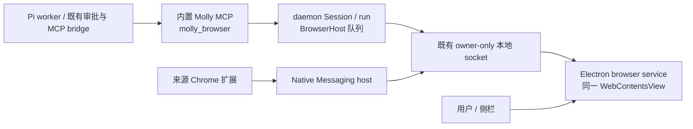

# 内置浏览器复用本机网站登录态：技术方案与分步实施计划

Status: proposed
Date: 2026-09-22
Translation: pending

## 摘要

设计 Agent 需要在 Molly 内置浏览器中调研并保存所选素材，由用户在设置页主动导入指定 Chrome 网站登录态。步骤 A 已修复 CHIPS 身份丢失，B、C 已接入官方 Playwright MCP 与固定 VS Code 适配，D、E 已取得匿名及本机 Apple Development 签名 Pinterest 核心证据。用户随后明确将首期收敛为 Pinterest，授权等待修复与当前交付范围见[收尾记录](../../implemented/feature/2026-09-23-pinterest-browser-release.zh.md)。本文保留更宽方案及历史失败，Amazon、Developer ID 分发、公证和升级不再作为首期代码收尾条件；相关 Spec 仍为 draft，未授权公开发布。

**2026-09-23 复用依据更正：** [竞品与开源实现核验](2026-09-23-browser-products-reuse-evidence.zh.md)确认 Cowork 已提供内置浏览器逐站 Cookie 导入，VS Code 已公开 Electron 页面隔离 → CDP 消息适配 → Playwright 的实现，且 Playwright v1.61.1 稳定类型已支持 transport 对象。下文“稳定 connectOverCDP 必须 HTTP/WS 监听”及据此推导的必需成本已过时；单页 debugger 不能直接充当 Browser endpoint 仍成立，但不足以证明自有 DOM 驱动更省。该更正当时只重新开放路线决策；随后步骤 B 的证据及步骤 C 的用户指令确定官方 MCP 路线，当前运行时已替换。

**2026-09-23 Cookie 合同复核与修复：** 原 [browser-account-source](../../../../apps/electron/src/main/services/browser-account-source.ts) 从 `browserReport` 读取不含 CHIPS 上下文的扁平 Cookie，可能把分区 Cookie 写成普通 Cookie。现保留报告的完整解密检查，另用已锁定 rookie-cookies 0.6.0 的 `chromiumBasedDetailed(source.path, [site], 'chrome')` 读取同一选中来源的详细记录；逐来源比较普通字段及重复条目数量，不一致即拒绝。单条 CHIPS、同名分区、未知上下文和普通身份冲突全部拒绝整次导入。目标分区也在写入前经只读 CDP 检查，已有 CHIPS 时不执行覆盖或扁平备份。这里只修导入边界，不支持 CHIPS 迁移。

## 当前后续实施计划：先复用驱动，再验收核心任务

本节保留 A–E 的执行过程，取代旧 0–9 步骤；最新范围及完成条件以[首期收尾记录](../../implemented/feature/2026-09-23-pinterest-browser-release.zh.md)为准。步骤 A–C 已完成，D、E 已取得匿名和本机开发签名 Pinterest 核心证据。Developer ID 分发、升级及 Amazon 验收、公开发布不在当前首期收尾范围。

### 目标、复用与责任

核心闭环为：用户在设置中导入 Pinterest 账号（或明确选择内置手工登录）→ Agent 在同一个可见内置页搜索 → 查看结果/详情 → 保存所选图片到现有设计素材目录。手工登录不能冒充 Chrome 导入通过。原方案的 Amazon 搜索/PDP/网页问答已按用户指令转为后续范围；图片自动排版、生图、设计版本、更多网站和多浏览器来源不加入本轮驱动任务。

优先候选调用链为：`Pi/既有 MCP bridge → Molly 受限工具入口 → Electron 持有的官方 Playwright MCP/BrowserContext → Playwright → VS Code 必要页面适配 → 现有 WebContentsView`。优先把高频 CDP 消息留在 Electron 宿主内，现有 owner-only 通道只承接高层工具请求，避免用低频轮询逐条运输 CDP。具体上游版本与进程内接入可行性在步骤 B 核验，不能只证明 Core 可用就宣称 MCP 已接入。

- 保留：Lody 浏览器外壳与页面生命周期、Pi/审批管线、Session/run 身份、既有本地通信、网站账号设置与读取库、受控字节抓取和资产写入。
- 优先替换：自有 DOM 快照、元素定位/引用失效、输入点击编排和通用页面等待。网络 peer 校验、站点授权、取消/接管及素材来源仍归 Molly；不承诺换驱动能自动替代它们。
- 源码复用：从[核验的 VS Code 实现](2026-09-23-browser-products-reuse-evidence.zh.md#已证实vs-code-提供最接近的开源接入参考)提取必要适配，保留来源与许可；MCP 和 Playwright 用锁定依赖，不 fork 上游自动化引擎。消息 transport 不要求新增公网或 loopback 监听。

### A：修复 Cookie 身份丢失

改用保留上下文的 rookie 读取入口，继续校验所选 profile、站点、完整解密、数量和大小。首期对无法保真写入的 CHIPS/未知上下文，在任何清除或写入前拒绝整次导入并说明原因；不静默跳过，不只检查同名重复，不扩展完整 CHIPS 迁移。覆盖和回滚也不得将 Cookie 身份扁平化；无法安全处理现有数据时保持原数据。

**交付与通过信号：** 普通 Cookie 字段保持不变；单条分区 Cookie及多个分区同名 Cookie 均在修改存储前被拒绝；错误返回不包含值，拒绝后既有 Molly 账号数据不变。复用现有合成测试补这几个行为，不读取真实 Chrome profile，不重跑真实模型。相关读取 API 若不能证明完整性则明确禁用该导入路径，不自行编写解密器。

**A 实施结果（2026-09-23）：**

- 继续复用固定版本的原生读取和解密。`read()/fromPath().detailedCookies` 是整 profile 无域名过滤接口，不采用；`chromiumCookiesFromPathDetailed` 在该版本拒绝非空 domains，也不采用。所选 Unix 兼容入口实际保留域名过滤和 CHIPS 上下文，路径仅来自已核验的原生报告。它已被上游标为 deprecated（最早 0.7 移除），依赖升级时必须重新验证，不能改成全账号读取后过滤。没有修改 vendor 或自写解密器。
- 代价是报告与详细记录两次站点读取，可能增加 Keychain 访问；固定错误文本隐藏 Cookie 和本机路径，两次内容不同则停止。检查不能使外部 Chrome 数据库成为原子快照，也不能代替稳定签名包的授权体验验收。兼容入口没有报告接口的 timeout 参数，本轮未引入后台重试或新读取服务。
- 原主进程写入/回滚块移到 [browser-account-import](../../../../apps/electron/src/main/services/browser-account-import.ts)，使测试能观察拒绝前后实际存储状态，没有新增 IPC 或导入流程。写入前临时空白 WebContentsView 绑定 Molly 目标 session，只调用 `Network.getAllCookies` 检查分区元数据，随后关闭；不导航、不接管 Agent 页面、不开放端口，Cookie 值始终留在主进程。目标已有 CHIPS/opaque 分区或检查失败时保持其 Cookie 不变。该检查与 Cookie 写入之间不构成对网站并发写入的存储事务。
- 验证：账号来源/写入测试 10 项、原签名门禁 2 项通过；实际 rookie 绑定读取临时合成 SQLite，确认仅返回所选域且保留分区；隔离 Electron 39.5.1 内存 session 中，同名普通/CHIPS 两条由 CDP 可区分，而 Electron Cookie API 确实省略分区字段；临时页面和数据已清理。Electron 主进程 typecheck 通过。本轮未读取真实 Chrome profile/Keychain、未运行模型或整套 E2E、未进行签名包验收。

### B：做一次成熟驱动最小接入验证

用隔离 Electron 技术样例连接现有 `WebContentsView`，真正经官方 MCP 完成页面读取、点击/输入、截图，并确认当前图片引用能交给既有素材入口；不得依赖上游私有模块或再建一套元素引用。只注册获准页面及必要子目标，验证 Molly 应用 renderer 不可列举/操作，撤销后不能继续读取。样例只证明驱动兼容性，不能以样例绕过生产网络守卫或冒充完整产品 E2E。

**交付与通过信号：** 一个可复现样例、一份固定版本/复用文件清单、实际能删除的自有机制清单。约一小时设置首次检查点；未跑通时先报告具体障碍和已验证范围，不通过堆通用 CDP 平台或扩展原生驱动无限延长。若必须 fork 上游或重写大部分处理器，停止该候选，给出基于 Playwright Core/已有处理器的最小差量比较，路线变更明确记录。

**B 实施结果（2026-09-23）：最小接入通过，保留官方 MCP 首选。**

入口为 [运行脚本](../../../../apps/electron/scripts/browser-mcp-probe.mjs)和[隔离 Electron 样例](../../../../apps/electron/scripts/browser-mcp-probe-main.ts)，一条命令：`node apps/electron/scripts/browser-mcp-probe.mjs <独立证据目录>`。不修改生产调用链或 workspace 依赖，不安装另一份浏览器，不读取 Chrome/Keychain，不调用模型。样例只导入生产 `fetchSelectedBrowserImage` 与其策略依赖；搜索页来自专用内存 session 的合成协议处理器，不能将它视为生产导航策略或真实网站验收。

| 固定项                                             | 实际使用与复用责任                                                                                                                                                                 |
| -------------------------------------------------- | ---------------------------------------------------------------------------------------------------------------------------------------------------------------------------------- |
| Electron 39.5.1 / Chromium 142.0.7444.265          | 使用项目当前 Electron 可执行文件，在创建并加载的同一个 `WebContentsView` 上操作                                                                                                    |
| 官方 `@playwright/mcp` 0.0.82                      | 仅通过公开 `createConnection(config, contextGetter)` 与 MCP SDK 调用，不导入其私有模块、不改处理器                                                                                 |
| Playwright 1.64.0-alpha-1789764292000              | 该 MCP 发布版锁定的上游依赖；Core 与 MCP 使用同一份版本，未强行混用另一个 stable 版本。稳定版 transport 的已有证据不等于本样例已测 stable 组合                                     |
| MCP SDK 1.29.0 / esbuild 0.24.2                    | `InMemoryTransport` 与编译；仅临时 probe 依赖，不加生产安装与协议                                                                                                                  |
| VS Code `3fecd4f931666fecd1fbd7c214ce544409ead6e8` | 原样复用 `common/cdp/proxy.ts`、`common/cdp/types.ts`、`electron-main/browserViewDebugger.ts`、`electron-main/browserViewCDPTarget.ts`；源码及依赖 SHA-256、MIT License 随证据保存 |

VS Code 编译时共读取 21 个源码文件，包含 Event/Disposable 等基础依赖，tree-shaking 后打包进独立样例。Molly 薄适配只提供宿主页面、Browser 回调、获准 target 注册/撤销和进程内 transport。Electron 39 缺少 VS Code 使用的 `getOrCreateDevToolsTargetId`，样例通过一次 `Target.getTargetInfo` 提供等价只读 accessor，不修改 Electron 对象或上游文件。`browserContextId` 必须是非空宿主 ID；首次样例传空值导致连接失败，已修正。未引入通用 CDP 服务或新引用表。

实际通过的单条旅程：官方 MCP snapshot → 以上游 ref 输入 `poster design` → 点击 Search → 再取 snapshot → 点击 Choose image → 截图 → 用主进程固定函数调用官方 `browser_evaluate(target)` 解析 IMG 的 `currentSrc` → 原有受控字节入口抓取。固定函数由宿主拥有，不能在产品中开放给 Agent 自写。保存得到 5,730 字节 PNG，SHA-256 为 `d45606a8ea2bb74d8d9ff1560eb68210021498bcf2c84fe569e93a68a2ed8dbc`；它是公开 TypeScript logo 测试图片，不是 Pinterest 调研结果。截图已检查，输入、搜索结果与选择结果均可见。

隔离样例同时创建未授权的应用 renderer。MCP tab 列表只有获准页面；CDP 只登记该页面及其实际 dedicated worker，尝试按真实 target ID 附加未授权 renderer 被拒绝。销毁这组 target 后，旧 ID 不能再附加，下一次官方 MCP snapshot 返回错误而非旧页面内容。页面身份在整个操作链保持不变。这是目标隔离与后续调用撤销证据，尚未覆盖生产 run/epoch 校验、在途结果撤销、所有 OOPIF/弹窗或页面来源策略。

通过证据位于 Git 忽略的 `e2e/artifacts/acceptance/browser-mcp-probe-03/`：`result.json`、`mcp-calls.json`、`tools.json`、`screenshot.png`、`selected-image.png`、`upstream-sources.json` 与许可证。前两次失败分别是样例 context ID 为空、合成表单脚本引号错误；失败结果保留在 `browser-mcp-probe/` 与 `browser-mcp-probe-02/`，没有修改产品驱动来迎合夹具。通过后不再扩测。后续运行脚本也保存 npm dependency lock；这次的确切 lock 已补存到通过证据。测试窗口、临时浏览器 profile 和编译目录已清理，临时 npm 缓存保留便于复现。

**步骤 C 可替换与必须保留的具体清单：**

| 现有机制                                                                 | 接入后处理                                                                                                        |
| ------------------------------------------------------------------------ | ----------------------------------------------------------------------------------------------------------------- |
| controller 的 `snapshotScript` / `selectorFor` / `elementFingerprint`    | 删除，以官方 MCP 的快照与引用替代                                                                                 |
| `Lease.refs`、`snapshotId`、`findElement` 及每次点击后的自有引用清空     | 删除；借助 MCP `target`，宿主继续绑定当前 run/page，旧数字引用合同需在消费者处迁移                                |
| 自有坐标点击、聚焦后 `insertText`、通用操作等待                          | 用上游 locator 操作及等待替代；人类输入屏蔽必须适配新的 CDP 输入路径，不能直接沿用旧 `dispatchingAgentInput` 假设 |
| 直接 `Page.captureScreenshot` 获取截图                                   | 由官方 MCP 承担捕获；模型字节上限、结果裁剪仍由 Molly 保留                                                        |
| `waitForReadable`                                                        | 不可整块删除：通用页面等待可交给 Playwright，网络验证、来源校验、超时与撤销责任需保留并拆清                       |
| 图片解析                                                                 | 上游解析自己的 ref；Molly 仅保留固定 IMG 元数据读取、来源/lease 复检与已有受控字节抓取                            |
| 宿主队列、Session/run/epoch、站点审批、人类接管、URL/DNS/peer 及下载拒绝 | 保留，不能因为本样例通过而移除                                                                                    |

**产品接入的实际差量：** `core` 工具集中仍含任意代码与 evaluate，生产 list/call 两处必须白名单；此样例是固定程序调用，没有把全部工具交给模型。`webmcp:false` 已使用。官方 MCP 即使未传 filename，动作可能把快照写到输出目录，截图会写文件并返回图像；不存在本样例已验证的“零文件输出”配置。步骤 C 应指定宿主私有临时目录、禁止 Agent filename 参数、处理结果中的文件链接并清理文件。上述工作属于工具范围/结果/生命周期适配，不构成重写快照或定位。与 Playwright Core 自有 handlers 相比，当前没有出现必须 fork MCP 或大量重写其语义的障碍，因此继续官方 MCP 路线；产品切换仍需步骤 C 实施。

### C：接入产品并删除被替代实现

在 B 通过后，将成熟驱动接入既有 Pi/MCP 和 Electron 服务。工具 list/call 两处固定允许范围与参数，保留任务/站点审批及接管；禁用任意服务端代码、通用文件、Cookie 导出和动态网站工具入口。沿用现有 MCP catalog 与命名合同，不改 Pi 引擎、不另建 grant 存储。截图按模型限额返回并清理上游临时文件；素材保存复用现有字节入口，普通下载继续拒绝。

让上游页面/引用解析承接选图，Molly 只做来源绑定与资产接纳；同时保留页面导航/重定向、私网和响应 peer 守卫。切换完成后删除旧快照、引用表及等待实现，不交付双驱动选择或自动回退。只处理替换必需的错误合同和生命周期差量，侧栏账号动作统一指向设置；公共队列抽象及无关 P2 清理不加入本阶段。

**交付与通过信号：** 产品 Agent 能通过新链路操作同一个内置页并保存素材，审批拒绝/接管后不能继续操作，旧驱动已退出调用链。既有确定性 E2E 只更新受影响场景；最终保留的素材入口补针对私网重定向、DNS 绑定、跨站 Cookie 不转发的必要回归，不以大范围抽象重构作为补测前提。

### 步骤 C 执行记录（2026-09-23）

用户授权“替换产品驱动”后，产品已接入 `Pi → molly_browser → Electron 内官方 Playwright MCP → Playwright → VS Code 适配 → 原 WebContentsView`。这取代文首“产品替换待执行”的状态；A、B、C 的实现与分层接线验证已完成，D 的真实模型闭环和 E 的签名账号验收仍待执行，整份方案保持 proposed。

依赖精确锁为步骤 B 的组合；pnpm 发布年龄豁免只列该 MCP、Playwright 和 Core 的确切版本。VS Code 三个入口及必要基类从固定 commit 原样构建，21 个来源 SHA-256、生成器及 MIT 许可随代码保存。2,658 行生成模块属于上游复用代码；正常构建不下载源码。Vite 会移除源码 banner，因此另将 `browser-cdp-NOTICE.txt` 随包交付并在 afterPack 检查。没有新浏览器、CDP 监听口或备用驱动。

删除自有快照脚本、selector/fingerprint、refs 表、snapshotId、findElement、坐标点击和输入。引用改为上游 `e5`/`f1e5` 字符串；严格动作合同拒绝 CSS selector、旧数字引用、任意 code 和 filename。官方 MCP 目录只在 main 内，Agent 仍仅见原七种动作；固定宿主 evaluate 只做密码字段检查、滚动和图片元数据解析。临时输出逐次清空、撤销后移除。保留的文档等待只用于公网响应核验，不承担元素定位/等待。

原 Electron 人工输入拦截也会阻止 CDP 点击，`Input.setIgnoreInputEvents` 在该组合亦阻止点击。最终只在同步 `Input.*` 分发调用栈内放行，返回 Promise 前立即关闭，不跨 Playwright 等待。侧栏账号动作统一打开设置，删除直接清理及 `window.alert`。

验证范围：

- CLI browser-host / MCP catalog / 严格动作合同 59 项通过；素材入口新增私网重定向、DNS 变化与 pin、跨站 Cookie、响应 peer 四项回归，与既有策略共 9 项通过。复用现有 Pi bridge 回归。
- 既有桌面 scripted-model E2E 两场景、12 步通过：拒绝浏览、一次批准仍拒绝本机地址。证据：忽略目录 `e2e/artifacts/acceptance/browser-driver-permissions-step3/`。
- 原探针增加 `--product`，使用当前产品模块。`browser-product-driver-07/` 通过同页输入/点击、官方 JPEG、上游图片 ref → 受控抓取 → PNG、撤销断开、真实 example.com 公网响应和私网拒绝。搜索页是合成夹具、图片是公开 logo，这是原生模块集成证据，不冒充 Pi 自主完成 Pinterest。
- 早期失败保留：01 为探针临时模块解析；02/03 为输入拦截；05 的直接图片文档没有可用图片 ref；06 的 Wikipedia 首个无障碍 img 不是可保存的已加载 IMG。没有因此新增自有图片选择器。上游快照不保证每个视觉图像均可保存，目标网站支持由 D 验收。
- Electron、CLI、shared 类型检查，目标 lint、桌面构建和 public-boundary 通过。macOS arm64 ad-hoc 包 afterPack 已加载 MCP/Playwright 并检查许可；既有 Cookie fuse、原生读取器和 CLI smoke 仍通过。未读取 Chrome 账号，未宣称稳定签名与登录持久性通过。

下一步只进行 D 的真实模型核心任务，验证内置 Agent 搜索并把素材写入作品；不扩展网站和模型矩阵。提交和发布仍未执行。

### D：完成无签名核心验收并整理交付

固定一个提示词，让用户已授权的 Kimi 连接通过 Molly 内置 Agent 在 Pinterest 搜索 `poster design`，查看一项结果并保存一张支持格式的图片；核对实际文件可解码、来源正确、内置页过程可见。先单次调用确认代理可用，再进行一轮真实任务；遇到明确实现缺陷后才修复并重跑相关轮次。若登录墙或站点限制阻断，明确记录未通过，最多用一个公开站点诊断驱动/素材路径，不能把替代站点当作 Pinterest 验收完成。

**交付与通过信号：** 一份沿用既有格式的核心验收证据，不要求生成设计、生图或再测全部网站。没有相关变更不重跑既有通过组合。依实际改动运行针对性测试和必要 E2E；准备提交前集中完成 `pnpm check`、`pnpm format`、`pnpm run docs check`，包组合变更补 `pnpm check:public-boundary`，E2E metadata/harness 变更遵循现有检查规则。更新当前实现文档、skill 和 Spec（保持 draft，批准按既有流程），按 Cookie 修复/驱动迁移/独立设计版本修复准备可审查的逻辑提交，不为凑数量拆成不能独立工作的片段；实际提交或发布遵循届时授权。

### 步骤 D 执行记录（2026-09-23）

复用既有 `ElectronHarness`、模型连接设置、Pi 与审批链，使用当前步骤 C 的开发构建和全新隔离 profile。一次本地代理预检确认有响应；随后只进行一轮真实 `kimi-k3` 任务，没有切换模型或网站，没有读取 Chrome 账号，也没有改动运行时代码。固定任务为在匿名 Pinterest 搜索 `poster design`，使用 snapshot/screenshot 观察，选择已加载图片，详情可访问时查看详情，再通过 `save_image` 保存并报告来源及限制；不生成设计、不调用生图、不修改账号。

本轮由产品 Agent 完成导航、上游快照、两次截图观察及图片保存。只批准一次 `pinterest.com` 任务范围，9 次模型请求均返回 HTTP 200；请求证据包含实际图片输入块。落盘文件为 474×711 JPEG、66,976 字节，SHA-256 `4874d889310f9d5a5e32c0687837935a95467dc960e910f5542486e15abe51c3`，Electron 解码成功，复制出的验收图片与原素材哈希一致。来源为 Pinterest 搜索页及 `https://i.pinimg.com/474x/fb/c7/71/fbc77125e15ba30ef3c3833f965f1cfd.jpg`，保存到当前设计的 `media/`；没有修改或提交画布。

**通过范围：匿名搜索结果 → 模型看图 → 选定图片保存。** 两次点击（关闭右下角提示、进入 Pin）返回 `harness_browser_page_not_ready`，页面截图显示居中的登录模态框，详情未成功进入。模型随后保存的是已加载的公开网格图片，不是登录后内容或原图；不据此宣布详情、作者溯源、完整 Pinterest 调研或任意站点已通过。超时错误没有提供更细的遮挡原因，本轮保留该观察，不扩展错误合同或添加站点专用绕过逻辑。此轮只记录了内置页截图，未单独断言侧栏打开过程，不把截图等同于人工完整交互验收。

回合正常结束，浏览状态恢复 `agentControl: human`；测试进程和隔离 profile 清理成功。证据保留在忽略目录 `e2e/artifacts/acceptance/browser-mcp-kimi-pinterest-20260923-01/`，包含原提示、工具 schema/调用、截图、实际 JPEG、运行诊断、`result.json`、构建哈希和 `manifest.json`。已核验 manifest 全部文件哈希、执行前后 main/CLI 构建哈希一致、隔离数据目录已删除。没有覆盖旧轮次，也没有新增公开站点诊断轮次。

能力说明和 Spec 的实施证据同步，Spec 仍为 draft。运行时代码未变，不重跑步骤 C 已通过的测试矩阵；文档检查另行完成。Cookie 修复、驱动迁移及独立设计版本修复仍以各自 owning note 保持审查边界，代码尚未提交或发布。下一项产品验收为 E，等待稳定签名后测试真实账号及重启持久性；Amazon 子场景仍未通过。

### E：具备稳定签名后验收真实账号

沿用现有打包与 fuse 验证，在隔离最终签名包中从设置页导入指定 Pinterest 账号，确认网站实际登录，然后搜索并保存图片；重启确认状态仍可用，再验证设置中清理。账号长期迁移/升级只在确有第二个已签名构建时验证，不以同一可执行文件重开冒充升级。用户已授予的同范围测试授权继续有效，系统钥匙串/MFA 由用户处理。

随后在用户实际提供的 Amazon 账号/地区执行一轮搜索→PDP→可用的网页问答；无问答入口就记录该子项不支持或未验证，不扩建网站专用驱动。相关站点因分区 Cookie 无法导入时如实报告限制，另行评估是否需要保真支持；手工登录可验证浏览能力，但不能冲抵导入失败。

**交付与通过信号：** 最终签名包的 Pinterest 导入、浏览、保存、重启与清理各有证据；Amazon 各子项有独立结果。当前本机开发签名 Pinterest 验收已执行，见下方结果；Developer ID 正式分发、升级与 Amazon 仍待条件具备，不以单站本机通过宣称总范围全部交付。

### 步骤 E 前置检查（2026-09-23）

启动签名账号验收前，`security find-identity -v -p codesigning` 返回 `0 valid identities found`；当前 `apps/electron/dist/mac-arm64/Molly.app` 的签名为 `Signature=adhoc`、`TeamIdentifier=not set`。`codesign --verify --deep --strict` 虽通过，但只证明该包签名与文件一致，不代表具备稳定开发者签名身份。常规 `/Applications/Molly.app` 与用户 Applications 路径未发现另一份 Molly 包，也未发现已配置的签名环境变量。

因此本步停在签名前提未满足：等待包含本轮改动的稳定签名包路径，或本机完成签名证书配置后继续。未启动测试应用、未读取 Chrome Cookie、未触发账号导入或钥匙串授权；没有绕过当前签名门禁。既有同范围账号测试授权继续有效，无需重复确认。E 的导入、登录后搜索保存、重启持久性和清理均未验收；本次检查不改变 D 的匿名核心闭环结果。

### 步骤 E 开发签名预检（2026-09-23）

用户配置证书后，本机发现一张 `Apple Development` 身份，而非 `Developer ID Application`。最初有效身份计数为零；从 Apple PKI 获取 WWDR G3 中间证书、先用系统根验证再安装到登录钥匙串后，系统识别为一个有效身份。未设置自定义信任、未导出私钥、未改签名门禁。开发证书可用于本机测试，本记录不把它视为 Developer ID 分发或公证通过。

使用既有 `build` 与 `package-electron.mjs`，以 `mac.type=development`、`forceCodeSigning=true`、`notarize=false`、`publish=never` 生成本地测试包；未改变发布配置。产物在忽略目录 `apps/electron/dist/signed-acceptance-20260923/mac-arm64/Molly.app`。用户在系统弹框完成签名私钥授权后，打包完成，`codesign --verify --deep --strict` 通过，具备 Apple 开发者证书链及 TeamIdentifier，非 ad-hoc。既有 CookieEncryption、原生 Cookie 读取器、MCP/Playwright、Bento、Pi 和 CLI 原生依赖打包探针通过。包包含当前未提交工作，基线 commit 与 asar 哈希单独保存在验收目录，不能仅凭基线 SHA 声称工作树干净。

首轮 `browser-signed-pinterest-20260923-01` 复用已安装包模式的 `ElectronHarness` 启动隔离 profile，等待首次系统钥匙串授权时触及现有 60 秒启动上限，未进入设置导入。失败结果保留在忽略的验收目录，测试进程及隔离目录已清理；没有读取 Chrome Cookie、没有进行账号模型任务。签名检查通过与真实导入通过仍分别记账，后者尚待继续。

用户完成首次 Molly Safe Storage 授权后，同一签名包后续启动成功。第二轮探针的设置深链接实际打开通用设置，等待网站账号标题失败，未读取 Chrome；第三轮改为在设置面板实际点击“Website accounts”，选定已授权的来源并点击 Pinterest 的“Import from Chrome”。产品返回 `persistent=true`、`importAvailable=true`，但原生读取在等待系统授权时超过既有 `timeoutMs: 60_000`，UI 如实报告 `Chrome profile import did not finish`；Pinterest 目标 Cookie 仍为 0。两轮均保留独立失败证据，未改产品代码或超时策略；真实模型账号任务、重启登录持久性和清理功能尚未执行。失败探针退出并清理各自隔离 profile。

### 步骤 E 本机真实账号验收结果（2026-09-23）

用户完成 Chrome Safe Storage 系统授权后，第四轮 `browser-signed-pinterest-20260923-04` 在同一开发签名包中，通过设置页面按钮导入指定来源的 Pinterest，目标持久分区保存 5 条 Cookie。真实内置 Pi/Kimi 通过官方 MCP 读取到了网站登录后的个人主页入口与账户切换器，完成 `poster design` 搜索、观察截图、进入 Pin 详情并保存所选 JPEG。点击详情曾遇到页面验证未就绪；模型根据已观察的 Pin 链接直接导航后成功，未换站或绕过登录。通过 Molly 的 Add panel → Browser 展示了 Agent 正在使用的内置详情页，未操作外部 Chrome 页面。

保存文件为 736×920 JPEG、68,516 字节，SHA-256 `71bbac5be2520fa53e0e5d1be65c8c845d6426353e75ffedb69bedc65c417601`，实际解码成功、复制出的证据图片与素材回执哈希相符。来源页 `https://www.pinterest.com/pin/327848047900131323/`，图片 `https://i.pinimg.com/736x/28/9a/61/289a6170e67852d6d55a3ab0fcb103d7.jpg`。模型确实收到截图图像输入；这一轮有 18 个模型 HTTP 200 响应，不把 HTTP 状态当作最终完成证据。

同一可执行文件经既有 harness 关闭再启动后，目标分区仍有 5 条 Pinterest Cookie，内置网站进入 `/business/hub/`，页面显示 Business Hub 和个人主页入口。随后点击设置中的清理按钮并确认，目标站点 Cookie 归零。隔离 profile 与所有自有测试进程均已清理，未删除共享 Keychain 条目；Chrome 原账号未更改。该记录证明同包重启，不证明升级。

**收尾证据的限制与补验：** 第四轮脚本用 Stop 按钮消失判断结束，之后的 30 秒内仍有新的模型请求；脚本在模型仍返回内容时进行了重启，因此其原始 `status=not-passed`、`browserControlReleased=false` 保留，不能改写为整轮全绿，也不能据此认定产品控制权释放缺陷。该轮直接页面截图探针只匹配搜索 URL，详情页不匹配，故其 `directCapture` 失败亦保留；不影响已保存的素材、真实 MCP 图像输入和网站侧登录观察证据。

补验 `browser-signed-pinterest-closure-20260923-01` 只重新导入并让 Agent 导航/观察登录状态、结束任务，没有重跑搜图和素材保存。最终 UI 实际出现独立的 `SIGNED_BROWSER_DONE` 回复及登录结论，并显示任务耗时；随后浏览器状态为 `agentControl=human`。清理按钮再次将测试站点 Cookie 归零，自有进程/profile 已清理，补验 `status=passed`。本轮未改产品代码、未绕过签名或授权合同。

**当前结论：** 本机 Apple Development 签名下，Pinterest 的产品设置导入、登录后浏览取材、同包重启持久性、清理及任务结束释放各有实际证据。核心取材与任务结束释放来自两个独立实测，不能包装为单轮全项通过。Developer ID 分发、公证、第二签名构建升级和 Amazon 各子项仍未验收；相关 Spec 仍为 draft。验收目录受 Git 忽略，原始账号页面/模型记录不提交到源码仓库。现有 60 秒人工授权等待容易使首次启动/导入超时，是本次暴露的体验限制，本轮未修改超时策略。

### 执行收敛规则

每步只回答本步问题；通过后前进，失败先归因再修复。模型/代理故障不变成浏览器代码任务，网站限制不变成绕过任务。真实轮次保留证据但不追求轮数；可保留的旧测试不重复建设，所选驱动尚未确定前不打磨将被替换的模块。每步结束报告完成项、证据和剩余阻碍，不再同时启动账号、驱动、设计版本及多站点验收。

## 2026-09-23 导入体验修订（取代下文的扩展首选路线）

用户明确要求在 Molly 页面完成导入，不能把开发者模式安装、扩展 ID 和配对码作为正式操作。原隔离测试在扩展加载前停止：未安装扩展、未读取或转移真实 Cookie；测试 Molly profile 与进程已清理。

- **产品路径：** 设置页选择 Chrome 用户配置，再点击 Pinterest 或 Amazon.com 的导入；侧栏按钮只打开该设置页。macOS 如请求 Chrome Safe Storage 钥匙串访问，由用户在系统提示中处理。导入仅是 Cookie 快照，不承诺复制密码、localStorage、IndexedDB 或整个 Chrome profile；网站必须在内置页实际确认登录。来源 Chrome 不交给 Agent 控制。
- **复用与边界：** 采用 MIT 许可的 [`rookie-cookies` 0.6.0 Node 绑定](https://github.com/teng-lin/rookie-cookies/blob/main/bindings/node/README.md)，它提供 Chrome profile 列举和按 profile/域名的报告接口，支持 macOS arm64 原生包及 Node 22。Molly 只调用所选站点的提取，重新核对返回 profile、域名、字段和数量；解密不完整时停止，不向 renderer/Agent/日志返回 Cookie 值。主进程沿用既有 Electron Cookie 写入、Agent 暂停和加密分区。macOS Chrome 的 Keychain 派生机制见 [Chromium 源码](https://chromium.googlesource.com/chromium/src/+/refs/tags/143.0.7497.1/components/os_crypt/sync/os_crypt_mac.mm)，这不等于已证明当前机器的权限和网站兼容性。
- **删除的机制：** 扩展、native host 注册、一次性码、daemon `browser/import-submit` 队列和开发者模式引导不再是交付路径。Chrome 官方把未打包扩展定位为开发用途，macOS 普通分发需 Chrome Web Store 与用户确认；原路线即使技术探针成功，也不能算“在 Molly 页面导入”。[Chrome 扩展分发](https://developer.chrome.com/docs/extensions/how-to/distribute)、[替代安装规则](https://developer.chrome.com/docs/extensions/how-to/distribute/install-extensions)
- **已验证与待验证：** 本机 ad-hoc macOS arm64 打包产物已在 `afterPack` 中加载原生绑定；经用户对直接读取路径的明确授权，在隔离的 Molly 设置页选择 Chrome profile 并导入 Pinterest Cookie。内置 Pinterest 页面出现登录后的 Business Hub 和账号入口，因此这一次账号复用有网站侧证据。随后重建同一 ad-hoc 包并重启时，Molly Safe Storage 钥匙串授权反复出现，未完成重启持久性验收。测试进程及隔离 profile 已清理；共享的 Molly Safe Storage 钥匙串条目未删除，以免破坏正常 Molly 的凭据。最终稳定签名包、Amazon 登录及升级仍待验证。macOS 系统授权是用户动作，Molly 不代替用户点击。

### 2026-09-23 反复钥匙串提示的修正

截图提示访问的是 **Molly Safe Storage**，并非 Chrome Safe Storage。测试包 `codesign --display --verbose=4` 报告 `Signature=adhoc`、`TeamIdentifier=not set`；重启进程采样停在 Keychain 读取。Electron 官方说明没有稳定签名时 `safeStorage` 在更新后可反复请求授权，启用 CookieEncryption fuse 也使用 macOS Keychain。现将 macOS 持久浏览分区及 Chrome 导入限制在具有稳定签名身份的打包应用，ad-hoc/开发版仅用内存分区；账号设置明确报告不可导入。这个门禁不改变既有模型连接凭据的 `safeStorage` 访问，因此不能宣称所有 ad-hoc 启动弹框均消失。导入结果改为报告 Electron flush 后实际保留的站点 Cookie 数，避免把源 Cookie 条数误报为已保存数。[Electron 签名说明](https://www.electronjs.org/docs/latest/tutorial/code-signing)、[Electron fuses](https://www.electronjs.org/docs/latest/tutorial/fuses)、[Apple 钥匙串访问控制](https://support.apple.com/en-lb/guide/mac-help/kychn002/mac)

下文保留扩展方案的比较和旧分步计划作为历史取舍；与本节冲突的“扩展优先”“Native Messaging 交付”条款均已由本修订替代。

## 2026-09-23 既有实施状态（历史路线与证据）

此前完整实施形成以下代码和验收证据；这些授权和历史记录不构成 Spec 批准。本节描述原生驱动已实现的事实，后续工作以文首 A–E 收敛计划为准；不得将历史路线裁定当作继续扩展原生驱动的依据。

- **驱动：** 实测 Electron 39.5.1 的单页 debugger 并不提供 Playwright 需要的受限 Browser/Target endpoint；裸 `Target` 发现还包含 Molly 应用 renderer。移植 VS Code proxy 或包装官方 Playwright MCP 将长期持有完整目标代理、transport 和工具过滤。按最小工具面，改用 Electron `loadURL`、固定 `executeJavaScript`、`sendInputEvent` 与页面局部 CDP `Page.captureScreenshot` / `Network.responseReceived`；不暴露任意脚本或 CDP 连接给 Agent。页面引用、截图限额与等待/失效语义由 Molly 自己维护。匿名 Pinterest 搜索缩略图已跑通；登录后 Pinterest 和 Amazon 页面兼容性尚未证明。
- **页面与传输：** 稳定签名打包版的持久 `persist:molly-public-browser-v1` 与人类侧栏共用同一 `WebContentsView`；开发版和 ad-hoc macOS 包改用内存分区。开发二进制的 Cookie 加密 fuse 未启用，ad-hoc 包虽启用了该 fuse，却没有跨重建稳定的钥匙串身份。Agent 在侧栏关闭时把该 view 挂到隐藏的 Electron window，仍是同一个页面；侧栏打开后再挂回主窗。隔离 Electron 探针证实隐藏导航/快照/截图、挂回后截图、再隐藏截图均可用。主进程通过已有 owner-only socket 轮询 daemon，run 与 Session 决定页面，未新增监听口或外部浏览器控制面。
- **网络：** Agent URL、站点、每次 Chromium 请求、DNS、DIRECT 代理和 CDP 响应 peer 均检查，无法确认则拒绝 Agent 内容；人类手工浏览维持旧的 hostname 引擎路由。所选图片由独立 Node 字节路径逐跳检查并 pin 公网 socket，`will-download` 继续全拒。当前 Chromium 导航在预检 DNS 与实际连接之间仍可能变化；响应 peer 检查能阻止把不安全页面字节交给 Agent，但不能证明连接前绝无 DNS-rebinding 请求，真实账号/私网对抗验收不得据此宣称绝对 SSRF 隔离。
- **账号：** 当前实现用 `rookie-cookies` 从用户在 Molly 设置中选择的 Chrome profile 读取 Pinterest/Amazon.com Cookie；Electron 主进程完成选站过滤、字段/数量验证、既有安全分区写入和 Agent 暂停。原扩展与 Native Messaging 原型已删除。合成报告的来源/profile/越站/不完整解密拒绝测试通过；一次真实 Pinterest 导入后网站显示登录后的账号入口。重启与最终签名包仍未测，Amazon 登录未测。
- **账号入口与可恢复错误：** 网站账号设置页显示 Chrome profile 选择、逐站导入与清除；侧栏导入按钮打开设置。Cookie 数量只说明本地状态，不证明登录。浏览快照继续标出图片原始尺寸，Pi 将已知浏览错误映射为固定安全错误码；真实模型的可恢复行为仍待验收。
- **交付：** 原扩展版的 ad-hoc arm64 包和匿名浏览 E2E 曾通过；新版原生读取路线的 ad-hoc arm64 打包、原生绑定探针、`pnpm check`、`pnpm run docs check` 与隔离设置页及一次 Pinterest 导入通过。重建后钥匙串授权重复，故未把 ad-hoc 包当成可交付的持久登录体验。Spec 仍为 draft，需对修订版取得明确人工批准。

### 2026-09-23 匿名站点手工验收

用隔离的完整桌面 E2E harness 启动真正的 Electron、daemon、Pi worker 与 `molly_browser` MCP；只有外部 OpenAI-compatible 模型 wire 是临时脚本，按顺序发出导航、快照和选图保存调用。逐站用 `browse-task-v1` 在 UI 中授权，未导入 Chrome Cookie、未使用用户浏览器账号。目标词统一为 `poster design`。本轮验证工具链和网站响应，不证明真实模型能自主判断视觉质量；临时逐次证据位于被 Git 忽略的 `e2e/artifacts/scenarios/lody-browser-999/`。

| 站点              | 匿名搜索与选图结果                                                                               | 观察到的边界                                                                                                 |
| ----------------- | ------------------------------------------------------------------------------------------------ | ------------------------------------------------------------------------------------------------------------ |
| Pinterest         | 搜索页在登录弹层背后仍有 474× 搜索结果图片；Agent 保存 4 张 JPEG，首张经哈希复核为农夫市集海报。 | 仅公开缩略图；不证明登录后推荐流、收藏或原图下载。机械选第一张时曾误存 60× 推荐图标，真实 Agent 需看图判别。 |
| Flickr            | 公开搜索结果可读，Agent 保存 3 张 JPEG 缩略图。                                                  | 首个站点图标选图失败；需要识别素材图而非 logo。                                                              |
| Wikimedia Commons | 公开搜索结果可读；较早两轮各保存 2 张 JPEG。                                                     | 后续快照可能早于动态结果图装载，最终七站轮为 0 张；需要重取快照并选择已加载的结果图，不能称稳定通过。        |
| Behance           | 可读到 10,000+ `poster design` 项目及图片引用，4 次选图保存均失败。                              | 被选中项目封面来自 `_webp` 路径，抽样响应 `Content-Type: image/webp`；首期仅接纳 PNG/JPEG/GIF。              |
| Unsplash          | 导航进入 BotStopper 验证页。                                                                     | 无公开搜索结果可选；不能绕过站点风控。                                                                       |
| Pexels            | 导航进入 Cloudflare `Just a moment...` 验证页。                                                  | 无公开搜索结果可选；不能绕过站点风控。                                                                       |
| Are.na            | 搜索页标题与筛选框可读，连续三次快照无已加载的可选图片。                                         | 此环境未完成素材保存，是否为站点脚本/接口限制尚未归因。                                                      |

实测发现两个浏览器就绪缺陷并修正：被预检取消的第三方子请求曾把整页标成致命网络错误；页面持续请求又让已验证的主文档无法快照。现在仅主框架预检失败污染整页，子请求继续被取消，响应 peer 校验仍持续；主文档获验证并达到 DOM-ready 后允许观察，不再等所有后台请求结束；快照只收录已加载的图片元素，并附上原始像素尺寸以辅助选图。匿名验收时，Pi 曾把 MCP `isError` 折叠为 `harness_mcp_tool_failed`；后续为 Molly 浏览工具加入固定业务错误码，已通过桥接层单测，但还需以真实模型观察其选图重试行为。

### 2026-09-23 不依赖签名的验收增量

使用隔离的开发版 Molly、完整 Electron→daemon→Pi→MCP→内置页面链路验收。新增两条确定性桌面旅程：用户拒绝浏览请求得到 `harness_permission_denied`；批准一次访问 loopback 后得到固定的 `harness_browser_destination_denied`，且没有页面数据。两条 P1 旅程和原三条 P0 烟测通过。此处只验证权限与地址边界，未读取 Chrome profile。

真实 Kimi K3 使用用户提供的本地 OpenAI-compatible 代理。在首次真实调用中，Pi 的 OpenAI 参数适配把 `molly_browser` 的顶层 JSON Schema discriminated union 降成了空对象，模型连续发送 `{}`，工具未运行。现将 MCP 公布形式改为带必填 `kind` 的扁平对象，并在 handler 中再次用原严格 union 验证；这是工具 schema 的兼容投影，不放宽执行命令。修正后，独立一轮真实模型在 Wikimedia Commons 匿名搜索 `poster design`，按 `commons.wikimedia.org` 任务授权，实际导航、快照并 `save_image` 一张 250×361 JPEG 到隔离设计素材。文件为 17,475 字节，SHA-256 `eb362d5cd2193a4319b8040e9762c3de6a7078c2eef3b24d356d4b39fb6a0a05`。页面首次重定向期间快照/截图多次只返回通用 `harness_mcp_tool_failed`，重新导航到最终 URL 后恢复；这一就绪/错误解释问题仍需单独处理，不能将一次成功等同稳定成功。该轮的模型请求、工具调用、UI、文件校验及失败尝试保存在 Git 忽略的 `e2e/artifacts/acceptance/browser-kimi-k3-public-20260923-01` 至 `-07`，隔离运行 profile 均已清理；密钥不在仓库文件中。

代理恢复后，Pinterest 匿名真实模型轮次也完成。Kimi K3 在 `pinterest.com` 任务授权下导航搜索页、读取快照并对已加载海报调用 `save_image`；页面快照出现登录弹层，因此可用搜索内容有限。隔离媒体目录实际写入一张 474×702 JPEG，85,687 字节，SHA-256 `2cce96197c81f9f71f3dc17539720e326a93e4a759e8a6dbd90b230cbfd4c22f`。工具调用、模型回答、文件校验和 UI 截图保存在 Git 忽略的 `e2e/artifacts/acceptance/browser-kimi-k3-pinterest-20260923-03`；前两轮因本地代理中途拒绝连接失败，也保留证据。隔离 profile 已清理。本轮证实匿名首屏选图与落盘，不证明登录后搜索、原图可取、设计画布引用及保存重开。

随后又做了图片到可编辑设计的真实模型验收。第一轮连接选择未刷新，尚未触发模型；第二轮 Kimi K3 已保存图片并写入相对 `media/` 引用，但把背景与形状填充误写为裸颜色字符串，Molly 正确拒绝该草稿（`MOLLY-E013`）。因此在随包 `artwork-format.md` 明示结构化填充合同。第三轮使用同一产品工具链，模型读取技能及最小 YAML 示例，保存 Pinterest JPEG（375×530，31,443 字节，SHA-256 `209512a6b03d2f8413c594aeb5548ceec41d6ff9b57761b111bc562a7d6909b0`），写入引用该文件且含可编辑文本/形状的 `design.yaml`，回读后调用 `molly_render_preview` 得到 1080×1350 PNG。桌面接受草稿，“保存版本”生成 V1，页面重新加载后仍显示 V1，浏览控制权归还人工。证据在 Git 忽略的 `e2e/artifacts/acceptance/browser-kimi-k3-design-20260923-01` 至 `-03`；隔离 profile 均已清理。预览 PNG 的模型读取审批在该轮被测试脚本拒绝，Playwright 页面截图也未捕获独立原生画布，因此只证明渲染成功、保存与重开显示，不宣称已人工确认视觉质量。

视觉链补测发现 Kimi K3 本地代理支持图像输入（16×16 合成红图返回 `Red`），但旧 `molly_browser.screenshot` 在 Pinterest 图片密集页连续返回通用 MCP 失败。独立 Electron 隐藏 `WebContentsView` 探针在 1280×800、37 张已加载图片时得到 2,052,910 字节 PNG / 2,737,216 字符 base64，逼近 2 MiB / 2,800,000 字符的现有限额；同屏 JPEG 质量 70 约 278 KiB。因此将仅供观察的截图改为有界 JPEG 质量 75，保留字节和格式校验，素材抓取不转码，并把固定的截图超限/未就绪失败映射为安全错误码。重新构建后，隔离的脚本模型实际调用 Pinterest 导航与截图，Molly→Pi→MCP→Electron 完整链路返回图像；Pi 将 JPEG 规范化为模型请求中的 PNG `image_url` 块。首轮脚本因误要求下游仍为 JPEG 而误判失败，修正断言的新轮次通过，证据在 Git 忽略的 `e2e/artifacts/acceptance/browser-jpeg-scripted-20260923-01` 至 `-02`。

真实 Kimi 复验亦已通过：`browser-kimi-k3-screenshot-postfix-20260923-02` 的模型请求含截图图像块，Kimi 在不调用 DOM 快照的任务中指出居中登录弹层、红底黑猫海报和黑底 `SYNTHETIC NATURE` 海报，与保留的公开页面 JPEG 可核对；回合正常完成，浏览控制权归还人工，隔离 profile 清理。前一视觉组合轮次被系统终止（退出码 137，残留隔离进程和 profile 已清理），本地代理也曾再次连接拒绝；修复后第一轮 Kimi 截图复验虽确实看见并描述图像，却因测试连接 `maxTokens: 512` 截断最终回复并报 `harness_interrupted`，随后用 4096 token 上限的新轮次正常完成。

设计预览视觉读取也已独立通过。`browser-kimi-k3-preview-vision-20260923-02` 中，Kimi 在匿名 Pinterest 保存 375×530 JPEG，写入引用该素材的有效 YAML，调用 `molly_render_preview`，再通过普通 `read` 工具把返回的 1080×1350 PNG 作为图像输入；模型对米白背景、深绿标题和蓝色水彩图的描述与保留的预览图一致。桌面接受可编辑画稿，“保存版本”产生 V1，`design.state` 的 `changed` 为 false，页面重载后仍显示 V1；控制权归还人工，隔离 profile 已清理。模型请求、文件哈希、版本历史、预览 PNG 和页面截图保存在 Git 忽略的同名验收目录。前一不可覆盖轮次 `-01` 同样完成素材、设计提交和模型看图，却在点击“保存版本”后由 `design.saveVersion` 返回一次 `Script failed to execute`；版本未显示。第二轮没有复现，故不能宣称版本保存无间歇故障，也不能仅凭错误文案断定是哪一个原生画布脚本抛错；该故障需在稳定签名包的保存/重开验收中继续观察。

随后针对无签名可做的故障验收，隔离原生回归证实 `history-create` 写入后画布 `snapshot` 抛错会被旧接口整体报为保存失败；现已按[写后刷新故障记录](../../implemented/bug-fix/2026-09-23-design-version-post-commit-reload.zh.md)返回已存版本和独立刷新错误，红/绿原生验证通过。它修复的是已证实的误报类别，不能反推上段历史轮次的准确抛错位置。Wikimedia 的另一问题可复现得更具体：真实 Kimi 连续收到 `harness_browser_page_not_ready`，随后只收到通用 MCP 失败；宿主记录的实际错误为“当前文档响应无法验证”。`Network.responseReceived` 与 `WebContents.getURL()` 对同一查询可用 `Special:MediaSearch` / `Special%3AMediaSearch` 等不同编码，旧文档键按原串匹配。现仅规范化查询编码用于匹配，保留每次请求预检和实际响应 peer 校验；剩余未验证文档/网络拒绝转为固定安全错误码。相同公开提示重跑后，Kimi 用一次站点授权搜索并保存 960×1387 JPEG（154,685 字节）；另一轮先获准尝试本机地址，收到 `harness_browser_destination_denied`，再导航已批准 Wikimedia 并保存 250×361 JPEG。两轮均用完整 Electron→daemon→Pi→MCP 路径与真实模型，隔离 profile 已清理，证据在 Git 忽略的 `e2e/artifacts/acceptance/browser-kimi-k3-redirect-diagnostic-20260923-01` 至 `-03`、`browser-kimi-k3-error-recovery-20260923-01`。这证明错误后继续执行和一轮重定向修复有效，不证明所有网站的重定向稳定。不同轮次选图尺寸差异也说明当前 `save_image` 保存的是页面已加载图片的实际字节，不承诺原图；Behance 抽样 WebP 仍被当前格式合同拒绝。

接管闭环另用匿名 Wikimedia 和真实 Kimi 验证：导航后测试脚本经产品 IPC 触发用户接管，Agent 的快照调用收到固定 `harness_browser_user_takeover`；脚本随后经产品 IPC 恢复，模型继续运行并保存一张 250×361 JPEG。两次 IPC 均返回成功，隔离 profile 与进程已清理，证据在 Git 忽略的 `e2e/artifacts/acceptance/browser-kimi-k3-takeover-20260923-01`。该轮还出现页面未就绪和一次非浏览工具被拒绝，但最终素材已落盘；此处验证接管、暂停、恢复的控制链，不等同于真实 MFA 页面的人机交接。当前可确定性回归中，daemon browser host 的取消与断线会撤销页面并拒绝迟到结果；真实桌面断线/取消仍需安装包闭环复验。

跨站授权也有一轮真实模型和桌面证据：Kimi 先 `navigate` 到 `commons.wikimedia.org`，再 `navigate` 到 `www.amazon.com`，UI 依次出现两个不同站点的任务授权，第二次获准后快照可读到 Amazon 匿名搜索页标题。证据在 Git 忽略的 `e2e/artifacts/acceptance/browser-kimi-k3-cross-site-20260923-01`，隔离 profile 已清理。这证明 Agent 主动跨站导航不会复用前站授权；页面内点击外链的逐次行为仍只由策略单测与守卫代码覆盖，未做独立真实站点闭环。

开发版使用内存浏览 partition，故这项验收不覆盖真实 Chrome 登录导入、跨重启登录保持及 Amazon 已登录问答。那些仍需稳定签名 macOS 产物；现阶段不得以匿名真实模型通过宣称账号功能验收完成。

## 目标和范围

核心体验是“在 Molly 里用已经登录的网站完成调研”，不是通用网页搜索 API。Agent 需要看图、理解网页、搜索、滚动、打开详情、提取信息和保存经选择的参考素材。产品只承诺受支持站点的登录态复用；“导入 Pinterest 登录态”与“同步整个 Chrome 账号、密码、历史和所有标签页”是不同能力。

执行环境固定为内置浏览器。外部浏览器可以由用户选择来源 profile，完成登录和一次性导入；不向 Agent 暴露外部标签页控制、Chrome debugger、远程调试端口或任意浏览器切换。保持现有本地架构、Agent 生命周期、设计附件与素材持久化，不扩成独立素材库、网页档案库或固定创作工作流。现有产品范围见 [设计 Spec](../../../../specs/graphic-design-platform.zh.md) 与 [范围收敛记录](../simplification/2026-09-11-design-result-feedback.zh.md)。

设计 Spec 的“工作台与边界”已将参考网页浏览列为按实际消费者决定的能力。本笔记为 Pinterest 素材及商品调研提供了具体消费者依据，但这条预留不等于持久账号、登录态导入和任务授权已获批准。已补入设计与 Pi Spec 的相关意图并保持 draft；按 [Spec 规则](../../../../specs/AGENTS.md)仍需对本修订取得明确批准，不将评审意见视为产品批准。

## 实施前工程基础

- [PublicBrowserService](../../../../apps/electron/src/main/services/public-browser-service.ts) 已使用 `WebContentsView`，关闭 Node 集成并启用 context isolation 与 sandbox。当前 partition 名没有 `persist:`，下载全部拒绝，弹窗被改为当前页导航；这些是现状，不是完整登录浏览器能力。
- [Session Browser 说明](../../../docs/sessions-browser.md) 明确当前公共浏览器只有人类读取者，因此没有网络读取 guard；增加 Agent 截图、DOM 或脚本读取后，需要在 Agent 路径恢复对应隔离，不能直接沿用 human-only 安全结论。该文也记录了旧 DNS guard 对 fake-IP 代理的误拦问题。
- [AgentClient](../../../../apps/cli/src/agent/agent-client.ts) 已有 `buildBuiltinMcpServers` 与内置 Molly MCP 传递会话身份；[Pi MCP bridge](../../../../packages/harness-pi/src/mcp-bridge.ts) 已实现工具发现、转换、授权与结果处理。Electron 到 daemon 已有 owner-only 本地控制通道，但当前公共浏览器只有 renderer UI IPC，浏览器专用的 run/page 合同和控制桥尚未实现。
- 平台能力与工具合同继续遵守 [platform](../../../../packages/platform/AGENTS.md) 和 [shared](../../../../packages/shared/AGENTS.md) 边界。浏览器账户数据不进入 Flock、workspace、Git 或设计 YAML。

## 已核实的产品与技术事实

### 主流产品确实有独立浏览器与登录态导入

Claude Cowork 官方帮助明确支持用户逐站选择导入登录 Cookie；macOS 来源包括 Chrome、Edge、Firefox，Windows/Linux 来源列为 Firefox，Safari 不支持。也可以手工登录并跨任务保留状态。它的内置浏览器独立于用户日常浏览器。该证据说明产品路线可行，但没有公开其凭据读取实现，不能推断 Molly 具有相同覆盖率。[Claude 官方帮助](https://support.claude.com/en/articles/16607400-use-the-built-in-browser-in-claude-cowork)

OpenAI 当前浏览器文档同样说明内置浏览器使用独立 profile，设置里可管理设备支持的导入能力；操作现有 Chrome 等浏览器标签页则另走扩展。这支持“内置 profile + 有限导入”的概念拆分，不证明底层使用 Electron 或某种 Cookie 提取库。[OpenAI 浏览器文档](https://learn.chatgpt.com/docs/browser)

### 与 Lody 和 Codex 的技术路线对照

本次另行核验 Lody 上游 `main` 固定提交 `787a9a6c516c55322ea12e60db404045c017cf04`：[公共浏览器源码](https://github.com/LodyAI/Lody/blob/787a9a6c516c55322ea12e60db404045c017cf04/apps/electron/src/main/services/public-browser-service.ts#L24) 使用不带 `persist:` 的 session partition 和 `WebContentsView`，并明确没有 Agent-facing tool、页面抓图或脚本注入；下载被取消，弹窗导航到当前页。[双引擎说明](https://github.com/LodyAI/Lody/blob/787a9a6c516c55322ea12e60db404045c017cf04/.agents/docs/sessions-browser.md) 将 loopback Managed Preview 与人类浏览公网/局域网站点的 Electron 宿主分开。因此本方案沿用 Lody 已有网页宿主，新增持久浏览身份、用户主动导入与 Agent 受控操作；不能把 Lody 的可见 Browser 面板当作已具备三项新增能力。

Codex 可调用的内置浏览器在公开能力架构上与本方案一致：独立 profile、Agent 页面操作，以及设备可用的导入功能。其官方文档还说明 developer mode 提供受控 CDP 访问，但这不证明所有正常操作都直接通过同一 CDP 通道实现，也不证明具体嵌入类是 Electron `WebContentsView`。当前公开依据没有披露登录态导入使用原生读取还是扩展，因此本文推荐的导入扩展是 Molly 的候选实现，不是经证实的 Codex 实现。导入扩展只传递用户选定的状态，并不增加外部 Chrome 执行后端。[OpenAI 浏览器与 developer mode 文档](https://learn.chatgpt.com/docs/browser)

Amazon 当前正式产品名已为 Alexa for Shopping，官方记录其由 Rufus 更名；本文沿用用户所述场景。是否在特定地区、账号和内置环境可用仍需真实验证。[Amazon 官方介绍](https://www.aboutamazon.com/news/retail/alexa-for-shopping-ai-assistant)

### Electron 提供独立持久化与浏览器控制基础

`session.fromPartition('persist:…')` 会产生可由同 partition 页面共享的持久会话；无此前缀则为内存会话。`WebContentsView` 可以在应用窗口中展示网页。方案因此可以复用已有渲染宿主，为内置账号 profile 建立独立稳定标识，标签页身份与账号 profile 身份分离；不能把 profile 直接绑定成每个 Agent 回合一份。[Electron session](https://www.electronjs.org/docs/latest/api/session)、[WebContentsView](https://www.electronjs.org/docs/latest/api/web-contents-view)

`session.cookies` 提供读取和写入 Cookie 的 API，包括 `httpOnly`、`secure`、域、路径、到期时间与 SameSite。公开 `cookies.set` 字段未列 `partitionKey`，而 Chrome 扩展 Cookie API 明确支持分区 Cookie，因此 CHIPS 映射需在项目固定的 Electron 39.5.1 上单独验证；不允许静默丢弃不支持字段后宣布完整导入。也不应人为延长源 Cookie 到期时间，把 session Cookie 伪装成永久登录。[Electron Cookies](https://www.electronjs.org/docs/latest/api/cookies)、[Chrome Cookies API](https://developer.chrome.com/docs/extensions/reference/api/cookies)

Electron `webContents.debugger` 是主进程内的 CDP 通道，可供受控适配器获得页面状态和执行输入，不要求开放应用全局调试端口。DevTools 打开可能导致连接 detach，需作为可见失效处理。它也不能直接证明 Playwright 全部高级行为可在该通道使用。[Electron Debugger](https://www.electronjs.org/docs/latest/api/debugger)

### 持久 Cookie 的落盘保护必须显式成立

实施前核对项目固定 Electron 39.5.1 的官方文档：`cookieEncryption` fuse 默认关闭，不能把 `persist:` 或应用使用了 `safeStorage` 当成 Cookie 已加密的证据。原打包配置未显式启用 `EnableCookieEncryption`；现已在 afterPack 使用直接依赖的 `@electron/fuses` 翻转并核验，本机未签名 macOS arm64 包通过。签名、Keychain、重启和升级仍需实证。[Electron 39.5.1 Fuses](https://github.com/electron/electron/blob/v39.5.1/docs/tutorial/fuses.md#cookieencryption)

建议将启用并核验 Cookie 加密作为持久登录功能的交付条件：在首次持久写入真实登录态前确认产物 fuse，验证 macOS 签名/Keychain、重启和升级后的可读性，保护失败时不静默退回明文。官方指出关闭已启用的 fuse 会破坏 Cookie 存储，升级/回退不能随意切换；不要借此修改其他与当前功能无关的 fuses。profile 使用 Molly 自有且与 Lody/外部 Chrome 隔离的应用数据目录，权限与临时导入数据清理也需验证。Cookie 加密不等于 localStorage、IndexedDB、缓存或整个 profile 都被加密，也不承诺同一 OS 用户下的强沙箱。[Electron Fuses](https://www.electronjs.org/docs/latest/tutorial/fuses#cookieencryption)、[safeStorage](https://www.electronjs.org/docs/latest/api/safe-storage)、[本项目数据目录](../../../../apps/electron/README.md)

实现时复用官方 `@electron/fuses` 的写入/读取能力，接入现有打包与产物验证链，不自写二进制补丁器。锁文件中的 1.8.0 当前来自 `app-builder-lib` 的传递依赖；若 Molly 脚本直接 import，须声明对应构建依赖并更新锁文件，不能依赖偶然提升。fuse 修改安排在代码签名前，产物核验读取实际打包二进制；开发依赖中存在该工具不算启用证据。[官方工具](https://github.com/electron/fuses/blob/v1.8.0/README.md)、[既有打包 hook](../../../../apps/electron/scripts/eb-after-pack.mjs)

### 登录态不止 Cookie

Playwright 官方认证说明将 Cookie、localStorage 和 IndexedDB 等列为认证状态来源，并单列 sessionStorage 的保存限制。因此“Cookie 已写入”只能证明传输成功，不能证明网站已经登录。导入结果必须在内置页面确认，失败可能需要手工登录；不承诺迁移密码、passkey、设备信任或完整浏览器身份。[Playwright Authentication](https://playwright.dev/docs/auth)

首期导入范围建议限定为经探针确认可通过 Cookie 迁移的站点。失败时先报告需在内置页登录或当前不支持，不自动申请更宽权限、导出全部站点存储或改用外部 Chrome 执行。`cookies` 权限不直接覆盖网站 localStorage/IndexedDB；后续若证据表明确有必要，可单独评估内容脚本/页面上下文读取、分区映射与目标写入，不能承诺“补一个 content script 就能完整恢复登录”。Chrome 官方说明内容脚本的 Web Storage 访问属于所注入页面的存储，这与扩展自身存储不同。[Chrome Storage and cookies](https://developer.chrome.com/docs/extensions/develop/concepts/storage-and-cookies)

Google OAuth 明确限制开发者控制的 embedded user-agent。由此推断，第三方网站的“使用 Google 登录”等路径需要单独验证，不能承诺所有内置手工登录均可用，也不应靠修改 UA 绕过限制。可由用户在原浏览器完成登录，再按受支持方式导入目标网站状态。[Google OAuth 政策](https://developers.google.com/identity/protocols/oauth2/policies)

## 登录态导入方案取舍

| 路线                                        | 对内置执行的满足情况                    | 优点                                                  | 实际限制与建议                                                                                                                     |
| ------------------------------------------- | --------------------------------------- | ----------------------------------------------------- | ---------------------------------------------------------------------------------------------------------------------------------- |
| 用户在内置浏览器手工登录                    | 完全满足                                | 实现较小，原生网站自行建立状态                        | 首次仍需登录，部分 SSO 可能拒绝 embedded 环境；作为必备兜底                                                                        |
| 用户授权的来源浏览器扩展导出指定站点 Cookie | 完全满足；扩展只负责导入                | 使用 Chrome 公开 Cookie API                           | 原型技术探针通过，但开发者模式、扩展 ID 与配对码对普通用户过于复杂；本轮退役，不进入产品交付                                       |
| 第三方通用 Cookie 导出扩展 + 人工转交       | 可形成导入来源，不能直接完成 Molly 接入 | 已有成熟 Cookie 管理 UI                               | 首期不采用：还要承担第三方更新信任、导出载荷的文件/剪贴板处理，以及 Molly 目标与范围绑定。权限是否全站点须逐产品检查，不能一概而论 |
| macOS 原生读取来源 profile 的 Cookie        | 完全满足                                | Molly 内选择 profile 和网站，接近一键导入；复用现成库 | 本轮选定 `rookie-cookies` 0.6.0；Keychain、实际网站登录、签名包和升级仍需实证                                                      |
| 复制完整 Chrome profile 或连续同步全部账号  | 没有必要                                | 表面上省去逐站导入                                    | 数据范围过大、并发占用与格式/加密差异复杂，且无法保证完整迁移；首期不采用                                                          |
| Agent 接管已有 Chrome 标签页                | 不满足本次明确边界                      | 原会话最完整                                          | 排除，不能拿外部 Chrome 预览冒充真正内置执行                                                                                       |

### 原推荐的扩展导入链（已退役）

用户在 Molly 设置中选择“从 Chrome 导入 Pinterest 登录状态”，在来源 Chrome profile 的扩展界面确认站点和目标 Molly 实例。扩展只获得 `cookies` 与该站点的 host 权限，并通过受限本地通道交给 Electron 主进程；主进程写入选定内置 profile，再打开 Pinterest 验证。传输结果只向 UI 报告站点、来源、时间与成功/需重新登录状态，Cookie 值不进入 Agent 上下文和日志。

Chrome 官方 Cookie API 要求 `cookies` 及对应 host 权限，支持 `HttpOnly` 数据；只运行页面 `document.cookie` 不能替代它。Native Messaging 是本方案扩展导入的首选运输：扩展通过 `nativeMessaging` 与注册的本地 host 通信，host manifest 的 `allowed_origins` 绑定具体扩展 ID，不能使用通配。浏览器以 stdin/stdout 管道连接 host，此段不新增 TCP/WebSocket 监听；但扩展身份限制不自动确认用户选定的来源 profile、站点、目标 Molly 实例和此次导入意图。Molly 仍须绑定这些范围；单次导入凭证有界且可撤销，过期/重放、来源错配、过大消息和条目均拒绝，完成/取消/断线后清理临时载荷和授权。这些是实施步骤 2、7 的通过条件，具体字段和限值可在实现设计中确定；Chrome 的协议最大消息大小不作为产品默认导入额度。[Chrome Cookies API](https://developer.chrome.com/docs/extensions/reference/api/cookies)、[Native Messaging](https://developer.chrome.com/docs/extensions/develop/concepts/native-messaging)

随包 host 将 Native Messaging 载荷转入既有 owner-only 本地控制通道，不同时建设 localhost 导入 HTTP 服务、通用设备配对平台或常驻同步服务。只有明确兼容障碍才评估 loopback 备选，届时完整满足本文新增监听面的验收要求。账号导入是设置中的用户操作，不进入 Agent 的 MCP 工具面；采用管道不会自动免除另一条 CDP 链路可能需要的监听防护。

第三方扩展的拒绝理由以集成成本为准，不把所有扩展描述成强制全站点权限或只能导出文件。例如 [Cookie-Editor](https://github.com/Moustachauve/cookie-editor) 提供当前页 Cookie 管理，其 [Chrome manifest](https://github.com/Moustachauve/cookie-editor/blob/master/manifest.chrome.json) 将 `<all_urls>` 列为可选 host 权限。它没有本文所需的 Molly 导入合同；人工中转也需要处理凭据载荷与清理。当前优先采用 Molly 维护、按站点请求权限并绑定目标的最小扩展，不移植通用 Cookie 编辑器的全部功能。

导入扩展不需要 `debugger` 权限、不提供导航/点击/抓图能力，也不对 Agent 暴露可调用接口。首次验证可以只支持一个已确认站点、用户明确选择的来源 Chrome profile 和一个内置 profile；多账号管理另行评估。内置站点已有登录态时，覆盖前由用户明确选择，并暂停使用该 profile 的相关浏览任务，避免混合账号状态。导入是一时点快照，不做双向持续同步；但两边可能共享网站服务端会话，原浏览器登出或服务端撤销会话可能令内置登录一起失效，不能保证互不影响。再次导入和删除内置站点数据由用户主动发起。

扩展还包含真实的交付成本：最小权限和登录数据用途需符合商店披露要求，native host manifest 需要注册、应用更新后的路径维护和卸载清理。企业可通过 NativeMessagingBlocklist 禁止 host；应显示不可用原因并保留内置登录路径，不尝试绕过管理策略。尚无证据可估算本扩展的商店审核通过率或时长；macOS 原生读取继续是技术候选，不因此预先建设两套完整导入产品。[Chrome 商店权限与数据要求](https://developer.chrome.com/docs/webstore/program-policies/policies)、[Chromium 企业策略](https://chromium.googlesource.com/chromium/src/+/2b4a3bc20e84e652b09b39661706dc97046260af/components/policy/resources/policy_templates.json)

macOS 原生路线必须通过系统与用户允许的访问方式完成。Chrome 官方说明 macOS 使用 Keychain 保护秘密；Windows 从 Chrome 127 起引入与应用身份绑定的 Cookie 加密，其他程序不能假定可以直接解密。同为 Chromium 不代表磁盘登录数据可跨应用共享。Windows 的这条保护也不能外推成“所有 Cookie 导入均不可能”：用户批准的浏览器扩展 API 是不同访问路径。[Chrome Cookie 加密说明](https://security.googleblog.com/2024/07/improving-security-of-chrome-cookies-on.html)

2026-09-23 补查现成读取库：[原 Rookie](https://github.com/thewh1teagle/rookie) 已于 2026-06-07 归档；[rookie-cookies](https://github.com/teng-lin/rookie-cookies) 是提供 Node/Rust 绑定的后继候选，其文档仍说明 API 演进、原生依赖及无法恢复仅驻留 Chrome 内存的会话状态。[browser_cookie3](https://github.com/borisbabic/browser_cookie3) 提供 Python 读取方案，但不是当前桌面已有运行时。它们证明不必从零编写磁盘读取器，尚不能证明是 Molly 可直接交付的登录导入组件。本轮只读文档，未安装或审计这些库；原生候选须在目标 macOS 包中验证所选 profile/站点范围、Cookie 字段和系统授权，再与扩展比较总交付成本，不因存在 npm 包就改用未经验证的方案。

## Agent 接入与页面操作

### 内置 harness 的已验证接入点

当前 bundled harness 已有 MCP 桥，但尚无控制内置浏览器的工具。建议以现有内置 Molly MCP 承载浏览能力，配套 skill 描述操作方法；CLI 和 native custom tool 是可选入口，不作为首期必须同时建设的能力。

| 入口               | 源码证据与职责                                                                                                                                                                                                                                                                                |
| ------------------ | --------------------------------------------------------------------------------------------------------------------------------------------------------------------------------------------------------------------------------------------------------------------------------------------- |
| MCP                | [mcp-bridge](../../../../packages/harness-pi/src/mcp-bridge.ts) 将服务端工具转换为模型可调用工具，支持 HTTP/stdio；[ACP adapter](../../../../packages/harness-pi/src/acp-adapter.ts) 合并工具并管理连接。复用现有内置服务，新增浏览器处理器即可接入模型工具循环，但 Electron 控制桥仍需实现。 |
| Skill              | [资源加载器](../../../../packages/harness-pi/src/resource-loader.ts) 接收宿主提供的 skill；生产设计 skill 经 [message handler](../../../../apps/cli/src/lib/message-handler.ts) 物化并提供读取指针。skill 提供网站操作知识，本身不授予 WebContents 控制能力。                                 |
| CLI                | [原生工具](../../../../packages/harness-pi/src/approved-tools.ts) 已包含 bash，可在确有消费者时增加调用同一浏览器服务的薄命令入口；不让 CLI 启动另一个浏览器或自行选择外部 Chrome。                                                                                                           |
| Native custom tool | [session factory](../../../../packages/harness-pi/src/session-factory.ts) 支持 `customTools: input.tools`，技术上可行；首期优先已有 MCP 接入，避免双份工具实现。                                                                                                                              |

页面结构可作为文本返回，截图可作为普通 MCP `image` 结果。[内容转换器](../../../../packages/harness-pi/src/mcp-content.ts) 已接受 PNG/JPEG/GIF/WebP，MCP bridge 将其交给模型上下文；仍需所选模型支持图片输入。截图不应标记成付费 generate/edit 的 image binding，观察页面与保存作品素材分别处理。

建议调用链为：bundled harness → 现有 Molly MCP → 带当前 run 与页面身份的本地请求 → Electron browser service → 指定 `WebContentsView`。复用既有本地控制通道与身份检查模式，浏览请求使用独立合同，不塞进 `design/render-*`。工具名在本方案中仅作语义示意；现有 MCP 名称映射只为三种设计图片/预览工具保留原名，其他工具使用含哈希的命名，skill 应引用实际暴露的名称。

目前 [Session bootstrap](../../../../apps/cli/src/session/session.ts) 使用 `ask-every-tool-v1`；MCP 调用经过宿主授权以及审批前后可用性复核。连续浏览的便利性需要同时评估权限交互，不能用 skill 自动批准操作。工具集合在准备阶段冻结，`tools/list_changed` 会令连接不可用；不承诺运行中热插浏览工具或在停机后自动恢复已完成回合。

### 项目整体选择：扩展既有 MCP，而不是定制 Pi 引擎

当前 [harness 包](../../../../packages/harness-pi/package.json) 固定依赖官方 Pi 0.85.1，Molly 自己的 adapter 已把 MCP 描述转成公开 SDK 的 `ToolDefinition`。因此需要的是 Molly 浏览器适配模块，不是 Pi 专用 MCP 协议、外部 Pi 插件安装或 SDK fork。浏览能力应由内置服务随桌面交付，用户无需在 workspace MCP 设置中填写 npm 命令、调试端口或新 API Key；workspace 外部 MCP 的选择合同保持原义。

比较以 **Molly 长期持有的机制清单** 为主，覆盖升级、故障与边界维护，再考虑首次接入量。各路线共同需要的任务/页面绑定、网络与素材策略不计作某一路线独有负担；清单更短也不自动证明总成本更低，仍要验证维护深度与上游兼容。

| 路线                                                           | Molly 长期持有的差异机制                                                                                | 当前判断                                                                                                       |
| -------------------------------------------------------------- | ------------------------------------------------------------------------------------------------------- | -------------------------------------------------------------------------------------------------------------- |
| 官方 Playwright MCP + 有限适配                                 | list/call 双入口白名单与参数约束；固定配置与目录；有界临时输出清理；实例/取消/错误适配；锁版与升级兼容  | 优先验证，复用上游快照引用和交互编排，不修改上游内部实现                                                       |
| `playwright-core` + 自有 handlers                              | 工具 schema；快照限界与引用使用/失效规则；操作后观察与等待编排；业务错误态和结果格式；驱动版本兼容      | 第二选择。Locator 自动等待和快照原语继续由 Playwright 实现，不能把它们全部算成自研；仅当上游包装维护更重时采用 |
| Electron 原生 API，无 Playwright/CDP                           | 自有定位、等待、结构快照、跨 frame、引用失效与交互结果处理                                              | 省去 CDP 桥；桥无法收敛时按同一任务评估，不默认重建自动化引擎                                                  |
| agent-browser 作为驱动                                         | 额外 CLI/daemon 产物与生命周期；命令/结果适配；其确认状态与 Molly 审批绑定；受限 CDP 及网络边界仍需对接 | 当前不优先；没有证据比现有 MCP 接入更省长期机制，目标 pinning 也不是访问隔离                                   |
| Pi native custom tools / extension                             | 跨进程回调与工具映射、授权和取消对接                                                                    | SDK 支持，但无足够收益绕过现成 MCP bridge                                                                      |
| 独立 MCP 发行包、额外 browser daemon 或 fork Pi/Playwright MCP | 额外发布/进程或上游分叉维护                                                                             | 当前无独立消费者或不可替代收益，不采用                                                                         |

agent-browser 的拒绝理由不能写成“无授权钩子”或“必须增加 Node/Playwright runtime”：2026-09-23 官方文档已有 `--action-policy`、`--confirm-actions` 与确认机制，并说明执行实现已改为原生 Rust。它仍增加需要交付和绑定的 CLI/daemon；现有 `--pin-tab` 保留列举/新建/切换能力，且其文档明确 `--allowed-domains` 不支持 `--cdp` 附着模式，不能把这项保护直接用于本方案。这里是产品接入取舍，不是否定该工具的自动化能力。[安全与确认](https://agent-browser.dev/security)、[原生实现](https://agent-browser.dev/native-mode)、[CDP 与 tab pinning](https://agent-browser.dev/cdp-mode)

2026-09-23 复用优先复审曾把上游 MCP 置于首个探针。实际 Electron 探针表明，单页 debugger 不提供可安全传给 Playwright 的 Browser/Target 语义，直接开放 Target 域会列出应用 renderer；VS Code 适配也不是可直接装入的独立 SDK。目标工具面只有一页的导航、有限快照、引用操作、截图与选图；因此最终选择 Electron 原生操作加页面局部 CDP 观察/截图。该选择的长期自有机制是快照/引用失效、有限等待、固定脚本、错误与大小界限；不新增通用 CDP proxy 或 Playwright 运行依赖。上表保留候选的真实取舍，不再表示后续会自动尝试另一驱动。

原候选组合是独立 MCP host 内的 `@playwright/mcp` `createConnection(config, contextGetter)` 与受限 BrowserContext。其公开接口与 MCP SDK 进程内运输确实存在，但它们不能补齐 Electron 缺失的受限 Browser/Target endpoint；本次未安装 Playwright 驱动。最终 MCP host 直接注册固定 `molly_browser` schema，面向 Pi 仍沿用现有 MCP bridge，不手写 JSON-RPC。[上游公开 API](https://github.com/microsoft/playwright-mcp/blob/f1257a5a67aff872f947fae274759f7d54853862/index.d.ts)、[SDK 进程内运输](https://github.com/modelcontextprotocol/typescript-sdk/blob/v1.29.0/src/inMemory.ts)、[本项目使用例](../../../../apps/cli/src/mcp/molly-mcp-server.test.ts)

适配限定为：关闭 `webmcp` 动态工具，拒绝任意服务端代码、Cookie 导出和通用文件访问工具；对获准工具中的文件名等参数实行宿主约束，截图进入任务临时目录并返回 inline image，普通下载继续拒绝，所选素材经 Molly 字节抓取入口保存。当前上游截图会写文件，不能把“无文件输出”列成已有配置能力；这里承诺的是有界临时输出及清理，截图文件不成为第二条网页素材导入路径。禁用危险工具不等于完成页面权限或网络隔离。如果达成这些行为必须重写大部分上游处理器、导入内部路径或修补上下文生命周期，就选 Core，不继续堆包装。

Core 备选仍复用公开 `locator.ariaSnapshot()`；较新版本的 `mode: 'ai'` 支持元素引用，但具体快照、引用定位和取消 API 按最终锁定版本验证。选 Core 不等于从零重写可访问性树，未证明稳定的内部模块也不作为公共依赖。[Playwright Locator API](https://playwright.dev/docs/api/class-locator#locator-aria-snapshot)

实际采用的原生 API 路线将执行落在主进程，但它本身不提供任务权限或网络安全；实现另复用 run/page、素材请求和人工接管合同，不向模型暴露任意主进程脚本。隔离 `example.com` 探针证明基础命令，不证明与成熟浏览驱动在 Pinterest/Amazon 的复杂交互等价。[Electron webContents](https://www.electronjs.org/docs/latest/api/web-contents)

### 进程、控制通道与状态归属

图示是当前实现。Session 服务决定活动 run、排队和结果回收；Electron 是页面/profile、网络与操作权的执行权威。Pi worker 不直接 import Electron，额外浏览驱动也未复制到模型 worker。

已有 [MCP HTTP host](../../../../apps/cli/src/mcp/molly-mcp-http-host.ts) 每个 HTTP 请求都会新建并关闭 `McpServer`/transport，因此页面状态不存于工具注册闭包。daemon `BrowserHost` 保留按 run/page 身份绑定的单次工作队列，Electron service 保留页面和短期操作 lease；stdio/HTTP 入口共用固定工具处理器。连接丢失与已派发动作超时按结果未知处理，不透明重放。

受限 CDP 桥是原方案最大未验证增量。实测单页 `webContents.debugger` 适合读取 Network 事件和视口截图，却不是 Playwright Browser endpoint；全局 Target 发现会暴露应用 renderer。曾审查 VS Code 固定提交的 [CDPBrowserProxy](https://github.com/microsoft/vscode/blob/0f8aec7bf3c3b38b80249e45e1be60807b0c605d/src/vs/platform/browserView/common/cdp/proxy.ts) 作为可移植候选，但本次有限工具面无需承担它的完整目标代理维护。没有新增 `@vscode/cdp`、Playwright 或 WS 监听。

这仍是真实备选比较：**局部改造 VS Code debugger → group/proxy → transport** 要长期维护固定来源、许可、Molly 事件替换与版本差异；**自行编写受限 CDP 桥** 要持有 Browser/Target 状态机。两者均比当前一页有限工具面多持一层浏览器目标机制；若后来需要多页/复杂 frame，再按新需求重新比较。

首期只支持任务所需的当前内置页面及其必要子目标，拒绝未授权目标；不预建任意浏览器、任意 profile 和远程设备的通用 CDP 网关。消息/事件沿已有本地运输与共享合同边界对接，不建第二个 daemon，也不塞进 `design/render-*`。具体代理部署和低延迟传输仍是技术验证项，不能直接照搬渲染桥的两秒轮询、无取消语义或 VS Code 的 alpha transport API。若源码复用仍需大规模浏览器仿真实现，应回到同一任务评估原生 API 备选，不无限扩充桥。[本地 RPC](../../../../packages/shared/src/local-machine-rpc.ts)、[渲染桥](../../../../apps/electron/src/main/services/design-render-host-service.ts)

实际保留 [local-ipc](../../../../packages/shared/src/node/local-ipc.ts) 的 owner-only Unix socket 运输，浏览与 Native Messaging 导入均未增加监听。其 `0o700` 与 uid 检查针对运行目录及目录所有者，不能夸大为每个连接的 peer 身份；浏览 run 授权另由 daemon/worker 审批绑定。当时把 Playwright `connectOverCDP` 的 HTTP/WS URL 当作必需成本，但 2026-09-23 [稳定版类型与 VS Code 源码核验](2026-09-23-browser-products-reuse-evidence.zh.md#已证实vs-code-提供最接近的开源接入参考)已更正这一点：公开 transport 对象可承接消息，仍需目标适配，却不必新增 WS 监听。

MCP host 重启会丢失连接内存，Electron 可以按产品规则保留网页；首期让失去连接的当前浏览调用明确失败并撤销控制权，不新增透明重连和动作恢复。之后的获准调用重新建立连接并观察，不能重放上次点击。HTTP 与 stdio 实例不能凭相同 sessionId 同时获得写控制权。复用进程减少了组件数量，但该 host 崩溃仍可能影响其他内置 MCP 调用，应在本次故障验收中覆盖，不预先为假设的负载再拆进程。

| 状态                                | 所有者与建议生命周期                                                                                             |
| ----------------------------------- | ---------------------------------------------------------------------------------------------------------------- |
| 网站 Cookie/Storage                 | Electron 的独立持久 profile；跨回合、会话与重启保留，按网站有效期和用户清除动作变化。首期一个本地 profile 即可。 |
| 内置页面与导航状态                  | Electron browser service；与 UI 共用同一 WebContents，使用已有会话归属。侧栏隐藏不等于任务放弃页面。             |
| Agent 操作权                        | 复用 Session 的实际 run/epoch，绑定获准页面与任务范围；完成、取消、接管、页面销毁时失效。                        |
| Playwright 连接、元素引用、截图坐标 | MCP host 的可丢弃状态；导航、人工修改或控制权变化后重读，不作为持久真相。                                        |
| 已选素材与设计版本                  | 现有附件/设计服务与 Molly 管理的 Git 历史；浏览器缓存不替代设计素材存储。                                        |

### 连续浏览必须补齐的产品合同

**任务授权。** [worker-main](../../../../packages/harness-pi/src/worker-main.ts) 已在既有 allow-once/reject-once 提示中加入当前 run/epoch 的逐站浏览任务选项，站点上限 8，授权事实写入现有工具 journal；重启不恢复活 grant。daemon/主进程另复核 run、页面与站点。已有页面登录不等于所有 Agent 任务永久获准读取。点击/输入仍可能改变网站状态；发布、下单和改账号需要任务之外的单独用户意图，浏览 grant 不能被文案称为语义只读。

授权锚定既有 `worker-main` 宿主审批管线和 Session run，不另建通用权限引擎、角色模型或长期 grant 存储。设计运行在[启动配置](../../../../apps/cli/src/session/session.ts)采用 `browse-task-v1` 标识本策略；[worker-config](../../../../packages/harness-pi/src/worker-config.ts) 的 `permissionProfileId` 仍只是快照身份字段。真正的逐站任务授权由 `worker-main` 的用户批准结果产生，并绑定 run/epoch；一个 profile 字符串本身不授予站点权限。

现有批准请求/结果已表达本任务范围，宿主逐调用复核，[工具 journal](../../../../packages/harness-pi/src/tool-operation-journal.ts) 将 `browse_task` 与 `allow_once` 区分，不能把任务内自动放行伪写成用户逐次批准。范围绑定当前 run/epoch、站点和浏览工具，随结束/取消/接管失效，历史记录不恢复活授权；其他工具保持原权限语义。账号导入同意不自动批准浏览任务。

不复用 `session/set_mode`：[AgentClient](../../../../apps/cli/src/agent/agent-client.ts) 将它留给会话级 permission/sandbox mode，粒度与本次短期浏览授权不同。这里是在既有管线上新增有范围的审批行为合同，Spec 修订仍需批准。

授权可包含用户明确允许的多个顶层站点，例如同一调研任务中的 Pinterest 和 Amazon；跳转或重定向到集合外站点时暂停自动导航/读取，由用户扩大本任务范围后继续，不把“一次批准”解释为全网授权。页面所需 CDN/子资源不自动获得顶层站点授权，也不必逐张图片弹窗，它们仍遵守独立的网络目标与素材抓取边界。首期一个内置页面只允许一个 run 观察和操作，其他 run 即使只读也不共享实时页面；并发任务使用各自页面。共用 profile 的登录状态不授予页面读取权，用户自己的可见查看不属于另一个 Agent reader。

**页面保留与人工接管。** 浏览器最多保留 8 个记录，但不淘汰持 Agent lease 的隐藏页面。Agent 创建时用隐藏 window 承载同一个 `WebContentsView`，人类打开侧栏后重挂到主窗；真实 Electron 探针覆盖三次位置的截图。Agent lease 期间 Electron 阻止人的鼠标与键盘事件；人工工具栏导航先接管并撤销当前观察和操作。恢复需当前 run 有效，再取得新快照。已执行动作不能承诺撤销。MFA 等待不等于设计回合结束，Bento 仍遵守既有执行期只读合同。[PublicBrowserService](../../../../apps/electron/src/main/services/public-browser-service.ts)、[页面挂载](../../../../packages/components/src/components/sessions/public-browser-surface.tsx)、[设计 Spec](../../../../specs/graphic-design-platform.zh.md)

首期沿用每个会话一个主浏览页和既有侧栏，不新建多标签浏览器 UI、页池、后台调度或页面恢复数据库。搜索与详情优先在该页完成；只有真实站点证明确需 popup 时补受控子页处理，不能因有上游标签工具就扩大产品范围。保留活动页、关闭后明确失败及用户接管属于当前任务必需能力，不能随简化一起删除。

**明确的失败与可见结果。** 页面需要登录、元素失效、页面已关闭等已知结果应返回有界的业务状态和恢复建议，而非声称点击成功。当前内容桥会把 MCP `isError` 统一为工具失败，工具适配应让允许模型处理的具体状态可见。已有 [工具操作 journal](../../../../packages/harness-pi/src/tool-operation-journal.ts) 串行记录调用；传输结果未知会结束当前 run，不自动换调用 ID 重试。这与页面正常加载失败不同，浏览器工具不能通过捕获全部错误掩盖未知外部副作用。

**模型与观察成本。** Pinterest 的选图需要当前所选模型真实具备图像输入能力；普通结构读取和文字调研可以单独成立。复用现有模型能力声明和 MCP image 桥，不增加视觉模型的隐式 fallback。结构快照限定范围与体积，截图按需截取视口或目标，不每次操作无条件回传整页大图；具体策略通过一次真实连续搜索判断，当前没有需要新建性能平台的证据。必要网页内容会随工具结果进入用户选择的模型服务；本地 profile 不意味着模型推理离线。

### 素材路径与设计边界

网页观察图片与保存设计素材是不同操作。前者直接返回普通 MCP image；后者统一经持有登录 session 的 Electron 受控抓取所选图片字节，再由 daemon 根据可信 Session 与当前草稿确定目的地，复用已有解码、哈希和排他写入能力。这是唯一网页素材导入路径；`will-download` 继续全拒，不增加 DownloadItem/saveAs 入库分支，页面只能通过下载事件交付内容的流程明确报告不支持。不要把 Cookie 交给 Pi、让模型提供任意落盘目录，或由无会话的通用 fetch 假装获取登录后素材。

[writeGeneratedImageAsset](../../../../apps/cli/src/mcp/image-generation.ts) 提供可复用的底层验证/写入实现，但当前只接纳 PNG/JPEG/GIF；页面能显示 WebP/AVIF 不证明可以进入设计。完整 [harness image import](../../../../apps/cli/src/agent/embedded-harness-control.ts) 还绑定付费图像操作、连接 revision 和授权，不能直接把网页图片套上 generate/edit 身份。实施时提取真正共享的资产写入部分，保留网页素材获取自己的来源和状态；未支持格式明确报告，不静默转换或谎报成功。

**首期格式选择明确采用限制方案（c）。** 仅将已验证的 PNG/JPEG/GIF 字节接纳为设计素材，其他格式返回明确的不支持状态；探针记录自然选图中实际响应格式与因此失败的情况，不预先按后缀筛出成功样本，也不声称已知道 Pinterest 的 WebP 命中率。如果这一限制阻断核心任务，相关验收保持未通过，再提出明确、可报告的解码转 PNG（a）作为产品修订，而非在探针中静默加转换。扩展输入格式合同（b）不进入本次默认范围：[static-v1](../../../../packages/design-bento/vendor/packages/contracts/src/static-v1.ts) 明确排除 WebP，需遵循 [vendor 更新规则](../../../../packages/design-bento/AGENTS.md)；这不是简单改 MIME 白名单。输入格式与 PNG/JPEG 成品导出是两项能力，不能仅凭增加 WebP 输入就判定导出范围也必须改变。

若以后采用明确的 PNG 转换，先评估复用 [image-preview-export](../../../../packages/components/src/lib/image-preview-export.ts) 已有的 Chromium 解码与 canvas 编码方法，避免自写 WebP 解码器或为导入扩 Bento vendor。该 helper 当前服务可信 renderer 的同源 blob/data 图片，不能直接拿跨域网页 URL 调用；字节获取、执行位置、尺寸限制与转换结果仍需适配。它是可复用的实现线索，不改变当前格式裁定。

来源先随现有工具结果返回页面链接、所保存资产及哈希，不新增素材数据库或修改 BentoDoc schema。只有实际保存的素材进入当前 `media/` 或既有附件用途；临时截图与缓存不进入 Git。保存素材不提交画布，Agent 继续自主修改 `design.yaml`，正常设计采集、验证、CAS 和版本机制保持原有职责。

### 交付与模块改动范围

| 现有位置                                           | 预计必要增量                                                                                                     |
| -------------------------------------------------- | ---------------------------------------------------------------------------------------------------------------- |
| `apps/electron` browser service / IPC / session UI | 一个持久 profile、现有任务页控制权、CDP 上游源码适配、接管、一条登录导入路线及所选素材获取。                     |
| `apps/cli/src/mcp`                                 | 优先组合上游 MCP 并暴露固定工具子集，保留 run 级内存实例；复用现有 server 能力门控，不先重写浏览工具集。         |
| `apps/cli/src/session`、Agent 宿主与共享合同       | 在现有审批/生命周期上补本次浏览范围、active run 绑定、取消与撤销，以及必要的浏览消息。                           |
| `packages/harness-pi`                              | 尽量沿用通用 bridge；若采用任务授权，只补宿主批准结果的必要映射，保持 schema 冻结和未知结果保护，不更改 Pi SDK。 |
| 已有技能加载与打包                                 | 增加随包交付的内置浏览操作说明；站点技巧作为可选参考，工具名使用实际 catalog 名称。                              |
| 既有素材服务与构建脚本                             | 复用底层验证/写入，补受控字节抓取入口与生产依赖 staging/版本和 license 检查；浏览器下载事件保持拒绝。            |
| 设计/Pi Spec 与相关共享权限合同                    | 补充浏览能力、账号归属、任务授权、来源与格式限制；变更含义的修订回到 draft，并在对应交付前取得明确批准。         |

当前 Playwright 主要是测试依赖，不能据此认为安装包已有生产驱动。所选 driver 锁定版本并随现有 CLI/MCP 产物交付，仅连接 Molly 自带 Chromium，不新增 Chromium 下载、全局 Node/npm 依赖、`npx @latest` 或首启动态安装。Pi 已有 sealed 资源闭包，驱动不并入该闭包；MCP host 的依赖仍需纳入现有安装包资源验证。首期验收沿用 macOS arm64 范围，不扩成全部桌面平台和多 harness 矩阵。[包内 harness 构建](../../../../apps/cli/scripts/build-embedded-harness.mjs)、[Electron 交付边界](../../../../apps/electron/README.md)

### 现成驱动的复用边界

Playwright MCP 官方支持以 `--cdp-endpoint` 连接已运行的 Electron；agent-browser CLI 的 CDP 模式也支持 Electron。因此可以评估复用其页面观察和交互实现，而无需另起 Chrome。但它们需要可连接的 CDP 端点，不能直接把进程内 `webContents.debugger` 对象当作现成端点。兼容适配及 Electron 39.5.1 上的行为仍未验证。[Playwright 连接文档](https://playwright.dev/mcp/configuration/browser-extension)、[agent-browser CDP 模式](https://agent-browser.dev/cdp-mode)、[Electron Debugger](https://www.electronjs.org/docs/latest/api/debugger)

不能为了接入工具直接暴露整个 Electron 的全局 CDP；该端点可能包含应用主界面、画布等其他 targets。若复用现成驱动，须在服务端限制可访问目标与命令，工具参数选择某个 tab 不能充当权限边界。agent-browser 的 `--pin-tab` 仍允许列举、新建和切换标签页，不能据此声明隔离；Playwright 也明确 CDP 连接比原生协议兼容性低。优先验证成熟驱动与受限页面桥的兼容性，不预先承诺现成工具开箱即用，也不默认自行实现元素定位、等待和页面快照引擎。[CDP Target](https://chromedevtools.github.io/devtools-protocol/tot/Target/)、[agent-browser tab pinning](https://agent-browser.dev/cdp-mode#tab-pinning)、[Playwright CDP 限制](https://playwright.dev/docs/api/class-browsertype#browser-type-connect-over-cdp)

### 与需求直接匹配的公开产品先例：VS Code Integrated Browser

VS Code 官方已提供 Agent 操作 Integrated Browser 的工具，包括打开/读取页面、点击、输入、截图和运行 Playwright。用户自己打开的内置页面需要显式共享后才交给 Agent，Agent 新开的页面默认使用隔离存储。该先例证明同一应用内可见网页可以作为 Agent 的实际执行页面，但不证明 Chrome 登录态导入已经由这套自动化方案解决。[VS Code Browser tools](https://code.visualstudio.com/docs/agents/run/browser-tools)

本次核验 VS Code 固定提交 `0f8aec7bf3c3b38b80249e45e1be60807b0c605d` 的实际源码：[BrowserView](https://github.com/microsoft/vscode/blob/0f8aec7bf3c3b38b80249e45e1be60807b0c605d/src/vs/platform/browserView/electron-main/browserView.ts#L141) 创建 `WebContentsView`；[Playwright service](https://github.com/microsoft/vscode/blob/0f8aec7bf3c3b38b80249e45e1be60807b0c605d/src/vs/platform/browserView/node/playwrightService.ts#L114) 为当前 Agent session 建立 group，并用 `chromium.connectOverCDP(transport)` 连接；[BrowserViewGroup](https://github.com/microsoft/vscode/blob/0f8aec7bf3c3b38b80249e45e1be60807b0c605d/src/vs/platform/browserView/electron-main/browserViewGroup.ts#L122) 按 audience 筛选可见页面并验证 Agent 访问；底层 [Debugger](https://github.com/microsoft/vscode/blob/0f8aec7bf3c3b38b80249e45e1be60807b0c605d/src/vs/platform/browserView/electron-main/browserViewDebugger.ts#L73) 使用对应页面的 `webContents.debugger`。完整路线为 Agent 工具 → Playwright → 页面范围受限的 CDP group/proxy → Electron 内置网页，无须开放覆盖整个应用的裸调试端口。

这是一套可借鉴的产品实现，并非独立可安装的浏览器组件：源码依赖 VS Code 自身的 IPC、生命周期和授权服务，且该提交使用 `playwright-core` 的 `1.61.0-alpha-2026-06-04` 版本。其自定义 transport API 不能直接视为所有稳定版 Playwright 的公共兼容合同。Molly 应保留现有页面宿主与生命周期，优先复用 Playwright 自动化和适用的 MCP 工具实现，补齐页面桥、目标权限、标签页创建/关闭映射与人工接管；具体采用本地受限端点还是兼容的自定义 transport，需在选定版本验证。

Playwright 官方 [PR #39912](https://github.com/microsoft/playwright/pull/39912) 已添加一个窗口内三个 `WebContentsView` 的发现与标题读取回归测试。这是实际支持证据，但 PR 只新增测试，不能声称对应版本才修复了运行时支持。`_electron` 专用启动/测试 API 的实验性标记也不能等同于通过 CDP 连接现有内置页面不可用。[Playwright Electron](https://playwright.dev/docs/api/class-electron)

Kimi WebBridge 当前官方文档描述的是 Chrome/Edge 中的 Kimi 浏览器扩展，并未提供可直接接入任意 Electron `WebContentsView` 的合同。因此本项目不应围绕移植该扩展设计 Agent 执行，而应采用支持 Electron/CDP 的驱动。账号导入扩展与这条执行链继续分离。[Kimi 官方介绍](https://www.kimi.com/help/kimi-webbridge/kimi-webbridge-introduction)

### 拟议浏览能力

建议在现有 Molly MCP 和本地执行生命周期上增加有限的浏览器能力面：取得当前任务页、导航、页面结构/截图、点击/输入/滚动、读取页面信息、保存所选图片。浏览交互优先复用上游 MCP 工具的固定子集，素材落盘保留 Molly 自有入口；首期不用整套浏览器管理 API，也不暴露任意 Node.js 脚本、Cookie 导出、外部浏览器连接或无边界本地上传工具。只有上游适配出现具体成本或兼容证据时才评估 Core handlers，不并行建设多种生产驱动。Pinterest 搜图策略、Amazon 商品字段和问答方法放在既有技能体系的可选参考中，不做站点专用固定 selector 工作流，也不新增 skill 安装平台。

只将 Molly 创建且属于当前会话授权的内置 `webContents` 交给适配器。主进程持有账号数据与真实页面资源，Agent 工具持有受限目标身份；不暴露 Cookie 导出、任意 profile 路径、原始全局 CDP 或外部 Chrome 控制。网页正文是待分析数据，不能因页面写着指令而获得扩大的工具权限。

用户能看见地址、正在操作的内置页面及暂停/接管入口；人类接管时暂停 Agent 对同标签页的操作与观察，再明确继续并重新读取页面状态。登录、验证码和 MFA 由用户处理，输入期间停止 DOM 与截图采集。页面内只读目标也不能靠“只读”工具标签保证无外部副作用；发布、购买或账号修改不属于本次素材/商品调研的默认授权。

对 Pinterest 等以图为主的页面，结构快照用于定位，截图和图片读取用于判断视觉内容，两者需要同时可用。素材保存仅走受控字节抓取并复用现有附件或当前设计 `media/`，保留来源与实际获取字节；不建立跨作品素材库。`will-download` 全拒保持不变，跨域图片请求与登录 Cookie 范围在字节抓取路径验证。

## 内置浏览器必须补齐的边界

Electron 官方要求远程网页关闭 Node 集成、启用 context isolation 和 sandbox、处理权限请求并限制导航/窗口创建，不向不可信网页暴露 Electron API。本方案保留这些约束。SSO 弹窗不能简单假定可全部改成同页，需要用真实站点验证 popup 与跨域返回流程。[Electron Security](https://www.electronjs.org/docs/latest/tutorial/security)

Agent 的 DOM、截图和素材读取必须受网络和目标范围约束：覆盖跳转、重定向、子资源和读取时点，防止网页把 Agent 引向本机或私网服务再回传内容；同时针对项目已有 fake-IP 代理问题单独设计兼容策略。不能只在地址栏检查字符串，也不能把“恢复旧 DNS guard”当作方案完成。人类浏览与 Agent 读取的授权保持分开。

复用现有 [browser-url](../../../../packages/shared/src/browser-url.ts) 的地址归一化、主机分类，以及 [PublicBrowserService](../../../../apps/electron/src/main/services/public-browser-service.ts) 的 `enforceEngineRouting` 分流规则，避免另写一份引擎路由。但现有守卫只判断 `engine === 'public-web'`，该分类也接纳私网 LAN 和解析到本机的公网域名；它不实现任务站点授权、实际 DNS/连接校验或子资源控制。共用策略入口并补齐 Agent 执行点，不能表述为导航与网络边界零新增。

`will-navigate`/`will-redirect` 覆盖须在固定 Electron/CDP 路线实测，不能从“同一 WebContents”推导同一事件流。Electron 39.5.1 文档明确程序化 `loadURL` 不触发 `will-navigate`；[导航 throttle 源码](https://github.com/electron/electron/blob/v39.5.1/shell/browser/electron_navigation_throttle.cc) 也以 renderer-initiated 条件发出该事件。探针分别记录 CDP 直接导航、点击链接、脚本跳转及重定向，程序化命令在派发前调用共用判定，页面发起的导航继续使用事件守卫。即便某条 CDP 导航触发事件，仍须保留 Agent 网络读取与素材策略；新增检查不扩到整个应用网络层或 Managed Preview。[固定版本事件合同](https://github.com/electron/electron/blob/v39.5.1/docs/api/web-contents.md#event-will-navigate)

**素材字节抓取是唯一素材入口，也是一条独立于导航的网络路径。** 不论图片地址来自模型参数还是页面选中元素，都复用同一网络目标判定，并在初始请求及每一跳重定向请求发出前重新验证；完成后检查最终来源只能作为补充，不能代替请求前检查。`will-navigate` 不能覆盖 session fetch，也不是程序化导航的通用拦截层。URL scheme、实际 DNS/连接目标、IPv4/IPv6 本机及私网地址、代理和 fake-IP 处理必须形成一致策略，不能用一次字符串校验或放行整个 fake-IP 网段代替；来源无法确认时明确拒绝。模型不能指定任意 Cookie/Authorization 头，跨站不转发源站凭据，由受限 session 按目标匹配；文件/内部协议不成为通用抓取入口。继续实施字节、时限、MIME 和解码限制，不自动抓取网页任意推荐的地址。[Electron 导航事件](https://www.electronjs.org/docs/latest/api/web-contents#event-will-navigate)

**新增本地监听面是必须验收的边界。** 若最终需要 loopback HTTP/WebSocket 端点，只绑定明确回环地址，并在发现接口、HTTP 请求和 WS upgrade 前同时验证高熵短期凭据、严格 Host 与 Origin 规则；优先使用独立 Authorization header，路径令牌如确需使用不得进入模型、页面或日志。拒绝网页 Origin、`null` Origin 与不在允许列表中的 Host；缺失 Origin 的受管非浏览器客户端仍必须通过凭据认证。每个连接绑定可撤销的 run/page 范围，过期/跨 run 请求、过大消息、超时和关闭清理均有明确结果。不能把端口随机化、CORS、仅 loopback 绑定、Host 校验或 Unix socket 的目录权限单独当作完整授权，也不能因换成原生驱动就取消已有本地通道的身份检查。这些是实施步骤 1、3 的通过条件；本笔记不宣称实现或恶意页面测试已经完成。

现有 human-only 页面可能已经加载了私网子资源；事后仅限制新请求，无法证明当前 DOM/截图可交给 Agent。首期优先由受控路径创建任务页；若支持用户共享既有内置页，必须在开始观察前建立可信加载边界，例如受控重载并处理页面状态变化，不能直接读取历史页面后才补 guard。此处需要验证代理和登录兼容性，不扩成新的通用网络过滤产品。

“仅操作内置浏览器”的保证作用于本方案提供的浏览工具。现有 [approved-tools](../../../../packages/harness-pi/src/approved-tools.ts) 仍有宿主批准的 read/write/edit/bash，macOS [SessionSandbox](../../../../apps/cli/src/session/session-sandbox.ts) 使用 Noop 实现；因此当前不具备“任意 shell/第三方工具都绝不可能访问外部 Chrome”的 OS 级沙箱保证。验收应检查浏览器工具不能选择外部 Chrome、应用 shell 或 Bento 页面；若要求跨全部工具的系统级禁止，则属于另一项执行隔离需求，不能靠 skill 或 CDP target 过滤宣称完成。[Pi Spec 的隔离范围](../../../../specs/molly-embedded-pi-harness.zh.md)

Electron 只支持 Chrome 扩展 API 的一部分，明确不保证商店任意扩展兼容，所以导入扩展安装在来源 Chrome，不能承诺把用户原 Chrome 扩展一并搬进 Electron。[Electron Extension Support](https://www.electronjs.org/docs/latest/api/extensions)

## 旧分步骤实施计划（历史，不再作为待办执行）

以下 0–9 步骤及顺序表已由文首 A–E 计划取代，保留用于解释此前实施和取舍；不再从本节展开新增任务，也不重新恢复扩展/native host 路线。

本节保留实施前制定的 0–9 验收门槛，状态按当前工作更新。用户已授权运行时实施及一次隔离的真实 Pinterest 导入测试，尚未授权发布；“已有代码”“一次真实网站识别账号”和“通过完整产品验收”在此分开。原步骤 1 的 Playwright 探针路线已由上文驱动裁定替代，后续不把该旧步骤文字当作必须再引入 Playwright 的要求。

### 顺序、依赖与交付单元

| 步骤                 | 当前状态                                                                                                                                   | 仍需完成的通过信号                                      |
| -------------------- | ------------------------------------------------------------------------------------------------------------------------------------------ | ------------------------------------------------------- |
| 0. Spec 与合同       | 中英文设计/Pi Spec 已补，均为 draft                                                                                                        | 人工批准当前修订                                        |
| 1. 驱动与控制通道    | 原生 Electron 路线实测；隐藏/显示同页截图通过                                                                                              | 真实复杂站点稳定性与异常生命周期                        |
| 2. Chrome 账号复用   | 原扩展原型已退役；Molly 设置中的原生读取和合成报告边界已实现；一次 Pinterest 真实导入后网站显示登录账号入口                                | 稳定签名包中的重启持久性、Amazon 兼容性                 |
| 3. Electron 宿主边界 | run/page、站点、网络、撤销和人工输入拦截代码落地；真实 Electron 点击/输入、关闭后同 run 拒绝和新 run 重开探针通过；daemon 断线撤销单测通过 | DNS rebinding 对抗结论、真实 host 断线闭环              |
| 4. Molly MCP / Pi    | 固定工具与审批桥接已实现，确定性权限 E2E、真实 Kimi 匿名浏览/截图/设计视觉轮次通过；本机地址被拒后真实模型能继续公开站点搜图并保存         | 更多可恢复错误类别的真实模型行为                        |
| 5. 任务授权和接管    | 设计运行采用 `browse-task-v1`；拒绝/loopback 确定性 E2E、真实模型接管→暂停→恢复，以及 Wikimedia→Amazon 两站分开授权通过                    | 外链点击、真实 MFA 与取消/断线桌面闭环                  |
| 6. 素材保存          | PNG/JPEG/GIF 字节路径与媒体写入已接；真实 Kimi 在 Pinterest 将 JPEG 放入 Bento 可编辑设计；写后画布刷新失败现与版本收据分开报告            | 可靠区分缩略图/原图与 WebP 失败；历史版本异常的精确源头 |
| 7. 登录导入产品      | Chrome profile 选择、逐站导入、清理及侧栏设置入口已接；原生绑定打包探针和一次 Pinterest 网站识别通过                                       | 稳定签名安装包上的授权、覆盖/清理、重启体验             |
| 8. 真实场景和回归    | 设计 skill 增补浏览参考；桌面完整回归（6 场景/37 步）、真实 Kimi 匿名 Pinterest 搜图→设计预览看图→V1 重开通过                              | Pinterest/Amazon 登录账号任务及最终签名包验收           |
| 9. 安装包验收        | 本机 ad-hoc arm64 包通过 fuse/资源/CLI 探针；无可用签名身份，ad-hoc 包已禁用真实导入与持久会话                                             | 稳定签名包的安装、重启/升级与核心旅程；公开发布另需公证 |

步骤 1 与 2 可以独立推进；步骤 6 与 7 在各自前置条件满足后也可独立推进。步骤 3–6 不必等待导入 UI，但不能把手工登录下的浏览成功记作整个目标完成。上表是按可验证结果划分的交付单元，不要求一行一个 PR；合同的生产者和消费者、实现及对应测试应一起审查，不先落一批没有调用者的抽象。

### 步骤 0：把产品意图落到现有 Spec

**改动范围：** 设计 Spec、Pi Spec 的受影响部分、本笔记；实现中新增不变量时再更新最近的作用域 `AGENTS.md`。

1. 在设计 Spec“参考网页浏览按实际消费者决定”处补入 Pinterest 搜图/取材、Amazon 商品调研的具体使用场景。明确一个 Molly 持久 profile、每会话一个主浏览页、外部 Chrome 仅作用户选定的账号来源、浏览工具仅控制内置页。
2. 写清授权和生命周期：当前 run/epoch 的站点与工具范围、单 run 观察/操作、接管/MFA、跨站扩大范围、关闭与取消、未知副作用不重放。区分浏览任务授权、账号导入同意和高影响操作授权；不把点击/输入称为天然只读。
3. 明确素材单一路径、PNG/JPEG/GIF 输入限制、来源结果、Cookie 之外状态和代理兼容的未验证项。首期不承诺任意网站、任意 Chrome profile 无条件成功迁移。
4. Pi Spec 只补现有审批请求/结果、授权来源和工具可用性所需合同。含义变化的 Spec 保持或返回 draft，保留历史批准来源；对应新修订按 [Spec 规则](../../../../specs/AGENTS.md)记录明确批准，不能沿用旧批准冒充本次批准。

**通过条件：** 下文技术探针和正式交付的范围可对应到具体产品条款；待验证的成功率、运输和格式问题有明确失败分支。探针授权不被扩成正式发布授权。

### 步骤 1：先证明成熟驱动能控制指定内置页

**改动范围：** 现有 Electron browser service、`apps/cli/src/mcp`、必要的共享浏览消息；复用当前测试入口，不建独立浏览器平台。

1. 从本文已核验版本开始，锁定 Electron、`@playwright/mcp` 及其 Playwright 依赖、VS Code 源码提交。检查可移植的 debugger/group/proxy/transport 与许可证，只带入本场景需要的实现和测试；使用公开 `createConnection`，不导入上游内部工具模块。
2. 在隔离的测试应用数据目录中，让现有 MCP host 通过 SDK 进程内运输接入上游，并附着一个真实、可见的 `WebContentsView`。验证结构、定位、输入、点击、滚动、截图及已知错误；截图内容实际经过 Molly image bridge。探针可逐次批准，不能用任意全局调试端口临时跑通代替目标隔离。
3. 同时验证 list/call 双入口工具限制、`webmcp: false`、受控截图临时输出、取消传播和借入页面的释放语义。普通下载保持拒绝，确认上游不会因 `saveAs` 等待而挂起、反复重试或启动另一浏览器。
4. 明确 CDP 运输选择：先验证可复用的本地通道/transport；若固定 API 确需 WS，按前述监听条件建立最小受控端点，凭据和 Host/Origin 保护随首次监听一并具备。分别观察程序化导航、链接点击、脚本跳转和重定向，记录事件未覆盖处以及网络策略可执行的位置；检查实际目标解析与代理信息能否取得，不能把 URL 分类视为已完成 SSRF 防护。

**通过条件：** 同一内置页可完成一轮真实操作；外部 Chrome、应用 shell、Bento 和其他 run 的 target 不可枚举、读取或控制；取消后不能继续返回页面内容；没有依赖浏览器下载、未过滤上游工具或内部导入。输出固定版本、复用来源、Molly 长期维护清单和尚待步骤 3 补齐的产品边界。

**停止/改道条件：** 上游 MCP 若需要大量重写处理器或修补其内部生命周期，才比较 Core + 有限 handlers；若 Browser/Target 或运输适配仍需建设通用网关，才评估 Electron 原生 API。每次只验证下一条有具体理由的候选，结论通过后停止选型，不保留运行时自动切换后端。网络目标无法可靠约束则不得进入真实 Agent 浏览验收。

### 步骤 2：尽早证明 Chrome 登录态可以复用（原扩展计划已被上文修订取代）

**改动范围：** Electron 的独立测试 partition、既有打包 hook、最小来源 Chrome 扩展及 native host 探针。此步不依赖 Agent 自动操作。

1. 在首次持久写入真实登录态前，用官方 `@electron/fuses` 在既有打包流程启用并读取验证 `EnableCookieEncryption`，检查签名、Keychain 和 Molly 数据目录隔离。构建脚本若直接 import 该工具，将其声明为直接构建依赖并更新 lockfile，不能依赖碰巧存在的传递依赖。
2. 用户在指定来源 Chrome profile 中主动发起、授权所选站点的导入。扩展只申请必要的 cookies、所选 host 与 nativeMessaging 权限；native host 用标准 stdin/stdout 协议转接现有私有本地通道，不增加导入监听端口、全站导出文件或后台同步服务。
3. 导入意图绑定此次请求、来源 profile/站点和目标 Molly 实例，带有界时效、大小与单次消费。先用合成 Cookie 验证错配、重放和清理，再在明确授权的测试账号上验证字段兼容、内置 Pinterest 登录状态及应用重启结果。日志只记录必要的非秘密结论，不记录 Cookie 载荷。
4. 将 Cookie 写入成功、网站承认登录、重启后仍可用分别记录。失败时识别 Cookie 字段、其他存储、SSO、设备绑定或风控原因；不自动扩大为 localStorage/IndexedDB 导出，也不复制整个 Chrome profile。

**通过条件：** 导入后内置页显示预期测试账号，来源 Chrome 不曾交给 Agent 控制；成功站点、所用版本和限制可复现。若网站本身要求重新登录，记录失败，不以 Cookie 数量或手工登录替代。

**停止/改道条件：** 优先扩展路线；只有实证阻碍才评估现成 macOS 读取库的维护状态、许可证、原生打包、所选范围和字段支持。最终只交付一条路线。无法复用 Pinterest 账号则账号核心目标未通过，可以继续验证独立的浏览能力，但需重新裁定导入方案后才投入步骤 7。

### 步骤 3：把页面、网络和操作权交给 Electron 宿主执行

**改动范围：** `public-browser-service.ts`、现有 browser IPC、`packages/shared` 浏览合同及必要的 Session 控制接入；保留现有侧栏和通用平台能力门控。

1. 在当前 service 内管理 Molly 自有 partition 与会话主页面，由可信 Session 身份解析页面，拒绝模型提供任意 `webContentsId`、endpoint 或 profile。先支持从受控入口创建任务页；若交接既有人类页面，先建立可信加载边界再允许观察。
2. 绑定真实 run/epoch 和唯一控制所有者，观察与操作适用同一归属检查；对返回结果也复核，丢弃撤销后的迟到内容。保护活动任务页不被隐藏页 LRU 淘汰，侧栏隐藏、窗口关闭、页面未就绪、取消及 host 断开均有明确结果。不要因 Agent 接管 UI 隐藏就另建一份页面。
3. 复用 `browser-url` 与 `enforceEngineRouting` 的地址/引擎分流，新增 Agent 所需的站点、实际网络目标及读取边界。程序化命令派发前检查；页面导航/重定向和子资源采用已验证的拦截点。URL/IP、IPv6、重定向、DNS 变化与 fake-IP/代理采用同一目标判定，不能仅事后检查最终 URL；无法确认来源时拒绝，并给出兼容限制。
4. 固化步骤 1 选定的最小控制通道；本地请求检查实际执行身份，不向通用 renderer RPC 放开主进程权限。若存在 WS/HTTP 监听，完成发现和 upgrade 两处的认证、Host/Origin、run/page、限额及销毁检查；若没有新监听，记录不适用原因。

**通过条件：** 确定性测试覆盖旧 run、跨页/跨实例、第二个只读 run、撤销后结果、非法目标与重定向；真实 Electron 验证页面隐藏/关闭及 transport 断开。尚未补齐的网络边界不能通过暂时允许全网、私网或整个 fake-IP 网段进入下一阶段。已有手工浏览和 Managed Preview 的边界不被全局改写。

### 步骤 4：在现有 MCP host 中接入浏览工具

**改动范围：** `molly-mcp-server.ts`、`molly-mcp-http-host.ts` 及其 stdio 入口、既有 Pi MCP bridge；依赖仅加入实际持有驱动的产物。

1. 用选定上游驱动暴露最小工具集：当前获准页面信息、导航、结构/截图、点击/输入/滚动及读取。按真实场景决定是否开放必要子页，不照搬完整标签管理；任意代码、Cookie 导出、文件上传/任意文件访问、下载落盘和启动其他浏览器不进入工具目录。资产保存另在步骤 6 接入。
2. 在 host 的进程生命周期内保留按实际 run/page 归属的可释放实例，HTTP 的单次 `McpServer`/transport 只作外层入口，stdio 复用同一模块。调用前后复核可用性；断开让当前调用明确失败，之后获准调用重新连接并观察，不回放旧动作。
3. 保留工具目录冻结及现有命名映射；list/call 都执行白名单和参数约束。固定配置、任务临时目录、快照/截图大小和结果限额；截图必须有模型可消费的 MCP image，不能只返回文件路径。处理正常业务失败和未知传输结果的差别，不捕获所有异常后统一伪报可重试。
4. 继续走已有逐次审批完成第一轮端到端接入。为现有 [scripted model wire](../../../../e2e/fixtures/scripted-model-server.mjs) 增加工具调用及结果消费脚本，复用既有图片内容桥，验证真实工具结果到达模型请求；不 fork Pi、不复制桥或手写 MCP 协议。

**通过条件：** Pi 的正常回合可发现固定工具并收到真实文本/图片/失败结果；禁用工具既不能列出也不能绕过调用；一次 HTTP 请求结束不会误销毁用户页面，host 故障及取消不产生自动重放。开发阶段无需新增用户 MCP 配置，但此时逐次批准仍不算连续浏览体验完成。

### 步骤 5：扩展现有任务审批与人工接管

**改动范围：** Session/Agent 宿主审批、`worker-main.ts`、必要的 shared 请求/结果、`tool-operation-journal.ts` 和现有审批/侧栏 UI。

1. 在现有批准选项中增加有界的“允许本次浏览任务”，由 Session 持有当前 run/epoch 的获准站点与工具范围；历史只保留真实授权事实，重启或读历史不恢复活授权。若使用 `browse-task-v1` 标识，连同实际处理逻辑一起实现，不将字符串视为现成策略引擎。
2. 每次操作及返回观察前复核范围；journal 区分逐次批准与任务授权，其他 read/write/edit/bash 权限维持原义。多站点任务显示明确集合，进入集合外顶层站点先暂停并请求扩大范围；CDN/素材目标受网络策略限制，不以每张图片建立一份用户 grant。
3. 用户接管先撤销 Agent 操作和观察，再放开人工输入；MFA 期间不向 Agent 回传页面快照/截图。用户恢复后确认当前执行仍有效并重新观察，旧元素引用不继续用；已结束回合不自动重启。复用现有执行期只读机制，Bento 在执行及产物处理结束前保持只读。
4. UI 只呈现当前站点、导入结果、Agent 控制/人工接管及已停止或不可用等必要状态，实际账号以网页显示为准，不增加通用网站账号识别服务。账号导入、发布/下单/修改账号等额外意图不能由调研授权顺带授予；不把点击工具名或 annotation 当作行为只读证明。不借用 `session/set_mode`，不另建长期 grant 存储。

**通过条件：** 一个获准任务可连续浏览；拒绝、扩大站点、撤销、取消、完成、MFA 与恢复均在真实桌面链路生效，旧 run 和第二个 reader 无法继续读取，journal 与实际批准一致。原有非浏览审批和设计只读保护仍通过回归。

### 步骤 6：素材只走受控字节抓取

**改动范围：** Electron 当前 session 的素材获取、已有 MCP 工具和设计资产写入 helper；不改变 Bento vendor 合同。

1. 提供有限的“保存当前任务选定图片”入口，绑定当前页及来源。Electron 持 session 获取字节，Agent 不取得 Cookie/Authorization，也不能指定任意保存目录；daemon 从可信 Session/草稿确定既有 `media/` 或附件目的地。
2. 在首次请求和每一跳重定向发出前应用步骤 3 的同一目标判定，限制 scheme、凭据转发、大小、时限、MIME 与解码结果。网页可见图片也不能绕过这些检查；`will-download` 仍全部取消，上游纯下载型行为给出明确不支持。
3. 提取并复用 `writeGeneratedImageAsset` 中真正通用的验证、哈希和排他写入，保留现有图像生成/编辑行为；不套用付费图像操作身份。首期接纳已验证的 PNG/JPEG/GIF，WebP/AVIF 明确失败，不悄悄转码。
4. 返回来源页面、实际保存结果与哈希，让 Agent 通过已有 YAML 创作和采集流程使用素材；沿用正常 CAS、保存、重开和版本历史。截图临时目录和浏览器缓存不成为媒体来源，也不自动提交画布。

**通过条件：** 获准任务保存一张自然选中的受支持图片并在 Bento 中正确显示、保存、重开；私网初始/中间目标、非法文件类型、超限以及发布前已取消的请求不落入权威媒体目录。失败不谎报素材已保存；取消前已经完成的写入如实记录，不承诺撤销已完成写入。记录自然选图的格式限制，若阻断主场景则保留验收失败，另行提出可报告 PNG 转码的产品修订。

### 步骤 7：把已验证导入路线做成可安装产品（原扩展计划已被上文修订取代）

**改动范围：** 现有设置框架、Electron profile 服务、步骤 2 选定的扩展/native host、既有打包与卸载说明。

1. 提供站点范围内的导入、账号状态说明及清除入口。用户从来源 Chrome profile 主动操作，界面明确目标 Molly 和站点；不承诺后台枚举所有 Chrome 账号。覆盖 Molly 已有该站点登录态须明确确认，并先停止受该 profile 变更影响的 Agent 访问。
2. 将探针的绑定、单次消费、限额、断线/取消清理变为完整产品路径。跨账号切换不让活动任务继续持有旧身份；完成后以网站实际状态说明结果，需登录/MFA 时转人工操作。清除或退出的含义说明清楚，不承诺服务端会话对两端完全独立。
3. Native Messaging 路线完成固定扩展 ID/发布渠道、最小权限说明、native host manifest 注册、安装路径更新及卸载清理。验证多 Molly 实例错配、重放、过大输入和浏览器企业策略禁用；不可用时显示具体原因和内置手工登录入口，不绕过企业策略。
4. 首期只交付步骤 2 选定路线；商店审核/企业分发是独立交付依赖，不能把开发者模式安装成功当成普通用户可安装。实际采用其他路线时更新本节和取舍依据，删除不再使用的探针实现。

**通过条件：** 非开发环境可以按说明安装来源端组件并完成所选站点导入；中断不泄漏临时登录载荷，不改变其他站点或外部浏览器数据；清除/覆盖及重启结果符合 Spec。手工登录可以是回退，但不能据此把账号复用标为完成。

### 步骤 8：补齐 skill、真实任务和分层回归

**改动范围：** 已有技能物化/加载链、桌面 E2E、所属模块单元测试及现有验收 artifacts；不引入新测试平台或验收文档格式。

1. 随包提供简短浏览说明，使用实际 catalog 名称：先观察再使用当前引用、截图用于视觉判断、选图走素材入口、遇到接管/登录/不支持如实报告。Pinterest/Amazon 技巧作为按需参考；不在 skill 中存凭据、硬编码账号、批准权限或要求固定创作步骤。
2. 在明确授权的真实账号与模型上固定 Pinterest 任务输入：使用导入账号搜索、看图、进详情、保存所选素材、应用到作品并保存重开。保留模型确实收到观察、素材写入和最终设计提交的各自证据；选用实际支持图像输入的模型，不通过另一个模型暗中补看图。
3. 使用同一工具集验证目标地区 Amazon 搜索/PDP 和 Alexa for Shopping 问答。分别记录站点、地区、账号、登录方式、导入与浏览结果；页面没有问答入口、反自动化或 SSO 限制均如实记为限制/未通过，不编造回答，也不为每个网站新造一个驱动。
4. 纯 URL/IP/重定向、限额及授权失效用现有确定性测试和注入的解析/时钟；跨进程审批、真实工具结果、取消和页面归属复用 `670fc590` 重建的 [桌面 E2E harness](../../implemented/testing/2026-09-21-e2e-deterministic-model-wire.md)。只模拟外部模型/provider wire，不 mock Molly IPC/CDP 成功或放宽生产网络守卫来伪造公网成功。确定性 E2E 可用真实被拒导航验证错误链，公网登录和网站正向行为在独立真实验收中验证。
5. 按既有 [E2E 规则](../../../../e2e/AGENTS.md)更新 registry/场景和生成的 coverage；真实验收复用固定提示词、不可覆盖轮次及 [artifact 格式](../../../../e2e/ARTIFACTS.md)，不回迁历史 Kimi 外部 harness。提交夹具只含合成数据，真实登录信息和用户/Agent 原始记录不进源码仓库。

**通过条件：** Pinterest 主场景由内置 Pi 使用导入账号完成，并有可检查的设计结果；Amazon 各子场景有独立证据与支持结论，未验证项不写成已支持。自然遇到的格式失败、风控和导入失败都保留，不能靠筛成功图片或替换账号掩盖不满足的产品目标。步骤 0 列为交付必需的任何子场景失败，最终验收仍未通过，除非明确修订该范围。

### 步骤 9：验证最终安装包并完成交付文档

**改动范围：** 现有 CLI/MCP 依赖 staging、Electron 打包 hook、安装验收及 `.agents/docs/sessions-browser.md` 和相关模块 README。

1. 在生产依赖中锁定实际选择的 driver、必要的复用许可及 host 资源；不把 Playwright 复制进每个 Pi worker 的 sealed 闭包。验证 macOS arm64 包仅连接随应用交付的 Electron Chromium，不依赖全局 Pi/Node/npm、`npx @latest`、额外 Chromium 下载或开发工作区。
2. 用最终签名产物复核 CookieEncryption fuse、Keychain、profile 隔离、重启/升级、native host 注册/更新/清理和账号导入；步骤 2 的保护是首次真实写入前提，这里是对最终包复验。回退不得通过关闭已启用的 fuse 破坏既有 Cookie 存储，无法兼容时明确停止或要求用户重新登录，不能静默改成明文。
3. 使用 [既有 installed harness](../../../../e2e/README.md#installed-molly-design-acceptance) 核对安装包源码身份和资源，从包内重新完成 Pinterest 核心路径与约定的 Amazon 场景。补齐取消/接管、MCP host 故障、隐藏/关闭页面、凭据失效和素材留存检查；无需重复未受影响的全模型、全网站和实验平台组合。
4. 更新能力说明、支持限制、设置/导入/清除方式和实际模块职责。每个改动单元跑针对性检查；涉及包组合时跑 `pnpm check:public-boundary`，suite metadata 变化跑 `pnpm e2e:check`，harness 或 active P0 变化跑 `pnpm e2e:build && pnpm e2e:smoke`。提交前完成 `pnpm check`、`pnpm format` 和 `pnpm run docs check`，如有未执行项明确记载，不把文档检查当成产品验收。

**交付门槛：** 内置控制、Chrome 账号复用、任务授权/接管、素材落盘和最终包核心旅程全部有当前版本证据；相应 Spec 修订有批准依据。未通过能力保持不可用或明确未支持，不新增自动降级/重试系统。只有实现与验证均完成后才移动本笔记到 implemented；发布仍按届时明确授权执行。

## 未采用路径与证据限度

官方 API 适合作为结构化数据路线，但不替代本次“在同一可见、已登录网页中调研”的产品目标。Pinterest API 需要应用注册/OAuth 与适用访问级别，确实支持获授权的 `boards:read`、`pins:read`，不能笼统说它读不了个人收藏；这些能力仍不等于完整推荐流和网页交互。Amazon 当前应比较 Creators API：官方已将 PA-API 5 标为废弃，其继任者面向符合条件的 Associates 商品目录访问，公开操作包括搜索、详情与变体，不能据此宣称覆盖账号内网页问答。因此首期不增加并行 API 后端；以后若有仅需结构化目录的消费者，再单独裁定。[Pinterest 授权](https://developers.pinterest.com/docs/getting-started/set-up-authentication-and-authorization/)、[访问级别](https://developers.pinterest.com/docs/key-concepts/access-tiers/)、[Amazon 迁移公告](https://affiliate-program.amazon.com/creatorsapi/docs/en-us/paapiv5-deprecation)、[Creators API 范围](https://affiliate-program.amazon.com/creatorsapi/docs/en-us/introduction)

Chrome 136 的命令行远程调试开关限制默认数据目录；但 Chrome 144+ 又提供用户在设置中主动启用、确认连接的当前实例 auto-connect。两条事实并不矛盾，不能说当前 Chrome profile 在技术上完全无法自动化。不过这两条控制路径都不满足本次“Agent 只能操作内置浏览器”的要求，因此不进入主方案。[Chrome 136 变更](https://developer.chrome.com/blog/remote-debugging-port)、[Chrome 当前连接文档](https://developer.chrome.com/docs/devtools/agents/get-started/configuration)

在用户明确授权后，隔离的 Molly 测试包实际读取所选 Chrome profile 的 Pinterest Cookie 并进入网站登录后页面；隔离 profile 已清理，未发布产物。Amazon 真实账号、反自动化、SSO、代理和导入后重启稳定性均未证实；ad-hoc 包重启出现重复钥匙串授权，因此该项须等稳定签名包复验。Spec 未获新修订批准，英语翻译待补。具体执行过的检查见上方状态记录。

## 外部依赖复用核验

本节是 2026-09-22–23 的只读依赖研究，不构成实现批准。核验所用 `@playwright/mcp` 为 `0.0.82`，包源码提交为 `f1257a5a67aff872f947fae274759f7d54853862`；它精确依赖 `playwright` 和 `playwright-core` 的 `1.64.0-alpha-1789764292000`，对应驱动源码提交 `78ff4260d79b924724bdcc4ccd89e463b8f43b0d`。下列行为以这组版本为准，不能与前文 VS Code 的版本直接混用。尚未安装依赖、启动 MCP 或验证 Electron 39.5.1 兼容性。[发布包元数据](https://registry.npmjs.org/@playwright/mcp/0.0.82)、[依赖元数据](https://registry.npmjs.org/playwright-core/1.64.0-alpha-1789764292000)

**存在公开的程序接入 API，不需要为了借用页面就 fork。** 包根导出 `createConnection(config?, contextGetter?)`，返回 MCP `Server`；`contextGetter` 返回已有 Playwright `BrowserContext`，源码用它替代启动浏览器的路径。包公开 exports 只有根入口与 `package.json`，没有逐个浏览器工具的公开导入入口。公开函数真实存在，但未发现长期兼容保证；当前 `0.0.x` 发布号及精确 alpha 依赖要求锁定版本并验证升级，而不能把后端内部模块当稳定 SDK。[包入口](https://github.com/microsoft/playwright-mcp/blob/f1257a5a67aff872f947fae274759f7d54853862/package.json)、[公开类型](https://github.com/microsoft/playwright-mcp/blob/f1257a5a67aff872f947fae274759f7d54853862/index.d.ts)、[连接实现](https://github.com/microsoft/playwright/blob/78ff4260d79b924724bdcc4ccd89e463b8f43b0d/packages/playwright-core/src/tools/mcp/index.ts)

`contextGetter` 是上下文注入点，不是页面权限过滤器：后端纳入该 context 的已有页面及后续 `page` 事件，标签工具还能新建或关闭页面。传入 context 时不能同时要求 `browser.isolated: true`，其简化 browser 不支持创建 context。另一条公开路径是配置 `browser.cdpEndpoint`，它调用 `chromium.connectOverCDP` 连接已有实例；未提供这些接入条件时则可能走自建浏览器路径。因此 Molly 必须由宿主提供范围受限的 context/CDP，并在接入失效时拒绝执行，不能回退启动外部 Chrome。页面选择参数和共享同一网站账号的 partition 都不能替代 Agent 会话的目标权限。[Context 实现](https://github.com/microsoft/playwright/blob/78ff4260d79b924724bdcc4ccd89e463b8f43b0d/packages/playwright-core/src/tools/backend/context.ts)、[浏览器工厂](https://github.com/microsoft/playwright/blob/78ff4260d79b924724bdcc4ccd89e463b8f43b0d/packages/playwright-core/src/tools/mcp/browserFactory.ts)

**上游没有满足本方案的按工具名禁用配置。** 当前 `Config` 提供 capabilities，但 `filteredTools` 无条件保留所有 `core*` 工具，额外 capabilities 只扩大集合；`capabilities: []` 仍包含 `browser_run_code_unsafe`。该工具在 Playwright 服务进程执行任意 JavaScript，上游描述明确标为 RCE-equivalent。若采用完整 MCP，Molly 需要在可信边界同时过滤工具发现和实际调用，不能只从提示词隐藏工具，也不能把 MCP 或独立子进程当作文件系统/网络沙箱。无需由此直接推导出 fork；现有 MCP 包装层也是候选。[配置类型](https://github.com/microsoft/playwright-mcp/blob/f1257a5a67aff872f947fae274759f7d54853862/config.d.ts)、[工具构建](https://github.com/microsoft/playwright/blob/78ff4260d79b924724bdcc4ccd89e463b8f43b0d/packages/playwright-core/src/tools/backend/tools.ts)、[代码执行工具](https://github.com/microsoft/playwright/blob/78ff4260d79b924724bdcc4ccd89e463b8f43b0d/packages/playwright-core/src/tools/backend/runCode.ts)

配置还默认启用 `webmcp`，会暴露页面注册的动态工具；当前 Molly 冻结工具目录，应显式设置 `webmcp: false` 并验证目录一致性。`allowUnrestrictedFileAccess` 的路径检查和网络 allow/block 配置均不能代替产品权限边界；上游对前者明确说明只是便利防护。`outputDir` 只决定自动生成文件的目录，工具显式指定的文件名另按 workspace 解析；因此设置输出目录不能证明 Agent 只能写那个目录。[配置与边界说明](https://github.com/microsoft/playwright-mcp/blob/f1257a5a67aff872f947fae274759f7d54853862/config.d.ts)

| 接入选择                                                          | 能直接复用的部分                                                                  | 对 Molly 的实际工作与限制                                                                                                                                                            |
| ----------------------------------------------------------------- | --------------------------------------------------------------------------------- | ------------------------------------------------------------------------------------------------------------------------------------------------------------------------------------ |
| 固定版本的官方 MCP 子进程，连接受限 CDP                           | 完整工具 schema、快照、定位与交互、MCP 文本和图片结果；可用现有 stdio/HTTP 客户端 | 仍需 CDP 范围限制、工具白名单、会话授权、输出与退出适配；官方 CLI 不是可任意删减工具的产品组件                                                                                       |
| 依赖 `@playwright/mcp`，调用公开 `createConnection`               | 同一套完整 MCP 工具；可注入宿主已建立的 context，无需再启动浏览器                 | 需要 MCP Server 的传输/生命周期包装，仍没有按工具名过滤选项；必须匹配上游 Playwright 版本，不宜把任意代码工具放进 Electron 主进程                                                    |
| 只依赖 `playwright-core`，在现有 Molly MCP host 增加有限 handlers | 浏览器连接、Page/Locator、自动等待、截图与页面结构读取等驱动能力                  | 最易贴合已有进程与授权边界，但不会自动获得上游 MCP 的工具目录及完整结果编排；选定版本的公开快照 API 可复用，工具 schema、页面引用与结果适配仍需计入开发量，不能称完整现成 MCP 已复用 |
| Fork 上游 MCP                                                     | 可以修改内部工具与行为                                                            | 多承担上游工具和驱动变化的维护责任；目前尚无必须 fork 的证据，先用公开接口、外层适配或少量自有 handlers 验证                                                                         |

文件与截图行为也需要适配。`browser_take_screenshot` 会保存输出文件；未提供 `filename` 时还注册 inline image，显式提供文件名则不走该 inline image 分支。返回图片是普通 MCP base64 `image` 内容，可以复用 Molly 现有图片内容桥；不能只返回磁盘路径就假定模型看见图片，也不能承诺配置成零文件输出。上游的页面下载处理会 `saveAs`，这是需要限制的默认行为，不是 Molly 必须交付的素材机制；保留 Electron `will-download` 全拒，验证上游能明确报告取消/不支持，不挂起或转入另一下载路径。真正选定的网页素材只走受控字节抓取与现有资产写入；截图临时文件及清理不得指向作品权威媒体目录。[截图工具](https://github.com/microsoft/playwright/blob/78ff4260d79b924724bdcc4ccd89e463b8f43b0d/packages/playwright-core/src/tools/backend/screenshot.ts)、[结果内容](https://github.com/microsoft/playwright/blob/78ff4260d79b924724bdcc4ccd89e463b8f43b0d/packages/playwright-core/src/tools/backend/response.ts)、[下载处理](https://github.com/microsoft/playwright/blob/78ff4260d79b924724bdcc4ccd89e463b8f43b0d/packages/playwright-core/src/tools/backend/tab.ts)

进程结束语义不能一概而论：`createConnection` 的工具 context 清理监听、录制及工具侧 tab 状态，没有显式关闭借入的原始 BrowserContext；CLI 的后端退出回调在最后客户端离开时会尝试 `browserContext.close()` 与 `browser.close()`。它们对持久内置页面的实际影响需在目标版本验证，并由 Electron 掌握页面保留、撤销操作权和人工接管，不能把 HTTP 请求结束等同于页面销毁。[Context 清理](https://github.com/microsoft/playwright/blob/78ff4260d79b924724bdcc4ccd89e463b8f43b0d/packages/playwright-core/src/tools/backend/context.ts)、[CLI 生命周期](https://github.com/microsoft/playwright/blob/78ff4260d79b924724bdcc4ccd89e463b8f43b0d/packages/playwright-core/src/tools/mcp/program.ts)

据此，先验证公开 API 上的有限上游 MCP 适配，不预选 fork；只有具体证据表明它比 Core 加有限 handlers 更重，才换路线。比较范围包括工具编排、CDP 适配、生命周期、权限与打包的总成本，不以新增文件数或包数代替判断。共同通过条件是只操作获准 WebContentsView、回合结束失去权限而用户页面按产品规则保留、截图可见且素材进入现有存储链路；没有通过前，不将任何候选写成已成熟集成。
