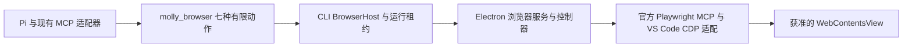

# ego lite 替换内置浏览器的可行性与取舍

Status: proposed
Date: 2026-10-10
Translation: pending

## 摘要

研究目标是让 Agent 获得通用浏览器能力，并判断全面替换内嵌方案能否显著缩小 DMG。接受独立窗口时，完整接入 ego Skill/API 是值得验证的候选；当前七动作只是 Molly 的产品封装，不应继续作为新方案的能力上限。坚持网页留在 Molly 窗口内时，现有 Electron/Playwright 可继续扩展，而 ego 尚无可核验的公开网页视图嵌入 SDK。仅替换网站浏览功能不能移除同时承载 Molly 界面、Bento 和 CLI 的 Electron：本机安装样本约 537.1 MiB，可识别浏览依赖约 19.3 MiB，不能据此承诺 DMG 大幅下降。移除整个 Electron 宿主才可能明显缩包，但属于另一项桌面平台迁移；ego 的原生隔离、运行撤销、实际任务收益和分发条件仍待验证。

## 范围与当前基线

本次核验 Molly 提交 `856b8a44823e6ca964eddecb0a77ad39fd5fadeb`，以及下文固定的 ego 源码。产品方向已明确扩大到 Agent 的通用浏览器能力，不再以 Pinterest 和现有七动作约束未来能力；原有 Spec 和下列合同用于说明当前实现，不代表新方向已经实现或获得完整设计审批。研究分别评估“替换网站浏览功能”“将 ego 原生页面放入 Molly 窗口”和“移除整个 Electron 宿主”。loopback Managed Preview、静态 HTML iframe、Bento 编辑器、渲染和导出各有独立消费者：前两种方案不能顺带删除它们，第三种必须安排迁移。[浏览器职责](../../../docs/sessions-browser.md)、[当前产品意图](../../../../specs/graphic-design-platform.zh.md#内置网页调研与素材)

当前实际链路是：

这不是自写 DOM 自动化栈：官方 `@playwright/mcp` 0.0.82 及锁定的 Playwright `1.64.0-alpha-1789764292000` 提供快照、引用与交互；固定来源的 VS Code 适配器通过内存消息 transport 连接获准页面及其后代 target，不启动外部浏览器。Electron 为 39.5.1。Pi 已经通过未修改的 `pi-mcp-adapter` 3.2.0 提供脚本组合及逐工具权限处理，因此“写一段代码完成多步、减少模型往返”不是 ego 独有的新能力。[当前驱动](https://github.com/LeonEthan/molly-design/blob/856b8a44823e6ca964eddecb0a77ad39fd5fadeb/apps/electron/src/main/services/browser-mcp-driver.ts)、[既有 MCP 集成](../../implemented/simplification/2026-09-28-standard-pi-mcp-integration.md)

当前合同的关键部分如下：

- 用户在 Molly 内登录 Pinterest 是主要路径；不支持 Google 登录，指定 Chromium profile 的 Pinterest 导入是备选。签名打包版持久化网站会话，开发版仅内存持有。
- Agent 只能操作当前运行获准的页面；人工接管、登录/MFA、取消及完成会撤销读取和操作。未知结果不自动重放，已经发到网站的副作用无法回滚。
- 导航和选图已复用 Chromium 的网络、代理和 TUN，没有 Molly 自有的公网 DNS 或目的地验证。不能把这些已经删除的机制算成替换收益。
- `save_image` 从当前引用解析已加载的主文档 IMG，经同一网站 session 的有界字节获取，再进入现有图片解码和设计素材发布；普通下载不等于素材发布。[有限动作合同](../../../../packages/shared/src/browser-agent-rpc.ts)、[原生传输决定](../../implemented/simplification/2026-10-03-native-browser-transport.zh.md)

## ego 实际交付了什么

以下把公开代码、厂商文档和本次推论分开。源码快照来自 GitHub codeload，压缩包 PAX 元数据固定提交为 `dca7003349c5f7132189ba00547cbbd7ff8e597e`；后续链接均使用这个提交。没有安装依赖、下载浏览器安装包、启动 ego 或读取任何用户 profile。

| 对象       | 核验结果                                                                                            | 对集成的意义                                                              |
| ---------- | --------------------------------------------------------------------------------------------------- | ------------------------------------------------------------------------- |
| 公开仓库   | Node/TypeScript helpers、Skill、测试与 native binding 文档；仓库 MIT                                | 可以研究和按 MIT 复用这些代码，不能据此认定浏览器 app 整体 MIT            |
| 辅助包     | `ego-browser-v2` 0.1.0，Node >=22；Skill 元数据 2.0.0                                               | 包、Skill 和浏览器是不同版本轴                                            |
| 浏览器发行 | 官网 changelog 当前列出的最新版本为 0.5.1.13，日期 2026-09-23                                       | 这是官网可见版本，不是已安装或已验证版本；不能用 helper 提交推导 app 行为 |
| 平台       | README 写明 macOS 可用、Windows closed beta 待推出、Linux roadmap；安装脚本提供 arm64/x64 macOS DMG | 不能作为已验证跨平台的默认替换                                            |

来源：[仓库与许可边界](https://github.com/citrolabs/ego-lite/blob/dca7003349c5f7132189ba00547cbbd7ff8e597e/README.md)、[包元数据](https://github.com/citrolabs/ego-lite/blob/dca7003349c5f7132189ba00547cbbd7ff8e597e/package/ego-browser/package.json)、[Skill](https://github.com/citrolabs/ego-lite/blob/dca7003349c5f7132189ba00547cbbd7ff8e597e/skills/ego-browser/SKILL.md)、[官方 changelog](https://lite.ego.app/changelog)。

### 接口与嵌入边界

公开接入是本机 `ego-browser nodejs` 接收 JavaScript；安装的浏览器向 Node 环境注入 `globalThis.ego`，辅助层再提供 `taskSpace()`、`Page`、截图、快照和交互。`--sdk-path` 可以让已安装的 ego 使用自建 helper bundle，但仍需要它提供原生环境。源码中的 `installEgoSdk()` / `disposeEgoSdk()` 以及“Embedded SDK host”文档指的是 Node 辅助层的装载生命周期，不是向 Electron 暴露网页视图的嵌入 API。[native binding 合同](https://github.com/citrolabs/ego-lite/blob/dca7003349c5f7132189ba00547cbbd7ff8e597e/docs/native-bindings-api.md)、[本地 runtime 接入](https://github.com/citrolabs/ego-lite/blob/dca7003349c5f7132189ba00547cbbd7ff8e597e/docs/local-runtime-development.md)、[SDK 生命周期](https://github.com/citrolabs/ego-lite/blob/dca7003349c5f7132189ba00547cbbd7ff8e597e/docs/native-sdk-lifecycle-requirement.md)

它使用 CDP，但不是 Playwright 的可替换实现。当前 Skill 明确采用自定义 `TaskSpace` / `Page` API，仅兼容有限 selector 形式，不支持任意推测的 Playwright 方法。公开包未提供可直接替换 `@playwright/mcp` 的 MCP server，也没有公开 `BrowserContext` 注入、CDP endpoint 或 Electron `WebContentsView` 宿主接口。由此推论：保留 Molly 内嵌页面而只换 npm 包，无法获得 ego 的原生快照、Space 与登录能力；补齐 `globalThis.ego` 意味着自行实现这些宿主职责，不能称为轻量复用。[helper 架构](https://github.com/citrolabs/ego-lite/blob/dca7003349c5f7132189ba00547cbbd7ff8e597e/package/ego-browser/README.md)、[自定义 Agent 接入说明](https://lite.ego.app/document/en/docs/custom-agent-harness)

macOS 的公开维护者说明描述了命名 Mach service：浏览器使用 `--startup-ego-browser-service`，CLI 使用 `--ego-server-name` 选择对应实例；两者旗标不同曾导致误报。不能把该已关闭问题描述为当前未修复的多实例漏洞，也不能据服务名断言存在调用者鉴权。仓库没有相应 native 服务实现，无法核验 peer 身份检查、socket/IPC 权限、其他本机调用者的访问范围或运行级不可转移凭据。[维护者说明](https://github.com/citrolabs/ego-lite/issues/150)

### Space 与登录隔离仍有冲突证据

官网 Space 页面宣称每个任务拥有独立 BrowserContext、Cookie 和 storage；同一提交的 `clearing-state.md` 却明确写出同一 profile 的用户标签和任务 Space 共享 Cookie jar 与 HTTP cache，并警告某些 CDP 清理动作影响整个 profile。native 文档又说明创建 Space 时选择 profile，省略时使用当前/最近使用的常规 profile。两组材料不能同时作为“任务账号完全隔离”的证明；本次没有 app 实测，实际版本行为待核实。Space 至少是任务界面和页面组织概念，不能直接当作 Molly 的授权租约。[官方 Space 说明](https://lite.ego.app/document/en/docs/space)、[共享状态警告](https://github.com/citrolabs/ego-lite/blob/dca7003349c5f7132189ba00547cbbd7ff8e597e/skills/ego-browser/references/clearing-state.md)

厂商宣称可从 Chrome 等浏览器迁移登录态、扩展和 profile；changelog 还记录 passkey/Touch ID 支持及导入修复。这是值得验证的收益，特别是 Molly 内 Google 登录受限时。但“能迁移 Chrome”不证明选定的 Pinterest 账号、SSO、MFA、代理及重启均成功，也不意味着应该默认使用用户最近活跃的全部登录身份。[首次设置](https://lite.ego.app/document/en/docs/quick-start)、[官方 changelog](https://lite.ego.app/changelog)

### 读取与控制权限

native 合同描述了人工接管后阻止快照、标签访问及 raw CDP 等行为，也提供 `claimTaskSpace()` 和 `takeOverTaskSpace()`。辅助层按 Space 串行调度，避免同一 Node 调用中切错当前 Space；这属于调度正确性，不能证明不同进程无法选择另一个任务。Molly 的 `sessionId/runId/browserId` 授权、取消和迟到输出检查仍要保留，且实际浏览器侧必须停止继续执行；只杀掉 CLI 或清掉 SDK callback 不足以证明撤销完成。[native 控制合同](https://github.com/citrolabs/ego-lite/blob/dca7003349c5f7132189ba00547cbbd7ff8e597e/docs/native-bindings-api.md)、[调度实现](https://github.com/citrolabs/ego-lite/blob/dca7003349c5f7132189ba00547cbbd7ff8e597e/package/ego-browser/src/native-gate.ts)

完整 Skill 允许 Node 内置模块、`page.evaluate()`、`page.cdp()`、上传下载与 profile/Space 操作，能力明显超过 Molly 的有限浏览工具，符合新的通用方向。官方隐私政策说外部工具不能导出认证 Cookie 或 token，但上述 `clearing-state.md` 给出 `Network.getAllCookies` 示例。可以确认公开接口包含 raw CDP；不能仅凭接口认定已安装 app 一定允许导出 Cookie，也不能仅凭政策认定存在足够的底层过滤。采用完整 Skill 应定义账号、文件和任务的实际授权边界，不能假定旧七动作合同仍然成立；这不构成继续限制为七动作的理由。[执行器代码](https://github.com/citrolabs/ego-lite/blob/dca7003349c5f7132189ba00547cbbd7ff8e597e/package/ego-browser/src/run.ts)、[隐私政策](https://lite.ego.app/privacy)

## 旧七动作接口的可选兼容层

下面只回答旧消费者需要兼容时的适配成本，不表示 ego 在 Molly 已可运行，也不是通用化路线必须先做的一层。新目标下，优先研究直接复用完整 Skill/API；只有确有旧接口消费者需要保留时，才适配 `molly_browser`。无论哪条路线，Agent 生命周期和设计素材发布仍有消费者，执行、观察、撤销及取图须有明确归属；现有控制器依赖 WebContents、session 与事件，替换范围大于 `BrowserMcpDriver` 一个类。

| Molly 动作   | ego 候选能力                                               | 必须保持或补齐的差量                                                                   |
| ------------ | ---------------------------------------------------------- | -------------------------------------------------------------------------------------- |
| `navigate`   | `page.goto()`                                              | 获准页面归属、原生导航错误、URL/title、有界等待；不默认选用户页面                      |
| `snapshot`   | `page.snapshot()`                                          | 文本上限和截断标记；页面、frame、document 与引用代际一致性                             |
| `screenshot` | `page.screenshot()`                                        | ego 返回 PNG 文件路径；需读取、尺寸/字节限额、转换为现有 JPEG MCP image 并清理临时文件 |
| `click`      | `page.click()`                                             | Molly 当前 `e5/f1e5` 与 ego `@21` 不兼容；不能只放宽正则，需不泄漏其他任务引用的适配   |
| `type`       | `page.fill()` 或键盘接口                                   | 明确替换/追加语义，保留密码输入限制、长度上限和人机互斥                                |
| `scroll`     | `page.mouse.wheel()`                                       | 对齐当前滚动目标、范围及回执；不额外开放任意坐标操作                                   |
| `save_image` | 当前 ref + 页面读取 / `page.fetch(url, { saveAs })` / 下载 | 尚无同等现成接口；须证明选择来源、同一身份、逐跳凭据规则、体积限额、解码及素材发布     |

对应来源：[Molly 输入输出合同](../../../../packages/shared/src/browser-agent-rpc.ts)、[ego 生成 API 参考](https://github.com/citrolabs/ego-lite/blob/dca7003349c5f7132189ba00547cbbd7ff8e597e/skills/ego-browser/references/api.md)、[Page 实现](https://github.com/citrolabs/ego-lite/blob/dca7003349c5f7132189ba00547cbbd7ff8e597e/package/ego-browser/src/page-model.ts)。

ego 快照支持视口、全页和 subtree，公开源码处理 iframe/OOPIF、引用身份及失效，也有相关测试夹具；但原生要求文档仍记录 iframe ref 缺失、frame-local backend id 歧义和 locator 修正。native 文档还注明 0.5.0.19 的 subtree 需要 feature flag。这些说明不能外推成所有新版仍坏，也不支持“复杂 iframe 已无条件胜过当前 Playwright”的结论；要在固定 app/helper 组合上对比。[原生快照限制](https://github.com/citrolabs/ego-lite/blob/dca7003349c5f7132189ba00547cbbd7ff8e597e/docs/native-snapshot-ref-requirement.md)、[ref 映射实现](https://github.com/citrolabs/ego-lite/blob/dca7003349c5f7132189ba00547cbbd7ff8e597e/package/ego-browser/src/page-ref-registry.ts)

素材是实质难点。v2 `page.fetch(url, { saveAs })` 确实支持二进制，不能依据旧 `http.ts` 就说它只有文本；实现是在页面里 `window.fetch()`，受 CORS 约束，把完整 `arrayBuffer` 编码后落盘，没有当前 Molly 传输的字节和逐跳凭据合同。可见 IMG 未必允许页面 fetch 读取。下载 API 能把文件复制到指定路径，但不是选定图片的安全发布接口；也不能改用 Molly 原 session 去取图，因为登录身份已经在 ego。[fetch 实现](https://github.com/citrolabs/ego-lite/blob/dca7003349c5f7132189ba00547cbbd7ff8e597e/package/ego-browser/src/page-model.ts#L2028)、[下载实现](https://github.com/citrolabs/ego-lite/blob/dca7003349c5f7132189ba00547cbbd7ff8e597e/package/ego-browser/src/driver/downloads.ts)、[现有素材传输](../../../../apps/electron/src/main/services/public-browser-asset-fetch.ts)

## 许可 分发与维护成本

MIT 覆盖公开仓库内容；浏览器是另行下载的产品。官网条款第 3 节描述有限、可撤销、不可转授权/转让的使用权，并写有个人非商业使用以及未经书面许可不得再分发或修改等限制；第 4 节又明确不因内容经本产品处理而增加其商业使用限制。应用使用权与所得内容权利要区分。现有公开材料不足以把浏览器作为 Molly 可自由捆绑和改造的 MIT 组件，需要厂商澄清适用授权。[MIT LICENSE](https://github.com/citrolabs/ego-lite/blob/dca7003349c5f7132189ba00547cbbd7ff8e597e/LICENSE)、[服务条款第 3 至 4 节](https://lite.ego.app/terms)

隐私政策 2026-09-07 版本明确说明使用分析会上传用户/设备标识、功能使用和时区等数据；崩溃上传在首次设置默认开启，可取消。它还说明地址栏相关信息可能发给 Google 用于搜索建议/安全检查。因此不能用主页“数据留在本地”的概括替代零遥测证明，也不能声称它已满足 Molly 的 local-only 边界。自选外部应用与随 Molly 默认交付的组件需分别评估，停用范围与最终产品表述仍待确认。[隐私政策](https://lite.ego.app/privacy)、[Molly 平台边界](../../../../packages/platform/AGENTS.md)

安装脚本会下载架构对应 DMG、可能申请安装权限、移除 quarantine 属性并启动 app；没有在该脚本中看到固定版本 checksum 或签名校验步骤。首次设置还会向 Agent Skill 目录写入文件。这些是已读脚本/文档的行为，不是本次执行结果；不应直接复用为 Molly 静默安装机制。[安装脚本](https://github.com/citrolabs/ego-lite/blob/dca7003349c5f7132189ba00547cbbd7ff8e597e/skills/ego-browser/scripts/install.sh)、[首次设置](https://lite.ego.app/document/en/docs/quick-start)

公开 CI 在 v-tag 发布 helper bundle，native bindings 则由独立 app 版本提供；官网教程仍展示 v1 helper，而当前仓库 Skill 是 v2，连时间单位也不同。若接入，应同时固定 app、helper、Skill 和源码身份，并有版本不兼容时的明确失败。开源 helper 可维护，不等于能够自行修复浏览器原生实现；升级频率和 Chromium 安全更新仍依赖厂商。[发布工作流](https://github.com/citrolabs/ego-lite/blob/dca7003349c5f7132189ba00547cbbd7ff8e597e/.github/workflows/ci.yml)、[官网旧接口示例](https://lite.ego.app/document/en/docs/ego-browser)、[当前 v2 Skill](https://github.com/citrolabs/ego-lite/blob/dca7003349c5f7132189ba00547cbbd7ff8e597e/skills/ego-browser/SKILL.md)

## 复用阶梯与方案判断

保持 Electron 不变、改进 Agent 接口与驱动轻量化的后续比较见[通用 Agent 浏览器驱动候选](2026-10-10-electron-agent-browser-options.zh.md)。该记录比较现有 Playwright 能力、agent-browser 原生 Rust、Stagehand、Puppeteer 等，不以移除 Electron 为前提。

| 顺序与路线                     | 可复用内容                                                                                        | 判断与理由                                                                                                             |
| ------------------------------ | ------------------------------------------------------------------------------------------------- | ---------------------------------------------------------------------------------------------------------------------- |
| A 复用并扩展现有内嵌方案       | Lody 侧栏/IPC、WebContentsView、官方 Playwright MCP、VS Code 适配、Pi code mode、现有权限与素材链 | 必须保留的低迁移成本基线；通用 API 不要求更换引擎，但需扩展多页、文件等产品合同及单页 transport                        |
| B 适配受限 ego 外部后端        | 保留七动作、CLI BrowserHost、Agent 生命周期与资产发布；接入 ego TaskSpace/Page                    | 仅在旧消费者确需兼容时采用；承担外部应用和受限包装双重成本，不作为通用方向的首选                                       |
| C Agent 直接使用完整 ego Skill | 厂商原生工作流、宽接口、登录和 Space 产品；复用 Molly 现有 Agent 执行设施                         | 接受独立浏览器窗口时的优先验证候选；通用目标已明确，下一步验证登录、多页、文件、接管和撤销，而非重复确认是否扩大七动作 |
| D 把 ego 原生浏览器嵌入 Molly  | 理想上同时得到现有 UI 和 ego 原生能力                                                             | 未找到公开 SDK/授权/宿主接口；需厂商合作或自建嵌入层，目前缺少可直接交付的公开路径                                     |
| E 移除整个 Electron 宿主       | 尽量复用现有前端、Bento 与平台 ports；原生能力迁到其他宿主或本地服务                              | 理论可行且可能明显缩小 Molly 自身包体，但不是 ego 浏览器组件替换；需要单独评估桌面能力与渲染迁移                       |

复用阶梯不能因为新目标而跳过 A：七动作和拒绝创建新 target 是 Molly 当前封装，Playwright 本身提供更广泛的 Page、文件和多页能力。若必须内嵌，A 优先于自建 D；若接受外部窗口，C 可复用完整浏览器产品，只有它在登录或通用任务上的收益值得外部依赖时才替代 A。仅借 ego helper 模式不能获得其原生登录、Space 和快照实现，故没有把它列为完整替换。D/E 属于更低复用层，不能为未经测量的缩包预期先投入。[当前单页适配器](../../../../apps/electron/src/main/services/browser-cdp-connection.ts)、[Playwright Page API](https://playwright.dev/docs/api/class-page)、[既有产品复用研究](2026-09-23-browser-products-reuse-evidence.zh.md)、[既有 Pi 集成](../../implemented/simplification/2026-09-28-standard-pi-mcp-integration.md)

| 取舍       | 潜在收益                                                | 相比现状的代价与证据限制                                                                 |
| ---------- | ------------------------------------------------------- | ---------------------------------------------------------------------------------------- |
| 登录       | 完整浏览器、profile 导入和 passkey 可能减少登录受阻     | 最强采用理由；Pinterest/Google SSO 等具体任务仍需实际对照，登录也可能受网站策略限制      |
| 多任务     | Space 提供原生并行任务 UI、状态与接管，契合通用任务方向 | 单独浏览器增加窗口切换；Space 不自动等于账号/运行隔离                                    |
| 观察与交互 | 原生语义快照、iframe、文件和丰富 Page API               | 内核侧能力不可独立复用；需制定通用合同，受限包装会舍弃部分灵活性                         |
| 维护       | 厂商负责浏览器外壳和其登录/自动化问题                   | Molly 仍保留 Electron/Bento，可能同时部署两套 Chromium；不能假定总体体积、内存或维护下降 |
| 执行效率   | 更好的快照或站点成功率可能减少重试                      | 当前已有代码组合；没有 Molly 对照数据，不能预先计算节约比例                              |

## 完全替换与 DMG 体积

### 现装样本测量

2026-10-10 只读检查本机已安装 Molly 0.1.0。以下是 `.app` 内普通文件的逻辑字节数，递归求和、不跟随或重复计入符号链接；不是磁盘分配量，也不是压缩 DMG。通过 `@electron/asar` 读取归档 header 统计包内文件，未启动应用。样本不是本次从所核验 HEAD 重建的产物，因此只用于量级判断。

| 组成                           |    原始字节 |   MiB | 替换网站浏览功能后                                                 |
| ------------------------------ | ----------: | ----: | ------------------------------------------------------------------ |
| Molly.app 总计                 | 563,148,777 | 537.1 | 测量基线，不是当前 DMG 大小                                        |
| Electron Framework             | 218,188,935 | 208.1 | 核心保留；Molly 界面与其他宿主职责仍依赖它，独立资源可另行评估裁剪 |
| 已打包 CLI resources           | 194,439,596 | 185.4 | 保留；包含 Agent harness 等，不能归入浏览器可删除项                |
| 可识别的浏览及登录导入依赖合计 |  20,237,578 |  19.3 | 待核对消费者后可移除的候选；不是已经验证的完整删除闭包             |

浏览依赖候选逐包为 `@playwright/mcp` 14,374 B、`playwright` 4,523,375 B、`playwright-core` 11,506,192 B、`rookie-cookies` 159,255 B、`rookie-cookies-darwin-arm64` 4,034,382 B。最后一项位于 ASAR 的 unpacked 区，统计时不与物理文件重复相加。候选合计约占现装样本 3.6%；自有浏览代码删除和新增 ego 接入代码还会影响差额，其他地方共用的依赖不能顺带移除。

在归档目录中未发现单独 Playwright Chromium 下载的常见路径；当前代码也明确通过内存 CDP transport 连接已有 Electron WebContents。当前内嵌浏览器并没有另附一套供 Playwright 启动的 Chrome，因此删除内嵌浏览功能不会删除 Electron Framework。即使上述约 19.3 MiB 都可移除，也不能把它直接当成 DMG 节省量；压缩通常会减小这部分，精确差额需要相同架构、资源和压缩配置的前后打包对照。[浏览页面创建](../../../../apps/electron/src/main/services/public-browser-service.ts)、[CDP 连接](../../../../apps/electron/src/main/services/browser-cdp-connection.ts)、[打包组成](../../../../apps/electron/electron-builder.yml)

### Electron Framework 是否固定

“保留 Framework”不表示每个字节都不可优化。同版本、同架构的官方预编译 Electron 不会依据应用用了几个网页视图自动裁剪；删除网站浏览视图仍保留 Molly 主界面和 Bento 所需的 Chromium 渲染核心。打包时删除独立资源、修改源码构建选项以及更换整个宿主，是三种不同成本的优化。运行时禁用功能也不等于删除其机器码；Electron fuses 是对二进制中的开关字节进行修改。[进程模型](https://www.electronjs.org/docs/latest/tutorial/process-model)、[Fuses 实现原理](https://www.electronjs.org/docs/latest/tutorial/fuses)

对同一现装样本进一步按普通文件统计：单个 `Electron Framework` 核心二进制为 172,556,400 B（164.6 MiB），`file` 确认是 arm64 单架构，不存在可再删除的 x64 slice。其余主要文件为 `libvk_swiftshader.dylib` 15.9 MiB、`icudtl.dat` 10.0 MiB、`libGLESv2.dylib` 6.8 MiB、`resources.pak` 6.0 MiB、`libffmpeg.dylib` 2.1 MiB。它们不是一个可整体卸载的“网站浏览器插件”。`otool -L` 显示核心对 FFmpeg 有普通动态链接依赖，因此即使产品不播放视频也不能直接删掉该库。

现有 `electronLanguages` 已限制语言资源，样本只有约 0.5 MiB 的 `en.lproj/locale.pak`；不能再次把多语言裁剪计作新增收益。SwiftShader 是 CPU 实现的 Vulkan 图形库，15.9 MiB 可以作为有条件评估项，但必须验证目标机器的图形后端、异常路径及 Bento 预览/导出，尚无安全删除结论。此项与是否打开外部网站没有直接等价关系。[现有打包配置](../../../../apps/electron/electron-builder.yml)、[SwiftShader 官方说明](https://github.com/google/swiftshader/blob/master/README.md)

源码定制也确实存在：当前锁定 Electron 39.5.1 的 `buildflags.gni` 提供 PDF viewer、扩展和拼写检查等编译选项。是否未被 Molly 消费者使用、能减少多少体积，均需定制构建和验证；它不会自动消除 HTML/CSS/Canvas/JavaScript 渲染核心。官方文档明确指出源码构建及维护 fork 成本高。依照复用阶梯，先检查现有打包产物和依赖，再评估独立资源，最后才考虑自维护 Electron；本次没有构建裁剪版或测得其 DMG 净收益。[39.5.1 编译选项](https://github.com/electron/electron/blob/v39.5.1/buildflags/buildflags.gni)、[源码构建](https://www.electronjs.org/docs/latest/development/build-instructions-gn)、[维护成本说明](https://www.electronjs.org/docs/latest/tutorial/fuses)

### ego 额外分发成本

同日对官方安装脚本中的 CDN 地址执行 HTTP HEAD，未下载 DMG 正文、安装或启动。arm64 DMG 为 **135,407,668 B（129.1 MiB）**，x64 为 **153,650,373 B（146.5 MiB）**；两者响应 metadata 标记版本 `0.5.1.13`、Last-Modified 为 2026-09-23。这是当前分发文件的压缩大小，不是解压 app 大小，也未验证安装期间是否另有下载。[固定安装脚本](https://github.com/citrolabs/ego-lite/blob/dca7003349c5f7132189ba00547cbbd7ff8e597e/skills/ego-browser/scripts/install.sh#L7)、[arm64 分发文件](https://cdn.ego.app/setup/macos/arm64/egolite-fHoqgZ74bOEM.dmg)、[x64 分发文件](https://cdn.ego.app/setup/macos/x64/egolite-fHoqgZ74bOEM.dmg)

若用户尚未安装 ego，外部分发会增加一次浏览器下载；移出 Molly DMG 不等于消除用户总下载和磁盘成本。随 Molly 捆绑 ego 会增加一个完整浏览器 payload，且须先确认分发许可。现有 Electron 与独立 ego 都会运行时，进程和内存开销有增加的可能，但本次没有测量，不能声称精确翻倍。

### 三种“彻底替换”的判断

| 目标                                                    | 可行性                                                                                | 对体积的结论                                                                               |
| ------------------------------------------------------- | ------------------------------------------------------------------------------------- | ------------------------------------------------------------------------------------------ |
| 删除 Molly 的网站内嵌视图和自动化实现，全部交给外部 ego | 官方 CLI/Skill 提供可落地的接入基础，运行边界及消费者迁移待验证                       | Molly 自身可能小幅缩包；保留 Electron，不能期待大幅下降；用户另需 ego                      |
| 网站仍在 Molly 窗口内，但网页引擎全部换成 ego           | 当前公开 API 不足以支持；`Embedded SDK` 是 Node 上下文生命周期，非原生视图 SDK        | 没有可核验的缩包路径；若保留 Electron 再集成另一内核，通常不会更小                         |
| 连 Molly 的 Electron 外壳一起取消                       | 理论可行：前端迁到浏览器配合本地服务，或迁到使用系统 WebView 的宿主；均是桌面平台迁移 | 才有机会移除约 208.1 MiB 的现装 Framework，约占样本 38.7%；这仍不是 DMG 减少比例或净节省量 |

ego 能显示普通网页，并不等于能宿主当前 Electron 应用。完整移除 Electron 至少涉及 preload/IPC、文件与凭据访问、进程启动、更新、Bento 的视图/flush/只读控制以及渲染和导出。当前 CLI 还借 Electron helper 的 `ELECTRON_RUN_AS_NODE` 模式运行，移除 Electron 后必须另有兼容执行环境。使用系统 WebView 需要验证 Bento 的字体、Canvas 和导出一致性；放入 ego 普通标签则需要把桌面能力移到明确授权的本地服务，复用现有 platform ports，不能把任意页面可访问的本地控制接口当作无成本替换。[Bento 宿主](../../../../apps/electron/src/main/services/design-service.ts)、[渲染宿主](../../../../apps/electron/src/main/services/design-render-host-service.ts)、[CLI 宿主](../../../../apps/electron/src/main/services/cli-service.ts)、[打包运行验证](../../../../apps/electron/scripts/eb-after-pack.mjs)、[Electron 进程职责](https://www.electronjs.org/docs/latest/tutorial/process-model)

因此，通用浏览器能力和 DMG 瘦身应分别决策：前者可以先验证 C 或扩展 A；后者先检查打包 payload，再决定是否值得承担 E。不能把 C 的可行性当作 D 的公开支持，也不能把 E 的理论减包量算到 C 名下。

## 性能宣传能支持到哪里

仓库 benchmark 图使用 Pi、同一 `gpt-5.5` medium，在四个真实网站任务上各跑五次取中位数。三个可直接比较任务的耗时为 87/226 秒、123/231 秒、60/86 秒，约 1.4–2.6 倍；第四个任务的对照被反自动化阻止，没有可比完成耗时。图中成本是模型 token 定价，不是完整部署成本。它是厂商报告、对照是 Vercel agent-browser，没有本次复验，也没有与 Molly 当前 Playwright MCP/code mode 比较，不能据此承诺换栈后同幅收益。[固定 benchmark 图](https://github.com/citrolabs/ego-lite/blob/dca7003349c5f7132189ba00547cbbd7ff8e597e/docs/assets/ego-vs-agent-benchmark.png)

Space 页的六任务内存比较针对“每任务另起浏览器并复制 profile”，且厂商自己说明只是资源模型示意；Molly 当前使用同一 Electron 的多个 WebContents，不是这个对照组。网站成功率、原生快照质量与模型脚本往返必须分开测量。[Space 资源说明](https://lite.ego.app/document/en/docs/space)

## 若继续 先验证哪些最小问题

以下为待决策的研究步骤，不是已经授权或实施的 runtime 工作。暂不估算开发天数：原生接口、授权和素材能力未确认前，工期数字没有可靠基础。

1. **选择窗口与宿主边界。** 通用能力方向已明确；剩余选择是独立 ego 窗口、继续内嵌，以及是否另立移除 Electron 的项目。接受独立窗口时优先验证 C，不先造七动作兼容层；坚持内嵌时先扩展 A。向厂商澄清集成/分发许可、遥测设置、app/helper 兼容、Space/profile 隔离和 IPC 调用者范围。
2. **验证通用任务闭环。** 固定浏览器二进制身份和 helper/Skill 提交，使用临时 profile/专用实例。用本地合成夹具验证多标签、弹窗/iframe、表单、上传下载、连续脚本执行、快照与截图，随后验证人工接管和取消；沿用现有 harness、确定性夹具与显式事件，不建立新测试平台。现有七动作只在兼容消费者存在时单独验证。
3. **保留真实消费者的合同。** 证明接管/取消/完成后不再执行后续命令、拒绝迟到读取结果，同时不承诺撤销已发生的网页副作用。通用文件读写与设计素材发布分别按消费者处理；后者仍要覆盖已加载但跨域的图片、重定向、超限、格式不支持和取消中取图。允许更广的接口应显式定义授权范围，不假装旧租约自然覆盖任意外部 CLI/CDP。
4. **比较收益与成本。** 在测试账号获授权后，用固定模型、输入、登录条件和代码组合设置比较真实多页调研、SSO、文件交换与设计取图任务，记录成功率、人工步骤、耗时、模型费用及资源增量。包体用同架构前后构建测 Molly DMG，再独立统计首次完整安装下载量、安装磁盘和运行内存。没有实测收益时，A 仍是成本更低的通用化基线。

若候选通过，再按实际消费者决定删除哪些 public browser 控制器、驱动和导入路径；不要提前删除 Managed Preview、HTML viewer 或 Bento 的代码，也不同时默认发布两个后端。外部路线改变产品意图和边界时，应另行修订 Spec 并保持其审批状态诚实。

## 独立意见与验证限度

依仓库规则，已完成只读 Codex CLI 第二意见，模型为 `gpt-6-astra`、high reasoning；明确通用目标后，以新目标另做一次只读复核。新意见支持提高 C 的验证优先级，不把七动作当作能力上限；同时认为 A 可扩展通用 API、D 没有公开宿主支持、E 属于另一个平台迁移。它确认移除浏览功能不能删除 Electron，约 20.2 MB 的可识别依赖字节不能换算为 DMG 降幅；并指出 SDK dispose 或进程退出不能证明 native 任务停止。这里记录经核对后的技术意见，没有复制会话原文，也不把咨询当批准。

支持 C 的最强理由是直接复用完整浏览器产品的登录、多任务与宽接口；最强反论点是现有 Playwright 同样具备通用能力，当前窄接口属于 Molly 的封装选择，且 A 不引入第二套浏览器。B 可能同时承受外部部署和有限包装成本，因此在新目标下不再默认优先于 C。选型应由窗口体验、真实任务成功率和维护成本决定，不由尚不存在的 DMG 瘦身收益决定。

本次只读核验公开源代码、官网文档、既有本地实现与现装包文件，执行官方 DMG 的 HEAD 请求，并新增本 proposed 笔记；未更改运行时代码或 Spec，未构建候选 DMG、下载或安装 ego、发布或运行真实账号验收。翻译待补。公开资料中的隔离、Cookie 接口及版本差异已经列明；未用未经验证的供应商宣传填补结论。
