# AIGC 图像生成产品界面调研：选区操作归属、画布 chrome 与工具栏收敛模式

Status: proposed
Date: 2026-09-15
Translation: pending

## 摘要

为回答"设计会话中 chat + Bento 画布上方的 React shell 工具栏（现状最多 15 个文字按钮，见 `packages/components/src/components/sessions/design-canvas.tsx`）如何按行业惯例收敛"这一问题，本次调研覆盖了 12 个 AIGC 图像/设计产品：Canva、Lovart、Recraft、Ideogram Canvas、Midjourney Web Editor、Krea、Leonardo.ai、Adobe Firefly（含 Boards）、Flora、Visual Electric、Freepik AI/Magnific、即梦 Jimeng，并以 ComfyUI 的 node 画布作参照。最重要的发现有三：其一，"选中元素后对选中物做 AI 操作"在行业中几乎从不以常驻文字按钮形态出现——它要么附着于选中物（选中才出现的上下文面板/浮动菜单，Recraft、Ideogram、Firefly Boards、Leonardo、即梦皆如此；Canva 进一步证明顶层工具栏与选中驱动可以合流：工具栏位置常驻，但内容随选中对象整体切换），要么作为引用注入 chat 输入框由 prompt 区分动作（Lovart 的 Add to chat、Canva 的 Ask Canva），我们的 5 个"选区→Agent"文字按钮与此惯例相悖；其二，导出入口全部是"一个入口 + 格式二级选择"（Canva 的 Share→Download 格式下拉、Ideogram 的 Download 旁箭头、Midjourney 的选项二级），没有产品把 PNG/JPEG 并列为两个顶层按钮；其三，状态反馈贴着对象走（Canva/Ideogram 的保存状态小图标、生成中标记落在被生成的对象上），而不是在工具栏下方堆叠文字带。对本项目的核心启示：15 个按钮可收敛为约 5 个可见控件（视图分段控件 + 选区动作菜单 + 版本下拉 + 保存图标 + 更多菜单），且每条收敛路径都有至少两个产品的先例支撑；所有结论仅为界面惯例调研，尚未做工程可行性验证（如 shell 能否感知 Bento 内选区状态）。

## 调研方法与来源说明

方法：WebSearch 定位候选来源，FetchURL 读全文验证后采信；优先一手来源（官方产品页、帮助中心/文档、官方发布稿）。每条论点附来源 URL；只能找到二手评测/媒体报道的标注"（二手来源）"；查不到的明确写"未找到公开资料"。时效说明：Midjourney 官方文档站（docs.midjourney.com）拦截直接抓取，其内容通过 Wayback Machine 2025-2026 年快照验证，正文引用现行文档 URL 并附存档链接；Visual Electric 已于 2025 年 10 月被 Perplexity 收购并停服，只能依据发布期的一手演示报道（二手转述）。界面截图存档于本笔记同目录 `assets/2026-09-15-aigc-image-product-ui-research/`，正文以相对路径引用并在图注注明来源页面 URL；优先官方帮助/文档/官网配图，其次可信评测配图，未找到可引用截图的产品在对应章节内注明，不以无关图片充数。

---

## Lovart（最高优先级对标：chat + agent + 无限画布同构）

Lovart（lovart.ai，LiblibAI 海外产品，2025-05-13 Beta、2025-07-23 全球正式发布）自称"全球首个设计 Agent"，形态为"chat 指令 + agent 在无限画布（ChatCanvas）上产出设计稿"，与本项目结构最接近。

**整体布局与 chat/画布关系**

- 核心概念是 ChatCanvas："一个无限的智能画布，通过共享的视觉和对话来响应意图，为人与 AI 之间真正的创意协作而建"。CEO 的原话是"画布就是桌面，agent 就是你的队友"（[Lovart 官方发布稿，PRNewswire 2025-07-23，经富途镜像](https://news.futunn.com/post/59519020/lovart-launches-globally-end-to-end-design-agent-exits-beta)）。
- 入口：官网首页正中央是对话框与 ChatCanvas 入口，输入指令后进入画布工作区（二手来源：[量子位 2025-07-26 上手文](https://www.qbitai.com/2025/07/313056.html)）。
- **chat 面板在右侧**：画布居左、chat 居右（约占屏宽 28-30%）；顶部 app bar 为标题 + 保存状态图标、试用入口、credits 余额、头像。面板的折叠行为仍未见公开资料（依据：用户提供的工作区截图，2026-09 现行版本；二手评测描述为"chat 式 prompt 窗口 + 可感知图层的画布"：[skywork.ai 评测 2025-09-11](https://skywork.ai/blog/agent/lovart-ai-review-2025)）。
- Lovart 无公开帮助中心（help/docs 子域不可达）。下图为用户提供的**一手工作区截图**（2026-09 现行版本，填补了本节此前的截图缺口）；其后两图分别来自 Product Hunt 官方 gallery 与二手评测整理，仅作补充参考。

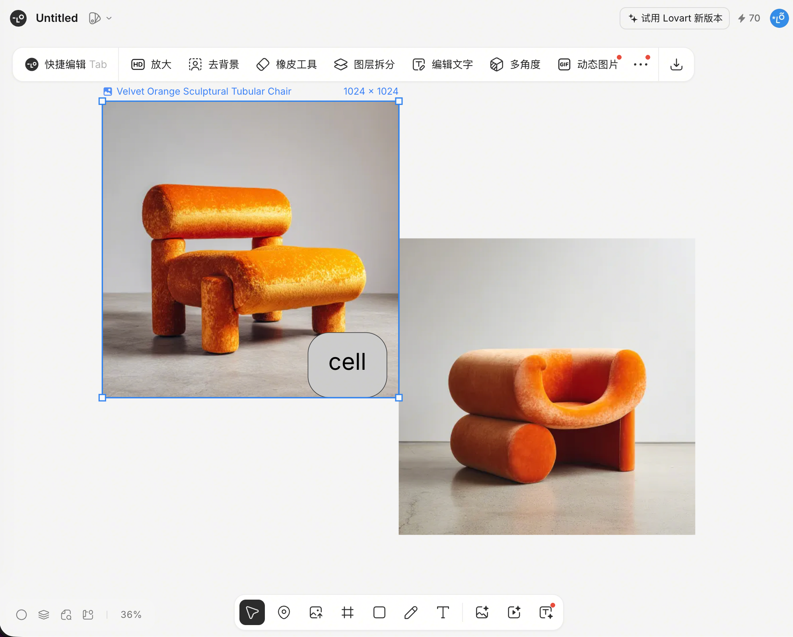

图：Lovart 完整工作区（用户提供截图，2026-09）——左画布右 chat；选中画布上的图片后，画布顶部出现上下文工具栏（快捷编辑 Tab / HD 放大 / 去背景 / 橡皮工具 / 图层拆分 / 编辑文字 / 多角度 / 动态图片 / ⋯ / 下载），选中元素带蓝色框线与"名称 + 尺寸"标签；画布底部为图标浮动工具坞（选择/图片/网格/形状/钢笔/文本/上传等）+ 左下角图层图标与 36% 缩放显示。（**按仓库边界裁去了右侧 chat 面板**——原截图含真实用户 prompt 与 agent 回复，属于不可入库的 captured transcript；右侧面板内的模型 chip（Midjourney）、内嵌"图片生成"结果缩略图（2 张变体）与 👍👎、底部输入框上方挂引用附件 chip、输入区 + 附件 / Agent 模式 chip / 模型选择，以本条文字记录为准。）

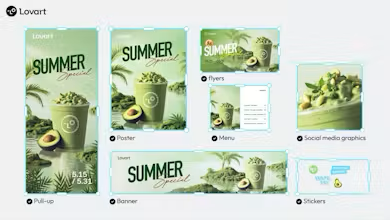

图：Lovart 画布形态——一个品牌 brief 产出 Roll-up/Poster/Flyers/Menu/Banner/Social/Stickers 等多规格资产，自由散布在无限画布上（画布自由排布模式）。来源：[Product Hunt Lovart 官方 gallery](https://www.producthunt.com/products/lovart)（官方供图，但非完整工作区视图，证据力弱）。

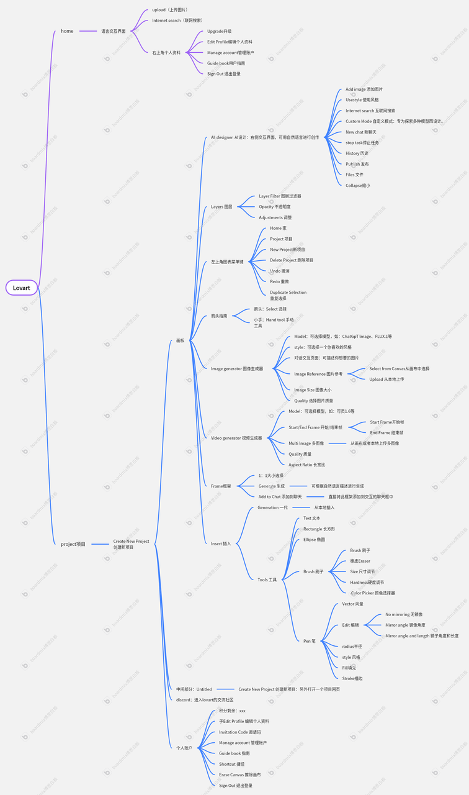

图：二手评测整理的 Lovart 信息架构——画布 Tools/Frames、Add to Chat、右侧 AI designer 交互界面（chat + 画布同构模式）。来源：[人人都是产品经理调研报告 2025-06-17](http://woshipm.com/evaluating/6230911.html)（二手来源）。

**agent 产出如何落到画布**

- 一次 prompt 可在几分钟内产出多达 40 个高保真资产（品牌套件、社媒图、故事板、UI 流程、包装等）（[官方发布稿](https://news.futunn.com/post/59519020/lovart-launches-globally-end-to-end-design-agent-exits-beta)）。
- agent 的工作流呈现：先"思考"产出一份行动指南，再一口气提出多套设计方案供用户选择（如 4 种方向），用户 pick 后继续细化（二手来源：[量子位上手文](https://www.qbitai.com/2025/07/313056.html)）。
- 多代理共创：多个专门 agent 分工（logo、包装、UI/UX 草图、竞品调研），通过共享上下文层 "Design Context Core" 保持一致性（[官方发布稿](https://news.futunn.com/post/59519020/lovart-launches-globally-end-to-end-design-agent-exits-beta)）。

**画布工具栏与选中→AI 操作**

- **选中图片 → 画布顶部出现上下文工具栏（一手证据）**：快捷编辑（标注 Tab 快捷键）/ HD 放大 / 去背景 / 橡皮工具 / 图层拆分 / 编辑文字 / 多角度 / 动态图片，尾部为 ⋯ 与下载按钮——全部是对选中图的 AI/编辑操作，icon+文字按钮；与 Canva 同属"工具栏槽位常驻、内容随选中对象切换"的合流形态，未选中时这些操作不出现（用户提供截图，2026-09）。
- 画布左侧工具栏提供添加元素、文本（T）、画笔、钢笔等创作工具；对象操作包括复制/粘贴/下载/导出/删除、图层上移/下移/置顶/置底、组合、锁定/解锁、显示/隐藏（二手来源：[AI 导航网 Lovart 词条](https://www.ainav.cn/sites/4659.html)）。
- 选中元素→对话：通过 **"Add to chat"** 把画布上的元素加入对话作为引用，再输入具体指令——即"选区作为 chat 附件，prompt 区分动作"（二手来源：[AI 导航网 Lovart 词条](https://www.ainav.cn/sites/4659.html)）。截图中输入框上方挂着的引用附件 chip（"Velvet Ora…"）即该引用在输入区的呈现形态（一手佐证）。
- 选中元素→直接编辑：官方首页列出的特性包括 **Touch Edit**（"在你需要的地方做定点修改，保留其余部分"）、**Text Edit**（文字分离为可编辑图层，可移动/改写而不破坏周围构图）、**Remix**（[Lovart 官网首页](https://lovart.ai)）。ChatCanvas 支持在画布上圈画、留笔记给 agent（二手来源：[Product Hunt 用户评论与官方 demo 转述](https://www.producthunt.com/products/lovart)）。
- 局部重绘/图层编辑/交互式修改列为 ChatCanvas 完整权限（二手来源：[DGT Store 商品页转述官方权益](https://dgtsell.com/products/lovart-pro-monthly-subscription)）。

**chat 输入框辅助控件**

- 输入区位于右侧 chat 面板底部（一手证据）：+ 附件、**Agent 模式 chip**（下拉切换）、模型选择、发送；agent 消息内嵌**模型 chip**（如 Midjourney）与"图片生成"结果缩略图（2 张变体），带 👍👎 反馈（用户提供截图，2026-09）。
- 交互分三档：Talk / Tab / Tune——对话、选项补全、细节调优（二手来源：[人人都是产品经理调研报告 2025-06-17](http://woshipm.com/evaluating/6230911.html)）。模糊指令会触发 Tab 补全机制，系统提示可补充的参数（主色调/元素推荐等）（二手来源：[AI 工具箱网 2025-08-04](http://ai-tab.cn/4639.html)）。
- 官网首页还列出 **Skills**（"one-click skills for every creative task"，一键技能）——即 prompt 预设入口（[Lovart 官网首页](https://lovart.ai)）。
- 成本透明：生成前显示本次请求消耗 credits 数（二手来源：[skywork.ai 评测引官方定价页](https://skywork.ai/blog/agent/lovart-ai-review-2025)）。

**人与 agent 的编辑权切换 / 版本历史 / 状态反馈**

- 用户提供的截图中未见版本历史入口，也未见编辑权互斥的表达；agent 工作时人能否动画布、版本/撤销 UX 仍未找到公开资料。生成结果的状态反馈形式可见一斑：以缩略图落在 chat 消息流内（"图片生成" + 2 张变体），而非独立画廊（截图佐证）。

**导出**

- 确认支持 PNG、SVG，部分流程（菜单/价目表）支持 PDF（二手来源：[skywork.ai 评测引官方功能页](https://skywork.ai/blog/agent/lovart-ai-review-2025)）；画布对象菜单内有下载/导出（二手来源：[AI 导航网](https://www.ainav.cn/sites/4659.html)）。PSD 导出未经证实。

**多图管理**：无限画布自由排布 + 图层管理（置顶/置底/组合/锁定）（二手来源：[AI 导航网](https://www.ainav.cn/sites/4659.html)）。

## Canva（选中驱动上下文工具栏的最成熟样本）

Canva 是用户量最大的在线设计平台（非 AI-native，但 Magic Studio 已把 AI 编辑完整接入编辑器），其"选中驱动的上下文工具栏"是该模式的教科书实现。以下全部来自 Canva 官方帮助中心与官网；唯导出一条因官方帮助页拒绝直接抓取，以多个二手教程交叉佐证（已标注）。

**整体布局**

- 编辑器自上而下：顶栏（homepage 菜单、File、Editing/Commenting/Viewing 模式切换、Share）→ 快速操作工具栏（quick actions toolbar）→ 画布；左侧 object panel 为一排竖排 tab（Templates、Elements、Fonts、Brand Kit、Draw、Projects、Apps），悬停预览面板内容、点击钉住；在工具栏选中某个工具后，编辑器侧边打开对应的 edit panel（[Canva 官方帮助 The new Canva editor](https://www.canva.com/help/glow-up/)）。

**选中驱动的上下文工具栏（核心先例）**

- 官方原话："The fixed toolbar below the header is now in a 'quick actions toolbar'. It'll suggest relevant editing options depending on the selected element. If you select an image, it'll present photo editing tools like cropping, filters, and effects. Select any text, and it will show font, size, and style."（[同上](https://www.canva.com/help/glow-up/)）。即**顶层工具栏位置常驻，但内容完全随选中对象切换**：选中图片给裁剪/滤镜/效果，选中文字给字体/字号/样式；移动端同一理念（浮动工具栏 + 左滑 + More）。
- 意义：Canva 证明"顶层常驻工具栏"与"选中驱动"并不矛盾——工具栏槽位常驻、按钮随选区变化，未选中时不堆叠对象级动作。

**AI 能力入口归属（Magic Studio）**

- 图片 AI 编辑全家桶走同一路径：**选中图片 → 上下文工具栏 Edit → 侧边 edit panel 的 Tools**——Magic Edit（[官方帮助](https://www.canva.com/help/using-magic-edit/)）、Magic Eraser（Brush/Click 子模式，[官方帮助](https://www.canva.com/help/magic-eraser/)）、Magic Expand（[官方帮助](https://www.canva.com/help/using-magic-expand/)）、Grab Text（[官方帮助](https://www.canva.com/help/using-grab-text/)）全部如此。即 AI 编辑不进顶层按钮，收在"选中物 → Edit → 侧栏工具列表"两级之下。
- 文生图（Magic Media）不从选中出发：左侧 object panel → Magic Media（或 Apps tab 搜索），内分 Images/Graphics/Videos；第三方模型 DALL·E/Imagen 同样收在 Apps tab（[官方帮助 Magic Media](https://www.canva.com/help/using-magic-media/)、[AI image generation apps](https://www.canva.com/help/ai-image-generation-apps/)）。
- 整稿级 AI 操作不进上下文工具栏：Magic Resize 在编辑器 menu bar（"From the editor menu bar, select Resize"，[官方帮助](https://www.canva.com/help/resize/)）；Magic Design 走编辑器搜索框直接输入描述。
- 照片编辑器 hub 页汇总全部图像工具（Magic Edit、BG Remover/Generator、Upscale、Style Match、Image to Video 等）（[官方帮助 Photo editor](https://www.canva.com/help/image-editor/)）。

**chat 形态（Ask Canva / Canva AI）**

- **Ask Canva**：选中元素或整个页面 → 上下文工具栏出现 Ask Canva → 在 Comments 或 Canva AI 侧面板打开对话 → 文字描述要求 → AI 自动应用修改；选中页面时提供预设 prompt（Redesign this page / Add background / Change style）（[官方帮助 Edit designs with Ask Canva](https://www.canva.com/help/edit-designs-with-ask-canva/)）。这正是"选区作为 chat 引用"的形态：选中对象即对话上下文，动作用自然语言区分，而非每动作一按钮。
- **Canva AI**：对话式创意伙伴，一次对话从创意到成稿，产出完全分层可编辑，可继续对话精修也可手动修改（[canva.com/ai-assistant](https://www.canva.com/ai-assistant/)）。

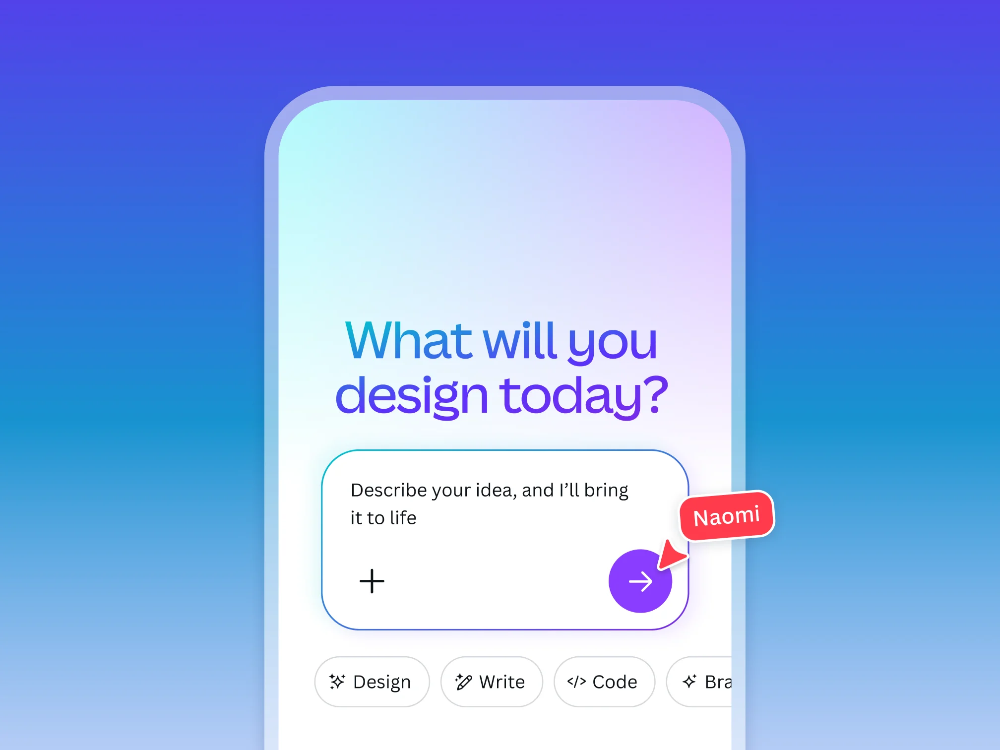

图：Canva AI 对话入口——输入框 + Design/Write/Code/Brand 模式 chips（chat 引用派形态）。来源：[canva.com/ai-assistant](https://www.canva.com/ai-assistant/)。

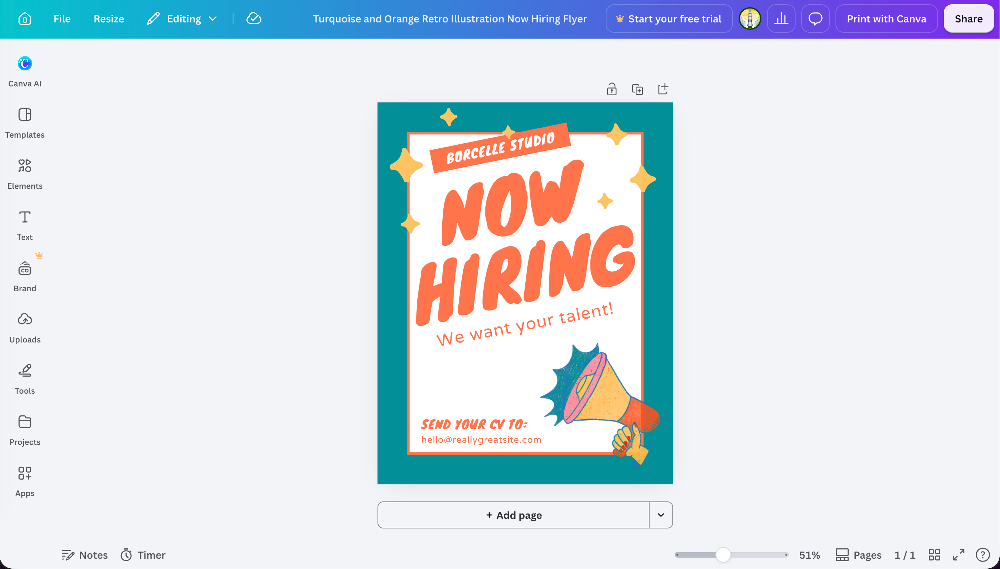

图：编辑器全景（用户提供截图）——四层 chrome：顶部 session bar（File/Resize/Editing ▾/居中标题/右侧 Share）、左侧 object panel（Canva AI 居首位，Templates/Elements/Text/Brand/Uploads/Tools/Projects/Apps）、画布、底部状态导航条（Add page/Notes/zoom 滑杆/Pages/全屏/帮助图标）。另有一张选中文字元素的特写（未归档）：顶部 contextual toolbar 整排切换为字体/字号/颜色/样式/Effects/Animate/Position，选中框上方浮出迷你条（Ask Canva + 旋转/锁定/复制/删除/⋯）——"选中驱动"与"chat 引用单入口"的同屏实证。

**版本历史与保存状态**

- File → Version history：点击任一版本与当前稿对比，可 Restore 或 Make a copy；付费档最多保留 1000 版且无时限，每版显示协作者头像（[官方帮助 Version history](https://www.canva.com/help/version-history/)）。
- 保存为全自动：状态栏出现 Save 图标即"您的更改已保存"；也可 File → Save 手动触发（[官方帮助 Save](https://www.canva.com/help/save/)）——状态反馈是一个小图标，而非文字带。

**导出**

- 右上角 Share → Download → 文件类型下拉（PNG/JPG/PDF Standard/PDF Print/MP4/GIF/SVG/PPTX）+ 选项 → Download——同样是"一个入口 + 格式二级选择"（官方下载帮助页拒绝直接抓取，此条依据多个二手教程与印刷商指南交叉佐证，标注二手来源）。

## Recraft

Recraft 是 AI-native 图像/设计画布，2026 年 8 月文档反映其最新一次交互重构，结论与本问题高度相关，以下全部来自官方文档。

**整体布局**

- 左侧面板容纳两个 tab：**Create**（生成与编辑：生成类型 Image/Vector/Video/Mockup/Image set，再加 Model、Style、Add references、Ratio、Colors、Generation count）与 **Chat**（agentic 模式，是同一面板里的 tab 而非独立底部面板）。History 在左上角。设计原则原话："creating, editing, and chatting used to live in different places… You don't go looking to change something; it's already there."（[Recraft 官方文档 Finding tools and controls，2026-08-26 更新](https://www.recraft.ai/docs/recraft-studio/finding-tools-and-controls)）。
- 画布为无限画布，带网格吸附（[Recraft 官方文档 Canvas](https://www.recraft.ai/docs/recraft-studio/work-area/canvas)）。

**画布工具栏**

- 画布工具栏**移到了画布底部**；导航/选择类工具为 Pointer（选择/移动/缩放对象）与 Hand（平移，空格临时激活）；undo/redo 在工具栏；zoom 控制在底部（Snap to grid 在 zoom control 内）。Mockup 等生成类功能从工具栏移除，归入 Create 面板的生成类型（[Finding tools and controls](https://www.recraft.ai/docs/recraft-studio/finding-tools-and-controls)、[Canvas](https://www.recraft.ai/docs/recraft-studio/work-area/canvas)）。

**选中→AI 操作（重点先例）**

- 单击图片：右侧打开面板，直接落在 **Modify** 区块——"对选中图能做的一切，包括 AI 编辑，都带着自己的 prompt 输入框写在右侧面板里"。动作按目的分三组：**Modify**（edit image、change background、remove background、erase area、adjust colors、outpaint、remix）、**Reuse**（turn to vector、turn to mockup、reuse for video、extract prompt）、**Finalize**（upscale、export）（[Finding tools and controls](https://www.recraft.ai/docs/recraft-studio/finding-tools-and-controls)）。
- 再次点击已选中的图片：Create 面板出现 "Add" 缩略图 + **画布上浮动的 prompt 条**，把它作为参考图附加（[Finding tools and controls](https://www.recraft.ai/docs/recraft-studio/finding-tools-and-controls)）。
- 多选：右侧面板切换为批量操作 + 对齐选项（[Canvas](https://www.recraft.ai/docs/recraft-studio/work-area/canvas)）。
- 右键菜单：空画布右键顶部是 "Create new"（可在指定位置直接生成）；对象右键为 copy/duplicate/delete/export/arrange（[Canvas](https://www.recraft.ai/docs/recraft-studio/work-area/canvas)）。

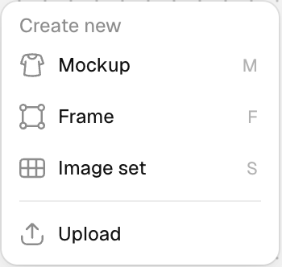

图：Recraft 空画布右键菜单——Create new 组（Mockup M / Frame F / Image set S / Upload），生成类动作收在上下文菜单而非顶层工具栏（选中驱动模式）。来源：[Recraft 官方文档 Canvas](https://www.recraft.ai/docs/recraft-studio/work-area/canvas)。

- Canvas states 被显式设计：未选中=工作区+工具栏；单选=左 Selected object 面板（prompt/参数）+ 右 Context 面板；多选=批量操作（[Canvas](https://www.recraft.ai/docs/recraft-studio/work-area/canvas)）。

**生成历史/版本**：History 在左上角；Chat 不再保存生成记录，统一去 History 查（[Finding tools and controls](https://www.recraft.ai/docs/recraft-studio/finding-tools-and-controls)）。未见命名版本/分支概念（未找到公开资料）。

**导出**：收在右侧面板 **Finalize** 组（upscale 与 export 并列）；对象右键菜单也有 export（[Finding tools and controls](https://www.recraft.ai/docs/recraft-studio/finding-tools-and-controls)）。

**状态反馈/多图管理**：以 canvas states 驱动整个面板系统切换；多图在无限画布自由排布、网格吸附（[Canvas](https://www.recraft.ai/docs/recraft-studio/work-area/canvas)）。

## Ideogram Canvas

Ideogram 的 Canvas 是"无限创意画板"，官方文档极其完整，是"选中→上下文菜单"模式的标准样本。

**整体布局**

- 无限画布；左侧竖排图标工具面板：Home、**生成工具**（Generate、Magic Fill、Remix、Extend）与**工具**（Select、Hand、Text、Upload、Download）。prompt box 在画布顶部；渲染选项（Private、Aspect Ratio、Style、Magic Prompt、Color）**默认收起**，点 prompt box 右侧的 Options 图标才展开（[Ideogram 官方文档 Canvas Overview](https://docs.ideogram.ai/canvas-and-editing/canvas/canvas-overview)）。

**画布工具栏**

- 右下角小面板：undo、redo、**保存状态云图标**、zoom 控制（+ / − / 预设百分比 / Fill / Fit）。全是图标，无文字按钮（[Canvas Overview](https://docs.ideogram.ai/canvas-and-editing/canvas/canvas-overview)）。

**选中→AI 操作（重点先例）**

- 选中图片后**图片下方出现 image panel**：生成组图（4 张）显示 1/4 箭头在变体间切换 + More；单图显示 Duplicate、Remove + More（[Canvas Overview](https://docs.ideogram.ai/canvas-and-editing/canvas/canvas-overview)）。
- **More 菜单**收纳全部进阶操作并分组：Edit（Remix、Magic Fill、Extend、Upscale、Remove background）、Reference、Manage（Copy、Duplicate、图层顺序 Bring to front/Bring forward/Send backward/Send to back、Download PNG|JPG、Remove from canvas）。约 12 个动作，选中物旁一个 "⋯" 全部装下（[Canvas Overview](https://docs.ideogram.ai/canvas-and-editing/canvas/canvas-overview)）。

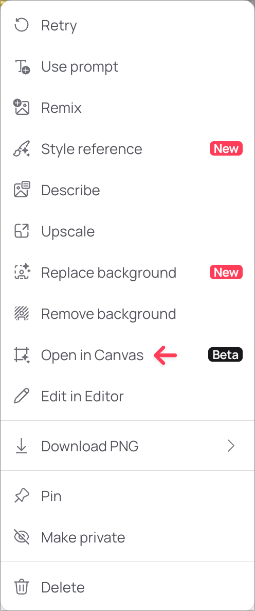

图：Ideogram 选中图旁的 More 菜单——Retry/Use prompt/Remix/Magic Fill/Extend/Upscale/Remove background/Download PNG▸/Pin/Make private/Delete 全部收在一个 "⋯" 里（选中驱动上下文菜单模式）。来源：[Ideogram 官方文档 Canvas Overview](https://docs.ideogram.ai/canvas-and-editing/canvas/canvas-overview)。

- 右侧 details panel 显示选中图的 prompt、尺寸、风格、seed 等，可手动开关（[Canvas Overview](https://docs.ideogram.ai/canvas-and-editing/canvas/canvas-overview)）。

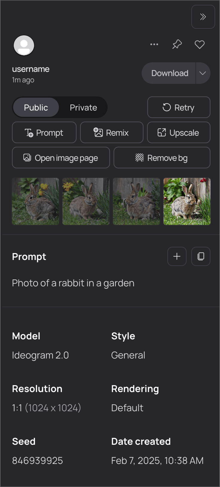

图：Ideogram 右侧 details 面板——Prompt/Remix/Upscale/Remove background 动作按钮 + Download▾ 下拉 + prompt/model/seed 元数据（选中物的属性与动作都进侧栏，不进顶层）。来源：[Ideogram 官方文档 Canvas Overview](https://docs.ideogram.ai/canvas-and-editing/canvas/canvas-overview)。

- 区域级 AI 操作（Magic Fill/Extend）是**模式化工具**而非按钮：从左侧选 Magic Fill → 蒙版工具（矩形/自由/画笔/橡皮/反选/载入上次蒙版）涂抹 → Next → 调整**生成窗口**（bounding box，定义生成内容的尺寸/比例/位置）→ 在顶部 prompt box 描述 → 生成（[Magic Fill 官方文档](https://docs.ideogram.ai/canvas-and-editing/canvas/magic-fill)）。

**生成历史/版本**：每次生成 4 张，用选中图下的箭头在 4 个变体间切换；undo/redo + 自动保存状态图标；**无命名版本概念**（未找到公开资料）（[Canvas Overview](https://docs.ideogram.ai/canvas-and-editing/canvas/canvas-overview)）。

**导出 UX（重点先例）**

- Download 是左侧工具之一：点击后画布上出现"下载生成窗口"，框选要导出的区域（截图式导出），左侧小面板显示/修改最终尺寸，**格式选择收在 Download 按钮旁的箭头里**（PNG 需付费档、JPG 免费）——一个入口 + 格式二级（[Canvas Overview](https://docs.ideogram.ai/canvas-and-editing/canvas/canvas-overview)）。
- 单张生成图也可直接在其 More 菜单里 Download（同样 PNG/JPG 两级）（[Canvas Overview](https://docs.ideogram.ai/canvas-and-editing/canvas/canvas-overview)）。

**状态反馈**：右下角的绿色"已保存"云图标是唯一常驻状态指示；其余状态（选中态、生成窗口）都附着在操作对象上（[Canvas Overview](https://docs.ideogram.ai/canvas-and-editing/canvas/canvas-overview)）。

**多图管理**：image frames 自由移动/缩放，图层顺序经 More 菜单管理（[Canvas Overview](https://docs.ideogram.ai/canvas-and-editing/canvas/canvas-overview)）。

## Midjourney（Web Editor）

Midjourney 的网页 Editor（2024 年起全量）把 inpaint/pan/zoom/retexture 整合在一个编辑页里。官方文档站拦截直接抓取，以下内容经 Wayback Machine 存档验证。

**整体布局与工具组织**

- 编辑在 midjourney.com 的 Editor 中进行，支持编辑 MJ 图库图与上传的外部图。工具清单：Undo/Redo/Reset、Suggest Prompt（反推 prompt）、Move/Resize（比例预设 + Image Scale 滑杆 + 拖动画布边缘灰色条改比例）、Paint（Erase/Restore 画笔 + Brush Size 滑杆）、Smart Select（正/负点选建立选区蒙版，"Erase Selection"/"Erase Background" 应用）、Layers（多图层，勾选标记活动层）、Retexture（保留结构构图、整图换新风格）（[Midjourney 官方文档 Editor](https://docs.midjourney.com/hc/en-us/articles/32764383466893-Editor)，[2025-04 Wayback 存档](https://web.archive.org/web/20250419064535/https://docs.midjourney.com/hc/en-us/articles/32764383466893-Editor)）。

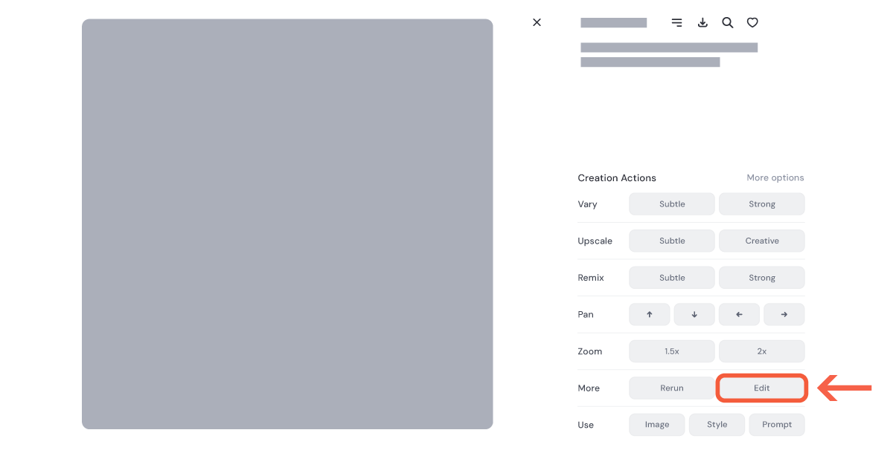

图：Midjourney 图片旁的 Creation Actions 面板——Vary/Upscale/Remix/Pan/Zoom + More（Rerun/Edit/Use），动作附着于图片（选中驱动模式）。来源：[Midjourney 官方文档 Editor](https://docs.midjourney.com/hc/en-us/articles/32764383466893-Editor)（[2025-04 Wayback 存档](https://web.archive.org/web/20250419064535/https://docs.midjourney.com/hc/en-us/articles/32764383466893-Editor)）。

**选区→AI 操作**

- Web Editor 流程：擦除要重生的区域（Paint/Smart Select）→ 在 **Imagine bar**（prompt 输入条）描述 → Submit Edit → 结果面板返回 4 张（[Editor 文档](https://docs.midjourney.com/hc/en-us/articles/32764383466893-Editor)）。

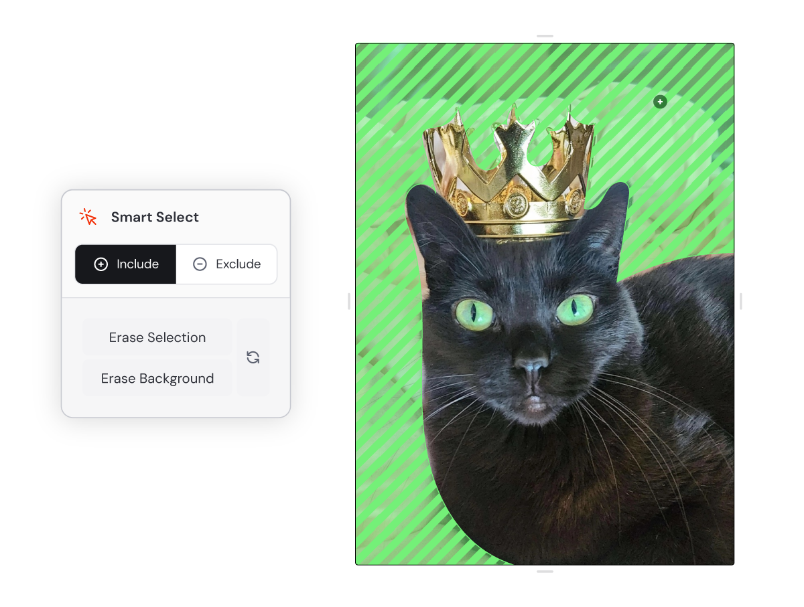

图：Editor 的 Smart Select——Include/Exclude 点选建立绿色蒙版，Erase Selection/Erase Background 应用（选区是模式化工具状态，不是工具栏按钮）。来源：同上。

- Discord 侧对应物 Vary Region：放大图后出现 "Vary (Region)" 按钮 → 编辑器左下 freehand/矩形选区工具 → （Remix 模式可改 prompt）→ submit。选区大小影响结果：大选区给模型更多创作空间，小选区改动更细微（[Midjourney 官方文档 Vary Region](https://docs.midjourney.com/hc/en-us/articles/32794723105549-Vary-Region)，[2025-02 Wayback 存档](https://web.archive.org/web/20250221183105/https://docs.midjourney.com/hc/en-us/articles/32794723105549-Vary-Region)）。

**生成历史/版本**：每次编辑的结果追加进结果面板（每次 4 张，可继续编辑或导出）；编辑中作品保存在 Editor 内，可随时回去继续，Upscale 后才进入 Create/Organize 画廊（[Editor 文档](https://docs.midjourney.com/hc/en-us/articles/32764383466893-Editor)）。

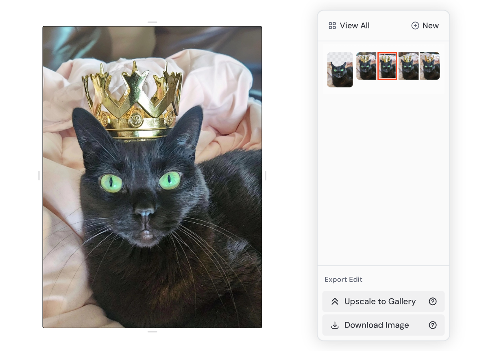

图：Editor 结果面板——版本缩略图追加排列 + Export Edit（Upscale to Gallery / Download Image 一个入口两个选项）（缩略图链即版本史模式）。来源：[Midjourney 官方文档 Editor](https://docs.midjourney.com/hc/en-us/articles/32764383466893-Editor)（[2025-04 Wayback 存档](https://web.archive.org/web/20250419064535/https://docs.midjourney.com/hc/en-us/articles/32764383466893-Editor)）。

**导出 UX**：Upscale to Gallery 或 Download Image；下载时二选一：Save Original Generation（生成图）或 Save Current Edit（擦除区域的透明 PNG）——同样是一个入口 + 选项二级（[Editor 文档](https://docs.midjourney.com/hc/en-us/articles/32764383466893-Editor)）。

**状态反馈/多图管理**：状态反馈未找到明确公开资料；多图经 Layers 面板合成，提交后 flatten（可见透明区域才会被重生成，其余保持不变）（[Editor 文档](https://docs.midjourney.com/hc/en-us/articles/32764383466893-Editor)）。

## Krea

Krea 的两块界面与调研问题相关：Realtime（实时画布）与 Edit（图像编辑器），以下均来自官方文档。

**Realtime 整体布局**

- **左右双栏**：左侧画布是输入面，右侧是实时输出——"there is no queue, no waiting, and no render button to press"。prompt box 下方依次切换：输出类型（Image/Video）、draw mode、比例（1:1/3:2/2:3）；左下角是模型选择与 **preview toggle**（隐藏画布、只看结果）（[Krea 官方文档 Realtime](https://www.krea.ai/docs/user-guide/features/realtime)）。
- 画布工具（全快捷键化）：Select(V)、Brush(B)、Eraser(X)、背景色、形状（C/R/T）、上传图片(I)、Live capture（摄像头实时输入）、Generate image(G)（把 AI 生成图放上画布作参考层）。Draw modes：Draw / Web Camera / Screen Record / Text Only（[Realtime](https://www.krea.ai/docs/user-guide/features/realtime)）。

**Edit（选区→AI 操作先例）**

- 编辑项加载后提供：Change Region、Annotate、Crop or Expand、Image Adjustments、Change Lighting、Draw、Change Camera Angle、Color Palette（[Krea 官方文档 Edit](https://www.krea.ai/docs/user-guide/features/edit)）。
- **Change Region**：先选"如何定义选区"——整图 / 画笔（可调笔刷大小）/ 矩形 / **Auto Mask**（悬停即自动检测并高亮区域）→ 在 prompt 字段用自然语言描述修改 → Generate。结果出现在主画布，**页面底部的缩略图预览可对比或回退到之前的版本**（[Edit](https://www.krea.ai/docs/user-guide/features/edit)）。

图：Krea Edit 的 Change Region——蒙版选区高亮叠加在图上，prompt 描述修改（选区 + prompt 的局部重绘模式）。来源：[Krea 官方文档 Edit](https://www.krea.ai/docs/user-guide/features/edit)。

- Annotate：给不同区域各配一条 prompt，分区控制构图（[Edit](https://www.krea.ai/docs/user-guide/features/edit)）。
- Image Adjustments：亮度/对比/饱和/色温滑杆，**Apply 前非破坏**（[Edit](https://www.krea.ai/docs/user-guide/features/edit)）。

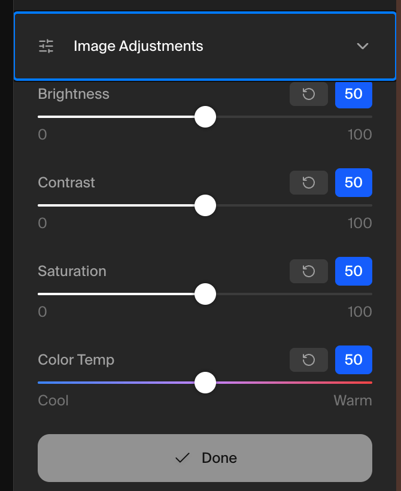

图：Krea Image Adjustments——亮度/对比/饱和/色温滑杆 + Done（调整项收在编辑面板内，非顶层工具栏）。来源：[Krea 官方文档 Edit](https://www.krea.ai/docs/user-guide/features/edit)。

**生成历史/导出/状态**：Edit 底部缩略图链即版本对比/回退；Realtime 输出面板底部两个动作：Upscale、Download；后续动作是"送去 Enhancer / 送去 Video"，从 edit 面板进入（[Edit](https://www.krea.ai/docs/user-guide/features/edit)、[Realtime](https://www.krea.ai/docs/user-guide/features/realtime)）。

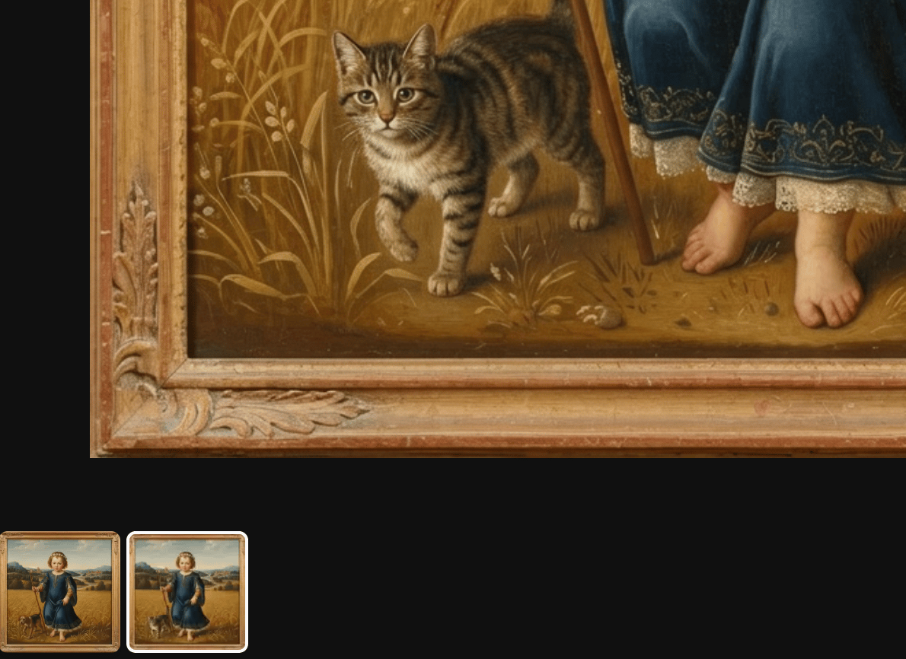

图：Krea Edit 左下角的版本缩略图链——两版并列、其一选中，点击即对比/回退（缩略图链即版本史模式）。来源：[Krea 官方文档 Edit](https://www.krea.ai/docs/user-guide/features/edit)。Realtime 的状态反馈就是实时输出本身。另有 node 工作流画布（无限画布上连接输入/参数/输出），属进阶形态（[Krea 官方文档 Nodes workflows](https://www.krea.ai/docs/user-guide/features/nodes)）。

## Leonardo.ai

Leonardo（现属 Canva）有 Canvas Editor 与 Realtime Canvas 两个相关界面，以下来自官方帮助中心。

**Canvas Editor**

- 上传图片开始。工具栏按钮：Select（箭头，移动元素与生成框）、**Draw Mask**（涂蒙版）、**Erase**（擦除，可选 All/Images/Sketches/Mask 四种擦除对象）；**prompt 输入条在屏幕底部**，输入后重新生成"生成框"（generation frame，左上角有锁，锁定后不在框内生成）内的区域（[Leonardo 官方帮助 Canvas Editor 使用指南](https://intercom.help/leonardo-ai/en/articles/8093145-how-to-use-canvas-editor-tool)）。
- 右侧 **Control Panel** 是各工具的主要访问区；模式：Text2Img / Img2Img / Sketch2Image / Inpainting / Outpainting；另有 **Focus Mode**（简化版 inpaint）与 Infinite Mode 互相切换（[同上](https://intercom.help/leonardo-ai/en/articles/8093145-how-to-use-canvas-editor-tool)）。
- 导出：工具栏上的 "Download Artwork" 按钮（[同上](https://intercom.help/leonardo-ai/en/articles/8093145-how-to-use-canvas-editor-tool)）。

**Realtime Canvas**

- Image-to-Image 工具：画草图近实时出图；**Creativity Strength 滑杆**越低越贴合草图；**Output to Input** 把输出送回输入形成持续编辑反馈环；支持 Inpaint 模式、Remove Background、上传自己的图（[Leonardo 官方帮助 Realtime Canvas](https://intercom.help/leonardo-ai/en/articles/8658301-realtime-canvas)）。

**生成历史/版本/状态反馈**：本次调研未找到官方公开资料。

## Adobe Firefly（Web 主应用 + Firefly Boards）

**Firefly 主应用（生成页）**

- 首页左侧选 Image → Generate image 进入生成页。**General settings**：Model 下拉（Adobe + partner 模型）、Aspect ratio、Content type、Visual intensity 滑杆；**Composition**（参考图 + Strength 滑杆）；**Styles**（风格参考 + Strength、effects、Color and tone、Lighting、Camera angle）；Prompt field 输入描述，Generate 旁的 Prompt features 可开 prompt 建议/增强（[Adobe 官方帮助 Generate images from text descriptions，2026-07 更新](https://helpx.adobe.com/firefly/web/work-with-images/generate-images/generate-images-from-text-descriptions.html)）。
- 结果与历史：生成后 grid view 看变体；**History strip** 展示全部生成（含 upscale 标记）；list view 可批量下载；每条结果可 "Use settings"（只复用设置不带 prompt）或 "Generate more"（设置+prompt 再来一组）；prompt bar 上方的 History 图标/View all 进入 Your stuff 的 Generation history（[同上](https://helpx.adobe.com/firefly/web/work-with-images/generate-images/generate-images-from-text-descriptions.html)）。

**Firefly Boards（协作画布/moodboard）**

- **底部 prompt bar**：Generate image / Generate video 在页面底部；左侧工具栏放 Artboard、Shapes、Text 等；右侧 toolbar 放 Adobe Stock 搜索（[Adobe 官方帮助 Create boards，2026-06 更新](https://helpx.adobe.com/firefly/web/create-mood-boards/firefly-boards/create-mood-boards.html)）。

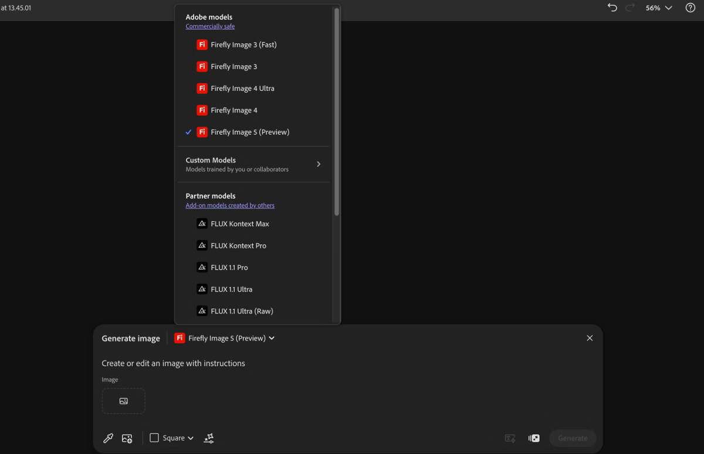

图：Firefly Boards 底部 Generate image 面板——prompt 输入 + 模型选择弹出层（Adobe/Custom/Partner 模型分组），生成入口在底部条而非顶层工具栏。来源：[Adobe 官方帮助 Create boards](https://helpx.adobe.com/firefly/web/create-mood-boards/firefly-boards/create-mood-boards.html)。

- 生成的变体先出现在 **filmstrip**（底部缩略图带），拖上画布（[同上](https://helpx.adobe.com/firefly/web/create-mood-boards/firefly-boards/create-mood-boards.html)）。
- **选中图片后出现的上下文选项**（重点先例）：Vary、Edit（Generative fill / Generative expand / Edit text in image / partner 模型精修）、Convert（Image to video / Image to 3D）、Remove background、Crop、**Download**、**More**（Open copy in Photoshop / Adobe Express、Copy link、Find similar inspiration、剪切/复制/删除/翻转/重排）——约 10+ 动作，主行 + More 两层装下（[同上](https://helpx.adobe.com/firefly/web/create-mood-boards/firefly-boards/create-mood-boards.html)）。

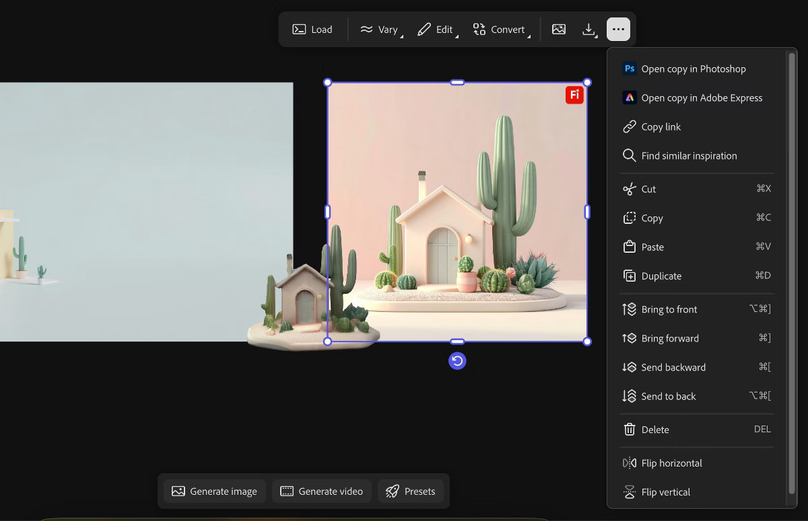

图：选中图片后出现的浮动工具条——Load/Vary▾/Edit▾/Convert▾/图图标/Download/⋯，More 菜单展开收纳其余动作（选中驱动上下文工具条模式）。来源：[Adobe 官方帮助 Create boards](https://helpx.adobe.com/firefly/web/create-mood-boards/firefly-boards/create-mood-boards.html)。

- **多选**激活另一组：Remix（以所选图为灵感生成混合变体）、Collect items（收进 artboard）、Arrange（Rows/Columns/Mosaic）、Align、Download、More（[同上](https://helpx.adobe.com/firefly/web/create-mood-boards/firefly-boards/create-mood-boards.html)）。

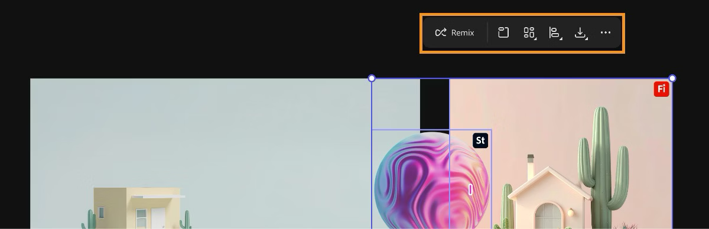

图：多选时切换为另一组紧凑工具条——Remix/Collect/Arrange/Align/Download/⋯（canvas states 驱动工具条内容切换）。来源：[Adobe 官方帮助 Create boards](https://helpx.adobe.com/firefly/web/create-mood-boards/firefly-boards/create-mood-boards.html)。

- Sample from canvas 图标把画布上的图用作：Describe image / Use as style reference / Use as composition reference / Extract sub-prompt——即"引用选中元素"的 Firefly 形态（[同上](https://helpx.adobe.com/firefly/web/create-mood-boards/firefly-boards/create-mood-boards.html)）。
- 版本历史：未找到公开资料（Boards 未见版本时间轴；主应用侧是 Generation history 画廊）。

## Flora

Flora（florafauna.ai，2025 年发布）是 node-based 创意画布，聚合 50+ 图像/视频/文本模型，Pentagram、Lionsgate 等团队在用。

- **整体布局**：Figma 式无限画布，无线性 chat；每个 **block**（节点）是一个模型或功能，从输出端口拖线即选择下游模型，形成可视化工作流；团队实时协作（Team workspaces）（二手来源：[skywork.ai 深度评测 2025](<https://skywork.ai/skypage/en/FLORA-&-FAUNA-AI:-The-All-in-One-Creative-Canvas-I-Ditched-5-Tools-For-(2025-Review)/1972912707931402240>)，其中引用了 [Flora 官网](https://florafauna.ai/)、[官方 blog/更新页](https://www.florafauna.ai/updates) 与 [TechCrunch 2025-03 报道](https://techcrunch.com/2025/03/02/flora-is-building-an-ai-powered-infinite-canvas-for-creative-professionals/)）。官网首页自述："Every text, image and video model on one infinite canvas"（[flora.ai 官网](https://flora.ai)）。
- **状态反馈（值得注意的先例）**：生成中的状态直接显示在节点上（官网首页演示文案 "Model Running" 落在节点卡片上）（[flora.ai 官网](https://flora.ai)）。
- **生成历史/版本**：从任一 image block 拖出新连接即形成"变体的视觉分支树"（visual tree of variations），整张创作过程图留在画布上（二手来源：[skywork.ai 评测](<https://skywork.ai/skypage/en/FLORA-&-FAUNA-AI:-The-All-in-One-Creative-Canvas-I-Ditched-5-Tools-For-(2025-Review)/1972912707931402240>)）。Replace Block：右键替换输入块，整个流程用新输入重跑（二手来源：同上，引官方 updates）。
- **导出/版本命名/撤销**：未找到官方公开资料。
- 附注：官方提供 MCP（agents.flora.ai/mcp），可从 Claude/Cursor 的 chat 里调用 Generate 与 Techniques——chat 指令 → 画布产出的另一种接线方式（[flora.ai/mcp 官方页](https://flora.ai/mcp)）。

## Visual Electric（已停服）

Visual Electric 是"为设计师而生的 AI 图像画布"的早期代表，2025-10-01 团队被 Perplexity 收购、产品于 90 天内关停（二手来源：[TechCrunch 2025-10-02](https://techcrunch.com/2025/10/02/perplexity-acquires-the-team-behind-sequioa-backed-ai-design-startup-visual-electric/)），当前界面已无法核验。以下基于发布期报道：

- 无限画布；输入 prompt 得到 4 个选项，可无限迭代；prompt 侧可选色板、排除颜色、格式与 mood（Airbrush/Film/Cinematic/Neon）（二手来源：[TechCrunch 2023-12-05 发布报道](https://techcrunch.com/2023/12/05/visual-electric-launches-an-ai-powered-image-generator-with-a-designer-workflow-focus/)）。
- 局部修改功能叫 **"touch"**：用 prompt 修改已生成图的指定部分；另有 creativity 滑杆做变体、remix 重制、去背景、upscale（付费）（二手来源：同上）。
- 创始人的界面观："generative AI is an interface problem. Existing tools rely on a linear chat metaphor. But creativity isn't linear"——用空间化画布取代线性 chat（二手来源：同上）。这一理念后被 Flora/Lovart 等继承。

## Freepik AI / Magnific

Freepik 的 AI 能力已整合为 AI 套件（页面现以 Magnific 品牌呈现），形态是**单任务工具集**而非大画布：

- 工具清单：Assistant、Image Editor（官方文案："Describe the edit. It happens."——自然语言描述即编辑）、Image Generator、Image Upscaler、Cinematic Shot、Variations、Character Generator、Skin Enhancer、Change Camera、Mockup Generator、Remove Background、Relight（[Freepik 官方 /ai 页](https://www.freepik.com/ai)）。
- 对本调研的价值在于"少即是多"的入口策略：每个工具一个页面/一个任务，编辑入口就是一句自然语言描述，无复杂 chrome。
- 其早期实时草图工具 Pikaso（2023，LCM 实时绘图）在现行 /ai 页未再单列，现状不明（标注存疑）。

## 即梦 Jimeng（简要）

字节跳动即梦的"智能画布"是国产 AIGC 画布的典型样本，本次仅检索到二手教程资料（官方页为重 JS 应用，帮助文档未公开索引）：

- 选中画布上的图片后，**顶部菜单出现针对该图的操作**：局部重绘、消除笔、扩图、抠图、细节重绘、无损超清；选区笔支持手动涂抹、框选工具与智能识别物体点选；重绘需在提示词中描述修改内容（二手来源：[什么值得买全流程教程 2026-04](https://post.smzdm.com/p/a26wvwzn)、[今日头条教程 2024-08](https://www.toutiao.com/article/7405616543872107019)）。
- 同组生成的 4 张图出现在右侧图层面板，可选定后继续局部重绘/消除（二手来源：[飞书文档教程镜像](https://docs.feishu.cn/article/wiki/WVylwf2EIi5DETk31euc43ucnqg)）。
- 模式同样是"选中驱动"：不选中图片，编辑操作不出现。
- 界面截图：官方页为重 JS 应用无法直接抓取，教程站正文图多为 JS 渲染或视频封面（大字覆盖），**本次未找到可引用的智能画布一手/清晰界面截图**，以上描述以文字教程为准。

## ComfyUI（node 画布范式参照）

ComfyUI 是专业 node 工作流画布的参照系。其 chrome 分配（[ComfyUI 官方文档 Interface Guide](https://docs.comfy.org/interface/overview)）：

- 主菜单（文件/帮助）收在角落；左侧边栏承载 ASSETS / Nodes / Models / Workflows / Templates 五个面板；左下小工具条只有 Help / Console / Shortcuts / Settings 四个图标；顶部为 workflow 名、新建按钮、Run/queue 控制区；右下画布导航（移动/平移切换、minimap、连线显示开关）。
- 参照意义：**画布自身的常驻 chrome 只有导航控件**，其余全部收进侧栏与角落菜单——这恰是专业画布产品对"工具栏该放什么"的集体答案。node 范式本身不适合本项目（Bento 已是完整编辑器，且 vendor chrome 不可改），故仅作 chrome 分配参照。

---

## 对本项目的启示

先重述约束：不新增功能、保留所有现有能力；"当前作品"切换必须留在可见工具栏；Bento vendor 内部 chrome 不可改，只能改 React shell 层（`design-canvas.tsx` 第 325-440 行的工具栏与下方状态带）。

### 模式一：选区→AI 操作不进顶层常驻工具栏（回答 5 个选区按钮的归属）

行业证据高度一致，且分两派：

1. **选中驱动派**（画布产品主流）：动作附着于选中物，选中才出现。Recraft 选中图片→右侧面板直接落在 Modify 区块（"it's already there"）；Ideogram 选中图片→图下浮出 image panel + More 菜单（约 12 个动作分 3 组）；Firefly Boards 选中→上下文选项行 + More；Leonardo/即梦不选中图片编辑操作根本不可用。**Canva 证明该派可与顶层工具栏合流**：quick actions toolbar 位置常驻、内容随选中对象整体切换（选中图片→裁剪/滤镜/效果，选中文字→字体/字号/样式），AI 编辑（Magic Edit/Eraser/Expand 等）再收一级到 Edit→Tools 侧栏——"工具栏槽位常驻"不等于"对象级按钮常驻"。
2. **chat 引用派**（chat+canvas 同构产品）：选区作为引用注入 chat 输入框，**prompt 区分动作，而不是每个动作一个按钮**。Lovart 的 "Add to chat" 把画布元素加入对话；Canva 的 Ask Canva 把选中元素/页面作为对话上下文并附预设 prompt（Redesign this page 等）；Firefly Boards 的 Sample from canvas（describe/style reference/composition reference/sub-prompt）同理。

我们的 5 个按钮（引用选中元素/生成选中图像/编辑选中图像/调整选中风格/重新生成选区）本质全是 `referenceSelection(reference, prompt)` + 不同 prompt 预设。按惯例应收敛为 **1 个"对选中元素…"入口 + 其内部分组菜单**（Ideogram More 菜单形态）或 **1 个引用动作 + prompt 预设迁至 chat 输入区**（Lovart Skills 形态，预设如"生成/编辑/调风格/重新生成"）。两派都不支持"5 个文字按钮常驻顶层"。可见性策略上，理想态是"有选区时才可用/才出现"（Leonardo、即梦、Ideogram 均如此）；**待工程确认**：shell 是否能从 Bento 桥接感知选区状态——若不能，退一步常驻一个菜单按钮仍符合惯例（Ideogram 的 More 菜单触发器常驻、选中才有内容）。

### 模式二：顶层 chrome 只留"会话级"控件，且以图标/下拉为主（回答 15 按钮如何收敛）

跨产品清点常驻 chrome：画布导航工具（选择/平移/缩放/撤销）全部是小图标，位置在画布底部（Recraft）、左侧竖排（Ideogram、Firefly Boards、即梦）或右下角簇（Ideogram 的 zoom/undo/保存图标；ComfyUI 的右下导航）。这些 Bento 内部已有，shell 无需重复。属于 shell 的"会话级"控件，各产品的放法：

| 我们的按钮（现状）                        | 行业惯例                                                                                                                                                                                                                                                  | 收敛建议（控件数）                                                      |
| ----------------------------------------- | --------------------------------------------------------------------------------------------------------------------------------------------------------------------------------------------------------------------------------------------------------- | ----------------------------------------------------------------------- |
| 5 个选区动作（文字按钮）                  | 选中驱动上下文菜单 / chat 引用（见模式一）；Canva 另给出合流形态：工具栏槽位常驻、内容随选中对象切换                                                                                                                                                      | 1 个菜单按钮                                                            |
| 当前作品 / 未提交预览（2 个文字按钮）     | 同互斥视图切换；Lovart/Recraft 用 tab 或 segmented（Create\|Chat tab 是先例）；Canva 顶栏的 Editing/Commenting/Viewing 模式切换同理                                                                                                                       | 1 个 segmented 控件——"当前作品"作为分段项天然留在可见工具栏，满足硬约束 |
| 刷新预览 / 导入为当前作品（条件出现）     | Ideogram/Recraft 的 canvas states：上下文动作只在对应状态出现                                                                                                                                                                                             | 维持条件渲染，收进预览态的上下文位置                                    |
| 版本历史下拉 + 保存版本/从此编辑          | History 收为一个角落入口（Recraft 左上、Firefly 的 History 图标）或菜单项（Canva 的 File→Version history，面板内对比/Restore）；保存/恢复动作放在历史面板内或紧随的小图标；保存状态用自动保存 + 小图标表达（Canva 状态栏 Save 图标、Ideogram 右下云图标） | 1 个 History 下拉（图标+标签）+ 1 个条件小图标按钮                      |
| 聚焦画布                                  | 图标按钮+tooltip（Ideogram 右下簇、ComfyUI 左下条均无文字按钮）                                                                                                                                                                                           | 1 个图标按钮，或收进更多菜单                                            |
| 另存为新设计 + PNG + JPEG（3 个文字按钮） | 导出绝无并列格式按钮：Canva Share→Download 格式下拉；Ideogram 一个 Download + 格式箭头；MJ 一个 Download + 选项二级；Recraft export 在 Finalize 组                                                                                                        | 1 个"更多/文件"菜单（⋯）：另存为新设计、导出 PNG、导出 JPEG             |

合计：约 5 个可见控件（segmented + 选区菜单 + History 下拉 + 保存图标 + ⋯菜单），对比现状最多 15 个文字按钮；风格回到 Lody 整体的 icon button + tooltip + dropdown-menu。

### 模式三：状态反馈贴着对象走，不堆文字带

- Canva：全自动保存，状态栏一个 Save 小图标即全部保存状态表达。Ideogram：常驻状态只有右下角的绿色"已保存"云图标。Flora：生成中状态直接落在被生成的节点卡片上（"Model Running"）。Firefly Boards：生成结果先落 filmstrip。Krea Edit：版本对比在页面底部缩略图链。
- 我们的三条状态文字带（历史只读 / 预览只读多行 / 错误）可合并为**一条紧凑 status 行**（图标 + 一行摘要 + 可展开详情），错误单独保留 `role="alert"`；这与 Ideogram 右下角状态簇、Lody 自身的轻量提示惯例一致，把垂直空间还给画布。

### 模式四：版本历史与导出的惯例

- 版本：生成历史用 filmstrip/缩略图链（Firefly History strip、Krea 底部缩略图、Midjourney 结果面板追加）是图像产品的常态；**命名检查点**则用面板/下拉（Recraft 左上 History；Canva 的 File→Version history 是最成熟样本——版本列表内点击对比、Restore/Make a copy，付费档保留 1000 版）。我们的"版本下拉 + 保存版本/从此编辑"已接近命名检查点惯例，主要问题是占位与文字形态，而非模式错误。
- 导出：全部产品都是"一个入口，格式二级"（Canva Share→Download 文件类型下拉；Ideogram Download 旁箭头选 PNG/JPG；MJ Download 对话框内选项）。我们 PNG/JPEG 两个并列按钮无行业先例，合并进一个菜单项即可。

### 模式五：布局大方向已被验证

chat 在左、画布在右（且画布占绝对主体、指令入口在底部浮动条或左面板）与 Lovart ChatCanvas、Recraft（左 Create/Chat 面板）同构，本项目布局方向无需动摇；要改的只是 shell chrome 的密度与形态。参数/选项默认收起（Ideogram Options 图标、Firefly 设置面板分组）也支持我们把低频项收进菜单。

### 存疑与未能证实之处

- Lovart：chat 面板位置（右侧）与选中→顶部上下文工具栏已由用户提供的一手工作区截图（2026-09）解答；面板折叠行为、agent 工作时人能否动画布（编辑权互斥如何表达）、版本历史 UX 仍未找到公开资料；其余界面细节部分来自二手评测，存在与现版偏差的风险。
- Canva：官网全站拦截直接抓取，上下文工具栏行为以官方帮助中心文字描述为据、未能取得一手截图；导出流程的官方帮助页（/help/download/）拒绝访问，Share→Download 细节依据多个二手教程交叉佐证；Magic Switch 原帮助页已 404（能力拆分后文档结构变化）。
- Midjourney：官方文档站拦截直接抓取，内容经 Wayback 2025-2026 存档验证；现行界面可能有更新。
- Visual Electric：已停服，仅发布期报道可考。
- 即梦：全部来自二手教程；官方无公开可索引的帮助文档，且未找到可引用的智能画布界面截图（教程图多为 JS 渲染或视频封面）。
- Freepik：Pikaso 是否在现行套件中保留未证实。
- Leonardo/Flora 的版本历史与撤销 UX 未找到公开资料。
- 工程可行性（非本次调研范围，需另行确认）：React shell 能否感知 Bento 内选区状态，决定选区动作能做到"选中才出现"还是只能"常驻菜单按钮"。
