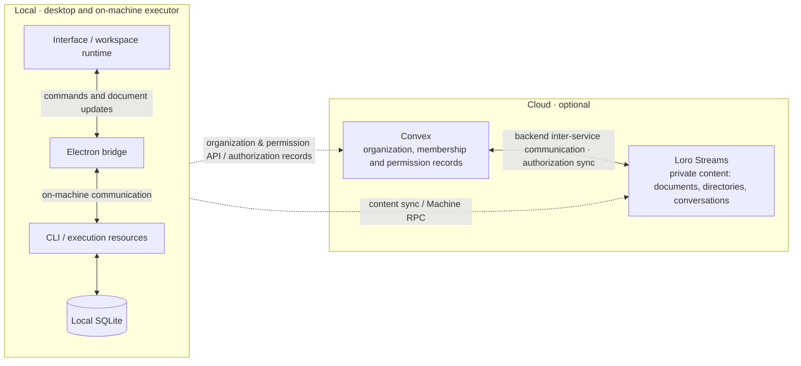

# Communication architecture

Status: approved  
Approval: [2026-09-21 owner approval](../.github/spec-approvals.md#2026-09-21-existing-specs)
Human review: approved  
Translation: current

[中文](communication-architecture.zh.md)

This document describes the division of communication responsibilities between local and cloud. Client paths are grounded in this repository's code; cloud data ownership and authorization synchronization follow the maintainer-confirmed architectural intent. The backend implementation and end-to-end behavior have not been verified, and the whole document still awaits human review.

## What we want readers to understand

The user initiates work on the desktop, and the CLI on the target machine executes it. The interface and the CLI exchange both immediately handled commands and resumable workspace/session data. These two kinds of communication cannot substitute for each other: receiving a command reply does not mean all shared data has finished syncing.

The public desktop defaults to local mode and needs no product cloud service. The source also carries optional cloud adapter interfaces; a product integrating a cloud service can reuse the shared UI and execution logic.

## Modules and paths

The left side is local execution and storage; the right side is the optional cloud. Dashed lines show communication between the local client and the cloud; the arrow inside the cloud shows inter-service authorization synchronization, with concrete protocols omitted.

| Part                            | Responsible for                                                                                                                                                                   |
| ------------------------------- | --------------------------------------------------------------------------------------------------------------------------------------------------------------------------------- |
| Interface and workspace runtime | Presenting document replicas, deciding which machine owns the target, choosing the communication path                                                                             |
| Electron bridge                 | Forwarding local control requests and document messages; connecting the interface to the on-machine CLI                                                                           |
| CLI                             | Holding on-machine execution resources, handling commands, persisting and syncing workspace and session data                                                                      |
| Convex                          | Storing organization structure, membership and permission records, and exposing the corresponding platform APIs                                                                   |
| Loro Streams                    | Carrying storage and sync of private or more sensitive content — documents, whole directories, conversations — as well as the standalone Machine RPC request and response streams |

**How the two relate.** Convex manages who belongs to which organization and who may access what; Loro Streams carries the content those permissions protect. Authorization records are synchronized through backend inter-service communication so content access follows the organization and permission settings. The bidirectional arrow in the diagram expresses inter-service cooperation; it does not mean both sides can modify permissions independently, nor does it specify synchronization timing.

Loro/Flock defines mergeable data, and loro-repo manages document collections, storage and transport; Loro Streams is the transport service and does not decide the meaning of product fields. Neither Convex subscriptions nor Machine RPC is a substitute for CRDT document sync.

## Two typical paths

**Operating the local machine.** The interface sends local control requests to the CLI through Electron; document updates are exchanged over the local data channel, and the CLI persists to SQLite. Operations already determined to belong to the local machine do not wait for cloud tokens, nor do they fall back to remote RPC after a local bridge failure.

**Optional cloud collaboration.** The client obtains workspace access and authorization records through the cloud adapter; organization and permissions are managed by Convex, while document, directory and conversation content is stored and synced through Loro Streams. The two synchronize authorization records in the backend. When a request asks a target machine to execute an operation, it enters that machine's RPC request stream, and the CLI replies to the response stream named by the request. Content sync and RPC share the transport service but have different data and completion semantics.

A cloud composition may also attach local and remote channels at the same time; routing chooses by target ownership. The public local composition does not enable a cloud adapter merely because the source contains one. Public runtime artifact downloads are an exception the existing boundary already allows; they do not mean product cloud capability is available.

## Failures and existing constraints

Saved locally, received remotely, and execution completed on the target must be expressed separately. In particular, a workspace directory write must not be reported as a save failure because a later upload failed. A successful connection is also not proof that all documents are ready.

Constraints remain maintained by existing files: the [root AGENTS](../AGENTS.md) owns platform boundaries and directory persistence, the [components AGENTS](../packages/components/AGENTS.md) owns target routing, and the [RPC AGENTS](../packages/loro-streams-rpc/AGENTS.md) owns request/response. This draft does not build another invariants list.

## Requested human review

- Does the division above accurately express the product intent? Which responsibility boundaries need to be made more explicit?
- How permission changes and revocations take effect, and how sync failures are handled — do these need a separate follow-up document? This document stays at the service-responsibility level and presumes no concrete timing guarantees.
- Attachments, terminals and previews each have their own channels, which this document does not expand on; which of them deserves the next write-up?

## Implementation cross-check entry points

The links below are navigation, not bound to automated freshness checks. This pass was static reading only; no runtime validation was executed.

- [Platform and sync modes](../packages/platform/src/provider.ts), [local composition](../packages/platform/src/local.ts)
- [Workspace routing and transport](../packages/components/src/providers/create-workspace-runtime.ts), [Electron document forwarding](../apps/electron/src/main/services/loro-data-plane-relay.ts)
- [CLI local storage and optional remote sync](../apps/cli/src/lib/loro/doc.ts)
- [Test-only Convex fixture](../packages/components/tests/cloud-platform-api.fixture.ts); the CLI's legacy cloud adapter was removed during the local-product convergence
- [CLI RPC wiring](../apps/cli/src/lib/message-handler.ts), [request dispatch](../packages/loro-streams-rpc/src/machine-rpc-server.ts)
