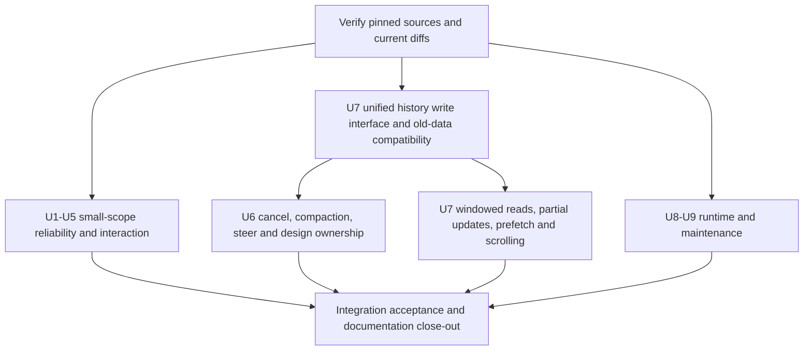

# Adopting Lody upstream reliability and long-conversation updates

Status: draft
Date: 2026-09-17
Translation: current

[中文](lody-upstream-adoption.zh.md)

## Scenario and goals

The user enters design requirements in Molly, attaches reference images, and keeps revising the same artwork. Long sessions, dropped connections, expired credentials, or the user clicking Stop while context and execution tools are being compacted must not cause unsent input to disappear, session context to be silently replaced, stale events to end a new turn, or the canvas to allow editing before the Agent has stopped. After an upgrade, the user can still open their existing sessions, artworks, assets and design versions offline and continue creating in the existing desktop workflow.

This task selectively adopts reliability, input-protection, desktop-interaction and long-conversation improvements already merged upstream in Lody. The goal is to fix the behaviors above while bounding the background workload, keeping Molly's single-user, local-machine design product scope. Where this project already meets the goal with existing behavior, we only record the covering evidence rather than rewriting for upstream alignment.

On 2026-09-17 the selective-adoption direction was confirmed, with a request to record goals, scope, plan and test methods; the maintainer then confirmed additions covering post-Stop input handling, readonly recovery, history compatibility and the real acceptance matrix. This Spec records those confirmed decisions and remains draft, with no approval link for this revision yet; runtime implementation and acceptance are recorded elsewhere. This round delivers documentation only: no code implementation, no release, and no real paid model calls.

## Scope

The comparison window is pinned to the upstream `6f3a8855` at research time, with `8ea564da` as the common baseline; it does not grow automatically with upstream main. The item numbers below organize implementation slices and acceptance tracking; PR numbers only locate the source and do not authorize copying an entire commit. Full SHAs and source evidence are collected in the research record at the end.

| No. | Behavior included in this task                                                                                                                                                                        | Upstream source                                      |
| --- | ----------------------------------------------------------------------------------------------------------------------------------------------------------------------------------------------------- | ---------------------------------------------------- |
| U1  | Local room join timeout recovery, connection-generation isolation, accurate first-sync success signal                                                                                                 | #774                                                 |
| U2  | Credential failure preserves recovery context; failed Session instance cleanup does not affect later execution                                                                                        | #559, #595                                           |
| U3  | New Chat preserves drafts, text drafts isolated between existing identities, Office mixed paste and oversized-text protection                                                                         | #735, #619, #772, #702                               |
| U4  | ScrollArea cleanup, submenu edge avoidance, native text context menu, local file-system actions with clear error feedback                                                                             | #722, #726, #733, #555                               |
| U5  | Capability-cache compatible reads, live capability refresh in the settings dialog, Grok implicit default-mode validation, React crash diagnostics kept                                                | Relevant diffs of #513, #745, #607, #742             |
| U6  | Execution ownership for cancel, context compaction and steer interruption; closing pending questions of stopped turns; cancel control for native subtasks                                             | #571, #573, #275, #618, #693, #740, #605             |
| U7  | Unified history write and validation, old-history compatibility, windowed reads, streaming partial updates, bounded prefetch, list restoration and user scroll intent; merged backlog dispatch checks | #460, #376, #694, #751, #753, #674, #695, #781, #676 |
| U8  | Node/SQLite lower-bound declaration consistent with install checks; the uncovered parts of Windows path and data-directory failure diagnostics                                                        | #72, #717                                            |
| U9  | Dependency release waiting period; Daily failure evidence kept only as artifacts, with feedback referencing run/artifact                                                                              | #629, #698                                           |

The following are not completion conditions for this task, and are not pulled in along with dependency upgrades:

- Built-in Pi migration, new Agent integration, new native title/goal behavior, multi-window, Devframe/devbar, Vite/Storybook/formatter upgrades.
- #638's prefetch worker and new cache/communication structures: implement bounded prefetch on the existing coordinator first; only if measurements still show this path as the bottleneck, propose an evidence-backed alternative separately.
- Conditional candidates such as new Mermaid gestures, Electron 44 API preparation, terminal automatic shell fallback, and macOS helper entitlement relaxation; keep the current contracts.
- Cloud accounts, telemetry, sharing, multi-machine/mobile/Web products, billing, development-workflow entries, and destructive cache resets.
- Upstream changelog-only releases replacing Molly's installer/update channel; new persistent design snapshots, candidate approvals, result cards or dedicated thumbnails.

## Responsibilities and plan

Keep the existing responsibilities: CLI/ACP owns execution and real completion, the shared session layer owns history writes and local sync, the renderer owns input and reading, Electron owns on-machine system actions, the design services own validation and commit, and Bento owns independent editing, rendering and generic snapshot/flush. Do not move the Agent lifecycle into Bento, and do not build another scheduler or chat store.

### U1–U2: Recovery restores only real state

Local room join has a bounded, testable deadline; when it expires the system enters a recoverable failure state. Health checks must not repeatedly reset the deadline to manufacture a permanent wait. Disconnects, shutdowns, invalidation notices and re-joins must isolate connection generations: a stale async completion must not mark a new connection as succeeded or failed. First sync counts as complete only when this generation's data reconcile succeeds. Keep using the existing local push channel; add no cloud sync or polling fallback.

Authentication failure must identify the real cause inside wrapped errors, preserve the session identity, history and drafts bound to the original provider/config, and show the user a recoverable diagnostic; it must not silently degrade into a new session, switch provider, or automatically resend requests. Other recovery paths that create a fresh runtime must first confirm the replayable context is ready, and must not fake recovery with empty history. A failed instance must have its event ownership released before cleanup; late events from a retired instance must not end the new instance's turn.

### U3–U5: Input and desktop behavior

New Chat navigation or target switching itself must not clear unsent text, local attachments, pasted fragments or their draft ownership. Text uses the same isolation keys as existing identities; do not add a multi-workspace product entry for this. Failed sends preserve the input; cleanup happens only at the existing explicit send-success or user-discard boundaries. An element reference must not point at a different artwork after a target switch; when inapplicable, follow the existing reference-validation feedback.

When the Office clipboard carries both text and a generic image copy, keep the text and let the user explicitly choose to attach the image; pure screenshots and real files keep going through the local attachment chain. The single-paste limit is **500 × 1024 bytes**, measured as the UTF-8 length of the stored text after newline normalization and trimming; exactly at the limit is allowed, over the limit is rejected with a prompt to use a file attachment. Rejection does not modify the original draft, and no file is uploaded automatically.

A scroll component stops its own background polling after unmount. Submenus must stay reachable in narrow windows and at screen edges, and preserve Molly's existing cross-menu pointer transition behavior. The native text menu enables undo, cut, copy, paste and similar actions according to Electron's editable state; ordinary selected text is copyable; image and Bento's own menus are not overridden.

Explicit user open/reveal actions on local files may resolve relative, absolute and parent-directory paths on the same trusted machine; failures distinguish nonexistence, permission, IPC and system-launch errors. This capability applies only to system open/reveal; it does not widen the preview resource protocol, attachment blobs, Agent tools or Bento's read permissions, and it does not auto-execute links in Markdown.

The capability cache reuses still-interpretable fields only when the configuration identity matches; old caches keep their refresh requirement, and unknown fields are not inferred as supported capabilities. The dialog follows real capability updates; an implicit default mode must be constrained by actual capabilities, and explicit user configuration and Role permissions are never silently overridden. The React error page keeps its diagnostics until the user retries or explicitly navigates away, and is not repeatedly auto-reset by unrelated data changes; keep reusing the native recovery page, with no telemetry restoration or data wiping.

### U6: Execution completion and artifact processing settle separately

"A cancel request was sent", "ACP cancel has returned", "the underlying prompt/config request has ended" and "design artifact processing has finished" are different facts. The CLI keeps current execution ownership until the underlying end is confirmed; on expiry it may settle via the existing termination mechanism, and when the end cannot be confirmed it shows an error and stays readonly — a timeout is not a successful stop. A repeated Stop does not create a second execution owner.

After a stop failure, the user must be able to re-verify the old execution state through the existing stop, close or reconnect paths; the interface explains why the run has not ended or cannot be confirmed, and points to a verified working recovery entry. Editing resumes only after the old execution's end is confirmed and its artifact processing has finished. Reopening the interface, a successful reconnect, or a local timer expiring are not unlock evidence. Before implementation, verify the actual consumers of these entries and demonstrate at least one reachable recovery path from the failure state to confirmed completion; merely showing an error with permanent readonly does not pass acceptance. Add no force-unlock or cache-clearing entry that ignores execution state.

Cancels and errors during compaction use the same ownership judgment. Grok keeps its confirmed complete-shutdown semantics, and Pi keeps relying on native settlement facts; a generic cancel receipt cannot replace these facts. A stale turn's termination event must not release the new turn's ownership.

Normal completion keeps following the existing queue dispatch rules; a user-initiated Stop preserves pending input and pauses further dispatch for that session until the user explicitly continues. The pause intent must not be lost to a late normal-completion event, a reconnect, or an interface reopen. Explicit continuation still goes through the existing conditions — old execution terminated, design artifact processing finished, and the next flush; resuming the queue must not be understood as skipping execution-ownership checks. Normal queue advancement is not restarting an already finished turn.

Steer (appending instructions mid-execution) distinguishes applied, not-applied and outcome-unknown by the original input identity. The unknown state preserves the input and the recovery facts, does not auto-resend, and is not re-recorded as undelivered or consumed; late receipts or history only settle that same input, never rolling back later producer pointers. The UI must not decide redelivery based solely on a local timeout or a delayed acknowledgement. Explicit user continuation also does not turn the unknown state into resendable: applied input is not sent again, and only confirmed-unapplied input may continue along the existing path; while still unknown, keep it and show the diagnostic. Adopting upstream queue recovery must not auto-restart a stopped or completed design turn.

Turn termination closes its unanswered questions while preserving answered records; a late question must not attach to a later turn. Stop for native subtasks is available only when the capability explicitly supports it, targets the exact subtask, and must not stop the parent by mistake or release the parent task's artwork readonly. Producers and consumers of shared RPC and capability migrate together; when the old end lacks the capability, it is honestly unavailable.

The design services still collect artifacts and record receipts after real execution ends; cancel/failure is not disguised as a successful commit. Flush before dispatch, readonly for all instances of the same artwork during execution and result processing, baseline validation, draft preservation on errors, and the final conditions for restoring editing are all decided by the existing design contracts.

### U7: Unified history interface, replacing consumers layer by layer

First build the unified history write and action interface, validating new input and actually changed fields while preserving unknown old content. Old records must not block legitimate new writes, but permanently disabling validation is not an acceptable way to accept all new writes. Only after every writer in the migration scope is connected may the session layer's temporary validation bypass be retired; this part continues the existing temporary-validation Spec and must not claim its retirement early.

New writes distinguish ordinary metadata from streaming text in storage. Old structures and old import summaries remain readable, and new summaries are explicitly versioned; repeated imports do not append duplicates, old summaries are not reinterpreted as new versions, and local edits or deletions are not overwritten. Design outcomes, commit receipts, attachments and element references must flow through schema, reads, actions and export, and must not be dropped because upstream closed its schema. No unconditional bulk rewriting or clearing-and-rebuilding of history.

The compatibility direction is explicitly new-version-reads-old-data; this task does not guarantee old versions read new writes, and provides no automatic downgrade. Before the implementation ships, verify history-write interruption and restart recovery on isolated data: records confirmed persisted are not lost, incomplete writes do not masquerade as success, and repeated recovery does not append a second copy. Recovery failure must not be bypassed by clearing history or falling back to the old binary; no new persistent design snapshot store is added for this verification.

The renderer reads body content by reading window; streaming changes update only the affected turn and the necessary directory/state, and must not re-read the entire middle body when head state and tail tokens change together. Building the directory for the first time may require scanning existing history; measure it separately rather than claiming all operations are constant-cost. Configuration updates outside the window must still be observed by the consumers that use them.

Bounded prefetch first reuses the existing coordinator: the automatic candidate window is at most 20 sessions, with concurrency and per-batch starts both at 1; explicit opens of the active session and required data reads are not limited by the background candidate window. After the coordinator stops or the identity scope is left, old task results must no longer be imported. The dispatch backlog check merges duplicate work and yields execution between batches, without missing the last pending input or skipping design preparation.

History hydration must not overwrite the first user message; reopening restores list measurements and reading position; when the user is parked at a historical position, expanding work processes or content-height changes must not force a jump to the bottom. While normally following the bottom, output remains continuously readable. Markdown optimizations must match the math/diagram syntax Molly actually retains; performance must not be gained by deleting existing rendering capability.

### U8–U9: Runtime and maintenance boundaries

The Node manifest, install guard, SQLite startup diagnostics and developer docs all express the Node-API 10 requirement consistently, with the version range `>=22.14.0 <23 || >=23.6.0`; the guard fails before loading the native binding and gives an actionable message. This does not equal upgrading Electron or every ACP runtime.

Path separators are decided by the host form of the source path; the system running the resolution code must not substitute for the source system. Directory creation failures are attributed to the Molly data directory; fix only the missing diffs, keep `.molly`, the explicit directory override and the existing compatibility precedence, and do not read, write or migrate Lody data.

Dependency resolution is configured with a 10,080-minute waiting period. Exceptions are set only for exact versions with a clear reason; upstream's new-product exemptions are not copied, and unrelated dependencies are not upgraded as a side effect of this policy. Daily keeps failure videos, traces and logs as Actions artifacts, and existing feedback only references the run URL and artifact name; retire the flow that published inline attachments and the content-write permission no longer needed. This item does not authorize this round's Agent to file Issues/comments or trigger releases.

## Implementation order and dependencies

Each slice first verifies the latest Molly consumers, then extracts the needed upstream behavior and tests; no whole-branch merges, no whole-file overwrites, and no global replacement of historical `lody` wire fields. The implementation, its tests and the upstream source must be traceable within the same slice. Protocol or adapter changes deliver producers/consumers and their compatibility handling as a group; submodules are not bulk-refreshed.

Adopt the new history interface to carry #740: land U7's write foundation first, without requiring the windowed UI to be finished. If implementation review proves the existing interface can fully carry the same contract, record that in the owning note and reuse it, but do not add a parallel persistent state store. The fixes of #376 and #751 together form the acceptance unit for the windowed part; do not ship an intermediate state known to invalidate whole sessions. Bounded prefetch can be implemented independently first; deferring the worker does not block U7 completion.

Join/cancel timeout durations, body window sizes, exact versions of necessary adapters and the write-interface slicing are decided by the implementer from existing contracts, upstream evidence and deterministic tests, and recorded in the owning note; no item-by-item product decisions are needed. They must not change the stop, recovery and compatibility boundaries above, nor affect the pinned paste limit and background prefetch cap.

## Test methods and pass conditions

Automation uses synthetic sessions, images and history records, reusing the existing toolchain; inject clocks, controllable transports, explicit promises/barriers and failure points. Passing must never be decided by real sleeps, network responses or scheduler luck, and observable behavior is never replaced by mock call counts. Each defect slice first keeps a regression case that exposes the old behavior, then verifies the target behavior.

| Acceptance  | Method and key cases                                                                                                                                                                                                                                                                                                                 | Required observations                                                                                                                                                                                                                                                                                                                                          |
| ----------- | ------------------------------------------------------------------------------------------------------------------------------------------------------------------------------------------------------------------------------------------------------------------------------------------------------------------------------------ | -------------------------------------------------------------------------------------------------------------------------------------------------------------------------------------------------------------------------------------------------------------------------------------------------------------------------------------------------------------- |
| T1 / U1     | Fake clock past the join deadline; reconcile failure; stale join arriving after a disconnect; flush unfinished at shutdown; new generation succeeding                                                                                                                                                                                | No success signal without success; stale results do not change the new connection; failures are recoverable; post-shutdown tasks do not keep publishing state                                                                                                                                                                                                  |
| T2 / U2     | Wrapped authentication errors; missing/delayed history; failed created instance exiting; stale events after replacement; different provider/config                                                                                                                                                                                   | Original recovery identity, history and drafts preserved; no automatic replay on auth failure; old instances do not end new turns; no cross-provider recovery                                                                                                                                                                                                  |
| T3 / U3     | New Chat from home and from a session, scope switching, send failure; plain text, pure screenshot, Office generic image copy, real files; UTF-8 just below/at/above the limit, including Chinese and CRLF                                                                                                                            | Text/attachment ownership preserved; Office text kept with the image still explicitly attachable; threshold measured on stored text; over-limit rejection leaves the draft unchanged                                                                                                                                                                           |
| T4 / U4     | ScrollArea unmounted under a controlled RAF; menu edit state, narrow-window submenus, cross-menu pointer in real Electron; success and error of system open/reveal; out-of-scope preview requests                                                                                                                                    | No continued work after unmount; menus reachable; native actions follow editFlags; errors distinguishable; the system-open capability does not loosen file-read permissions                                                                                                                                                                                    |
| T5 / U5     | Old/future cache versions, changed configuration fingerprint, capability change during refresh, explicit/implicit mode; unrelated state changes after a React throw, and user retry                                                                                                                                                  | Only understood and matching capabilities reused, refresh continues; real capabilities drive the UI; explicit permissions not overridden; the error page stays readable and manually recoverable                                                                                                                                                               |
| T6 / U6     | cancel ack returning before prompt/config ends; normal completion and user Stop each carrying queued input; Stop during compaction, repeated Stop, termination failure; reconnect/reopen and late completion after pause; explicit continue with steer applied/not-applied/unknown; subtask cancel                                   | Normal queue continues; input preserved and dispatch paused after a user Stop; reconnect/reopen does not lose the pause intent; explicit continue does not resend unknown or applied input nor mark unknown as undelivered; single execution ownership, no early completion; stopping a subtask does not stop the parent; stale questions do not cross turns   |
| T7 / U6, U7 | Multiple instances of the same artwork; unflushed edits, waiting for permission, artifact processing paused/failed; recovery through the actual stop/close/reconnect entries after a stop failure; timeout and remount while the old execution is still active, then confirming the old execution and artifact processing have ended | Unflushed work does not start; real mutation/save entries of the same artwork stay readonly while other artworks are unaffected; the interface explains and can reach the recovery entry; timeout/reopen does not unlock — only confirmed execution end plus finished processing unlocks; stale events do not unlock new turns; drafts and receipts preserved  |
| T8 / U7     | New version reading synthetic old-format/unknown history and design fields; legitimate new writes, illegal input; repeated imports, v1/v2 summaries, local modification/deletion; write interruption injected at a controlled persistence boundary, restart, and recovery again                                                      | Old content does not block legitimate new writes, illegal new writes are rejected; old and new records readable offline with no lost fields, duplicate appends or silent overwrites; persisted records retained, incomplete writes do not masquerade as success; no history clearing, no automatic downgrade; old versions reading new writes is not a promise |
| T9 / U7     | Fixed reading window; identical single-tail change against 100- and 1,000-turn fixtures, early-state-plus-tail change, out-of-window configuration change; record actually affected ID sets with read/materialization diagnostic events                                                                                              | Ordinary increments do not re-read unrelated body text or invalidate whole middle segments; consumers of the configuration update; first-scan and incremental costs recorded separately, proven without duration thresholds or mock counts                                                                                                                     |
| T10 / U7    | Fake clock driving the background queue, more than 20 candidates, foreground open of an out-of-window session, stop/switch identity; explicit scheduler advancing backlog dispatch; hydration, reopen, expand and scroll in Electron                                                                                                 | Automatic prefetch obeys the bounded window and serial policy, foreground reads unblocked; stale tasks do not write into the new scope; the last input is still processed and other queued work gets a chance to run; first message and reading position preserved                                                                                             |
| T11 / U8    | Injected Node versions/N-API covering 22.13, 22.14, 23.5, 23.6 and supported later versions; Windows drive/UNC, POSIX, explicit data root, unwritable directory; TS/CJS entries                                                                                                                                                      | Install/startup guards consistent with the declarations; no native binding loaded on an unsupported environment; paths match the source host; failures are clear and never touch Lody data                                                                                                                                                                     |
| T12 / U9    | Resolution-policy check with pinned dependency versions/release times; frozen-lockfile install; synthetic Daily success/failure/cancel/missing-artifact events, rendering only the content to be sent                                                                                                                                | The 7-day rule and its exact exceptions hold; CI feedback contains only run/artifact references, and failure evidence is no longer published as attachments; permissions minimized with no real posting                                                                                                                                                        |

The deterministic thresholds for performance acceptance are "unrelated body content is not re-materialized by a local change" and the prefetch caps. Real Electron additionally records before/after operation durations, main-thread activity and memory under the same fixture, window, build and machine as diagnostic evidence; no unmeasured speedup ratio is promised, and no unit-test threshold that depends on machine load is set. First full load, steady-state output, and switch/reopen are reported separately.

Integration acceptance uses an isolated Molly profile, synthetic designs and local attachments, chaining input → dispatch → interruption → explicit continue → commit → edit → export → full restart and read-back. It verifies that local storage, the design Git history, the current artwork and the YAML round trip remain consistent; the tests prohibiting product-cloud requests and telemetry cover the main process, the CLI and the renderer. The existing boundaries for runtime/update public downloads and user-configured providers are preserved; "local product" must not be mis-tested as forbidding all network capability.

Automated ACP fixtures only prove the application contract. Any public lifecycle change must cover the real integration of all **five existing Agents — Claude, Codex, Grok, Kimi and Pi**, even when their respective adapter files were not modified. For each, verify the existing supported behaviors — startup, permissions, stop, explicit continue, image reading/preview, MCP and artifact settlement — and record runtime versions and build identity. Native compaction, steer and subtask control are verified according to each Agent's actual capability; unsupported capabilities need explicit unavailability evidence — support must not be faked, and this is no excuse to skip that Agent's generic stop and continue verification. When an adapter/protocol is changed directly, add regressions for that integration's specific contract.

Real-platform acceptance uses the following fixed scope, without mechanically combining five Agents and three platforms into fifteen full matrices:

| Platform | Required acceptance                                                                                                                                                                                          |
| -------- | ------------------------------------------------------------------------------------------------------------------------------------------------------------------------------------------------------------ |
| macOS    | Full local integration path, the five-Agent real integration above, menu and canvas interaction, stop-failure recovery, old-history read-back and long-session performance diagnostics                       |
| Windows  | Verify paths/data directories, native runtime startup, native menus, application launch and read-back after full quit and reopen on the real platform; cover the relevant platform-specific failure branches |
| Linux    | Verify paths/data directories, native runtime startup, native menus, application launch and read-back after full quit and reopen on the real platform; cover the relevant platform-specific failure branches |

Every required unit is explicitly marked passed, failed or not executed, with evidence; a macOS pass or successful cross-platform packaging cannot substitute for Windows/Linux runs. Paid-model acceptance is not part of this documentation task; it proceeds later under actual authorization and is not automatically retried. Visual judgment additionally requires the corresponding human inspection and cannot be inferred from functional passes.

## Completion conditions and delivery evidence

Implementation completion requires, for each of U1–U9, evidence of either "implemented and verified" or "the current implementation already satisfies this, no porting needed"; deferred items do not count as gaps. Each item records the source commit, actual changes, behavioral verification, build/runtime identity and limits. The stop-failure recovery path, history write-interruption recovery, and the five-Agent/macOS full acceptance plus targeted Windows/Linux acceptance above are all completion conditions; when a required unit has not been executed, only the completed parts may be reported — overall acceptance must not be declared. Passing functional tests does not automatically approve the Spec, and passing a synthetic provider is not passing the real provider.

Each slice runs the relevant tests and type checks; at the end run `pnpm check`, `pnpm format`, `pnpm run docs check` and `git diff --check`. Manifest changes update the lockfile; package-boundary and platform-composition changes run `pnpm check:public-boundary`. Electron/CLI/runtime changes complete the local composition build plus the integration acceptance above; documentation-only slices run just the documentation and diff checks. Update the affected READMEs, implementation notes and the owning note; invariants that warrant it go into the nearest AGENTS.md without copying upstream's whole rule set.

When any slice fails, preserve the evidence and user data; never bypass by clearing caches, rewriting old history, loosening read permissions, automatic paid retries or silently repairing design files. A later release touching persistent formats must state honestly the new-reads-old boundary and the absence of automatic downgrade, carrying the write-interruption recovery evidence. This Spec does not authorize releases, installer replacement or user-data migration.

## Basis and current verification status

- [Research and adoption decisions](../.agents/notes/proposed/process/2026-09-17-lody-upstream-adoption.zh.md): pinned upstream `6f3a8855e94737ae65e2e57c625d74573adddc01`, Molly research baseline `75fe35085e3e0c512ef28cec3016b6c07c0866f7`, and the exact commits of each candidate. When this Spec was written Molly had advanced to `c1dc2aab`; the original research was not retroactively recognized as a full runtime review of the new HEAD, so the diff must be re-checked before implementation.
- [Design product contract](graphic-design-platform.md), [temporary history-validation bypass](session-validation-hotfix.md), [platform boundaries](../packages/platform/AGENTS.md), [shared protocol](../packages/shared/AGENTS.md), [local data plane](../.agents/docs/cli-lib-local-loro-data-plane.md): these continue to constrain this task; this Spec only plans evidence-backed diffs.
- U1–U9 have been implemented under the user's "start the full implementation task" authorization; slice verification and final gates are recorded in the owning note. The required real five-Agent and Windows/Linux runtime evidence must still be provided separately; source code, synthetic tests and macOS builds cannot substitute for that acceptance. This Spec remains draft and is not automatically approved by implementation or tests.
