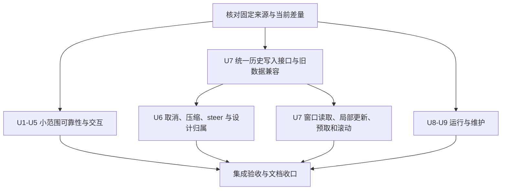

# Lody 上游可靠性与长对话更新采纳

Status: draft
Date: 2026-09-17
Translation: pending

## 场景与目标

用户在 Molly 中输入设计需求、附加参考图并持续修改同一作品。会话变长、连接中断、凭据过期，或用户在压缩上下文及执行工具时点击停止，都不应导致未发送输入消失、会话上下文被静默替换、旧事件结束新回合，或 Agent 尚未停止而画布提前允许编辑。升级后，用户仍能离线打开原有会话、画稿、素材和设计版本，并在原有桌面工作流中继续创作。

本任务选择性采纳 Lody 已合并的可靠性、输入保护、桌面交互和长对话改进。目标是修复上述行为并限制后台工作量，保持 Molly 的单人本机设计产品范围。既有功能在本项目已达到目标时，只记录覆盖证据，不为对齐上游重复改写。

2026-09-17 已确认选择性采纳方向，并要求记录目标、范围、方案和测试方法；随后确认补充 Stop 后输入处置、只读恢复、历史兼容方向及真实验收矩阵。本 Spec 记录这些已确认决定，保持 draft，尚无对应修订的批准链接；运行时实现和验收另行记录。本轮交付限于文档，不包含代码实施、发布或真实付费模型调用。

## 范围

比较窗口固定到调研时的上游 `6f3a8855`，共同基线为 `8ea564da`；不随上游 main 自动扩大范围。下表编号用于实施切片和验收追踪，PR 编号只定位来源，不授权照搬整个提交。完整 SHA 和源码证据集中在文末的调研记录。

| 编号 | 本任务纳入的行为                                                                                             | 上游来源                                             |
| ---- | ------------------------------------------------------------------------------------------------------------ | ---------------------------------------------------- |
| U1   | 本地房间 join 超时恢复、连接代际隔离、首次同步成功信号准确                                                   | #774                                                 |
| U2   | 凭据失效保留恢复上下文，失败 Session 实例清理不影响后续执行                                                  | #559、#595                                           |
| U3   | New Chat 保留草稿，已有身份间隔离文本草稿，Office 混合粘贴与超大文本保护                                     | #735、#619、#772、#702                               |
| U4   | ScrollArea 清理、子菜单避让、原生文字右键菜单、本地文件系统动作及明确错误反馈                                | #722、#726、#733、#555                               |
| U5   | 能力缓存兼容读取、设置弹窗实时能力刷新、Grok 隐式默认模式校验、React 崩溃诊断保留                            | #513、#745、#607、#742 的相关差量                    |
| U6   | 取消、上下文压缩、steer 中断的执行归属；关闭停止回合的待答问题；已有原生子任务的取消控制                     | #571、#573、#275、#618、#693、#740、#605             |
| U7   | 统一历史写入与校验、兼容旧历史、窗口化读取、流式局部更新、有限预取、列表恢复和用户滚动意图；合并积压派发检查 | #460、#376、#694、#751、#753、#674、#695、#781、#676 |
| U8   | Node/SQLite 下限声明与安装检查一致；Windows 路径和数据目录失败诊断的未覆盖部分                               | #72、#717                                            |
| U9   | 依赖发布等待期；Daily 失败证据仅留 artifacts，反馈引用 run/artifact                                          | #629、#698                                           |

以下项目不作为本任务完成条件，也不因依赖升级顺带纳入：

- 内置 Pi 迁移、新 Agent 接入、原生标题/goal 新行为、多窗口、Devframe/devbar、Vite/Storybook/formatter 升级。
- #638 的预取 worker 与新增缓存/通信结构：先实施现有 coordinator 的有限预取；只有测量仍显示该路径构成瓶颈时，才另行提出带证据的方案。
- Mermaid 新手势、Electron 44 API 准备、terminal 自动 shell 回退、macOS helper entitlement 放宽等条件性候选；保留现行合同。
- 云账户、遥测、分享、多机/移动/Web 产品、计费、开发工作流入口，以及破坏性缓存重置。
- 上游 changelog-only 发布替换 Molly 安装包/更新渠道；新增持久设计快照、候选审批、结果卡或专用缩略图。

## 职责与方案

沿用现有职责：CLI/ACP 管执行和真实结束，共享会话层管历史写入和本地同步，renderer 管输入与阅读，Electron 管本机系统动作，设计服务管校验和提交，Bento 管独立编辑、渲染及通用 snapshot/flush。不得把 Agent 生命周期放入 Bento，也不建立另一套调度或聊天存储。

### U1–U2：恢复只恢复真实状态

本地房间 join 有可终止、可测试的期限，期限届满进入可恢复失败状态；健康检查不能反复重置期限以制造永久等待。断线、关闭、失效通知和重新加入应隔离不同连接代际，旧异步完成不得将新连接标为成功或失败。只有本代际数据 reconcile 成功，首次同步才算完成。继续使用既有本地 push 通道，不增加云同步或轮询兜底。

认证失败需识别包装错误中的真实原因，保留原 provider/config 对应的会话身份、历史和草稿，向用户显示可恢复诊断；不得将它静默降级成新会话、切换 provider 或自动重发请求。其他允许新建运行时的恢复路径也必须先确认可重放上下文就绪，不能以空历史假装恢复成功。失败实例应先解除事件归属再清理；已退休实例的迟到事件不结束新实例的回合。

### U3–U5：输入和桌面行为

New Chat 的导航或目标切换本身不清空未发送文本、本地附件、粘贴片段及其草稿归属。文本采用与已有身份一致的隔离键；不为此增加多 workspace 产品入口。发送失败保留输入，清理只发生在既有明确发送成功或用户主动丢弃边界。元素引用不得因目标切换而指向另一作品；不适用时按既有引用校验反馈。

Office 剪贴板同时携带文本和通用图片副本时保留文本，并允许用户明确选择附加图片；纯截图和真实文件继续走本机附件链。单次粘贴的上限为 **500 × 1024 字节**，按换行规范化、去首尾空白后的存储文本计算 UTF-8 长度；等于上限允许，超过上限拒绝并提示使用文件附件。拒绝不改变原草稿，也不自动上传文件。

滚动组件卸载后停止自身后台轮询。子菜单需在窄窗口及屏幕边缘可达，并保持 Molly 已有跨菜单指针过渡行为。原生文字菜单按 Electron 的可编辑状态启用撤销、剪切、复制、粘贴等动作；普通选中文本可复制，不覆盖图片及 Bento 自有菜单。

本地文件的显式用户打开/定位动作可解析同一可信本机上的相对路径、绝对路径及父目录路径；失败时区分不存在、权限、IPC 或系统启动错误。此能力只作用于系统打开/定位，不扩大预览资源协议、附件 blob、Agent 工具或 Bento 的读取权限，也不自动执行 Markdown 中的链接。

能力缓存仅在配置身份匹配时复用仍可解释的字段，旧缓存保持刷新需求，未知字段不推导为支持能力。弹窗跟随真实 capability 更新；隐式默认模式必须受实际能力约束，用户显式配置与 Role 权限不被静默覆盖。React 错误页保留诊断直到用户重试或明确导航离开，不由无关数据变化触发反复自动 reset；继续复用原生恢复页，不恢复遥测或数据清空。

### U6：执行结束与产物处理分别收敛

取消请求已发送、ACP cancel 已返回、底层 prompt/config 请求已结束以及设计产物处理已结束，是不同事实。CLI 保持当前执行所有权直到底层结束得到确认；到期可沿既有终止机制收敛，无法确认结束时显示错误并保留只读，不把超时当作成功停止。重复 Stop 不建立第二个执行所有者。

停止失败后，用户须能沿现有停止、关闭或重连路径重新核验旧执行状态；界面说明当前未结束或无法确认的原因，并指向已验证可用的恢复入口。只有确认旧执行结束且对应产物处理终结，才恢复编辑。重开界面、重连成功或本地计时届满本身都不是解锁证据。实施前必须核对这些入口的实际消费者，至少证明一条从失败状态到确认结束的可达恢复路径；仅显示错误并永久只读不满足验收。不新增忽略执行状态的强制解锁或清缓存入口。

压缩中的取消和异常采用同一归属判断。Grok 继续采用已确认的完整关闭语义，Pi 继续依据原生结算事实；通用 cancel 回执不能替代这些事实。旧回合终结事件不得释放新回合的所有权。

正常完成继续沿用既有队列派发规则；用户主动 Stop 则保留待处理输入并暂停该会话的后续派发，等待用户显式继续。暂停意图不能因迟到的正常结束事件、重连或界面重开而丢失。显式继续仍须经过旧执行终结、设计产物处理结束及下一轮 flush 等既有条件；不能将恢复队列理解为跳过执行归属检查。正常队列推进不等于重新启动已经完成的回合。

steer（执行中追加指令）按原输入身份区分已应用、未应用和结果未知。未知状态保留输入及恢复事实，不自动重发，也不改记为未投递或已消费；迟到回执或历史只能收敛同一输入，不回退后续生产者指针。UI 不单凭本地超时或延迟 acknowledgement 决定再次投递。用户显式继续也不把未知状态自动转换成可重发：已应用的输入不重复发送，确认未应用的输入才可沿既有路径继续处理；仍未知时保留并显示诊断。不得因采用上游队列恢复而自动重启已停止或已完成的设计回合。

回合终结关闭其未回答问题，保留已回答记录；迟到提问不能挂到后续回合。原生子任务的 Stop 仅在能力明确支持时可用，定位确切子任务，不误停父任务或释放父任务所属作品的只读。共享 RPC 和 capability 的生产者、消费者一同迁移，旧端缺能力时诚实不可用。

设计服务仍在真实执行结束后依据结果收集产物并记录回执，取消/失败不伪装为成功提交。派发前 flush、执行和结果处理期间所有同作品实例只读、基线校验、异常保稿以及最终恢复编辑的条件，均由现有设计合同决定。

### U7：统一历史接口，逐层替换消费者

先建立统一历史写入和动作接口，校验新增输入及实际改变的字段，保留旧未知内容。旧记录不能阻止合法新写入，但不得靠永久关闭校验接受所有新写入。迁移范围内的 writer 全部接入后，才撤销会话层临时 validation bypass；这部分承接现有临时校验 Spec，不提前宣称其已退役。

新写入按普通 metadata 与流式文本区分存储。旧结构和旧导入摘要继续可读，新摘要显式版本化；重复导入不重复追加，不把旧摘要解释成新版本，也不覆盖本地编辑或删除。设计 outcome、commit receipt、附件及元素引用需贯穿 schema、读取、动作和导出，不能因上游闭合 schema 而丢弃。无无条件批量重写或清空重建历史。

兼容方向明确为新版读取旧数据；本任务不保证旧版读取新版写入，也不提供自动降级。实施交付前须在隔离数据上验证历史写入中断及重启恢复：已确认持久化的记录不丢失，未完成写入不冒充成功，重复恢复不追加第二份记录。不能通过清空历史或退回旧二进制绕过恢复失败；不为这项验证新增持久设计快照库。

renderer 按阅读窗口取正文，流式变化只更新相关回合与必要的目录/状态，不因头部状态与尾部 token 同时变化而重读中间全部正文。首次建立目录可能需要扫描既有历史，应单独计量，不能宣称所有操作都是常数成本。窗口外输入配置更新仍应被使用它的消费者观察到。

有限预取先复用现有 coordinator：自动候选窗口最多 20 个会话，并发及每批启动数均为 1；活动会话的显式打开和必需数据读取不受后台候选窗口限制。停止 coordinator、离开身份作用域后不得继续导入旧任务结果。派发积压检查合并重复工作并在批次之间让出执行机会，不能漏掉最后一份待处理输入或跳过设计准备。

历史 hydration 不覆盖首条用户消息，重开恢复列表测量和阅读位置；用户停留在历史位置时，展开工作过程或内容高度变化不能强制跳到底部。正常处于底部跟随时仍可持续阅读输出。Markdown 优化必须匹配 Molly 实际保留的数学/图表语法，不能通过删除现有渲染能力获得性能。

### U8–U9：运行与维护边界

Node 清单、安装守卫、SQLite 启动诊断和开发说明一致表达 Node-API 10 要求，版本范围为 `>=22.14.0 <23 || >=23.6.0`；守卫在加载 native binding 前失败并给出可操作提示。它不等于升级 Electron 或所有 ACP runtime。

路径分隔符由来源路径的宿主形态决定，不能用执行解析代码的系统代替来源系统。目录创建失败需归因到 Molly 数据目录；仅修尚缺差量，保留 `.molly`、显式目录覆盖及现有兼容优先级，不读写或迁移 Lody 数据。

依赖解析配置 10,080 分钟等待期。仅对有明确理由的精确版本设置例外，不复制上游新增产品的豁免，也不为该策略顺便升级无关依赖。Daily 保留失败录像、trace 和日志为 Actions artifacts，既有反馈仅引用运行地址和 artifact 名；取消发布内联附件的流程和不再需要的内容写权限。此项不授权本轮 Agent 发 Issue/评论或触发发布。

## 实施顺序与依赖

每个切片先核对最新 Molly 消费者，再抽取所需上游行为和测试；不整分支合并、不整文件覆盖，也不全局替换历史 `lody` wire 字段。实现、对应测试和上游来源须在同一切片可追踪。涉及协议或 adapter 变动时成组交付生产者/消费者及兼容处理；不全量刷新子模块。

采用新历史接口承接 #740，先迁入 U7 的写入基础，不要求先完成窗口化 UI。若实施核对证明现有接口能完整承载同一合同，可在 owning note 说明并复用，但不增设并行持久状态库。#376 与 #751 的修补共同构成窗口化部分的验收单元，不交付已知会全会话失效的中间态。有限预取可先独立实现；worker 暂缓不阻塞 U7 完成。

join/取消超时时长、正文窗口大小、必要 adapter 精确版本和写入接口切片由实施者根据现有合同、上游证据及确定性测试确定，并在 owning note 记录；无需逐项增加产品决策。它们不得改变上述停止、恢复和兼容边界，也不影响已固定的粘贴上限与后台预取上限。

## 测试方法与通过条件

自动化使用合成会话、图片和历史记录，复用现有工具链；注入时钟、可控 transport、明确 promise/barrier 和失败点。不得用真实 sleep、网络响应或调度运气决定通过，也不以 mock 调用次数代替可观察行为。每个缺陷切片先保留能够暴露旧行为的回归案例，随后验证目标行为。

| 验收        | 方法与关键案例                                                                                                                                                                               | 必须观察到的结果                                                                                                                                                                            |
| ----------- | -------------------------------------------------------------------------------------------------------------------------------------------------------------------------------------------- | ------------------------------------------------------------------------------------------------------------------------------------------------------------------------------------------- |
| T1 / U1     | 假时钟越过 join 期限；reconcile 失败；断线后旧 join 晚到；关闭时 flush 未结束；新代际成功                                                                                                    | 未成功不发成功信号；旧结果不改变新连接；失败可恢复；关闭后的任务不继续发布状态                                                                                                              |
| T2 / U2     | 包装的认证错误；缺失/延迟历史；失败创建实例退出；replacement 后旧事件；不同 provider/config                                                                                                  | 原恢复身份、历史和草稿保留；认证失败无自动重放；旧实例不终结新回合；不跨 provider 恢复                                                                                                      |
| T3 / U3     | 首页和会话输入中 New Chat、作用域切换、发送失败；纯文字、纯截图、Office 通用图片副本、真实文件；UTF-8 上限前/等于/后，含中文及 CRLF                                                          | 文本/附件归属不丢；Office 文字保留，图片仍可明确附加；阈值按存储文本计算；超限拒绝不改原草稿                                                                                                |
| T4 / U4     | 受控 RAF 下卸载 ScrollArea；真实 Electron 中菜单编辑状态、窄窗子菜单、指针跨菜单；系统 open/reveal 的成功和错误；越权预览请求                                                                | 无卸载后持续工作；菜单可达；原生动作按 editFlags；错误可辨；系统打开能力不放宽文件读取权限                                                                                                  |
| T5 / U5     | 旧/未来缓存版本、配置 fingerprint 改变、刷新中能力改变、显式/隐式 mode；React 抛错后无关状态变化及用户重试                                                                                   | 仅复用理解且匹配的能力，继续刷新；真实能力驱动 UI；不覆盖显式权限；错误页持续可读且可手动恢复                                                                                               |
| T6 / U6     | cancel ack 先返回而 prompt/config 未结束；正常完成与主动 Stop 各自携带排队输入；压缩中 Stop、重复 Stop、终止失败；暂停后重连/重开及迟到完成；显式继续时 steer 已应用/未应用/未知；子任务取消 | 正常队列继续，主动 Stop 后输入保留且派发暂停；重连/重开不丢暂停意图；显式继续也不重发未知或已应用输入，不把未知标为未投递；单一执行归属，无提前结束；子任务停止不误停父任务，旧提问不跨回合 |
| T7 / U6、U7 | 同作品多个实例；未 flush 编辑、等待权限、产物处理暂停/失败；停止失败后沿实际停止/关闭/重连入口恢复；在旧执行仍活动时超时及重挂载，随后确认旧执行和产物处理结束                               | 未完成 flush 不启动；同作品真实 mutation/save 入口保持只读，其他作品不受影响；界面提示并能到达恢复入口；超时/重开不解锁，确认执行结束且处理终结才解锁；旧事件不解锁新回合；草稿和回执保留   |
| T8 / U7     | 新版读取合成旧格式/未知历史和设计字段；合法新写、非法输入；重复导入、v1/v2 摘要、本地修改/删除；在受控持久化边界注入写入中断并重启、再次恢复                                                 | 旧内容不阻断合法新写，非法新写被拒；旧新记录离线可读，无丢字段、重复追加或静默覆盖；已持久化记录保留，未完成写入不冒充成功；不清空历史、不自动降级；不以旧版能读新写入作为承诺              |
| T9 / U7     | 固定阅读窗口，对 100 和 1,000 turn 夹具输入相同的单尾部变化、早期状态加尾部变化、窗口外配置变化；用读取/物化诊断事件记录实际受影响 ID 集合                                                   | 常规增量不重新读取无关正文或失效中间全段；使用配置的消费者更新；首读扫描与增量开销分别记录，不用耗时阈值或 mock 次数证明                                                                    |
| T10 / U7    | 假时钟控制后台队列，超过 20 个候选、前台打开窗口外会话、停止/切身份；显式调度器推进积压 dispatch；Electron 中 hydration、重开、展开和滚动                                                    | 自动预取遵守有限窗口和串行策略，前台读取不被阻断；旧任务不写新作用域；最后输入仍被处理且其他已排队工作有机会执行；首消息和阅读位置保留                                                      |
| T11 / U8    | 注入 Node 版本/N-API，覆盖 22.13、22.14、23.5、23.6 及支持的后续版本；Windows drive/UNC、POSIX、显式数据根、不可写目录；TS/CJS 入口                                                          | 安装/启动守卫与声明一致；无不支持环境先加载 native binding；路径与来源宿主一致；失败清楚且不触及 Lody 数据                                                                                  |
| T12 / U9    | 固定依赖版本/发布时间的解析策略核对；冻结锁文件安装；合成 Daily success/failure/cancel/artifact 缺失事件，仅渲染待发内容                                                                     | 7 天规则及精确例外成立；CI 反馈只含 run/artifact 引用，失败证据不再发布为附件；权限最小化且无真实发帖                                                                                       |

性能验收的确定性门槛是“无关正文不因局部变化重新物化”和预取上限。真实 Electron 另记录同一夹具、窗口、构建及机器下的前后操作耗时、主线程活动和内存，作为诊断证据，不承诺未经测量的加速比例，也不设置依赖机器负载的单元测试阈值。首次完整载入、稳态输出、切换/重开分开报告。

集成验收使用隔离 Molly profile、合成设计和本地附件，串起输入 → 派发 → 中断 → 显式继续 → 提交 → 编辑 → 导出 → 完全重启读回。验证本地存储、设计 Git 历史、当前稿及 YAML 往返仍一致；禁止产品云请求和遥测的测试要覆盖主进程、CLI 和 renderer。保留 runtime/update 公共下载以及用户配置 provider 的既有边界，不能把“本机产品”误测为禁止所有网络能力。

自动化 ACP 夹具只证明应用合同。公共生命周期变动必须覆盖 **Claude、Codex、Grok、Kimi、Pi 五种现有 Agent** 的真实接入，即使未修改它们各自的 adapter 文件。各自验证启动、权限、停止、显式继续、读图/预览、MCP 与产物结算等现有支持行为，并记录 runtime 版本和构建身份。原生压缩、steer、子任务控制按各自实际 capability 验证；不支持的能力需有明确不可用证据，不能伪造支持，也不能以此跳过该 Agent 的通用停止与继续验证。直接改动某个 adapter/protocol 时，另补该接入特有合同的回归。

真实平台验收采用以下固定范围，不要求把五种 Agent 与三个平台机械组合为十五套完整矩阵：

| 平台    | 必需验收                                                                                                           |
| ------- | ------------------------------------------------------------------------------------------------------------------ |
| macOS   | 完整本地集成路径、五种 Agent 的上述真实接入、菜单与画布交互、停止失败恢复、旧历史读回及长会话性能诊断              |
| Windows | 在真实平台验证路径/数据目录、native runtime 启动、原生菜单、应用启动与完全关闭后重开读回；覆盖相关平台特有失败分支 |
| Linux   | 在真实平台验证路径/数据目录、native runtime 启动、原生菜单、应用启动与完全关闭后重开读回；覆盖相关平台特有失败分支 |

每个必需单元明确标记通过、失败或未执行，并提供证据；不能以 macOS 通过或跨平台打包成功代替 Windows/Linux 运行。付费模型验收不包含在本次文档任务中，后续按实际授权执行，不自动重试。视觉判断另需对应人工检查，不能从功能通过推导。

## 完成条件与交付证据

实施完成要求 U1–U9 每项均有“已实现并验证”或“当前实现已满足、无需移植”的证据；暂缓项不计入缺口。每项记录源提交、实际改动、行为验证、构建/runtime 身份和限制。停止失败恢复路径、历史写入中断恢复，以及上述五种 Agent/macOS 完整验收和 Windows/Linux 针对性验收均属于完成条件；必需单元尚未执行时只能报告已完成部分，不能宣布整体验收通过。功能测试通过不自动批准 Spec，合成 provider 通过不等于真实 provider 通过。

各切片执行相关测试和类型检查；最终执行 `pnpm check`、`pnpm format`、`pnpm run docs check` 和 `git diff --check`。清单修改更新锁文件；包边界、平台组合改动执行 `pnpm check:public-boundary`。对 Electron/CLI/runtime 改动完成本地组合构建与上述集成验收；仅文档切片执行文档及差异检查即可。更新受影响 README、实现说明及 owning note，必要的不变量归入最近的 AGENTS.md，不复制上游整套规则。

任何切片失败时保留证据和用户数据，不通过清缓存、重写旧历史、放松读取权限、自动付费重试或静默修复设计文件绕过。涉及持久格式的后续发布须如实说明新版读旧数据及无自动降级的边界，并携带写入中断恢复证据。本 Spec 不授权发布、安装替换或用户数据迁移。

## 依据与当前验证状态

- [调研及采纳决策](../.agents/notes/proposed/process/2026-09-17-lody-upstream-adoption.zh.md)：固定上游 `6f3a8855e94737ae65e2e57c625d74573adddc01`、Molly 调研基线 `75fe35085e3e0c512ef28cec3016b6c07c0866f7` 和各候选精确提交。写本 Spec 时 Molly 已前进到 `c1dc2aab`；未把原调研追认为新 HEAD 的全量运行时审查，实施前需复核差量。
- [设计产品合同](graphic-design-platform.zh.md)、[临时历史校验绕过](session-validation-hotfix.zh.md)、[平台边界](../packages/platform/AGENTS.md)、[共享协议](../packages/shared/AGENTS.md)、[本地数据平面](../.agents/docs/cli-lib-local-loro-data-plane.md)：继续约束本任务；本 Spec 只规划有证据的差量。
- 已按用户“开始完整实现任务”的授权实施 U1–U9，切片验证与最终门禁记录在 owning note。必需的真实五 Agent 和 Windows/Linux 运行证据仍须分别提供；源码、合成测试和 macOS 构建不能替代这些验收。本 Spec 保持 draft，不因实现或测试自动获得批准。
